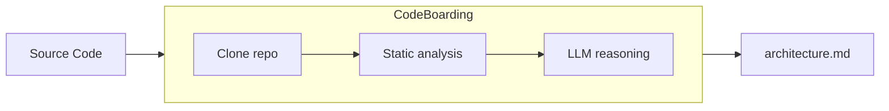

# Awesome Architecture MDs

> Architecture diagrams for popular open-source repos. Auto-generated, markdown, drop-in-ready for your coding agent.

```mermaid
graph LR
  subgraph 1["Orchestration & Lifecycle"]
    1__1_1["CLI & Execution Orchestrator"]
    1__1_2["Environment & Tooling Manager"]
    1__1_3["Project Discovery & Context Builder"]
    1__1_4["Agentic Analysis Pipeline"]
    1__1_5["System Registry & Persistence"]
  end
  subgraph 2["Static Analysis Core"]
    2__2_1["Analysis Orchestrator & Cache Manager"]
    2__2_2["LSP Client & Language Adapters"]
    2__2_3["Semantic Graph Engine"]
    2__2_4["Architectural Clustering & Validation"]
  end
  subgraph 3["Change Analysis"]
    3__3_1["Change Detection & Context Manager"]
    3__3_2["Incremental State Orchestrator"]
    3__3_3["Analysis Serialization Layer"]
  end
  subgraph 4["AI Reasoning Layer"]
    4__4_1["Agentic Orchestration & Execution"]
    4__4_2["Structural Analysis & Health Engine"]
    4__4_3["Prompt Factory & Provider Abstraction"]
    4__4_4["Context Extraction & Persistence"]
  end
  subgraph 5["Health & Documentation"]
    5__5_1["Health Metrics Evaluator"]
    5__5_2["Documentation & Visualization Generator"]
    5__5_3["Unified Data Serializer"]
    5__5_4["Structural Analysis Engine"]
    5__5_5["Incremental Update Manager"]
    5__5_6["CLI & Repository Interface"]
  end
  subgraph 6["Persistence & Tooling"]
    6__6_1["Local Persistence Engine"]
    6__6_2["Repository Interaction Toolkit"]
    6__6_3["Execution Monitoring & Telemetry"]
  end
  1 -->|"Triggers change detection to determine the scope of the current run"| 3
  1 -->|"Initiates the full project scan and graph construction"| 2
  3 -->|"Provides diff context to enable partial updates of the call graph"| 2
  2 -->|"Provides structural graph data for semantic interpretation"| 4
  4 -->|"Uses the toolkit to read specific source code files for deep analysis"| 6
  2 -->|"Provides the call graph for metric calculation and diagram generation"| 5
  4 -->|"Provides semantic descriptions and component purposes for the final reports"| 5
  6 -->|"Provides access to cached analysis data and the local database"| 2
  1 -->|"calls"| 4
  1 -->|"calls"| 5
  1 -->|"calls"| 6
  2 -->|"calls"| 1
  2 -->|"calls"| 3
  3 -->|"calls"| 1
  3 -->|"calls"| 4
  4 -->|"calls"| 1
  4 -->|"calls"| 2
  5 -->|"calls"| 2
  5 -->|"calls"| 4
  6 -->|"calls"| 1
  3__3_1 -->|"Provides the `ChangeSet` and method-level diffs along with the cached `StaticAnalysisResults` from previous runs to initiate the delta computation."| 3__3_2
  3__3_2 -->|"Supplies the updated and validated `AnalysisInsights` to be transformed into structured LLM prompts and response models."| 3__3_3
  3__3_2 -->|"calls"| 3__3_1
  4__4_1 -->|"Requests formatted system and user messages tailored to the active LLM provider."| 4__4_3
  4__4_1 -->|"Invokes repository tools to ground LLM reasoning in actual source code and metadata."| 4__4_4
  4__4_1 -->|"Consumes code clusters and health insights to provide high-level architectural summaries."| 4__4_2
  4__4_2 -->|"Reads raw static analysis data and persists graph-based clustering results for future incremental runs."| 4__4_4
  4__4_2 -->|"calls"| 4__4_1
  4__4_4 -->|"calls"| 4__4_2
  6__6_3 -->|"Persists aggregated run statistics, token usage, and job status updates to the DuckDB/SQLite backend"| 6__6_1
  6__6_2 -->|"Queries the cache using file content hashes to determine if previous analysis results can be reused"| 6__6_1
  6__6_3 -->|"Instruments tool execution to track latency and frequency of filesystem interactions during an analysis run"| 6__6_2
  2__2_1 -->|"Orchestrates the startup and shutdown of language servers required for the current project"| 2__2_2
  2__2_1 -->|"Triggers the graph construction process and provides cached symbol data to minimize redundant LSP queries"| 2__2_3
  2__2_2 -->|"Supplies raw symbol locations and reference batches used to build graph edges"| 2__2_3
  2__2_3 -->|"Provides the completed call graph and hierarchy as input for community detection and logical grouping"| 2__2_4
  2__2_4 -->|"Returns the final clustered results and change metrics to be persisted in the analysis cache"| 2__2_1
  2__2_1 -->|"calls"| 2__2_4
  2__2_2 -->|"calls"| 2__2_1
  2__2_3 -->|"calls"| 2__2_2
  5__5_6 -->|"triggers"| 5__5_5
  5__5_5 -->|"coordinates with"| 5__5_4
  5__5_4 -->|"provides component boundaries to"| 5__5_1
  5__5_1 -->|"sends findings to"| 5__5_3
  5__5_4 -->|"feeds final architectural map into"| 5__5_3
  5__5_3 -->|"provides structured JSON to"| 5__5_2
  5__5_1 -->|"calls"| 5__5_4
  5__5_1 -->|"calls"| 5__5_5
  5__5_2 -->|"calls"| 5__5_3
  5__5_2 -->|"calls"| 5__5_6
  5__5_3 -->|"calls"| 5__5_4
  5__5_3 -->|"calls"| 5__5_5
  5__5_4 -->|"calls"| 5__5_5
  5__5_5 -->|"calls"| 5__5_3
  5__5_6 -->|"calls"| 5__5_2
  1__1_1 -->|"Verifies and prepares the local environment (LSP servers, Node.js) before any analysis begins."| 1__1_2
  1__1_1 -->|"Initiates the repository scanning process to identify the codebase structure and languages."| 1__1_3
  1__1_1 -->|"Triggers the high-level analysis workflow once the environment and project context are established."| 1__1_4
  1__1_3 -->|"Provides the structured project context and file-to-language mappings required for agentic reasoning."| 1__1_4
  1__1_4 -->|"Persists analysis results and retrieves cached signatures to support incremental analysis and reduce LLM token usage."| 1__1_5
  1__1_1 -->|"Uses the registry to dynamically load available tools and plugins during initialization."| 1__1_5
  1__1_3 -->|"calls"| 1__1_1
  1__1_3 -->|"calls"| 1__1_2
  1__1_3 -->|"calls"| 1__1_5
  1__1_4 -->|"calls"| 1__1_1
  1__1_4 -->|"calls"| 1__1_3
  1__1_5 -->|"calls"| 1__1_3
```


*Example: simplified view of a typical RAG stack. Real diagrams are generated from actual source, not drawn.*

   

---

## Why

- **Onboard your AI agent.** Paste the markdown into your AGENT.md so the agent onboards in fewer tokens.
- **Live mindmap as your agent codes.** Human readable to understand the changes your agent does.
- **Pattern literacy.** *"How do mature async runtimes structure their scheduler?"* Browse five of them side-by-side.

## Drop into your agent (10 seconds)

```bash
# Cursor / Claude Code / Aider — load a repo's architecture as context
curl -sL https://raw.githubusercontent.com/<org>/awesome-architecture-mds/main/vllm/architecture.md \
  | pbcopy
```

Or reference it directly in your prompt:
```
@https://github.com/<org>/awesome-architecture-mds/blob/main/vllm/architecture.md
Using the architecture above, implement X without breaking module boundaries.
```

## Browse the atlas

### AI & LLM infrastructure
| Repo | Language | Depth | Diagram |
|---|---|---|---|
| [vllm](./vllm/) | Python | 2 | [architecture.md](./vllm/architecture.md) |
| [langchainjs](./langchainjs/) | TypeScript | 2 | [architecture.md](./langchainjs/architecture.md) |
| [sglang](./sglang/) | Python | 2 | [architecture.md](./sglang/architecture.md) |
| [TensorRT-LLM](./TensorRT-LLM/) | Python/C++ | 2 | [architecture.md](./TensorRT-LLM/architecture.md) |
| [mastra](./mastra/) | TypeScript | 2 | [architecture.md](./mastra/architecture.md) |

### Agents & dev tools
| Repo | Language | Depth | Diagram |
|---|---|---|---|
| [Roo-Code](./Roo-Code/) | TypeScript | 2 | [architecture.md](./Roo-Code/architecture.md) |
| [assistant-ui](./assistant-ui/) | TypeScript | 2 | [architecture.md](./assistant-ui/architecture.md) |
| [humanlayer](./humanlayer/) | Python | 2 | [architecture.md](./humanlayer/architecture.md) |
| [stagehand](./stagehand/) | TypeScript | 2 | [architecture.md](./stagehand/architecture.md) |

### Infrastructure, data, platforms
| Repo | Language | Depth | Diagram |
|---|---|---|---|
| [airbyte](./airbyte/) | Java/Python | 2 | [architecture.md](./airbyte/architecture.md) |
| [buildkit](./buildkit/) | Go | 2 | [architecture.md](./buildkit/architecture.md) |
| [presto](./presto/) | Java | 2 | [architecture.md](./presto/architecture.md) |
| [convex-backend](./convex-backend/) | Rust | 2 | [architecture.md](./convex-backend/architecture.md) |
| [stackrox](./stackrox/) | Go | 2 | [architecture.md](./stackrox/architecture.md) |

*(Full index: [INDEX.md](./INDEX.md) — 50 repos, auto-generated.)*

## How diagrams are generated



Every diagram is produced by running [**CodeBoarding**](https://codeboarding.com) — a local static-analysis + LLM-reasoning engine — over the repo at `--depth-level 2`. The engine parses real imports, call graphs, and module boundaries; the LLM only names and summarizes. No diagram is hand-drawn.

Each folder contains:
- `architecture.md` — the human-readable diagram
- `analysis.json` — the structured source of truth
- `file_coverage.json` — which files the analysis was grounded in

## Contribute

**Found a mistake?** Static analysis + LLMs aren't perfect. If a module is misnamed or a dependency is invented, open a PR on the `.md`.

**Want your repo in here?** Open an issue with:
- the GitHub URL
- one sentence on what the repo does
- primary language

We prioritize repos that are (a) actively maintained, (b) widely depended on, or (c) architecturally interesting.

**Running this on your own code?** [CodeBoarding](https://codeboarding.com) runs locally — point it at any repo, public or private.

## License

[MIT](./LICENSE). Copy the diagrams into your own `README.md`, `ARCHITECTURE.md`, or `.cursorrules`. No attribution required.
