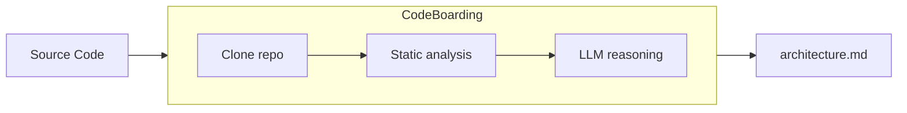

# Awesome Architecture MDs

> Architecture diagrams for popular open-source repos. Auto-generated, markdown, drop-in-ready for your coding agent.

```mermaid
graph LR
  subgraph 1["Orchestration & Lifecycle"]
    1__1_1["CLI & Execution Orchestrator"]
    1__1_2["Environment & Tooling Manager"]
    1__1_3["Project Discovery & Context Builder"]
    1__1_4["Agentic Analysis Pipeline"]
    1__1_5["System Registry & Persistence"]
  end
  subgraph 2["Static Analysis Core"]
    2__2_1["Analysis Orchestrator & Cache Manager"]
    2__2_2["LSP Client & Language Adapters"]
    2__2_3["Semantic Graph Engine"]
    2__2_4["Architectural Clustering & Validation"]
  end
  subgraph 3["Change Analysis"]
    3__3_1["Change Detection & Context Manager"]
    3__3_2["Incremental State Orchestrator"]
    3__3_3["Analysis Serialization Layer"]
  end
  subgraph 4["AI Reasoning Layer"]
    4__4_1["Agentic Orchestration & Execution"]
    4__4_2["Structural Analysis & Health Engine"]
    4__4_3["Prompt Factory & Provider Abstraction"]
    4__4_4["Context Extraction & Persistence"]
  end
  subgraph 5["Health & Documentation"]
    5__5_1["Health Metrics Evaluator"]
    5__5_2["Documentation & Visualization Generator"]
    5__5_3["Unified Data Serializer"]
    5__5_4["Structural Analysis Engine"]
    5__5_5["Incremental Update Manager"]
    5__5_6["CLI & Repository Interface"]
  end
  subgraph 6["Persistence & Tooling"]
    6__6_1["Local Persistence Engine"]
    6__6_2["Repository Interaction Toolkit"]
    6__6_3["Execution Monitoring & Telemetry"]
  end
  1 -->|"Triggers change detection to determine the scope of the current run"| 3
  1 -->|"Initiates the full project scan and graph construction"| 2
  3 -->|"Provides diff context to enable partial updates of the call graph"| 2
  2 -->|"Provides structural graph data for semantic interpretation"| 4
  4 -->|"Uses the toolkit to read specific source code files for deep analysis"| 6
  2 -->|"Provides the call graph for metric calculation and diagram generation"| 5
  4 -->|"Provides semantic descriptions and component purposes for the final reports"| 5
  6 -->|"Provides access to cached analysis data and the local database"| 2
  1 -->|"calls"| 4
  1 -->|"calls"| 5
  1 -->|"calls"| 6
  2 -->|"calls"| 1
  2 -->|"calls"| 3
  3 -->|"calls"| 1
  3 -->|"calls"| 4
  4 -->|"calls"| 1
  4 -->|"calls"| 2
  5 -->|"calls"| 2
  5 -->|"calls"| 4
  6 -->|"calls"| 1
  3__3_1 -->|"Provides the `ChangeSet` and method-level diffs along with the cached `StaticAnalysisResults` from previous runs to initiate the delta computation."| 3__3_2
  3__3_2 -->|"Supplies the updated and validated `AnalysisInsights` to be transformed into structured LLM prompts and response models."| 3__3_3
  3__3_2 -->|"calls"| 3__3_1
  4__4_1 -->|"Requests formatted system and user messages tailored to the active LLM provider."| 4__4_3
  4__4_1 -->|"Invokes repository tools to ground LLM reasoning in actual source code and metadata."| 4__4_4
  4__4_1 -->|"Consumes code clusters and health insights to provide high-level architectural summaries."| 4__4_2
  4__4_2 -->|"Reads raw static analysis data and persists graph-based clustering results for future incremental runs."| 4__4_4
  4__4_2 -->|"calls"| 4__4_1
  4__4_4 -->|"calls"| 4__4_2
  6__6_3 -->|"Persists aggregated run statistics, token usage, and job status updates to the DuckDB/SQLite backend"| 6__6_1
  6__6_2 -->|"Queries the cache using file content hashes to determine if previous analysis results can be reused"| 6__6_1
  6__6_3 -->|"Instruments tool execution to track latency and frequency of filesystem interactions during an analysis run"| 6__6_2
  2__2_1 -->|"Orchestrates the startup and shutdown of language servers required for the current project"| 2__2_2
  2__2_1 -->|"Triggers the graph construction process and provides cached symbol data to minimize redundant LSP queries"| 2__2_3
  2__2_2 -->|"Supplies raw symbol locations and reference batches used to build graph edges"| 2__2_3
  2__2_3 -->|"Provides the completed call graph and hierarchy as input for community detection and logical grouping"| 2__2_4
  2__2_4 -->|"Returns the final clustered results and change metrics to be persisted in the analysis cache"| 2__2_1
  2__2_1 -->|"calls"| 2__2_4
  2__2_2 -->|"calls"| 2__2_1
  2__2_3 -->|"calls"| 2__2_2
  5__5_6 -->|"triggers"| 5__5_5
  5__5_5 -->|"coordinates with"| 5__5_4
  5__5_4 -->|"provides component boundaries to"| 5__5_1
  5__5_1 -->|"sends findings to"| 5__5_3
  5__5_4 -->|"feeds final architectural map into"| 5__5_3
  5__5_3 -->|"provides structured JSON to"| 5__5_2
  5__5_1 -->|"calls"| 5__5_4
  5__5_1 -->|"calls"| 5__5_5
  5__5_2 -->|"calls"| 5__5_3
  5__5_2 -->|"calls"| 5__5_6
  5__5_3 -->|"calls"| 5__5_4
  5__5_3 -->|"calls"| 5__5_5
  5__5_4 -->|"calls"| 5__5_5
  5__5_5 -->|"calls"| 5__5_3
  5__5_6 -->|"calls"| 5__5_2
  1__1_1 -->|"Verifies and prepares the local environment (LSP servers, Node.js) before any analysis begins."| 1__1_2
  1__1_1 -->|"Initiates the repository scanning process to identify the codebase structure and languages."| 1__1_3
  1__1_1 -->|"Triggers the high-level analysis workflow once the environment and project context are established."| 1__1_4
  1__1_3 -->|"Provides the structured project context and file-to-language mappings required for agentic reasoning."| 1__1_4
  1__1_4 -->|"Persists analysis results and retrieves cached signatures to support incremental analysis and reduce LLM token usage."| 1__1_5
  1__1_1 -->|"Uses the registry to dynamically load available tools and plugins during initialization."| 1__1_5
  1__1_3 -->|"calls"| 1__1_1
  1__1_3 -->|"calls"| 1__1_2
  1__1_3 -->|"calls"| 1__1_5
  1__1_4 -->|"calls"| 1__1_1
  1__1_4 -->|"calls"| 1__1_3
  1__1_5 -->|"calls"| 1__1_3
```


*Above: CodeBoarding diagrammed by CodeBoarding. Every repo in the atlas below is mapped the same way.*


---


**Onboard your AI agent.** Paste the markdown into your ARCHITECTURE.md so the agent onboards in fewer tokens.

## Drop into your agent

```bash
# Cursor / Claude Code / Aider — load a repo's architecture as context
curl -sL https://raw.githubusercontent.com/<org>/awesome-architecture-mds/main/vllm/architecture.md \
  | pbcopy
```

Or reference it directly in your prompt:
```
@https://github.com/codeboarding/awesome-architecture-mds/blob/main/vllm/on_boarding.md
Using the architecture above, implement X without breaking module boundaries.
```

### Contents

- [AI & machine learning](#ai--machine-learning)
    - [LLM serving & inference](#llm-serving--inference)
    - [Agent frameworks & orchestration](#agent-frameworks--orchestration)
    - [AI coding tools](#ai-coding-tools)
    - [ML research & models](#ml-research--models)
    - [Training, evaluation & guardrails](#training-evaluation--guardrails)
- [Data & analytics](#data--analytics)
    - [ETL & workflow orchestration](#etl--workflow-orchestration)
    - [Databases & storage](#databases--storage)
    - [Data processing & analysis](#data-processing--analysis)
- [Web & UI](#web--ui)
    - [Frontend frameworks](#frontend-frameworks)
    - [UI libraries & no-code](#ui-libraries--no-code)
    - [Apps & platforms](#apps--platforms)
- [Infrastructure & DevOps](#infrastructure--devops)
    - [Configuration & automation](#configuration--automation)
    - [Observability & telemetry](#observability--telemetry)
    - [Media & real-time infra](#media--real-time-infra)
    - [Platform SDKs](#platform-sdks)
- [Developer tools](#developer-tools)
    - [Package & environment management](#package--environment-management)
    - [Language tooling (lint / types / format)](#language-tooling-lint--types--format)
    - [CLIs, docs & DX](#clis-docs--dx)
    - [Testing & load](#testing--load)
- [Scientific & research computing](#scientific--research-computing)
    - [Genomics & bioinformatics](#genomics--bioinformatics)
    - [Imaging, neuroscience & health](#imaging-neuroscience--health)
    - [Molecular dynamics & chemistry](#molecular-dynamics--chemistry)
- [Security & privacy](#security--privacy)
    - [App & supply-chain security](#app--supply-chain-security)
    - [Offensive / red team](#offensive--red-team)
- [Games, graphics & media](#games-graphics--media)
    - [Game engines & 3D](#game-engines--3d)
    - [Video, audio & downloaders](#video-audio--downloaders)
    - [Creative tooling](#creative-tooling)
- [Networking, APIs & protocols](#networking-apis--protocols)
    - [Platform SDKs & API clients](#platform-sdks--api-clients)
    - [Industrial & IoT protocols](#industrial--iot-protocols)
- [Learning codebases](#learning-codebases)
- [Uncategorized](#uncategorized)
- [Full index (A–Z)](./INDEX.md)

### AI & machine learning

#### LLM serving & inference

- [bella-openapi](./ai-ml/bella-openapi/on_boarding.md) - AI gateway routing and orchestrating requests to multiple large language models. _(Java)_
- [BitNet](./ai-ml/BitNet/on_boarding.md) - Efficient 1-bit LLM inference runtime with Python orchestration and C++/CUDA kernels. _(Python)_
- [FastChat](./ai-ml/FastChat/on_boarding.md) - Distributed platform for serving and evaluating chat-based large language models. _(Python)_
- [gpt4free](./ai-ml/gpt4free/on_boarding.md) - Proxy client library routing requests across free LLM providers. _(Python)_
- [koila](./ai-ml/koila/on_boarding.md) - PyTorch wrapper providing lazy evaluation to prevent GPU out-of-memory errors. _(Python)_
- [lightning-thunder](./ai-ml/lightning-thunder/on_boarding.md) - Source-to-source compiler for optimizing PyTorch model execution. _(Python)_
- [litellm](./ai-ml/litellm/on_boarding.md) - Unified LLM client and proxy supporting 100+ providers via OpenAI format. _(Python)_
- [mlc-llm](./ai-ml/mlc-llm/on_boarding.md) - Universal LLM compilation and deployment across hardware and platforms. _(Python)_
- [mlx-lm](./ai-ml/mlx-lm/on_boarding.md) - Apple MLX framework toolkit for running and fine-tuning language models. _(Python)_
- [mlx-vlm](./ai-ml/mlx-vlm/on_boarding.md) - Apple MLX toolkit for serving and interacting with vision-language models. _(Python)_
- [ollama-python](./ai-ml/ollama-python/on_boarding.md) - Official Python client library for the Ollama local LLM runtime API. _(Python)_
- [openai-python](./ai-ml/openai-python/on_boarding.md) - Official Python client library for the OpenAI API and models. _(Python)_
- [tinygrad](./ai-ml/tinygrad/on_boarding.md) - Minimalist deep learning framework between PyTorch and karpathy's micrograd. _(Python)_
- [transformer-deploy](./ai-ml/transformer-deploy/on_boarding.md) - Efficient transformer model deployment on ONNX Runtime TensorRT and Triton. _(Python)_
- [tvm](./ai-ml/tvm/on_boarding.md) - Apache TVM compiler stack for deploying deep learning models across hardware. _(Python)_
- [vllm](./ai-ml/vllm/on_boarding.md) - High-throughput memory-efficient inference and serving engine for LLMs. _(Python)_

#### Agent frameworks & orchestration

- [ABCs-of-control](./ai-ml/ABCs-of-control/on_boarding.md) - Conversational agent that parses queries, calls LLMs, and optionally invokes external tools. _(Python)_
- [AdalFlow](./ai-ml/AdalFlow/on_boarding.md) - Framework for building, training, and evaluating LLM-powered applications and pipelines. _(Python)_
- [ag2](./ai-ml/ag2/on_boarding.md) - Multi-agent LLM orchestration framework derived from AutoGen with tool and code execution. _(Python)_
- [agno](./ai-ml/agno/on_boarding.md) - Lightweight framework for building multimodal AI agents with memory and tool use. _(Python)_
- [arcade-ai](./ai-ml/arcade-ai/on_boarding.md) - Platform for developing and serving authenticated tools for AI agents. _(Python)_
- [Archon](./ai-ml/Archon/on_boarding.md) - Agent orchestration system that builds and refines other AI agents automatically. _(Python)_
- [AutoAgent](./ai-ml/AutoAgent/on_boarding.md) - Fully autonomous LLM agent framework with CLI, REPL, and tool management. _(Python)_
- [autogen](./ai-ml/autogen/on_boarding.md) - Microsoft framework for orchestrating multi-agent LLM conversations and task automation. _(Python)_
- [Bard](./ai-ml/Bard/on_boarding.md) - Conversational AI client for interacting with Google Bard language model. _(Python)_
- [browser-use](./ai-ml/browser-use/on_boarding.md) - AI agent framework giving LLMs control of a web browser for automation. _(Python)_
- [ChatGPT](./ai-ml/ChatGPT/on_boarding.md) - Unofficial CLI and API wrappers for interacting with ChatGPT conversational models. _(Python)_
- [ChatterBot](./ai-ml/ChatterBot/on_boarding.md) - Machine learning conversational bot engine with pluggable storage and logic adapters. _(Python)_
- [cognee](./ai-ml/cognee/on_boarding.md) - Memory and knowledge-graph layer for AI agents with ingestion and retrieval APIs. _(Python)_
- [composio](./ai-ml/composio/on_boarding.md) - Platform giving AI agents authenticated access to hundreds of external tools. _(Python)_
- [contextgem](./ai-ml/contextgem/on_boarding.md) - LLM-powered framework for structured information extraction from documents. _(Python)_
- [crawl4ai](./ai-ml/crawl4ai/on_boarding.md) - LLM-friendly web crawler producing clean markdown and structured data for RAG. _(Python)_
- [crewAI](./ai-ml/crewAI/on_boarding.md) - Framework for orchestrating role-playing autonomous AI agent crews. _(Python)_
- [dataproduct-mcp](./ai-ml/dataproduct-mcp/on_boarding.md) - MCP server exposing data products to LLMs with governance and guardrails. _(Python)_
- [dspy](./ai-ml/dspy/on_boarding.md) - Framework for programming with LLMs via modular signatures and automatic prompt optimization. _(Python)_
- [Flowise](./ai-ml/Flowise/on_boarding.md) - Drag-and-drop UI for building customized LLM flows and agent pipelines. _(TypeScript)_
- [genai-processors](./ai-ml/genai-processors/on_boarding.md) - Asynchronous pipeline library for building generative AI data processing workflows. _(Python)_
- [gpt-researcher](./ai-ml/gpt-researcher/on_boarding.md) - Autonomous agent that conducts comprehensive research with LLMs and citations. _(Python)_
- [graphrag](./ai-ml/graphrag/on_boarding.md) - Microsoft knowledge-graph-enhanced retrieval-augmented generation pipeline. _(Python)_
- [haystack](./ai-ml/haystack/on_boarding.md) - Modular framework for building LLM-powered search and RAG applications. _(Python)_
- [instructor](./ai-ml/instructor/on_boarding.md) - Library for extracting structured Pydantic outputs from large language models. _(Python)_
- [kor](./ai-ml/kor/on_boarding.md) - Schema-driven LLM library for structured information extraction. _(Python)_
- [kotaemon](./ai-ml/kotaemon/on_boarding.md) - Open-source clean UI RAG chatbot for document question answering. _(Python)_
- [langchain](./ai-ml/langchain/on_boarding.md) - Framework for building applications powered by language model chains and agents. _(Python)_
- [langextract](./ai-ml/langextract/on_boarding.md) - LLM-agnostic structured information extraction pipeline library. _(Python)_
- [langflow](./ai-ml/langflow/on_boarding.md) - Visual low-code UI for experimenting with LangChain workflows. _(Python)_
- [langgraph](./ai-ml/langgraph/on_boarding.md) - Library for building stateful, multi-actor LLM agent applications as graphs. _(Python)_
- [llama_index](./ai-ml/llama_index/on_boarding.md) - Data framework for indexing and querying data with LLMs for RAG. _(Python)_
- [llm-graph-builder](./ai-ml/llm-graph-builder/on_boarding.md) - LLM-powered pipeline that builds Neo4j knowledge graphs from unstructured data. _(Python)_
- [lmql](./ai-ml/lmql/on_boarding.md) - Query language for large language models with constrained generation. _(Python)_
- [MaiBot](./ai-ml/MaiBot/on_boarding.md) - Modular AI conversational agent with pluggable NLP and communication adapters. _(Python)_
- [mcp-agent](./ai-ml/mcp-agent/on_boarding.md) - Framework for building AI agents with MCP integration and workflow patterns. _(Python)_
- [mcp-agent-discussion](./ai-ml/mcp-agent-discussion/on_boarding.md) - Multi-agent system orchestrating complex AI workflows with MCP integration. _(Python)_
- [mcp-context-forge](./ai-ml/mcp-context-forge/on_boarding.md) - API gateway for managing MCP servers, tools, and resources across protocols. _(Python)_
- [mcp-use](./ai-ml/mcp-use/on_boarding.md) - Library for building LLM agents that use MCP tools and servers. _(Python)_
- [mem0](./ai-ml/mem0/on_boarding.md) - Memory layer for AI agents integrating LLMs, embeddings, and vector stores. _(Python)_
- [MetaGPT](./ai-ml/MetaGPT/on_boarding.md) - Multi-agent framework assigning software roles to collaborative LLM agents. _(Python)_
- [mongodb-mcp-server](./ai-ml/mongodb-mcp-server/on_boarding.md) - MCP server exposing MongoDB operations as tools for LLM agents. _(TypeScript)_
- [Open-Assistant](./ai-ml/Open-Assistant/on_boarding.md) - Open-source conversational AI assistant with human feedback training pipeline. _(Python)_
- [openai-agents-python](./ai-ml/openai-agents-python/on_boarding.md) - OpenAI's lightweight SDK for building multi-agent workflows with tools and handoffs. _(Python)_
- [OpenCopilot-PikoAi](./ai-ml/OpenCopilot-PikoAi/on_boarding.md) - Terminal-based AI copilot CLI for task automation via natural language. _(Python)_
- [openr](./ai-ml/openr/on_boarding.md) - LLM reasoning framework combining reinforcement learning and process reward models. _(Python)_
- [OS-Copilot](./ai-ml/OS-Copilot/on_boarding.md) - Self-improving AI agent framework for autonomous OS task execution. _(Python)_
- [paper-search-mcp](./ai-ml/paper-search-mcp/on_boarding.md) - MCP server aggregating academic paper search across multiple research databases. _(Python)_
- [pipecat](./ai-ml/pipecat/on_boarding.md) - Open-source framework for building voice and multimodal conversational AI agents. _(Python)_
- [podcastfy](./ai-ml/podcastfy/on_boarding.md) - Converts content into AI-generated multilingual conversational podcasts. _(Python)_
- [poml](./ai-ml/poml/on_boarding.md) - Prompt-oriented markup language engine for structured LLM prompt authoring. _(Python)_
- [pywit](./ai-ml/pywit/on_boarding.md) - Python SDK for the Wit.ai natural language understanding service. _(Python)_
- [quivr](./ai-ml/quivr/on_boarding.md) - Retrieval-augmented generation framework for building second brain chatbots. _(Python)_
- [ragbits](./ai-ml/ragbits/on_boarding.md) - Framework for building and evaluating retrieval-augmented generation systems. _(Python)_
- [redis-vl-python](./ai-ml/redis-vl-python/on_boarding.md) - Redis vector library for building LLM-powered semantic search and RAG applications. _(Python)_
- [sample-app-aoai-chatGPT](./ai-ml/sample-app-aoai-chatGPT/on_boarding.md) - Microsoft sample chat app integrating Azure OpenAI with enterprise data sources. _(Python)_
- [Scrapegraph-ai](./ai-ml/Scrapegraph-ai/on_boarding.md) - LLM-powered web scraping library generating extraction pipelines from prompts. _(Python)_
- [SuperAGI](./ai-ml/SuperAGI/on_boarding.md) - Open-source autonomous AI agent framework for building and deploying agents. _(Python)_
- [symbolicai](./ai-ml/symbolicai/on_boarding.md) - Neuro-symbolic framework combining LLMs with symbolic reasoning operations. _(Python)_
- [thinkgpt](./ai-ml/thinkgpt/on_boarding.md) - LLM orchestrator adding memory long-term context and reasoning capabilities. _(Python)_
- [trt-llm-rag-linux](./ai-ml/trt-llm-rag-linux/on_boarding.md) - Linux reference RAG application using NVIDIA TensorRT-LLM for inference. _(Python)_
- [txtai](./ai-ml/txtai/on_boarding.md) - All-in-one embeddings database for semantic search and LLM workflows. _(Python)_
- [whatsapp-chatgpt](./ai-ml/whatsapp-chatgpt/on_boarding.md) - ChatGPT-powered WhatsApp bot integration. _(?)_

#### AI coding tools

- [aideml](./ai-ml/aideml/on_boarding.md) - Autonomous ML engineer that iteratively writes and improves data science code. _(Python)_
- [auto-code-rover](./ai-ml/auto-code-rover/on_boarding.md) - Autonomous program-repair agent that navigates repos and patches buggy code. _(Python)_
- [AutoGPT](./ai-ml/AutoGPT/on_boarding.md) - Autonomous GPT-powered agent platform for chaining goals into executable tasks. _(Python)_
- [cocode](./ai-ml/cocode/on_boarding.md) - CLI tool combining code analysis with AI for summarization and vulnerability detection. _(Python)_
- [crush](./ai-ml/crush/on_boarding.md) - Charm's terminal AI coding assistant for interactive code generation. _(Go)_
- [DeepCode](./ai-ml/DeepCode/on_boarding.md) - AI-powered code analysis and generation agent for document and code processing. _(Python)_
- [deepwiki-open](./ai-ml/deepwiki-open/on_boarding.md) - FastAPI+Next.js tool auto-generating interactive wikis and chat for GitHub repos. _(TypeScript)_
- [dyad](./ai-ml/dyad/on_boarding.md) - Local AI app builder with IPC-based UI for code generation workflows. _(TypeScript)_
- [gpt-engineer](./ai-ml/gpt-engineer/on_boarding.md) - CLI tool that generates entire codebases from natural-language prompts. _(Python)_
- [gpt_engineer](./ai-ml/gpt_engineer/on_boarding.md) - AI agent that writes and iterates on full software projects from prompts. _(Python)_
- [hai-build](./ai-ml/hai-build/on_boarding.md) - AI-driven software development lifecycle platform with orchestration services. _(Python)_
- [llama.vim](./ai-ml/llama.vim/on_boarding.md) - Vim/Neovim plugin providing LLM-powered local code completion. _(VimScript)_
- [open-interpreter](./ai-ml/open-interpreter/on_boarding.md) - LLM-powered interpreter that runs code locally via natural language instructions. _(Python)_
- [python_code_generator](./ai-ml/python_code_generator/on_boarding.md) - Multi-agent AI code generation platform with web interface. _(Python)_
- [ScreenCoder](./ai-ml/ScreenCoder/on_boarding.md) - Tool converting UI screenshots into front-end code using vision-language models. _(Python)_
- [stagehand](./ai-ml/stagehand/on_boarding.md) - AI framework for browser automation combining deterministic code and natural language. _(TypeScript)_
- [SWE-agent](./ai-ml/SWE-agent/on_boarding.md) - Autonomous software engineering agent that fixes bugs using language models. _(Python)_
- [SWE-ReX](./ai-ml/SWE-ReX/on_boarding.md) - Remote execution framework for SWE-agent running code in sandboxed environments. _(Python)_

#### ML research & models

- [addons](./ai-ml/addons/on_boarding.md) - TensorFlow Addons extending core TensorFlow with custom ops, layers, and utilities. _(Python)_
- [aitextgen](./ai-ml/aitextgen/on_boarding.md) - Python tool for training and generating text with GPT-2 transformer models. _(Python)_
- [albumentations](./ai-ml/albumentations/on_boarding.md) - Fast and flexible image augmentation library for computer vision training pipelines. _(Python)_
- [AlphaPy](./ai-ml/AlphaPy/on_boarding.md) - Machine learning framework for quantitative finance and sports analytics workflows. _(Python)_
- [antialiased-cnns](./ai-ml/antialiased-cnns/on_boarding.md) - PyTorch implementations of antialiased convolutional networks using blur-pooling layers. _(Python)_
- [AutoDL-Projects](./ai-ml/AutoDL-Projects/on_boarding.md) - Research toolkit for neural architecture search and hyperparameter optimization experiments. _(Python)_
- [avalanche](./ai-ml/avalanche/on_boarding.md) - PyTorch-based continual learning research library with strategies and benchmarks. _(Python)_
- [BasicTS](./ai-ml/BasicTS/on_boarding.md) - PyTorch benchmark and toolbox for time series forecasting deep learning models. _(Python)_
- [bayesian_meta_learning](./ai-ml/bayesian_meta_learning/on_boarding.md) - Research code exploring Bayesian meta-learning strategies for few-shot tasks. _(Python)_
- [BCEmbedding](./ai-ml/BCEmbedding/on_boarding.md) - Bilingual and crosslingual embedding and reranking models for retrieval and RAG. _(Python)_
- [benchmark_VAE](./ai-ml/benchmark_VAE/on_boarding.md) - Unified implementation and benchmarking of variational autoencoder generative models. _(Python)_
- [bert-extractive-summarizer](./ai-ml/bert-extractive-summarizer/on_boarding.md) - BERT-based extractive text summarization library with embedding-based sentence selection. _(Python)_
- [BERTopic](./ai-ml/BERTopic/on_boarding.md) - Topic modeling library combining transformer embeddings with c-TF-IDF clustering. _(Python)_
- [bindsnet](./ai-ml/bindsnet/on_boarding.md) - Spiking neural network simulation library built on PyTorch for biological modeling. _(Python)_
- [boruta_py](./ai-ml/boruta_py/on_boarding.md) - Python implementation of the Boruta all-relevant feature selection algorithm. _(Python)_
- [causal-learn](./ai-ml/causal-learn/on_boarding.md) - Python package for causal discovery algorithms and structure learning. _(Python)_
- [CBAM.PyTorch](./ai-ml/CBAM.PyTorch/on_boarding.md) - PyTorch implementation of the Convolutional Block Attention Module for CNNs. _(Python)_
- [ChatGLM-6B](./ai-ml/ChatGLM-6B/on_boarding.md) - Open bilingual chat model based on the GLM architecture with fine-tuning scripts. _(Python)_
- [chatterbox](./ai-ml/chatterbox/on_boarding.md) - Open-source text-to-speech and voice conversion deep learning model. _(Python)_
- [ChatTTS](./ai-ml/ChatTTS/on_boarding.md) - Generative text-to-speech model optimized for expressive dialogue synthesis. _(Python)_
- [ckiptagger](./ai-ml/ckiptagger/on_boarding.md) - Chinese NLP toolkit for word segmentation, POS tagging, and named entity recognition. _(Python)_
- [ClassyVision](./ai-ml/ClassyVision/on_boarding.md) - Facebook's modular end-to-end PyTorch image classification training framework. _(Python)_
- [clip-rt](./ai-ml/clip-rt/on_boarding.md) - Real-time CLIP-based visual understanding for robotics and perception. _(Python)_
- [clothes-virtual-try-on](./ai-ml/clothes-virtual-try-on/on_boarding.md) - Deep learning virtual clothing try-on system with Gradio interface. _(Python)_
- [CogDL](./ai-ml/CogDL/on_boarding.md) - Extensive graph deep learning research toolkit with many benchmarks and models. _(Python)_
- [compare_gan](./ai-ml/compare_gan/on_boarding.md) - Research framework for training and benchmarking GAN variants at scale. _(Python)_
- [CompressAI](./ai-ml/CompressAI/on_boarding.md) - PyTorch library for learned neural image and video compression models. _(Python)_
- [ConvNeXt-V2](./ai-ml/ConvNeXt-V2/on_boarding.md) - PyTorch implementation of ConvNeXt V2 vision backbone models. _(Python)_
- [CosyVoice](./ai-ml/CosyVoice/on_boarding.md) - Multilingual zero-shot text-to-speech synthesis model with voice cloning. _(Python)_
- [CTGAN](./ai-ml/CTGAN/on_boarding.md) - Conditional GAN for generating synthetic tabular data resembling real datasets. _(Python)_
- [datasets](./ai-ml/datasets/on_boarding.md) - Hugging Face library for loading, processing, and sharing ML datasets. _(Python)_
- [Deep-Live-Cam](./ai-ml/Deep-Live-Cam/on_boarding.md) - Real-time deepfake face-swap pipeline for live webcam video streams. _(Python)_
- [deepface](./ai-ml/deepface/on_boarding.md) - Lightweight face recognition and attribute analysis framework wrapping many models. _(Python)_
- [deepgaze](./ai-ml/deepgaze/on_boarding.md) - Computer vision library for head pose, gaze, and saliency estimation. _(Python)_
- [denoiser](./ai-ml/denoiser/on_boarding.md) - Real-time audio speech denoising using an encoder-decoder deep neural network. _(Python)_
- [Dense_OpticalFlow_and_CNN_based_Motion_Segmentation_and_Object_Recognition](./ai-ml/Dense_OpticalFlow_and_CNN_based_Motion_Segmentation_and_Object_Recognition/on_boarding.md) - Video pipeline combining dense optical flow with CNNs for motion segmentation. _(Python)_
- [detectron2](./ai-ml/detectron2/on_boarding.md) - Facebook's PyTorch object detection and segmentation research platform. _(Python)_
- [DeTikZify](./ai-ml/DeTikZify/on_boarding.md) - Generative model converting sketches and images into editable TikZ vector code. _(Python)_
- [dgl](./ai-ml/dgl/on_boarding.md) - Deep Graph Library providing graph neural network primitives for PyTorch and others. _(Python)_
- [diffusers](./ai-ml/diffusers/on_boarding.md) - Hugging Face library of state-of-the-art diffusion models for image and audio generation. _(Python)_
- [DocLayout-YOLO](./ai-ml/DocLayout-YOLO/on_boarding.md) - YOLO-based deep learning model for document layout analysis. _(Python)_
- [DPR](./ai-ml/DPR/on_boarding.md) - Facebook Dense Passage Retrieval bi-encoder for open-domain question answering. _(Python)_
- [EasyOCR](./ai-ml/EasyOCR/on_boarding.md) - Ready-to-use OCR toolkit supporting 80+ languages with deep learning models. _(Python)_
- [EasyRec](./ai-ml/EasyRec/on_boarding.md) - Configurable deep learning recommendation model training and serving framework. _(Python)_
- [efficientnet](./ai-ml/efficientnet/on_boarding.md) - Keras/TensorFlow implementation of EfficientNet convolutional image classification models. _(Python)_
- [elephas](./ai-ml/elephas/on_boarding.md) - Distributed deep learning with Keras on Apache Spark clusters. _(Python)_
- [ERNIE](./ai-ml/ERNIE/on_boarding.md) - Large-scale pretrained NLP model from Baidu with knowledge integration. _(Python)_
- [face_recognition](./ai-ml/face_recognition/on_boarding.md) - Simple Python library for face recognition with CLI tools. _(Python)_
- [fairseq](./ai-ml/fairseq/on_boarding.md) - PyTorch sequence modeling toolkit for translation, summarization, and language modeling. _(Python)_
- [fast-bert](./ai-ml/fast-bert/on_boarding.md) - Easy-to-use library for BERT-based NLP classification and NER. _(Python)_
- [fastdup](./ai-ml/fastdup/on_boarding.md) - Tool for finding duplicates and anomalies in large image datasets. _(Python)_
- [FastVideo](./ai-ml/FastVideo/on_boarding.md) - High-performance toolkit for training and inference of video generation models. _(Python)_
- [flair](./ai-ml/flair/on_boarding.md) - PyTorch-based NLP library for state-of-the-art text embeddings and tagging. _(Python)_
- [flow_matching](./ai-ml/flow_matching/on_boarding.md) - Reference implementation of flow matching generative models for text and images. _(Python)_
- [fold](./ai-ml/fold/on_boarding.md) - TensorFlow library for processing dynamically-structured deep learning inputs. _(Python)_
- [FoolNLTK](./ai-ml/FoolNLTK/on_boarding.md) - Chinese natural language processing toolkit for segmentation, POS, and NER. _(Python)_
- [gae](./ai-ml/gae/on_boarding.md) - Graph autoencoder reference implementation for learning graph representations. _(Python)_
- [geatpy](./ai-ml/geatpy/on_boarding.md) - Python evolutionary algorithms framework with population-based optimization. _(Python)_
- [gemma_pytorch](./ai-ml/gemma_pytorch/on_boarding.md) - Official PyTorch implementation of Google Gemma open language models. _(Python)_
- [gflownet](./ai-ml/gflownet/on_boarding.md) - Framework for GFlowNet generative flow networks on structured data. _(Python)_
- [GFPGAN](./ai-ml/GFPGAN/on_boarding.md) - GAN-based algorithm for real-world blind face restoration. _(Python)_
- [gplearn](./ai-ml/gplearn/on_boarding.md) - Scikit-learn compatible genetic programming for symbolic regression. _(Python)_
- [gradslam](./ai-ml/gradslam/on_boarding.md) - Differentiable SLAM library for 3D reconstruction in PyTorch. _(Python)_
- [graph4nlp](./ai-ml/graph4nlp/on_boarding.md) - Library for NLP tasks using graph neural networks. _(Python)_
- [GraphGym](./ai-ml/GraphGym/on_boarding.md) - Platform for systematic design and evaluation of graph neural networks. _(Python)_
- [gym](./ai-ml/gym/on_boarding.md) - OpenAI toolkit providing reinforcement learning environments and the Env API. _(Python)_
- [gym-pybullet-drones](./ai-ml/gym-pybullet-drones/on_boarding.md) - PyBullet-based Gym environments for quadcopter reinforcement learning. _(Python)_
- [HanLP](./ai-ml/HanLP/on_boarding.md) - Multilingual NLP toolkit supporting tokenization, parsing, and named entity recognition. _(Python)_
- [hiddenlayer](./ai-ml/hiddenlayer/on_boarding.md) - Neural network graph visualization library for PyTorch and TensorFlow. _(Python)_
- [hls4ml](./ai-ml/hls4ml/on_boarding.md) - Translates deep learning models to FPGA high-level synthesis code. _(Python)_
- [hopfield-layers](./ai-ml/hopfield-layers/on_boarding.md) - PyTorch implementation of modern Hopfield networks as attention layers. _(Python)_
- [Hunyuan3D-2.1](./ai-ml/Hunyuan3D-2.1/on_boarding.md) - Tencent model pipeline for generating 3D shapes and textures from inputs. _(Python)_
- [jax](./ai-ml/jax/on_boarding.md) - Composable transformations of NumPy programs with autodiff and JIT for accelerators. _(Python)_
- [jieba](./ai-ml/jieba/on_boarding.md) - Popular Chinese text segmentation library with dictionary-based tokenization. _(Python)_
- [keras](./ai-ml/keras/on_boarding.md) - High-level deep learning API running on TensorFlow, JAX, or PyTorch. _(Python)_
- [keras-resnet](./ai-ml/keras-resnet/on_boarding.md) - Keras implementation of ResNet architectures for image classification. _(Python)_
- [Keras-TextClassification](./ai-ml/Keras-TextClassification/on_boarding.md) - Keras toolkit with many text classification model implementations. _(Python)_
- [khaiii](./ai-ml/khaiii/on_boarding.md) - Kakao Korean morphological analyzer using a CNN-based model. _(Python)_
- [KoBERT](./ai-ml/KoBERT/on_boarding.md) - Korean BERT pretrained language model with tokenizer and utilities. _(Python)_
- [kornia](./ai-ml/kornia/on_boarding.md) - Differentiable computer vision library for PyTorch with classical CV operators. _(Python)_
- [labelme](./ai-ml/labelme/on_boarding.md) - Qt-based image polygonal annotation tool for computer vision datasets. _(Python)_
- [langdetect](./ai-ml/langdetect/on_boarding.md) - Port of Google language-detection library for Python. _(Python)_
- [LaTeX-OCR](./ai-ml/LaTeX-OCR/on_boarding.md) - Neural OCR model that converts images of math formulas to LaTeX. _(Python)_
- [libra](./ai-ml/libra/on_boarding.md) - High-level facade library that automates end-to-end ML workflows. _(Python)_
- [Lidar_AI_Solution](./ai-ml/Lidar_AI_Solution/on_boarding.md) - NVIDIA LiDAR and multi-modal perception pipeline for autonomous driving. _(Python)_
- [lightning](./ai-ml/lightning/on_boarding.md) - PyTorch Lightning framework for organized, scalable deep learning training. _(Python)_
- [lightweight-gan](./ai-ml/lightweight-gan/on_boarding.md) - Minimal implementation of lightweight GAN for one-GPU image generation. _(Python)_
- [LightZero](./ai-ml/LightZero/on_boarding.md) - MCTS-based reinforcement learning framework with AlphaZero and MuZero. _(Python)_
- [llama](./ai-ml/llama/on_boarding.md) - Inference code for Meta's Llama family of open foundation language models. _(Python)_
- [llama3](./ai-ml/llama3/on_boarding.md) - Reference inference pipeline for Meta's Llama 3 language models. _(Python)_
- [LLaVA](./ai-ml/LLaVA/on_boarding.md) - Multimodal LLM combining vision and language for visual instruction following. _(Python)_
- [ManiSkill](./ai-ml/ManiSkill/on_boarding.md) - GPU-parallelized robotic manipulation simulation and benchmark suite. _(Python)_
- [metric-learn](./ai-ml/metric-learn/on_boarding.md) - Scikit-learn compatible Python library for supervised metric learning. _(Python)_
- [micro_diffusion](./ai-ml/micro_diffusion/on_boarding.md) - Compact latent diffusion transformer implementation with training pipeline. _(Python)_
- [MinerU](./ai-ml/MinerU/on_boarding.md) - PDF and document extraction toolkit converting content to machine-readable formats. _(Python)_
- [ml-cvnets](./ai-ml/ml-cvnets/on_boarding.md) - Apple computer vision network training library for mobile models. _(Python)_
- [ml-fastvit](./ai-ml/ml-fastvit/on_boarding.md) - Apple FastViT hybrid vision transformer reference implementation. _(Python)_
- [ml4a](./ai-ml/ml4a/on_boarding.md) - Machine learning for artists library bundling creative deep learning models. _(Python)_
- [MLBox](./ai-ml/MLBox/on_boarding.md) - Automated machine learning library for preprocessing and model stacking. _(Python)_
- [mmdetection](./ai-ml/mmdetection/on_boarding.md) - Modular PyTorch toolbox for object detection and instance segmentation research. _(Python)_
- [model2vec](./ai-ml/model2vec/on_boarding.md) - Toolkit for distilling static embedding models from transformer encoders. _(Python)_
- [models](./ai-ml/models/on_boarding.md) - Collection of reference neural network model implementations and training pipelines. _(Python)_
- [nano-llama31](./ai-ml/nano-llama31/on_boarding.md) - Minimal from-scratch reference implementation of the Llama 3.1 model. _(Python)_
- [neat-python](./ai-ml/neat-python/on_boarding.md) - Python implementation of NeuroEvolution of Augmenting Topologies (NEAT) algorithm. _(Python)_
- [nerfacc](./ai-ml/nerfacc/on_boarding.md) - Accelerated neural radiance fields library with efficient volumetric ray marching. _(Python)_
- [nltk](./ai-ml/nltk/on_boarding.md) - Comprehensive natural language processing toolkit with corpora and algorithms. _(Python)_
- [nsfw_model](./ai-ml/nsfw_model/on_boarding.md) - Pretrained deep learning model for classifying NSFW images and video. _(Python)_
- [omnizart](./ai-ml/omnizart/on_boarding.md) - Automatic music transcription toolkit with deep learning models. _(Python)_
- [once-for-all](./ai-ml/once-for-all/on_boarding.md) - Train one elastic supernet that specializes into efficient subnets for deployment. _(Python)_
- [Open3D-ML](./ai-ml/Open3D-ML/on_boarding.md) - Open3D extension for 3D machine learning tasks on point clouds and meshes. _(Python)_
- [OpenNE](./ai-ml/OpenNE/on_boarding.md) - Toolkit of graph network embedding algorithms for representation learning. _(Python)_
- [openWakeWord-cpp](./ai-ml/openWakeWord-cpp/on_boarding.md) - Real-time wake word detection engine with streaming audio processing. _(C++)_
- [PaddleOCR](./ai-ml/PaddleOCR/on_boarding.md) - PaddlePaddle toolkit for multilingual optical character recognition and document understanding. _(Python)_
- [penzai](./ai-ml/penzai/on_boarding.md) - JAX research toolkit treating neural networks as manipulable pytrees. _(Python)_
- [Personae](./ai-ml/Personae/on_boarding.md) - Reinforcement and supervised learning experiments for financial market trading. _(Python)_
- [PGL](./ai-ml/PGL/on_boarding.md) - PaddlePaddle graph learning framework for GNN development. _(Python)_
- [PGPortfolio](./ai-ml/PGPortfolio/on_boarding.md) - Deep reinforcement learning framework for cryptocurrency portfolio management. _(Python)_
- [phonemizer](./ai-ml/phonemizer/on_boarding.md) - Multilingual text-to-phoneme conversion library for speech applications. _(Python)_
- [pke](./ai-ml/pke/on_boarding.md) - Python keyphrase extraction toolkit with unsupervised and supervised methods. _(Python)_
- [Pointnet2_PyTorch](./ai-ml/Pointnet2_PyTorch/on_boarding.md) - PyTorch implementation of PointNet++ for 3D point cloud deep learning. _(Python)_
- [poker_ai](./ai-ml/poker_ai/on_boarding.md) - Poker AI research codebase with counterfactual regret minimization training. _(Python)_
- [pseudo](./ai-ml/pseudo/on_boarding.md) - Deep learning prototype of graph neural networks for scientific machine learning. _(Python)_
- [PVT](./ai-ml/PVT/on_boarding.md) - Pyramid Vision Transformer implementation for various computer vision tasks. _(Python)_
- [pygod](./ai-ml/pygod/on_boarding.md) - Graph anomaly detection library built on PyTorch Geometric. _(Python)_
- [pymarl](./ai-ml/pymarl/on_boarding.md) - PyTorch framework for multi-agent reinforcement learning research. _(Python)_
- [pyserini](./ai-ml/pyserini/on_boarding.md) - Python toolkit for reproducible information retrieval research with dense/sparse retrieval. _(Python)_
- [pytorch](./ai-ml/pytorch/on_boarding.md) - Deep learning framework with dynamic computation graphs and GPU acceleration. _(Python)_
- [PyTorch-Encoding](./ai-ml/PyTorch-Encoding/on_boarding.md) - PyTorch toolkit for semantic segmentation with synchronized batch normalization. _(Python)_
- [pytorch3d](./ai-ml/pytorch3d/on_boarding.md) - PyTorch library for 3D deep learning on meshes, point clouds and volumes. _(Python)_
- [pytorch_geometric](./ai-ml/pytorch_geometric/on_boarding.md) - PyTorch library for deep learning on graphs and irregular structures. _(Python)_
- [PyTorch_YOLOv4](./ai-ml/PyTorch_YOLOv4/on_boarding.md) - PyTorch implementation of the YOLOv4 object detection model. _(Python)_
- [qlib](./ai-ml/qlib/on_boarding.md) - AI-oriented quantitative investment research platform with reinforcement learning. _(Python)_
- [Real-ESRGAN](./ai-ml/Real-ESRGAN/on_boarding.md) - Practical image and video super-resolution using enhanced GAN models. _(Python)_
- [Real-Time-Voice-Cloning](./ai-ml/Real-Time-Voice-Cloning/on_boarding.md) - Real-time voice cloning toolkit using speaker encoder and neural vocoder. _(Python)_
- [RecLearn](./ai-ml/RecLearn/on_boarding.md) - Modular recommender systems research library for deep learning models. _(Python)_
- [recommenders](./ai-ml/recommenders/on_boarding.md) - Microsoft toolkit with examples and best practices for building recommender systems. _(Python)_
- [rembg](./ai-ml/rembg/on_boarding.md) - Tool to remove backgrounds from images using deep learning segmentation models. _(Python)_
- [rerankers](./ai-ml/rerankers/on_boarding.md) - Unified Python interface for document reranking models used in retrieval pipelines. _(Python)_
- [rf-detr](./ai-ml/rf-detr/on_boarding.md) - Real-time DETR-based object detection framework with modular components. _(Python)_
- [RLBench](./ai-ml/RLBench/on_boarding.md) - Robot learning benchmark and environment for reinforcement learning research. _(Python)_
- [ROMP](./ai-ml/ROMP/on_boarding.md) - Deep learning pipeline for 3D multi-person pose and shape estimation from images. _(Python)_
- [rsl_rl](./ai-ml/rsl_rl/on_boarding.md) - Fast PyTorch reinforcement learning library focused on robotics training loops. _(Python)_
- [sam](./ai-ml/sam/on_boarding.md) - PyTorch implementation of Sharpness-Aware Minimization optimizer for better generalization. _(Python)_
- [Sapiens](./ai-ml/Sapiens/on_boarding.md) - Meta foundation model for human-centric vision tasks like pose and segmentation. _(Python)_
- [sdfstudio](./ai-ml/sdfstudio/on_boarding.md) - Unified framework for neural implicit surface reconstruction and rendering. _(Python)_
- [Semi-supervised-learning](./ai-ml/Semi-supervised-learning/on_boarding.md) - Unified PyTorch codebase for semi-supervised and imbalanced learning algorithms. _(Python)_
- [ShuffleNet-Series](./ai-ml/ShuffleNet-Series/on_boarding.md) - Reference implementations of ShuffleNet and related efficient neural architectures. _(Python)_
- [skip-thoughts](./ai-ml/skip-thoughts/on_boarding.md) - Reference implementation of skip-thought sentence embedding vectors. _(Python)_
- [skrub](./ai-ml/skrub/on_boarding.md) - Data cleaning and feature engineering library for tabular machine learning. _(Python)_
- [sktime](./ai-ml/sktime/on_boarding.md) - Unified Python framework for machine learning with time series data. _(Python)_
- [snntorch](./ai-ml/snntorch/on_boarding.md) - PyTorch-based framework for training and simulating spiking neural networks. _(Python)_
- [solo-learn](./ai-ml/solo-learn/on_boarding.md) - Self-supervised learning methods library in PyTorch Lightning. _(Python)_
- [spaCy](./ai-ml/spaCy/on_boarding.md) - Industrial-strength natural language processing library in Python and Cython. _(Python)_
- [sparse_attention](./ai-ml/sparse_attention/on_boarding.md) - OpenAI reference implementation of sparse attention mechanisms for transformers. _(Python)_
- [spikingjelly](./ai-ml/spikingjelly/on_boarding.md) - PyTorch-based deep learning framework for spiking neural networks. _(Python)_
- [sru](./ai-ml/sru/on_boarding.md) - Simple recurrent unit PyTorch implementation with CUDA acceleration. _(Python)_
- [stable-diffusion-tensorflow](./ai-ml/stable-diffusion-tensorflow/on_boarding.md) - TensorFlow and Keras implementation of the Stable Diffusion image generation model. _(Python)_
- [stable-ts](./ai-ml/stable-ts/on_boarding.md) - Whisper wrapper providing stable word-level timestamps for audio transcription. _(Python)_
- [super-resolution](./ai-ml/super-resolution/on_boarding.md) - Reference PyTorch implementations of image super-resolution deep learning models. _(Python)_
- [supervision](./ai-ml/supervision/on_boarding.md) - Reusable computer vision utilities for detection tracking and visualization. _(Python)_
- [Synchronized-BatchNorm-PyTorch](./ai-ml/Synchronized-BatchNorm-PyTorch/on_boarding.md) - Synchronized batch normalization PyTorch module for multi-GPU distributed training. _(Python)_
- [tensorflow](./ai-ml/tensorflow/on_boarding.md) - End-to-end open-source machine learning platform for research and production. _(Python)_
- [tensorflow-DeepFM](./ai-ml/tensorflow-DeepFM/on_boarding.md) - TensorFlow implementation of the DeepFM factorization machine recommendation model. _(Python)_
- [TensorFlowTTS](./ai-ml/TensorFlowTTS/on_boarding.md) - Real-time state-of-the-art speech synthesis toolkit built on TensorFlow. _(Python)_
- [TextGrapher](./ai-ml/TextGrapher/on_boarding.md) - Tool for converting raw text into interactive knowledge graphs. _(Python)_
- [tf_unet](./ai-ml/tf_unet/on_boarding.md) - TensorFlow implementation of the U-Net convolutional network for image segmentation. _(Python)_
- [theseus](./ai-ml/theseus/on_boarding.md) - Differentiable nonlinear optimization library for robotics and computer vision. _(Python)_
- [THULAC-Python](./ai-ml/THULAC-Python/on_boarding.md) - Chinese lexical analyzer for segmentation and part-of-speech tagging. _(Python)_
- [TimeMixer](./ai-ml/TimeMixer/on_boarding.md) - Time series forecasting model using decomposable multiscale mixing architecture. _(Python)_
- [tods](./ai-ml/tods/on_boarding.md) - Automated machine learning system for outlier detection on time series data. _(Python)_
- [torchgan](./ai-ml/torchgan/on_boarding.md) - PyTorch-based framework for designing and training generative adversarial networks. _(Python)_
- [torchgfn](./ai-ml/torchgfn/on_boarding.md) - PyTorch library for generative flow network research and implementation. _(Python)_
- [torchsde](./ai-ml/torchsde/on_boarding.md) - Differentiable stochastic differential equation solvers for PyTorch. _(Python)_
- [torchstat](./ai-ml/torchstat/on_boarding.md) - Lightweight neural network analyzer reporting flops parameters and memory usage. _(Python)_
- [torchsurv](./ai-ml/torchsurv/on_boarding.md) - PyTorch library for deep learning survival analysis. _(Python)_
- [trackers](./ai-ml/trackers/on_boarding.md) - Object tracking library implementing SORT and DeepSORT algorithms. _(Python)_
- [TradingGym](./ai-ml/TradingGym/on_boarding.md) - Reinforcement learning environment for backtesting and developing trading strategies. _(Python)_
- [transformers](./ai-ml/transformers/on_boarding.md) - State-of-the-art pretrained models for NLP vision and audio from Hugging Face. _(Python)_
- [TTS](./ai-ml/TTS/on_boarding.md) - Deep learning toolkit for text-to-speech with pretrained voice models. _(Python)_
- [uis-rnn](./ai-ml/uis-rnn/on_boarding.md) - Unbounded interleaved-state recurrent neural network for speaker diarization. _(Python)_
- [ultralytics](./ai-ml/ultralytics/on_boarding.md) - YOLO computer vision framework for object detection segmentation and classification. _(Python)_
- [unidiffuser](./ai-ml/unidiffuser/on_boarding.md) - Unified multi-modal diffusion model for generating images text and joint samples. _(Python)_
- [vit-pytorch](./ai-ml/vit-pytorch/on_boarding.md) - PyTorch implementations of vision transformer variants and related models. _(Python)_
- [vits](./ai-ml/vits/on_boarding.md) - Conditional variational autoencoder with adversarial learning for end-to-end speech synthesis. _(Python)_
- [VLA-OS](./ai-ml/VLA-OS/on_boarding.md) - Research framework for vision-language-action foundation models in robotics. _(Python)_
- [webdataset](./ai-ml/webdataset/on_boarding.md) - High-performance I/O library for PyTorch using tar archives for training data. _(Python)_
- [whisper](./ai-ml/whisper/on_boarding.md) - OpenAI speech recognition model for multilingual audio transcription and translation. _(Python)_
- [WildGS-SLAM](./ai-ml/WildGS-SLAM/on_boarding.md) - Gaussian splatting-based SLAM system for 3D mapping and camera pose tracking. _(Python)_
- [xlstm](./ai-ml/xlstm/on_boarding.md) - Extended LSTM architecture research toolkit for language modeling. _(Python)_
- [YOLO_tensorflow](./ai-ml/YOLO_tensorflow/on_boarding.md) - TensorFlow implementation of the YOLO real-time object detection network. _(Python)_
- [yolov5](./ai-ml/yolov5/on_boarding.md) - PyTorch implementation of YOLOv5 real-time object detection model. _(Python)_
- [Yolov5-deepsort-inference](./ai-ml/Yolov5-deepsort-inference/on_boarding.md) - Real-time object detection and tracking pipeline combining YOLOv5 with DeepSORT. _(Python)_

#### Training, evaluation & guardrails

- [agentdojo](./ai-ml/agentdojo/on_boarding.md) - Benchmark suite for evaluating LLM agent robustness against prompt-injection attacks. _(Python)_
- [AIX360](./ai-ml/AIX360/on_boarding.md) - IBM toolkit providing algorithms and metrics for AI explainability and interpretability. _(Python)_
- [Alien](./ai-ml/Alien/on_boarding.md) - Active learning toolkit for iteratively selecting informative samples and training models. _(Python)_
- [async_rlhf](./ai-ml/async_rlhf/on_boarding.md) - Asynchronous reinforcement learning from human feedback training with DPO and PPO. _(Python)_
- [baxbench](./ai-ml/baxbench/on_boarding.md) - Benchmark system for evaluating security of code generated by large language models. _(Python)_
- [beir](./ai-ml/beir/on_boarding.md) - Heterogeneous benchmark for zero-shot evaluation of information retrieval models. _(Python)_
- [chatarena](./ai-ml/chatarena/on_boarding.md) - Multi-agent language game environment for evaluating LLMs in interactive settings. _(Python)_
- [deepeval](./ai-ml/deepeval/on_boarding.md) - Unit-testing framework for evaluating and benchmarking LLM outputs with metrics. _(Python)_
- [DeepSpeed](./ai-ml/DeepSpeed/on_boarding.md) - Microsoft library optimizing large-scale distributed deep learning training and inference. _(Python)_
- [DiCE](./ai-ml/DiCE/on_boarding.md) - Microsoft library generating diverse counterfactual explanations for classifiers. _(Python)_
- [dlrover](./ai-ml/dlrover/on_boarding.md) - Distributed deep learning training orchestrator with elastic scheduling and fault tolerance. _(Python)_
- [finetuner](./ai-ml/finetuner/on_boarding.md) - Jina AI Cloud library for fine-tuning deep learning embedding models. _(Python)_
- [fitlog](./ai-ml/fitlog/on_boarding.md) - ML experiment logging tool with Git integration and web dashboard. _(Python)_
- [GaLore](./ai-ml/GaLore/on_boarding.md) - Memory-efficient LLM training via gradient low-rank projection. _(Python)_
- [ImageReward](./ai-ml/ImageReward/on_boarding.md) - Reward model for evaluating and fine-tuning text-to-image generation. _(Python)_
- [inspect_ai](./ai-ml/inspect_ai/on_boarding.md) - LLM evaluation framework for building and running safety and capability evals. _(Python)_
- [invariant](./ai-ml/invariant/on_boarding.md) - Policy engine and language for analyzing and enforcing LLM agent behavior. _(Python)_
- [invariant-gateway](./ai-ml/invariant-gateway/on_boarding.md) - LLM proxy gateway with guardrails, monitoring, and multi-provider routing. _(Python)_
- [jiant](./ai-ml/jiant/on_boarding.md) - NLP experiment framework for multitask and transfer learning benchmarks. _(Python)_
- [LAMA](./ai-ml/LAMA/on_boarding.md) - Framework for probing language models for factual and commonsense knowledge. _(Python)_
- [lighteval](./ai-ml/lighteval/on_boarding.md) - Hugging Face LLM evaluation suite with configurable task registry. _(Python)_
- [llm-guard](./ai-ml/llm-guard/on_boarding.md) - Content-scanning toolkit providing input/output safety scanners for LLMs. _(Python)_
- [matharena](./ai-ml/matharena/on_boarding.md) - Evaluation framework for testing LLM performance on mathematical problems. _(Python)_
- [Megatron-LM](./ai-ml/Megatron-LM/on_boarding.md) - NVIDIA framework for large-scale distributed language model training. _(Python)_
- [mlflow](./ai-ml/mlflow/on_boarding.md) - Open-source platform for managing the end-to-end machine learning lifecycle. _(Python)_
- [Olive](./ai-ml/Olive/on_boarding.md) - Hardware-aware AI model optimization toolkit with pluggable compression techniques. _(Python)_
- [optuna](./ai-ml/optuna/on_boarding.md) - Hyperparameter optimization framework with define-by-run API and pruning. _(Python)_
- [PaddleSlim](./ai-ml/PaddleSlim/on_boarding.md) - PaddlePaddle model compression toolkit with pruning, quantization, and NAS. _(Python)_
- [piq](./ai-ml/piq/on_boarding.md) - PyTorch image quality assessment metrics collection for model evaluation. _(Python)_
- [pyreft](./ai-ml/pyreft/on_boarding.md) - Library for fine-tuning LLMs with representation finetuning interventions. _(Python)_
- [pytorch-lightning](./ai-ml/pytorch-lightning/on_boarding.md) - Lightweight PyTorch wrapper organizing training code for scale and reproducibility. _(Python)_
- [RagaAI-Catalyst](./ai-ml/RagaAI-Catalyst/on_boarding.md) - Platform for LLM observability, evaluation, and experiment tracking. _(Python)_
- [rexmex](./ai-ml/rexmex/on_boarding.md) - Recommender system evaluation metrics library for machine learning researchers. _(Python)_
- [RL](./ai-ml/RL/on_boarding.md) - RLHF training framework for large language models with distributed computing. _(Python)_
- [ROLL](./ai-ml/ROLL/on_boarding.md) - Distributed RLHF training framework built on Ray for LLM post-training. _(Python)_
- [Ruli](./ai-ml/Ruli/on_boarding.md) - Research toolkit for machine unlearning and privacy attack experiments. _(Python)_
- [safe-rlhf](./ai-ml/safe-rlhf/on_boarding.md) - Safe reinforcement learning from human feedback framework for language model alignment. _(Python)_
- [smollm3_finetune](./ai-ml/smollm3_finetune/on_boarding.md) - Fine-tuning scripts and utilities for the SmolLM3 small language model. _(Python)_
- [SWE-bench](./ai-ml/SWE-bench/on_boarding.md) - Benchmark evaluating language models on real-world GitHub issue resolution. _(Python)_
- [SWEBench](./ai-ml/SWEBench/on_boarding.md) - Benchmark for evaluating software engineering tasks with code generation models. _(Python)_
- [TextBrewer](./ai-ml/TextBrewer/on_boarding.md) - Knowledge distillation toolkit for compressing NLP models from teacher to student. _(Python)_
- [ToolFuzz](./ai-ml/ToolFuzz/on_boarding.md) - Fuzzing framework for testing tools used by AI agents like LangChain and AutoGen. _(Python)_
- [trojai-submission-all](./ai-ml/trojai-submission-all/on_boarding.md) - Repository aggregating TrojAI challenge submissions for AI trojan detection. _(Python)_
- [uncertainty-toolbox](./ai-ml/uncertainty-toolbox/on_boarding.md) - Toolbox for predictive uncertainty quantification calibration and visualization. _(Python)_
- [unsloth](./ai-ml/unsloth/on_boarding.md) - Fast LLM fine-tuning library with optimized kernels and memory efficiency. _(Python)_
- [verl](./ai-ml/verl/on_boarding.md) - Volcano Engine reinforcement learning library for post-training large language models. _(Python)_
- [vizier](./ai-ml/vizier/on_boarding.md) - Google's scalable black-box optimization service for hyperparameter tuning. _(Python)_
- [zenml](./ai-ml/zenml/on_boarding.md) - Extensible MLOps framework for creating production-ready machine learning pipelines. _(Python)_

### Data & analytics

#### ETL & workflow orchestration

- [airflow](./data-analytics/airflow/on_boarding.md) - Platform to programmatically author, schedule, and monitor DAG-based data workflows. _(Python)_
- [BayerCLAW](./data-analytics/BayerCLAW/on_boarding.md) - AWS-based workflow orchestrator for running containerized bioinformatics pipelines. _(Python)_
- [bonobo](./data-analytics/bonobo/on_boarding.md) - Lightweight Python ETL framework for building functional data transformation graphs. _(Python)_
- [bytewax](./data-analytics/bytewax/on_boarding.md) - Python stream processing framework built on top of Rust's Timely Dataflow. _(Python)_
- [celery](./data-analytics/celery/on_boarding.md) - Distributed task queue for running asynchronous background jobs with message brokers. _(Python)_
- [conductor](./data-analytics/conductor/on_boarding.md) - Netflix distributed workflow orchestration engine for microservices. _(Java)_
- [django-celery-beat](./data-analytics/django-celery-beat/on_boarding.md) - Database-backed periodic task scheduler for Celery managed through Django admin. _(Python)_
- [faust](./data-analytics/faust/on_boarding.md) - Python stream processing library for Kafka with declarative agents. _(Python)_
- [fugue](./data-analytics/fugue/on_boarding.md) - Unified distributed computing interface for Spark, Dask, and Ray workflows. _(Python)_
- [lea](./data-analytics/lea/on_boarding.md) - Minimalist SQL-based data transformation tool that orchestrates DAGs. _(Python)_
- [metaflow](./data-analytics/metaflow/on_boarding.md) - Netflix human-centric framework for building and deploying data science workflows. _(Python)_
- [prefect](./data-analytics/prefect/on_boarding.md) - Modern Python workflow orchestration engine for data pipelines. _(Python)_
- [quix-streams](./data-analytics/quix-streams/on_boarding.md) - Python streaming framework for Kafka-based real-time data pipelines. _(Python)_
- [redbeat](./data-analytics/redbeat/on_boarding.md) - Redis-backed scheduler for Celery enabling dynamic periodic task management and persistence. _(Python)_
- [redun](./data-analytics/redun/on_boarding.md) - Expressive workflow framework using functional reactive programming for task orchestration. _(Python)_
- [rq-scheduler](./data-analytics/rq-scheduler/on_boarding.md) - Job scheduler extension for Redis Queue enabling periodic and future-dated tasks. _(Python)_
- [saga](./data-analytics/saga/on_boarding.md) - Saga pattern implementation for distributed transaction orchestration across services. _(Python)_
- [snakemake](./data-analytics/snakemake/on_boarding.md) - Python-based workflow management system for scientific reproducible pipelines. _(Python)_
- [SpiffWorkflow](./data-analytics/SpiffWorkflow/on_boarding.md) - Python-based workflow engine implementing BPMN business process management. _(Python)_
- [streamparse](./data-analytics/streamparse/on_boarding.md) - Python tools for running and managing Apache Storm topologies. _(Python)_
- [submitit](./data-analytics/submitit/on_boarding.md) - Python tool for submitting and managing jobs on SLURM clusters. _(Python)_
- [taskiq](./data-analytics/taskiq/on_boarding.md) - Python asynchronous distributed task queue inspired by Celery. _(Python)_

#### Databases & storage

- [aiomysql](./data-analytics/aiomysql/on_boarding.md) - Asynchronous MySQL driver for Python asyncio applications with connection pooling. _(Python)_
- [aiosqlite](./data-analytics/aiosqlite/on_boarding.md) - Asynchronous wrapper around Python's sqlite3 for use in asyncio code. _(Python)_
- [btree](./data-analytics/btree/on_boarding.md) - In-memory B-tree data structure implementation for ordered key storage. _(Python)_
- [djongo](./data-analytics/djongo/on_boarding.md) - Django ORM connector translating relational queries into MongoDB operations. _(Python)_
- [godror](./data-analytics/godror/on_boarding.md) - Go database/sql driver for Oracle Database using ODPI-C. _(Go)_
- [influxdb-python](./data-analytics/influxdb-python/on_boarding.md) - Official Python client library for InfluxDB time-series database. _(Python)_
- [mongo-python-driver](./data-analytics/mongo-python-driver/on_boarding.md) - Official Python driver for connecting to and querying MongoDB databases. _(Python)_
- [orator](./data-analytics/orator/on_boarding.md) - ActiveRecord-style ORM for Python inspired by Laravel's Eloquent. _(Python)_
- [orm](./data-analytics/orm/on_boarding.md) - Async ORM for Python built on SQLAlchemy Core with typed models. _(Python)_
- [piccolo](./data-analytics/piccolo/on_boarding.md) - Async Python ORM and query builder supporting multiple database backends. _(Python)_
- [pokedex](./data-analytics/pokedex/on_boarding.md) - Relational database of Pokemon data with CLI for export and queries. _(Python)_
- [psycopg2](./data-analytics/psycopg2/on_boarding.md) - PostgreSQL database adapter for Python with full DB-API 2.0 compliance. _(Python)_
- [PyHive](./data-analytics/PyHive/on_boarding.md) - Python DBAPI and SQLAlchemy dialect for Hive, Presto and Trino. _(Python)_
- [pymemcache](./data-analytics/pymemcache/on_boarding.md) - Comprehensive pure-Python memcached client library. _(Python)_
- [pymodm](./data-analytics/pymodm/on_boarding.md) - Object-document mapper for MongoDB providing declarative model definitions. _(Python)_
- [python-driver](./data-analytics/python-driver/on_boarding.md) - Official Python driver for Apache Cassandra and DataStax Enterprise clusters. _(Python)_
- [python-irodsclient](./data-analytics/python-irodsclient/on_boarding.md) - Python client library for the iRODS data management system. _(Python)_
- [python-oracledb](./data-analytics/python-oracledb/on_boarding.md) - Python driver for Oracle Database with async support and connection pooling. _(Python)_
- [redis-py](./data-analytics/redis-py/on_boarding.md) - Official Python client library for the Redis key-value store. _(Python)_
- [sqlalchemy](./data-analytics/sqlalchemy/on_boarding.md) - Python SQL toolkit and Object Relational Mapper for database abstraction. _(Python)_
- [sqlalchemy-crud-plus](./data-analytics/sqlalchemy-crud-plus/on_boarding.md) - Enhanced CRUD operations helper library built on top of SQLAlchemy. _(Python)_
- [theine](./data-analytics/theine/on_boarding.md) - High-performance Python caching library with adaptive eviction policies. _(Python)_
- [tidb](./data-analytics/tidb/on_boarding.md) - Distributed SQL database compatible with MySQL protocol and horizontally scalable. _(Go)_
- [valkey-py](./data-analytics/valkey-py/on_boarding.md) - Python client library for the Valkey key-value store with cluster support. _(Python)_
- [valkey-timeseries](./data-analytics/valkey-timeseries/on_boarding.md) - Time series data extension module for the Valkey key-value store. _(Rust)_

#### Data processing & analysis

- [abu](./data-analytics/abu/on_boarding.md) - Modular quantitative trading and backtesting platform for developing and optimizing strategies. _(Python)_
- [academic-keyword-occurrence](./data-analytics/academic-keyword-occurrence/on_boarding.md) - Command-line web scraper that tracks academic keyword occurrence trends over time. _(Python)_
- [akshare](./data-analytics/akshare/on_boarding.md) - Python library fetching Chinese financial and economic market data from many sources. _(Python)_
- [asammdf](./data-analytics/asammdf/on_boarding.md) - Parser and editor for ASAM MDF automotive measurement data files. _(Python)_
- [AutoViz](./data-analytics/AutoViz/on_boarding.md) - Automated exploratory data visualization library generating charts from any dataset. _(Python)_
- [backtrader](./data-analytics/backtrader/on_boarding.md) - Python framework for backtesting and live trading of algorithmic investment strategies. _(Python)_
- [bt](./data-analytics/bt/on_boarding.md) - Flexible backtesting framework for Python with tree-structured trading strategies. _(Python)_
- [cartopy](./data-analytics/cartopy/on_boarding.md) - Cartographic Python library for geospatial data processing and map projection plotting. _(Python)_
- [common-pile](./data-analytics/common-pile/on_boarding.md) - Tooling for ingesting and processing large-scale openly-licensed text corpora. _(Python)_
- [d3py](./data-analytics/d3py/on_boarding.md) - Python library generating interactive D3.js and Vega visualizations from dataframes. _(Python)_
- [dask](./data-analytics/dask/on_boarding.md) - Parallel computing library scaling NumPy and pandas workflows across clusters. _(Python)_
- [DataProfiler](./data-analytics/DataProfiler/on_boarding.md) - Library for profiling, labeling, and generating reports on diverse datasets. _(Python)_
- [docling](./data-analytics/docling/on_boarding.md) - IBM library converting documents in many formats into structured data. _(Python)_
- [dtale](./data-analytics/dtale/on_boarding.md) - Web-based interactive visualizer and editor for pandas DataFrames. _(Python)_
- [explorer](./data-analytics/explorer/on_boarding.md) - Dataset management and trace exploration tool with policy enforcement. _(Python)_
- [FinQuant](./data-analytics/FinQuant/on_boarding.md) - Python library for portfolio optimization and financial quantitative analysis. _(Python)_
- [freqtrade](./data-analytics/freqtrade/on_boarding.md) - Open-source cryptocurrency algorithmic trading bot with backtesting. _(Python)_
- [glom](./data-analytics/glom/on_boarding.md) - Declarative Python library for restructuring and transforming nested data. _(Python)_
- [h3-py](./data-analytics/h3-py/on_boarding.md) - Python bindings for Uber H3 hexagonal geospatial indexing system. _(Python)_
- [hummingbot](./data-analytics/hummingbot/on_boarding.md) - Open-source framework for building high-frequency crypto market making bots. _(Python)_
- [ijson](./data-analytics/ijson/on_boarding.md) - Iterative JSON parser for Python handling large files without full loading. _(Python)_
- [matplotlib](./data-analytics/matplotlib/on_boarding.md) - Comprehensive Python library for creating static and interactive visualizations. _(Python)_
- [numpy](./data-analytics/numpy/on_boarding.md) - Fundamental N-dimensional array package for scientific computing in Python. _(Python)_
- [OpenBB](./data-analytics/OpenBB/on_boarding.md) - Open source financial investment research and data analysis platform. _(Python)_
- [optimus](./data-analytics/optimus/on_boarding.md) - Unified data cleaning and transformation API over Pandas, Spark and Dask. _(Python)_
- [order_book_server](./data-analytics/order_book_server/on_boarding.md) - Real-time order book server consuming Hyperliquid market data streams. _(Rust)_
- [pandas](./data-analytics/pandas/on_boarding.md) - High-performance DataFrame library for data analysis and manipulation in Python. _(Python)_
- [pathway](./data-analytics/pathway/on_boarding.md) - High-performance real-time streaming data processing framework with Rust engine. _(Python)_
- [pingouin](./data-analytics/pingouin/on_boarding.md) - Statistical package for Python built on top of Pandas and NumPy. _(Python)_
- [plotly.py](./data-analytics/plotly.py/on_boarding.md) - Interactive graphing library for Python creating publication-quality charts. _(Python)_
- [polars](./data-analytics/polars/on_boarding.md) - Fast DataFrame library with Rust engine and Python bindings. _(Rust)_
- [prettyplotlib](./data-analytics/prettyplotlib/on_boarding.md) - Matplotlib wrapper producing publication-ready plots with sensible defaults. _(Python)_
- [prince](./data-analytics/prince/on_boarding.md) - Python multivariate exploratory data analysis library for PCA and related methods. _(Python)_
- [pypeln](./data-analytics/pypeln/on_boarding.md) - Concurrent data pipeline library with thread, process, and asyncio backends. _(Python)_
- [pyreadstat](./data-analytics/pyreadstat/on_boarding.md) - Python interface reading SPSS, SAS, and Stata statistical files via C library. _(Python)_
- [python-benedict](./data-analytics/python-benedict/on_boarding.md) - Python dictionary subclass with keylist/keypath and serialization helpers. _(Python)_
- [qstock](./data-analytics/qstock/on_boarding.md) - Quantitative stock analysis toolkit with data acquisition and backtesting. _(Python)_
- [riko](./data-analytics/riko/on_boarding.md) - Stream processing library for creating modular data pipelines and feed aggregation. _(Python)_
- [scipy](./data-analytics/scipy/on_boarding.md) - Fundamental scientific computing library providing mathematics, science, and engineering algorithms. _(Python)_
- [scrapy](./data-analytics/scrapy/on_boarding.md) - High-level Python web crawling and scraping framework for structured data extraction. _(Python)_
- [scrapy-proxies](./data-analytics/scrapy-proxies/on_boarding.md) - Random proxy middleware for rotating IPs in Scrapy crawlers. _(Python)_
- [seaborn](./data-analytics/seaborn/on_boarding.md) - Statistical data visualization library built on matplotlib with attractive defaults. _(Python)_
- [skfolio](./data-analytics/skfolio/on_boarding.md) - Portfolio optimization library building on scikit-learn for quantitative finance. _(Python)_
- [splink](./data-analytics/splink/on_boarding.md) - Python record linkage library for deduplication across large datasets. _(Python)_
- [sqllineage](./data-analytics/sqllineage/on_boarding.md) - SQL lineage analysis tool tracing column and table dependencies. _(Python)_
- [superset](./data-analytics/superset/on_boarding.md) - Modern data exploration and visualization platform with rich dashboards. _(Python)_
- [textfilter](./data-analytics/textfilter/on_boarding.md) - Pipeline-based text content filtering tool for keyword-based moderation. _(Python)_
- [tika-python](./data-analytics/tika-python/on_boarding.md) - Python binding to Apache Tika REST services for content extraction from documents. _(Python)_
- [tushare](./data-analytics/tushare/on_boarding.md) - Python library for retrieving Chinese financial market data. _(Python)_
- [usaddress](./data-analytics/usaddress/on_boarding.md) - Python library using CRFs for parsing unstructured US address strings. _(Python)_
- [vnpy](./data-analytics/vnpy/on_boarding.md) - Python-based quantitative trading platform with event-driven architecture. _(Python)_
- [webscraping](./data-analytics/webscraping/on_boarding.md) - Web scraping pipeline for extracting job listings from online portals. _(Python)_
- [zipline](./data-analytics/zipline/on_boarding.md) - Pythonic algorithmic trading library for backtesting quantitative strategies. _(Python)_

### Web & UI

#### Frontend frameworks

- [angular](./web-ui/angular/on_boarding.md) - Google's TypeScript framework for building scalable single-page web applications. _(TypeScript)_
- [babel](./web-ui/babel/on_boarding.md) - Internationalization library providing locale data, translations, and formatting utilities. _(Python)_
- [dominate](./web-ui/dominate/on_boarding.md) - Python library generating HTML documents programmatically using context managers. _(Python)_
- [fastapi](./web-ui/fastapi/on_boarding.md) - Modern Python web framework for building fast APIs with type hints. _(Python)_
- [fastapi-pagination](./web-ui/fastapi-pagination/on_boarding.md) - Pagination extension library for FastAPI applications. _(Python)_
- [flask](./web-ui/flask/on_boarding.md) - Lightweight Python WSGI web framework with routing and templating. _(Python)_
- [flask-ask](./web-ui/flask-ask/on_boarding.md) - Flask extension for rapidly building Amazon Alexa skills. _(Python)_
- [flask-jwt-extended](./web-ui/flask-jwt-extended/on_boarding.md) - Flask extension for JWT-based authentication and authorization. _(Python)_
- [flask-wtf](./web-ui/flask-wtf/on_boarding.md) - Flask integration for WTForms form handling with CSRF protection. _(Python)_
- [gpfjs](./web-ui/gpfjs/on_boarding.md) - Angular frontend for GPF genomic and phenotypic data exploration. _(TypeScript)_
- [kivy](./web-ui/kivy/on_boarding.md) - Open-source Python framework for cross-platform multi-touch GUI applications. _(Python)_
- [mangum](./web-ui/mangum/on_boarding.md) - Adapter for running ASGI Python applications on AWS Lambda. _(Python)_
- [microdot](./web-ui/microdot/on_boarding.md) - Minimalistic Python web framework for MicroPython and CPython servers. _(Python)_
- [nicegui](./web-ui/nicegui/on_boarding.md) - Python framework for creating web-based user interfaces with minimal boilerplate. _(Python)_
- [paypal-js](./web-ui/paypal-js/on_boarding.md) - React wrapper components for loading the PayPal JavaScript SDK. _(JavaScript)_
- [pyramid](./web-ui/pyramid/on_boarding.md) - Flexible Python web framework scaling from small apps to large applications. _(Python)_
- [react](./web-ui/react/on_boarding.md) - Declarative JavaScript library for building user interfaces with components. _(JavaScript)_
- [reflex](./web-ui/reflex/on_boarding.md) - Pure-Python framework for building full-stack reactive web applications. _(Python)_
- [sanic](./web-ui/sanic/on_boarding.md) - High-performance async Python web framework built for speed and extensibility. _(Python)_
- [spring-boot](./web-ui/spring-boot/on_boarding.md) - Framework for building standalone production-grade Spring-based Java applications. _(Java)_
- [streamlit](./web-ui/streamlit/on_boarding.md) - Python framework for quickly building interactive data apps and dashboards. _(Python)_
- [tornado](./web-ui/tornado/on_boarding.md) - Python web framework and asynchronous networking library for high-concurrency. _(Python)_
- [tsoa](./web-ui/tsoa/on_boarding.md) - TypeScript OpenAPI framework generating routes and specs from decorators. _(TypeScript)_
- [vue](./web-ui/vue/on_boarding.md) - Progressive JavaScript framework for building reactive user interfaces. _(TypeScript)_
- [XgagSPA](./web-ui/XgagSPA/on_boarding.md) - React single-page application displaying user posts and statistics. _(JavaScript)_

#### UI libraries & no-code

- [ant-design](./web-ui/ant-design/on_boarding.md) - Enterprise-class React UI component library with consistent design language. _(TypeScript)_
- [carbon](./web-ui/carbon/on_boarding.md) - IBM's Carbon design system React and web component library for enterprise UIs. _(JavaScript)_
- [CopilotKit](./web-ui/CopilotKit/on_boarding.md) - React SDK for embedding in-app AI copilots, chatbots, and agents. _(TypeScript)_
- [CustomTkinter](./web-ui/CustomTkinter/on_boarding.md) - Modern customizable widget library extending Python's tkinter GUI toolkit. _(Python)_
- [dash](./web-ui/dash/on_boarding.md) - Plotly framework for building analytical web applications in pure Python. _(Python)_
- [deep-chat](./web-ui/deep-chat/on_boarding.md) - Customizable chat component embedding AI conversations into any web application. _(TypeScript)_
- [formio](./web-ui/formio/on_boarding.md) - API-driven platform for dynamic form building and data management. _(JavaScript)_
- [gradio](./web-ui/gradio/on_boarding.md) - Python library to build web demos for machine learning models. _(Python)_
- [NodeGraphQt](./web-ui/NodeGraphQt/on_boarding.md) - PyQt-based node graph framework for building visual programming interfaces. _(Python)_
- [PySimpleGUI](./web-ui/PySimpleGUI/on_boarding.md) - Simplified wrapper creating GUIs across Tkinter, Qt and web frameworks. _(Python)_
- [Tkinter-Designer](./web-ui/Tkinter-Designer/on_boarding.md) - Tool for converting Figma designs into Python Tkinter GUI code. _(Python)_
- [vuestic-admin](./web-ui/vuestic-admin/on_boarding.md) - Open-source Vue 3 admin dashboard template with Vuestic UI components. _(TypeScript)_

#### Apps & platforms

- [appsmith](./web-ui/appsmith/on_boarding.md) - Low-code platform for building internal tools, dashboards, and admin panels. _(TypeScript)_
- [arxiv-base](./web-ui/arxiv-base/on_boarding.md) - Core Flask application infrastructure powering the arXiv preprint platform. _(Python)_
- [asgiref](./web-ui/asgiref/on_boarding.md) - ASGI reference utilities bridging synchronous and asynchronous Python web code. _(Python)_
- [atlassian-connect-example-app-node](./web-ui/atlassian-connect-example-app-node/on_boarding.md) - Example Atlassian Connect app with React frontend and Node.js Express backend. _(JavaScript)_
- [Caly](./web-ui/Caly/on_boarding.md) - Avalonia-based cross-platform calendar desktop application using MVVM patterns. _(C#)_
- [cherrypy](./web-ui/cherrypy/on_boarding.md) - Minimalist object-oriented Python web framework with built-in HTTP server. _(Python)_
- [claude-code-testing](./web-ui/claude-code-testing/on_boarding.md) - Web application rendering markdown onboarding guides as interactive CodeBoarding docs. _(TypeScript)_
- [codeforlife-portal](./web-ui/codeforlife-portal/on_boarding.md) - Django-based educational portal delivering coding lessons to students and teachers. _(Python)_
- [copyparty](./web-ui/copyparty/on_boarding.md) - Self-hosted multi-protocol file server supporting HTTP, FTP, SMB, and more. _(Python)_
- [core](./web-ui/core/on_boarding.md) - Home Assistant core home-automation platform integrating smart-home devices. _(Python)_
- [cvimprover-api](./web-ui/cvimprover-api/on_boarding.md) - Django application that improves resumes using AI with Stripe-based payments. _(Python)_
- [dispatch](./web-ui/dispatch/on_boarding.md) - Netflix's open-source security incident and case management platform. _(Python)_
- [dj-rest-auth](./web-ui/dj-rest-auth/on_boarding.md) - Django REST framework package providing authentication and registration endpoints. _(Python)_
- [dj-stripe](./web-ui/dj-stripe/on_boarding.md) - Django package syncing Stripe subscription and payment objects into local models. _(Python)_
- [django](./web-ui/django/on_boarding.md) - High-level Python web framework encouraging rapid development and clean design. _(Python)_
- [django-anymail](./web-ui/django-anymail/on_boarding.md) - Django email backend sending mail via multiple transactional ESP providers. _(Python)_
- [django-crm](./web-ui/django-crm/on_boarding.md) - Modular Django customer relationship management application for leads and deals. _(Python)_
- [Django-facebook](./web-ui/Django-facebook/on_boarding.md) - Django extension for Facebook OAuth login and user profile synchronization. _(Python)_
- [django-filer](./web-ui/django-filer/on_boarding.md) - Django digital asset management app handling files, folders, and image metadata. _(Python)_
- [django-lifecycle](./web-ui/django-lifecycle/on_boarding.md) - Django mixin adding declarative save/delete lifecycle hooks to ORM models. _(Python)_
- [django-modeltranslation](./web-ui/django-modeltranslation/on_boarding.md) - Django extension enabling translation of model field content into multiple languages. _(Python)_
- [django-ninja](./web-ui/django-ninja/on_boarding.md) - Fast Django web framework for building type-hinted REST APIs. _(Python)_
- [django-notifications](./web-ui/django-notifications/on_boarding.md) - Django app providing a reusable GitHub-style user notifications framework. _(Python)_
- [django-postgres-docker-skeleton](./web-ui/django-postgres-docker-skeleton/on_boarding.md) - Boilerplate Django project skeleton with PostgreSQL and Docker configuration. _(Python)_
- [django-react-typescript](./web-ui/django-react-typescript/on_boarding.md) - Full-stack starter combining Django backend with React TypeScript frontend. _(Python)_
- [django-rest-framework](./web-ui/django-rest-framework/on_boarding.md) - Powerful and flexible toolkit for building Web APIs with Django. _(Python)_
- [django-rules](./web-ui/django-rules/on_boarding.md) - Tiny Django authorization library based on predicate rule composition. _(Python)_
- [django-tenant-schemas](./web-ui/django-tenant-schemas/on_boarding.md) - Django app providing PostgreSQL-schema-based multi-tenancy for SaaS applications. _(Python)_
- [erpnext](./web-ui/erpnext/on_boarding.md) - Open-source enterprise resource planning platform for managing businesses. _(Python)_
- [eShop](./web-ui/eShop/on_boarding.md) - Reference microservices-based e-commerce sample application on .NET. _(C#)_
- [EShopMicroservices](./web-ui/EShopMicroservices/on_boarding.md) - Microservices e-commerce reference with API gateway and event-driven services. _(C#)_
- [eShopOnAzure](./web-ui/eShopOnAzure/on_boarding.md) - Azure-deployed microservices e-commerce reference application. _(C#)_
- [eShopOnWeb](./web-ui/eShopOnWeb/on_boarding.md) - Monolithic ASP.NET Core e-commerce sample demonstrating clean architecture. _(C#)_
- [Fashion-Brand](./web-ui/Fashion-Brand/on_boarding.md) - Static frontend website for a fashion brand with HTML, CSS, and JavaScript. _(HTML/JS)_
- [Flyerscord-Bot](./web-ui/Flyerscord-Bot/on_boarding.md) - Discord bot application for the Philadelphia Flyers community. _(JavaScript)_
- [foodgram-project](./web-ui/foodgram-project/on_boarding.md) - Dockerized web application for sharing recipes with Django backend and NGINX. _(Python)_
- [ForestBlog](./web-ui/ForestBlog/on_boarding.md) - Java-based Spring MVC blog system with admin panel. _(Java)_
- [HR-SM](./web-ui/HR-SM/on_boarding.md) - HR management web app with React frontend and Node.js/MongoDB backend. _(JavaScript)_
- [hrms](./web-ui/hrms/on_boarding.md) - Open-source Frappe-based human resources management system. _(Python)_
- [jellyfin](./web-ui/jellyfin/on_boarding.md) - Free open-source media server for streaming and managing personal media. _(C#)_
- [jovvix](./web-ui/jovvix/on_boarding.md) - Polyglot interactive quiz application with web frontend and services. _(JavaScript)_
- [laudspeaker](./web-ui/laudspeaker/on_boarding.md) - Open-source multichannel customer messaging and marketing automation platform. _(TypeScript)_
- [MayarDataScienceLab](./web-ui/MayarDataScienceLab/on_boarding.md) - Static informational website for Mayar data science lab. _(HTML/JS)_
- [nest](./web-ui/nest/on_boarding.md) - Progressive Node.js framework for building scalable server-side applications. _(TypeScript)_
- [obsidian-spaced-repetition](./web-ui/obsidian-spaced-repetition/on_boarding.md) - Obsidian plugin for spaced repetition flashcard review over notes. _(TypeScript)_
- [OctoPrint](./web-ui/OctoPrint/on_boarding.md) - Web interface for controlling, monitoring, and managing 3D printers. _(Python)_
- [odoo](./web-ui/odoo/on_boarding.md) - Open source ERP and business application suite covering CRM, sales, inventory. _(Python)_
- [OpenUpgrade](./web-ui/OpenUpgrade/on_boarding.md) - Framework for upgrading Odoo ERP deployments across major versions. _(Python)_
- [payload](./web-ui/payload/on_boarding.md) - TypeScript-first headless CMS and application framework. _(TypeScript)_
- [pelican-plugins](./web-ui/pelican-plugins/on_boarding.md) - Collection of plugins extending the Pelican static site generator. _(Python)_
- [PharmaSage](./web-ui/PharmaSage/on_boarding.md) - Next.js pharma-themed web application with component-based architecture. _(TypeScript)_
- [quick-notes-extension](./web-ui/quick-notes-extension/on_boarding.md) - Browser extension for taking and managing quick notes. _(JavaScript)_
- [RuoYi](./web-ui/RuoYi/on_boarding.md) - Spring Boot admin dashboard system with role-based access control. _(Java)_
- [saleor](./web-ui/saleor/on_boarding.md) - GraphQL-first headless e-commerce platform built with Django. _(Python)_
- [sdos-orchestration-flow-designer](./web-ui/sdos-orchestration-flow-designer/on_boarding.md) - Visual flow designer for the SDOS orchestration platform with React frontend. _(TypeScript)_
- [snappass](./web-ui/snappass/on_boarding.md) - Flask-based web application for sharing passwords and secrets with expiring URLs. _(Python)_
- [social-app-django](./web-ui/social-app-django/on_boarding.md) - Django integration for python-social-auth providing social authentication flows. _(Python)_
- [StructureBlock](./web-ui/StructureBlock/on_boarding.md) - Minecraft server management application with CLI and web GUI. _(?)_
- [synapse](./web-ui/synapse/on_boarding.md) - Matrix homeserver reference implementation for decentralized real-time communication. _(Python)_
- [timetagger](./web-ui/timetagger/on_boarding.md) - Tag-based time tracking web application for individuals and small teams. _(Python)_
- [warehouse](./web-ui/warehouse/on_boarding.md) - Codebase powering the Python Package Index at pypi.org. _(Python)_
- [winboat](./web-ui/winboat/on_boarding.md) - Electron desktop app running Windows VMs on Linux hosts. _(TypeScript)_
- [zulip](./web-ui/zulip/on_boarding.md) - Open-source team chat application with threaded conversations and integrations. _(Python)_

### Infrastructure & DevOps

#### Configuration & automation

- [ansible](./infrastructure-devops/ansible/on_boarding.md) - Agentless IT automation platform for configuration management and application deployment. _(Python)_
- [archinstall](./infrastructure-devops/archinstall/on_boarding.md) - Guided installer automating Arch Linux setup with interactive and scripted modes. _(Python)_
- [AYABInterface](./infrastructure-devops/AYABInterface/on_boarding.md) - Python library controlling AYAB-modified knitting machines over serial communication. _(Python)_
- [charmcraft](./infrastructure-devops/charmcraft/on_boarding.md) - CLI tool for building, packaging, and publishing Juju charms and bundles. _(Python)_
- [dellemc-openmanage-ansible-modules](./infrastructure-devops/dellemc-openmanage-ansible-modules/on_boarding.md) - Ansible collection automating Dell EMC server and iDRAC management tasks. _(Python)_
- [fabric](./infrastructure-devops/fabric/on_boarding.md) - High-level Python library for SSH-based remote execution and deployment. _(Python)_
- [foxops](./infrastructure-devops/foxops/on_boarding.md) - DevOps/GitOps automation tool for templating and managing infrastructure repositories. _(Python)_
- [irods_capability_automated_ingest](./infrastructure-devops/irods_capability_automated_ingest/on_boarding.md) - Distributed asynchronous framework for automated iRODS data ingest. _(Python)_
- [kalico](./infrastructure-devops/kalico/on_boarding.md) - 3D printer firmware host (Klipper fork) for microcontroller motion control. _(Python)_
- [nginxconfig.io](./infrastructure-devops/nginxconfig.io/on_boarding.md) - Web tool for generating optimized NGINX and Docker Compose configurations. _(JavaScript)_
- [nornir](./infrastructure-devops/nornir/on_boarding.md) - Pluggable Python network automation framework for multi-device orchestration. _(Python)_
- [sceptre](./infrastructure-devops/sceptre/on_boarding.md) - CLI tool for managing and orchestrating AWS CloudFormation stacks. _(Python)_
- [stackstorm_pack_ansible](./infrastructure-devops/stackstorm_pack_ansible/on_boarding.md) - StackStorm integration pack exposing Ansible operations as automation actions. _(Python)_
- [turborepo-remote-cache-cloudflare](./infrastructure-devops/turborepo-remote-cache-cloudflare/on_boarding.md) - Turborepo remote cache implementation running on Cloudflare Workers. _(TypeScript)_
- [VertFlow](./infrastructure-devops/VertFlow/on_boarding.md) - Airflow operator for running Cloud Run jobs across regions optimizing for green compute. _(Python)_

#### Observability & telemetry

- [datadogpy](./infrastructure-devops/datadogpy/on_boarding.md) - Official Python client for Datadog metrics, events, and API interactions. _(Python)_
- [dd-agent](./infrastructure-devops/dd-agent/on_boarding.md) - Datadog host agent collecting system and application metrics for monitoring. _(Python)_
- [dd-trace-py](./infrastructure-devops/dd-trace-py/on_boarding.md) - Datadog APM Python tracer instrumenting applications with distributed traces. _(Python)_
- [django-prometheus](./infrastructure-devops/django-prometheus/on_boarding.md) - Django library exporting application metrics in Prometheus format. _(Python)_
- [grafanalib](./infrastructure-devops/grafanalib/on_boarding.md) - Python library for defining Grafana dashboards as code. _(Python)_
- [insights-core](./infrastructure-devops/insights-core/on_boarding.md) - Red Hat framework for collecting and analyzing system data for insights. _(Python)_
- [logparser](./infrastructure-devops/logparser/on_boarding.md) - Toolkit of automated log parsing algorithms for log analytics research. _(Python)_
- [logster](./infrastructure-devops/logster/on_boarding.md) - Utility for reading log files and generating metrics for monitoring systems. _(Python)_
- [newrelic-python-agent](./infrastructure-devops/newrelic-python-agent/on_boarding.md) - New Relic APM agent for instrumenting Python applications and collecting telemetry. _(Python)_
- [opentelemetry-go](./infrastructure-devops/opentelemetry-go/on_boarding.md) - OpenTelemetry SDK and API for instrumenting Go applications with traces and metrics. _(Go)_
- [opentelemetry-python](./infrastructure-devops/opentelemetry-python/on_boarding.md) - OpenTelemetry API and SDK for Python application observability instrumentation. _(Python)_
- [raven-python](./infrastructure-devops/raven-python/on_boarding.md) - Legacy Sentry SDK for capturing Python application errors and events. _(Python)_
- [sentry-python](./infrastructure-devops/sentry-python/on_boarding.md) - Official Sentry SDK for Python error tracking and performance monitoring. _(Python)_
- [simplemonitor](./infrastructure-devops/simplemonitor/on_boarding.md) - Simple Python-based monitoring framework checking hosts and services with alerting. _(Python)_

#### Media & real-time infra

- [livekit](./infrastructure-devops/livekit/on_boarding.md) - Open-source WebRTC SFU for scalable real-time audio, video, and data. _(Go)_

#### Platform SDKs

- [cluster-api](./infrastructure-devops/cluster-api/on_boarding.md) - Kubernetes project providing declarative APIs and controllers for cluster lifecycle management. _(Go)_
- [docker-py](./infrastructure-devops/docker-py/on_boarding.md) - Official Python SDK for interacting with the Docker Engine API. _(Python)_
- [localstack](./infrastructure-devops/localstack/on_boarding.md) - Fully functional local AWS cloud stack for testing and development. _(Python)_
- [moby](./infrastructure-devops/moby/on_boarding.md) - Container toolkit and runtime powering Docker and related projects. _(Go)_
- [nginx](./infrastructure-devops/nginx/on_boarding.md) - High-performance HTTP server and reverse proxy with modular architecture. _(C)_
- [python-lambda](./infrastructure-devops/python-lambda/on_boarding.md) - CLI tool for developing and deploying AWS Lambda functions. _(Python)_

### Developer tools

#### Package & environment management

- [cibuildwheel](./developer-tools/cibuildwheel/on_boarding.md) - CI tool building Python wheels for CPython and PyPy across many platforms. _(Python)_
- [pipenv](./developer-tools/pipenv/on_boarding.md) - Python dependency management tool combining pip and virtualenv workflows. _(Python)_
- [poetry](./developer-tools/poetry/on_boarding.md) - Modern Python packaging and dependency management tool. _(Python)_
- [poetry-multiproject-plugin](./developer-tools/poetry-multiproject-plugin/on_boarding.md) - Poetry plugin enabling monorepo-style multi-project workflows. _(Python)_
- [proxpi](./developer-tools/proxpi/on_boarding.md) - Caching proxy server for PyPI reducing package download latency. _(Python)_
- [pybuilder](./developer-tools/pybuilder/on_boarding.md) - Continuous build tool for Python projects with declarative configuration. _(Python)_

#### Language tooling (lint / types / format)

- [cloudpickle](./developer-tools/cloudpickle/on_boarding.md) - Extended pickle module serializing closures, lambdas, and dynamically-defined Python objects. _(Python)_
- [codon](./developer-tools/codon/on_boarding.md) - High-performance Python compiler using JIT and AOT to generate native code. _(C++)_
- [cuda-python](./developer-tools/cuda-python/on_boarding.md) - NVIDIA's official Python bindings for the CUDA driver and runtime APIs. _(Python)_
- [dacite](./developer-tools/dacite/on_boarding.md) - Small utility converting nested dictionaries into strongly-typed Python dataclasses. _(Python)_
- [deco](./developer-tools/deco/on_boarding.md) - Decorator-based automatic parallelization of Python functions via AST rewriting. _(Python)_
- [injector](./developer-tools/injector/on_boarding.md) - Python dependency injection framework inspired by Google Guice. _(Python)_
- [mypy](./developer-tools/mypy/on_boarding.md) - Static type checker for Python with a compiler for optimizing type-checked code. _(Python)_
- [pre-commit](./developer-tools/pre-commit/on_boarding.md) - Framework for managing and running multi-language pre-commit git hooks. _(Python)_
- [pyannotate](./developer-tools/pyannotate/on_boarding.md) - Auto-generates PEP 484 type annotations by observing Python runtime behavior. _(Python)_
- [pydantic](./developer-tools/pydantic/on_boarding.md) - Data validation library using Python type hints for runtime checking. _(Python)_
- [pyflakes](./developer-tools/pyflakes/on_boarding.md) - Lightweight passive Python source static analyzer for error detection. _(Python)_
- [python-betterproto](./developer-tools/python-betterproto/on_boarding.md) - Protobuf code generator producing modern idiomatic Python dataclasses and gRPC. _(Python)_
- [rope](./developer-tools/rope/on_boarding.md) - Python refactoring library providing AST-based code analysis and transformation. _(Python)_
- [ruff-lsp](./developer-tools/ruff-lsp/on_boarding.md) - Language server protocol wrapper for the Ruff Python linter and formatter. _(Python)_
- [shopify_python](./developer-tools/shopify_python/on_boarding.md) - Shopify Python style guide enforcement tools extending Pylint and AST utilities. _(Python)_
- [stm32-rs](./developer-tools/stm32-rs/on_boarding.md) - Generator for Rust peripheral access crates for STM32 microcontrollers. _(Rust)_
- [torchtyping](./developer-tools/torchtyping/on_boarding.md) - Runtime type annotations for PyTorch tensor shapes and dtypes. _(Python)_
- [typeguard](./developer-tools/typeguard/on_boarding.md) - Runtime type checker for Python function annotations using AST transformation. _(Python)_
- [TypeScript](./developer-tools/TypeScript/on_boarding.md) - Strongly typed programming language that builds on JavaScript with compile-time types. _(TypeScript)_
- [typescript-language-server](./developer-tools/typescript-language-server/on_boarding.md) - Language server protocol implementation for TypeScript and JavaScript. _(TypeScript)_
- [typeshed](./developer-tools/typeshed/on_boarding.md) - Collection of library stubs for Python used by type checkers like mypy. _(Python)_
- [voluptuous](./developer-tools/voluptuous/on_boarding.md) - Python data validation library with schema definition and compilation. _(Python)_
- [vscode-xslt-tokenizer](./developer-tools/vscode-xslt-tokenizer/on_boarding.md) - VS Code extension for XSLT and XPath syntax highlighting and language features. _(TypeScript)_
- [xed](./developer-tools/xed/on_boarding.md) - Intel x86 encoder decoder library and disassembler. _(C)_
- [zls](./developer-tools/zls/on_boarding.md) - Zig language server providing autocompletion and IDE features. _(Zig)_

#### CLIs, docs & DX

- [aiomultiprocess](./developer-tools/aiomultiprocess/on_boarding.md) - Asynchronous multiprocessing pool for running async tasks across worker processes. _(Python)_
- [amazing-qr](./developer-tools/amazing-qr/on_boarding.md) - Generator for artistic QR codes with custom images, GIFs, and colors. _(Python)_
- [argcomplete](./developer-tools/argcomplete/on_boarding.md) - Bash/zsh tab completion provider for Python argparse command-line programs. _(Python)_
- [bashplotlib](./developer-tools/bashplotlib/on_boarding.md) - Library for plotting basic histograms and scatterplots directly in the terminal. _(Python)_
- [blinker](./developer-tools/blinker/on_boarding.md) - Fast in-process signal/event dispatching library for decoupled Python applications. _(Python)_
- [cli](./developer-tools/cli/on_boarding.md) - Snyk's command-line interface for scanning code and dependencies for vulnerabilities. _(TypeScript)_
- [cobra](./developer-tools/cobra/on_boarding.md) - Go library for building modern CLI applications with nested commands and flags. _(Go)_
- [CodeBoarding-vscode](./developer-tools/CodeBoarding-vscode/on_boarding.md) - VSCode extension visualizing code architecture with control flow graph diagrams. _(TypeScript)_
- [cookiecutter](./developer-tools/cookiecutter/on_boarding.md) - CLI utility creating new projects from templated cookiecutter directories. _(Python)_
- [craft-application](./developer-tools/craft-application/on_boarding.md) - Framework for Canonical's craft-family CLI tools providing shared lifecycle scaffolding. _(Python)_
- [delegator.py](./developer-tools/delegator.py/on_boarding.md) - Simplified subprocess wrapper providing a friendly API for shell command execution. _(Python)_
- [delorean](./developer-tools/delorean/on_boarding.md) - Python library making timezone-aware datetime manipulation simpler and safer. _(Python)_
- [DirLink](./developer-tools/DirLink/on_boarding.md) - Command-line utility for creating and managing directory symlinks. _(Python)_
- [dive](./developer-tools/dive/on_boarding.md) - CLI tool exploring Docker image layers and analyzing wasted space. _(Go)_
- [drgn](./developer-tools/drgn/on_boarding.md) - Programmable debugger for introspecting the Linux kernel and user processes. _(Python)_
- [ebooklib](./developer-tools/ebooklib/on_boarding.md) - Python library for reading and writing EPUB ebook files. _(Python)_
- [eventsourcing](./developer-tools/eventsourcing/on_boarding.md) - Python library implementing the event sourcing pattern for domain-driven design. _(Python)_
- [ganda](./developer-tools/ganda/on_boarding.md) - Go CLI utility for making parallel HTTP requests from a URL list. _(Go)_
- [gaphor](./developer-tools/gaphor/on_boarding.md) - Simple yet powerful UML and SysML modeling application. _(Python)_
- [git-stacktrace](./developer-tools/git-stacktrace/on_boarding.md) - Tool that parses Python stack traces and maps them to git blame information. _(Python)_
- [gitdiagram](./developer-tools/gitdiagram/on_boarding.md) - Tool for generating interactive architecture diagrams from GitHub repositories. _(TypeScript)_
- [GitHubPoster](./developer-tools/GitHubPoster/on_boarding.md) - CLI tool to generate visual posters from GitHub and activity data. _(Python)_
- [Gooey](./developer-tools/Gooey/on_boarding.md) - Library that turns Python command-line programs into full GUI applications. _(Python)_
- [guietta](./developer-tools/guietta/on_boarding.md) - Simple Python library for declaratively creating PyQt GUIs in few lines. _(Python)_
- [gydnc](./developer-tools/gydnc/on_boarding.md) - CLI for managing guidance entities with storage and service layers. _(Go)_
- [hashids-python](./developer-tools/hashids-python/on_boarding.md) - Python library to generate short, unique, non-sequential IDs from numbers. _(Python)_
- [heartrate](./developer-tools/heartrate/on_boarding.md) - Real-time visualization of Python program execution in the browser. _(Python)_
- [holidays](./developer-tools/holidays/on_boarding.md) - Python library generating holiday dates for many countries and regions. _(Python)_
- [honcho](./developer-tools/honcho/on_boarding.md) - Python port of Foreman process manager for Procfile-based applications. _(Python)_
- [humanize](./developer-tools/humanize/on_boarding.md) - Python library for converting numbers, dates, and sizes to human-readable strings. _(Python)_
- [ipdb](./developer-tools/ipdb/on_boarding.md) - IPython-powered interactive Python debugger. _(Python)_
- [ipython](./developer-tools/ipython/on_boarding.md) - Enhanced interactive Python shell with rich display and magic commands. _(Python)_
- [itermplot](./developer-tools/itermplot/on_boarding.md) - Matplotlib backend that renders plots inline in iTerm2 terminals. _(Python)_
- [jupyterlab](./developer-tools/jupyterlab/on_boarding.md) - Next-generation web-based user interface for Project Jupyter notebooks. _(Python)_
- [KiKit](./developer-tools/KiKit/on_boarding.md) - KiCad automation tool for PCB panelization and manufacturing outputs. _(Python)_
- [knittingpattern](./developer-tools/knittingpattern/on_boarding.md) - Python library for parsing and converting knitting pattern DSL files. _(Python)_
- [loguru](./developer-tools/loguru/on_boarding.md) - Python logging library designed to be stupidly simple to use. _(Python)_
- [markitdown](./developer-tools/markitdown/on_boarding.md) - Microsoft CLI tool that converts documents and files to Markdown. _(Python)_
- [mkdocs](./developer-tools/mkdocs/on_boarding.md) - Static site generator geared towards building project documentation from Markdown. _(Python)_
- [mkdocstrings](./developer-tools/mkdocstrings/on_boarding.md) - MkDocs plugin for auto-generating API documentation from docstrings. _(Python)_
- [mtkclient](./developer-tools/mtkclient/on_boarding.md) - CLI and GUI client for flashing and interacting with MediaTek devices. _(Python)_
- [napi](./developer-tools/napi/on_boarding.md) - CLI framework built on yargs with middleware and manifest generation. _(TypeScript)_
- [notebook](./developer-tools/notebook/on_boarding.md) - Jupyter Notebook web application for interactive computing and data analysis. _(Python)_
- [Pipe](./developer-tools/Pipe/on_boarding.md) - Small Python library enabling fluent function composition through pipe operators. _(Python)_
- [poco](./developer-tools/poco/on_boarding.md) - Project management CLI for bootstrapping and managing multi-repo projects. _(Python)_
- [poethepoet](./developer-tools/poethepoet/on_boarding.md) - Task runner for Python projects configured via pyproject.toml. _(Python)_
- [posting](./developer-tools/posting/on_boarding.md) - Terminal-based HTTP client for API development and testing. _(Python)_
- [pyautogui](./developer-tools/pyautogui/on_boarding.md) - Cross-platform Python library for GUI automation of mouse and keyboard. _(Python)_
- [pydash](./developer-tools/pydash/on_boarding.md) - Functional utility library for Python inspired by lodash. _(Python)_
- [python-adb](./developer-tools/python-adb/on_boarding.md) - Pure Python ADB and Fastboot implementation for Android device communication. _(Python)_
- [python-fire](./developer-tools/python-fire/on_boarding.md) - Google library for automatically generating CLIs from Python objects. _(Python)_
- [python-nubia](./developer-tools/python-nubia/on_boarding.md) - Facebook framework for building interactive CLIs with REPL and autocomplete. _(Python)_
- [PyWhatKit](./developer-tools/PyWhatKit/on_boarding.md) - Python helper library for WhatsApp messaging and desktop automation tasks. _(Python)_
- [questionary](./developer-tools/questionary/on_boarding.md) - Python library for building interactive command line prompts and forms. _(Python)_
- [railroad-diagrams](./developer-tools/railroad-diagrams/on_boarding.md) - Library for generating SVG railroad diagrams from grammar definitions. _(Python)_
- [retrying](./developer-tools/retrying/on_boarding.md) - Python decorator library for adding configurable retry logic to functions. _(Python)_
- [rich](./developer-tools/rich/on_boarding.md) - Library for rich text and beautiful formatting in the terminal. _(Python)_
- [simplejson](./developer-tools/simplejson/on_boarding.md) - Simple fast extensible JSON encoder and decoder for Python. _(Python)_
- [terminal_markdown_viewer](./developer-tools/terminal_markdown_viewer/on_boarding.md) - Command-line tool for rendering markdown files beautifully in the terminal. _(Python)_
- [textual](./developer-tools/textual/on_boarding.md) - Python framework for building rich interactive terminal user interfaces. _(Python)_
- [tools](./developer-tools/tools/on_boarding.md) - Nextflow tooling for managing pipelines modules and subworkflows. _(Python)_
- [tqdm](./developer-tools/tqdm/on_boarding.md) - Fast extensible progress bar library for Python and command line. _(Python)_
- [tuna](./developer-tools/tuna/on_boarding.md) - Visualization tool for Python profile and import time data. _(Python)_
- [vscode](./developer-tools/vscode/on_boarding.md) - Microsoft Visual Studio Code source editor for modern web and cloud applications. _(TypeScript)_
- [wdb](./developer-tools/wdb/on_boarding.md) - Web-based remote Python debugger with real-time breakpoint interface. _(Python)_
- [XKCD-password-generator](./developer-tools/XKCD-password-generator/on_boarding.md) - CLI tool generating memorable passwords following the XKCD passphrase method. _(Python)_

#### Testing & load

- [appium](./developer-tools/appium/on_boarding.md) - Cross-platform mobile automation framework for testing native and web apps. _(JavaScript)_
- [AsyncFlow](./developer-tools/AsyncFlow/on_boarding.md) - Discrete-event simulation framework for modeling asynchronous request-response systems. _(Python)_
- [atheris](./developer-tools/atheris/on_boarding.md) - Coverage-guided fuzzing engine for Python with native extension instrumentation. _(Python)_
- [behave](./developer-tools/behave/on_boarding.md) - Behavior-driven development framework executing Gherkin feature files as tests. _(Python)_
- [chromeless](./developer-tools/chromeless/on_boarding.md) - Serverless headless Chrome automation running browser sessions on AWS Lambda. _(JavaScript)_
- [facebook-wda](./developer-tools/facebook-wda/on_boarding.md) - Python client for WebDriverAgent to automate iOS device UI testing. _(Python)_
- [hypothesis-torch](./developer-tools/hypothesis-torch/on_boarding.md) - Property-based testing extension for PyTorch models via Hypothesis. _(Python)_
- [IOS13-SimulateTouch](./developer-tools/IOS13-SimulateTouch/on_boarding.md) - iOS automation framework with Python client and on-device tweak for touch simulation. _(Python)_
- [locust](./developer-tools/locust/on_boarding.md) - Python load testing framework where users write scenarios as code. _(Python)_
- [openhtf](./developer-tools/openhtf/on_boarding.md) - Python framework for building scalable manufacturing hardware test automation. _(Python)_
- [optics-framework](./developer-tools/optics-framework/on_boarding.md) - Automated testing framework for building and running test suites. _(Python)_
- [perfplot](./developer-tools/perfplot/on_boarding.md) - Python micro-benchmarking library with automatic runtime plotting. _(Python)_
- [pytest](./developer-tools/pytest/on_boarding.md) - Plugin-driven Python testing framework for writing expressive tests. _(Python)_
- [pytest-xdist](./developer-tools/pytest-xdist/on_boarding.md) - Pytest plugin for distributed parallel test execution across workers. _(Python)_
- [python-client](./developer-tools/python-client/on_boarding.md) - Appium Python client for mobile application test automation via WebDriver. _(Python)_
- [requestium](./developer-tools/requestium/on_boarding.md) - Library merging Requests, Selenium, and Parsel for robust web scraping automation. _(Python)_
- [RIDE](./developer-tools/RIDE/on_boarding.md) - Robot Framework test data editor with a graphical user interface. _(Python)_
- [robotframework](./developer-tools/robotframework/on_boarding.md) - Generic open-source automation framework for acceptance testing and RPA. _(Python)_
- [scanapi](./developer-tools/scanapi/on_boarding.md) - Automated integration and contract testing tool for REST APIs using YAML specs. _(Python)_
- [selenium-wire](./developer-tools/selenium-wire/on_boarding.md) - Selenium extension adding request inspection and interception to browser automation. _(Python)_
- [testcontainers-python](./developer-tools/testcontainers-python/on_boarding.md) - Python library for running throwaway Docker containers during integration tests. _(Python)_
- [uiautomator2](./developer-tools/uiautomator2/on_boarding.md) - Python wrapper for Android UIAutomator2 enabling mobile UI automation and testing. _(Python)_
- [undetected-chromedriver](./developer-tools/undetected-chromedriver/on_boarding.md) - Patched Selenium ChromeDriver bypassing Cloudflare Distil and other bot detection. _(Python)_

### Scientific & research computing

#### Genomics & bioinformatics

- [aestetik](./scientific-research/aestetik/on_boarding.md) - Spatial transcriptomics analysis library using deep learning embeddings on tissue data. _(Python)_
- [AfterQC](./scientific-research/AfterQC/on_boarding.md) - Quality control and preprocessing tool for next-generation sequencing FASTQ data. _(Python)_
- [alphafold](./scientific-research/alphafold/on_boarding.md) - DeepMind protein structure prediction pipeline producing accurate 3D protein models. _(Python)_
- [alphagenome](./scientific-research/alphagenome/on_boarding.md) - Python SDK applying deep learning to genomics sequence and regulatory analysis. _(Python)_
- [anndata](./scientific-research/anndata/on_boarding.md) - Annotated data container for storing large single-cell gene expression datasets. _(Python)_
- [annofilter-junctions](./scientific-research/annofilter-junctions/on_boarding.md) - Bioinformatics pipeline annotating and filtering RNA-seq splice junction calls. _(Python)_
- [augur](./scientific-research/augur/on_boarding.md) - Bioinformatics pipeline toolkit for phylogenetic analysis of pathogen sequences. _(Python)_
- [BeadArrayFiles](./scientific-research/BeadArrayFiles/on_boarding.md) - Parser library for Illumina BeadArray BPM, cluster, and GTC genotyping files. _(Python)_
- [bigwig-loader](./scientific-research/bigwig-loader/on_boarding.md) - GPU-accelerated data loader for streaming BigWig genomic signal tracks into deep learning. _(Python)_
- [BioPhi](./scientific-research/BioPhi/on_boarding.md) - Web platform for antibody design, humanization, and humanness evaluation. _(Python)_
- [biopython](./scientific-research/biopython/on_boarding.md) - Comprehensive toolkit for computational biology, sequence analysis, and biological I/O. _(Python)_
- [CoSpred](./scientific-research/CoSpred/on_boarding.md) - Deep learning predictor of mass spectrometry spectra for peptide identification. _(Python)_
- [decima](./scientific-research/decima/on_boarding.md) - Neural network for analyzing gene expression and biological sequence data. _(Python)_
- [DeepSpot](./scientific-research/DeepSpot/on_boarding.md) - Spatial transcriptomics deep learning predictor from histology images. _(Python)_
- [deeptools](./scientific-research/deeptools/on_boarding.md) - Command-line suite for analyzing and visualizing high-throughput sequencing data. _(Python)_
- [digest](./scientific-research/digest/on_boarding.md) - High-performance ntHash bioinformatics sequence hashing library with Python bindings. _(C++)_
- [EFAAR_benchmarking](./scientific-research/EFAAR_benchmarking/on_boarding.md) - Benchmarking toolkit for evaluating biological perturbation representation methods. _(Python)_
- [enact-pipeline](./scientific-research/enact-pipeline/on_boarding.md) - Pipeline for processing and analyzing spatial transcriptomics data. _(Python)_
- [equifold](./scientific-research/equifold/on_boarding.md) - Machine learning pipeline for protein structure prediction and computational biology. _(Python)_
- [esm](./scientific-research/esm/on_boarding.md) - Protein language models for structure prediction and sequence embedding. _(Python)_
- [GearNet](./scientific-research/GearNet/on_boarding.md) - Deep learning framework for protein structure representation learning. _(Python)_
- [GeneAgent](./scientific-research/GeneAgent/on_boarding.md) - Self-verifying LLM agent for bioinformatics gene set analysis. _(Python)_
- [genie](./scientific-research/genie/on_boarding.md) - Deep learning framework for generative protein structure design. _(Python)_
- [genome-manager](./scientific-research/genome-manager/on_boarding.md) - Bioinformatics data management system with Nextflow workflow automation. _(Python)_
- [gnomAD_DB](./scientific-research/gnomAD_DB/on_boarding.md) - SQLite-backed database for querying gnomAD genomic variant data. _(Python)_
- [gpf](./scientific-research/gpf/on_boarding.md) - Genomic data management and analysis platform for genetics research. _(Python)_
- [gpf_flash](./scientific-research/gpf_flash/on_boarding.md) - Layered bioinformatics data platform for genomic and phenotypic data. _(Python)_
- [gpf_old](./scientific-research/gpf_old/on_boarding.md) - Legacy Genomic data management platform with web interface. _(Python)_
- [gpf_small](./scientific-research/gpf_small/on_boarding.md) - Scalable framework for managing and querying large-scale genomic variants. _(Python)_
- [gReLU](./scientific-research/gReLU/on_boarding.md) - Deep learning framework for biological sequence analysis and interpretation. _(Python)_
- [HLAIIPred](./scientific-research/HLAIIPred/on_boarding.md) - HLA class II peptide binding prediction tool for immunology research. _(Python)_
- [jump_hub](./scientific-research/jump_hub/on_boarding.md) - Biological data processing and analysis hub for JUMP Cell Painting. _(Python)_
- [KAZU](./scientific-research/KAZU/on_boarding.md) - Biomedical NLP framework for named entity recognition and ontology linking. _(Python)_
- [kipoiseq](./scientific-research/kipoiseq/on_boarding.md) - Standard dataloaders for genomic sequence and variant machine learning models. _(Python)_
- [LISTT](./scientific-research/LISTT/on_boarding.md) - CLI bioinformatics pipeline orchestrating external tools for genomic analysis. _(Python)_
- [MultiQC](./scientific-research/MultiQC/on_boarding.md) - Aggregates bioinformatics tool outputs into a single summary report. _(Python)_
- [Muon](./scientific-research/Muon/on_boarding.md) - Multi-omics data analysis framework built around the MuData object. _(Python)_
- [neusomatic](./scientific-research/neusomatic/on_boarding.md) - Deep learning-based somatic variant caller for long-read sequencing data. _(Python)_
- [nf-crispr-primer-design](./scientific-research/nf-crispr-primer-design/on_boarding.md) - Nextflow bioinformatics pipeline for designing primers for CRISPR experiments. _(Python)_
- [omnibenchmark](./scientific-research/omnibenchmark/on_boarding.md) - Framework for automating and standardizing benchmarking of bioinformatics tools. _(Python)_
- [openfold](./scientific-research/openfold/on_boarding.md) - Open-source PyTorch reimplementation of DeepMind's AlphaFold 2 protein prediction. _(Python)_
- [ProteinFlow](./scientific-research/ProteinFlow/on_boarding.md) - Pipeline for processing protein structure data for machine learning tasks. _(Python)_
- [PyDESeq2](./scientific-research/PyDESeq2/on_boarding.md) - Python implementation of DESeq2 for RNA-seq differential expression analysis. _(Python)_
- [pysam](./scientific-research/pysam/on_boarding.md) - Python interface to SAMtools for manipulating genomic sequencing files. _(Python)_
- [railroadtracks](./scientific-research/railroadtracks/on_boarding.md) - Framework for defining and executing bioinformatics workflows with provenance. _(Python)_
- [scanpy](./scientific-research/scanpy/on_boarding.md) - Scalable Python toolkit for single-cell gene expression data analysis. _(Python)_
- [scikit-bio](./scientific-research/scikit-bio/on_boarding.md) - Bioinformatics data structures, algorithms, and educational resources in Python. _(Python)_
- [scimilarity](./scientific-research/scimilarity/on_boarding.md) - Metric learning framework for single-cell RNA-seq similarity search and annotation. _(Python)_
- [scirpy](./scientific-research/scirpy/on_boarding.md) - Scanpy-based toolkit for single-cell T-cell and B-cell receptor repertoire analysis. _(Python)_
- [scispacy](./scientific-research/scispacy/on_boarding.md) - spaCy NLP models and pipelines for biomedical and scientific text processing. _(Python)_
- [scvi-tools](./scientific-research/scvi-tools/on_boarding.md) - Deep probabilistic models for single-cell omics data analysis. _(Python)_
- [seqlike](./scientific-research/seqlike/on_boarding.md) - Unified Python interface for biological sequence manipulation and analysis. _(Python)_
- [somaticseq](./scientific-research/somaticseq/on_boarding.md) - Ensemble pipeline combining somatic variant callers with machine learning classification. _(Python)_
- [spatialone-pipeline](./scientific-research/spatialone-pipeline/on_boarding.md) - Spatial transcriptomics pipeline for Visium platform data processing. _(Python)_
- [SRAgent](./scientific-research/SRAgent/on_boarding.md) - AI agent system for curating and retrieving Sequence Read Archive bioinformatics data. _(Python)_
- [starfish](./scientific-research/starfish/on_boarding.md) - Pipeline toolkit for image-based spatial transcriptomics analysis. _(Python)_

#### Imaging, neuroscience & health

- [AllenSDK](./scientific-research/AllenSDK/on_boarding.md) - Allen Institute SDK for accessing and analyzing neuroscience brain observatory data. _(Python)_
- [arviz](./scientific-research/arviz/on_boarding.md) - Exploratory analysis and visualization library for Bayesian statistical models. _(Python)_
- [bagel-cli](./scientific-research/bagel-cli/on_boarding.md) - CLI for annotating neuroimaging datasets with harmonized BIDS-compatible metadata. _(Python)_
- [BIC-megaplots](./scientific-research/BIC-megaplots/on_boarding.md) - Neuroimaging visualization tool producing composite megaplots from brain scan data. _(Python)_
- [cellpose](./scientific-research/cellpose/on_boarding.md) - Generalist deep learning model for segmenting cells in biomedical images. _(Python)_
- [DeepLabCut](./scientific-research/DeepLabCut/on_boarding.md) - Markerless animal pose estimation tool for neuroscience and behavioral research. _(Python)_
- [dipy](./scientific-research/dipy/on_boarding.md) - Python library for diffusion MRI analysis, tractography, and neuroimaging workflows. _(Python)_
- [fmriprep](./scientific-research/fmriprep/on_boarding.md) - Robust preprocessing pipeline for fMRI neuroimaging data following BIDS standards. _(Python)_
- [h5bench](./scientific-research/h5bench/on_boarding.md) - HDF5 I/O performance benchmarking suite for scientific computing. _(C)_
- [improver](./scientific-research/improver/on_boarding.md) - UK Met Office modular post-processing toolkit for meteorological forecasts. _(Python)_
- [iris](./scientific-research/iris/on_boarding.md) - Python library for analyzing and visualizing Earth science data. _(Python)_
- [lyse](./scientific-research/lyse/on_boarding.md) - Labscript suite analysis component for scientific experiment data. _(Python)_
- [MEA-NAP](./scientific-research/MEA-NAP/on_boarding.md) - MATLAB pipeline for microelectrode array neural activity analysis. _(MATLAB)_
- [medconb](./scientific-research/medconb/on_boarding.md) - GraphQL service for managing medical concepts, codelists, and phenotypes. _(Python)_
- [MedicalNet](./scientific-research/MedicalNet/on_boarding.md) - Pretrained 3D CNN models for medical image transfer learning. _(Python)_
- [mne-python](./scientific-research/mne-python/on_boarding.md) - Neuroscience library for MEG, EEG and neurophysiological signal analysis. _(Python)_
- [mouse-echo-neural-net](./scientific-research/mouse-echo-neural-net/on_boarding.md) - Desktop deep learning app for biomedical mouse echocardiography image analysis. _(Python)_
- [MS-lesion-segmentation](./scientific-research/MS-lesion-segmentation/on_boarding.md) - Deep learning pipeline for multiple sclerosis lesion segmentation in MRI. _(Python)_
- [neuro-forestwalk](./scientific-research/neuro-forestwalk/on_boarding.md) - Machine learning pipeline for behavioral phenotyping on HPC environments. _(Python)_
- [neuro-green](./scientific-research/neuro-green/on_boarding.md) - Deep learning research library for computational neuroscience applications. _(Python)_
- [neuro-meeglet-paper](./scientific-research/neuro-meeglet-paper/on_boarding.md) - Research code accompanying a neuroscience MEG/EEG wavelet analysis paper. _(Python)_
- [NiftyNet](./scientific-research/NiftyNet/on_boarding.md) - Deep learning platform for medical image analysis and research. _(Python)_
- [nilearn](./scientific-research/nilearn/on_boarding.md) - Scientific Python library for statistical learning on neuroimaging data. _(Python)_
- [nipype](./scientific-research/nipype/on_boarding.md) - Neuroimaging pipeline framework uniting heterogeneous analysis packages under one API. _(Python)_
- [ome-zarr-py](./scientific-research/ome-zarr-py/on_boarding.md) - Python library for reading and writing OME-Zarr bioimaging data format. _(Python)_
- [PhenEx](./scientific-research/PhenEx/on_boarding.md) - Defines and computes patient phenotypes and cohorts from clinical databases. _(Python)_
- [pvlib-python](./scientific-research/pvlib-python/on_boarding.md) - Scientific library for simulating photovoltaic energy system performance. _(Python)_
- [pybalance](./scientific-research/pybalance/on_boarding.md) - Causal inference matching library for balancing treatment and control groups. _(Python)_
- [PyHealth](./scientific-research/PyHealth/on_boarding.md) - Deep learning toolkit for healthcare predictive modeling on EHR data. _(Python)_
- [pymedphys](./scientific-research/pymedphys/on_boarding.md) - Medical physics toolkit for radiotherapy and diagnostic imaging calculations. _(Python)_
- [scikit-image](./scientific-research/scikit-image/on_boarding.md) - Collection of image processing algorithms for scientific Python applications. _(Python)_
- [sit2standpy](./scientific-research/sit2standpy/on_boarding.md) - Python library for detecting sit-to-stand transitions from wearable sensor data. _(Python)_
- [TotalSegmentator](./scientific-research/TotalSegmentator/on_boarding.md) - Deep learning tool for automatic segmentation of anatomical structures in CT scans. _(Python)_
- [WUCSS](./scientific-research/WUCSS/on_boarding.md) - Scientific pipeline for sleep state classification from physiological signals. _(Python)_

#### Molecular dynamics & chemistry

- [aizynthfinder](./scientific-research/aizynthfinder/on_boarding.md) - Retrosynthetic planning tool predicting synthesis routes for target molecules using AI. _(Python)_
- [beignet](./scientific-research/beignet/on_boarding.md) - Scientific computing library for molecular modeling, polynomials, and 3D rotations. _(Python)_
- [boltz](./scientific-research/boltz/on_boarding.md) - Diffusion-based molecular structure and binding affinity prediction model. _(Python)_
- [ccdutils](./scientific-research/ccdutils/on_boarding.md) - PDB Chemical Component Dictionary utilities for processing and analyzing small molecules. _(Python)_
- [ChEMBL_Structure_Pipeline](./scientific-research/ChEMBL_Structure_Pipeline/on_boarding.md) - Chemical structure standardization and validation pipeline used by ChEMBL. _(Python)_
- [chemicalx](./scientific-research/chemicalx/on_boarding.md) - PyTorch library for drug-drug interaction prediction using graph neural networks. _(Python)_
- [ConfGF](./scientific-research/ConfGF/on_boarding.md) - Score-based generative model for 3D molecular conformation generation. _(Python)_
- [ddi-designer](./scientific-research/ddi-designer/on_boarding.md) - Tool for designing drug-drug interaction studies in pharmacology research. _(Python)_
- [deep-molecular-optimization](./scientific-research/deep-molecular-optimization/on_boarding.md) - Deep generative models for optimizing molecular structures against target properties. _(Python)_
- [deepchem](./scientific-research/deepchem/on_boarding.md) - Machine learning library for drug discovery, materials, and quantum chemistry. _(Python)_
- [DeeplyTough](./scientific-research/DeeplyTough/on_boarding.md) - Deep learning comparison of protein binding pockets for drug discovery. _(Python)_
- [diffrax](./scientific-research/diffrax/on_boarding.md) - JAX library for numerical differential equation solvers with autodiff support. _(Python)_
- [drcHelper](./scientific-research/drcHelper/on_boarding.md) - R toolkit helping dose-response analyses in toxicology and pharmacology. _(R)_
- [geomstats](./scientific-research/geomstats/on_boarding.md) - Python library for computations and statistics on Riemannian manifolds. _(Python)_
- [insitro-research](./scientific-research/insitro-research/on_boarding.md) - Research code for molecular docking and predictive drug modeling. _(Python)_
- [mlr-xai-selfies](./scientific-research/mlr-xai-selfies/on_boarding.md) - Explainable AI for SELFIES-based molecular property prediction models. _(Python)_
- [mmpdb](./scientific-research/mmpdb/on_boarding.md) - Matched molecular pair database tool for cheminformatics and drug discovery. _(Python)_
- [MOCCA](./scientific-research/MOCCA/on_boarding.md) - Chromatographic data analysis framework for peak detection and deconvolution. _(Python)_
- [NonadditivityAnalysis](./scientific-research/NonadditivityAnalysis/on_boarding.md) - Tool for detecting non-additive structure-activity relationships in chemistry data. _(Python)_
- [openmc](./scientific-research/openmc/on_boarding.md) - Monte Carlo neutron and photon transport simulation code for nuclear physics. _(Python)_
- [psych.js](./scientific-research/psych.js/on_boarding.md) - JavaScript library for psychrometric calculations with interactive chart viewer. _(JavaScript)_
- [pyemma](./scientific-research/pyemma/on_boarding.md) - Molecular dynamics analysis library for Markov model estimation. _(Python)_
- [pymatgen](./scientific-research/pymatgen/on_boarding.md) - Materials science library for structure analysis and high-throughput computation. _(Python)_
- [PyPSA](./scientific-research/PyPSA/on_boarding.md) - Power system analysis toolbox for energy network optimization. _(Python)_
- [python-skyfield](./scientific-research/python-skyfield/on_boarding.md) - Astronomy library computing positions of stars, planets, and satellites. _(Python)_
- [rdkit](./scientific-research/rdkit/on_boarding.md) - Open-source cheminformatics library for molecular operations and drug discovery. _(C++)_
- [synflownet-boltz](./scientific-research/synflownet-boltz/on_boarding.md) - GFlowNet-based generative machine learning framework for chemistry design. _(Python)_
- [torsional-strain](./scientific-research/torsional-strain/on_boarding.md) - Computational chemistry workflow for calculating torsional strain in molecules. _(Python)_

### Security & privacy

#### App & supply-chain security

- [bandit](./security-privacy/bandit/on_boarding.md) - Static security linter finding common vulnerabilities in Python code via AST analysis. _(Python)_
- [bcrypt](./security-privacy/bcrypt/on_boarding.md) - Python bindings for the bcrypt password hashing algorithm with native speedups. _(Python)_
- [chainguard](./security-privacy/chainguard/on_boarding.md) - Lakera guardrails library adding prompt and response safety checks to LLMs. _(Python)_
- [credential-digger](./security-privacy/credential-digger/on_boarding.md) - Scanner that hunts for secrets and credentials in source code repositories. _(Python)_
- [django-axes](./security-privacy/django-axes/on_boarding.md) - Django middleware tracking failed login attempts and locking out attackers. _(Python)_
- [django-two-factor-auth](./security-privacy/django-two-factor-auth/on_boarding.md) - Pluggable two-factor authentication system for Django web applications. _(Python)_
- [fail2ban](./security-privacy/fail2ban/on_boarding.md) - Daemon that bans IPs after repeated authentication failures via log analysis. _(Python)_
- [garak](./security-privacy/garak/on_boarding.md) - LLM vulnerability scanner probing for prompt injection and content issues. _(Python)_
- [hpn-ssh](./security-privacy/hpn-ssh/on_boarding.md) - High-performance patched OpenSSH for high-bandwidth network transfers. _(C)_
- [jumpserver](./security-privacy/jumpserver/on_boarding.md) - Open-source bastion host for managing SSH, RDP, and database access. _(Python)_
- [lemur](./security-privacy/lemur/on_boarding.md) - TLS certificate management and lifecycle automation service from Netflix. _(Python)_
- [mcp-scan](./security-privacy/mcp-scan/on_boarding.md) - CLI that scans MCP server configurations and verifies entities against whitelists. _(Python)_
- [microsoft-authentication-library-for-python](./security-privacy/microsoft-authentication-library-for-python/on_boarding.md) - MSAL Python library for acquiring tokens from Microsoft identity platform. _(Python)_
- [Name-That-Hash](./security-privacy/Name-That-Hash/on_boarding.md) - CLI tool to identify hash types from unknown hash strings. _(Python)_
- [PMapper](./security-privacy/PMapper/on_boarding.md) - Graph-based tool for mapping and analyzing AWS IAM privilege escalation paths. _(Python)_
- [policy_sentry](./security-privacy/policy_sentry/on_boarding.md) - CLI for generating least-privilege AWS IAM policies from templates. _(Python)_
- [prowler](./security-privacy/prowler/on_boarding.md) - Cloud security assessment tool auditing AWS, Azure, GCP and Kubernetes. _(Python)_
- [pycasbin](./security-privacy/pycasbin/on_boarding.md) - Policy-based access control library supporting RBAC, ABAC and custom models. _(Python)_
- [python-tuf](./security-privacy/python-tuf/on_boarding.md) - Reference implementation of The Update Framework for secure software updates. _(Python)_
- [safe-chain](./security-privacy/safe-chain/on_boarding.md) - Security gateway for JavaScript and Python package managers blocking malicious dependencies. _(Python)_
- [safety](./security-privacy/safety/on_boarding.md) - Python dependency vulnerability scanner checking packages against security databases. _(Python)_
- [text_blind_watermark](./security-privacy/text_blind_watermark/on_boarding.md) - Text steganography library embedding invisible watermarks in strings. _(Python)_

#### Offensive / red team

- [Bashfuscator](./security-privacy/Bashfuscator/on_boarding.md) - Modular Bash script obfuscator for offensive security and red-team operations. _(Python)_
- [CobaltStrikeBeaconCppSource](./security-privacy/CobaltStrikeBeaconCppSource/on_boarding.md) - Leaked Cobalt Strike beacon C++ source code used for offensive security. _(C++)_
- [GhostTrack](./security-privacy/GhostTrack/on_boarding.md) - CLI tool for open-source intelligence gathering and tracking. _(Python)_
- [MHDDoS](./security-privacy/MHDDoS/on_boarding.md) - Python DDoS attack tool with many protocol methods. _(Python)_
- [pyrdp](./security-privacy/pyrdp/on_boarding.md) - Man-in-the-middle RDP proxy for session interception and analysis. _(Python)_
- [QBDI](./security-privacy/QBDI/on_boarding.md) - Dynamic binary instrumentation framework for reverse engineering and analysis. _(C++)_
- [rdpy](./security-privacy/rdpy/on_boarding.md) - Python RDP and VNC implementation for remote desktop protocol tools. _(Python)_
- [sulley](./security-privacy/sulley/on_boarding.md) - Fuzzing framework for discovering vulnerabilities in network protocols. _(Python)_
- [WhatWaf](./security-privacy/WhatWaf/on_boarding.md) - Tool detecting and identifying web application firewalls via payload fingerprinting. _(Python)_

### Games, graphics & media

#### Game engines & 3D

- [evennia](./games-graphics-media/evennia/on_boarding.md) - Python framework for building text-based multiplayer online games (MUDs). _(Python)_
- [g3m](./games-graphics-media/g3m/on_boarding.md) - Multi-platform 3D/4D geographic rendering and visualization engine. _(C++)_
- [openage](./games-graphics-media/openage/on_boarding.md) - Open-source clone of the Age of Empires II real-time strategy engine. _(C++)_
- [panda3d](./games-graphics-media/panda3d/on_boarding.md) - 3D game engine with Python bindings for interactive application development. _(C++)_
- [pygame](./games-graphics-media/pygame/on_boarding.md) - Python library for writing 2D games and multimedia applications. _(Python)_
- [pygame-menu](./games-graphics-media/pygame-menu/on_boarding.md) - Menu creation and management library for Pygame applications. _(Python)_
- [pyglet](./games-graphics-media/pyglet/on_boarding.md) - Cross-platform windowing and multimedia library for Python games. _(Python)_
- [pyrender](./games-graphics-media/pyrender/on_boarding.md) - Physically-based OpenGL renderer for 3D scenes and meshes in Python. _(Python)_
- [pyunity](./games-graphics-media/pyunity/on_boarding.md) - Python-based Unity-style 2D/3D game engine with scene management. _(Python)_
- [Quake-2](./games-graphics-media/Quake-2/on_boarding.md) - Classic Quake 2 game engine source code. _(C)_
- [sdf](./games-graphics-media/sdf/on_boarding.md) - Library for generating 3D meshes from signed distance functions. _(Python)_
- [Solitaire](./games-graphics-media/Solitaire/on_boarding.md) - Solitaire card game implementation. _(?)_
- [Sudoku](./games-graphics-media/Sudoku/on_boarding.md) - Sudoku puzzle generator and solver implementation. _(?)_
- [TA](./games-graphics-media/TA/on_boarding.md) - Game project component abstractions. _(?)_

#### Video, audio & downloaders

- [anime-downloader](./games-graphics-media/anime-downloader/on_boarding.md) - CLI tool for searching and downloading anime from various streaming sites. _(Python)_
- [moviepy](./games-graphics-media/moviepy/on_boarding.md) - Python library for video editing, compositing, and FFmpeg-based media processing. _(Python)_
- [pyo](./games-graphics-media/pyo/on_boarding.md) - Real-time digital signal processing and audio synthesis library. _(Python)_
- [resemble-enhance](./games-graphics-media/resemble-enhance/on_boarding.md) - Deep learning toolkit for audio denoising and speech enhancement. _(Python)_
- [sms-tools](./games-graphics-media/sms-tools/on_boarding.md) - Audio analysis and synthesis tools for sound and music computing. _(Python)_
- [soundconverter](./games-graphics-media/soundconverter/on_boarding.md) - GNOME application for converting audio files between formats. _(Python)_
- [spleeter](./games-graphics-media/spleeter/on_boarding.md) - Deezer source separation library for splitting audio into stems. _(Python)_
- [syncedlyrics](./games-graphics-media/syncedlyrics/on_boarding.md) - Command-line utility for fetching time-synced lyrics from multiple providers. _(Python)_
- [versatile_audio_super_resolution](./games-graphics-media/versatile_audio_super_resolution/on_boarding.md) - Deep learning pipeline for audio super-resolution and quality enhancement. _(Python)_
- [ykdl](./games-graphics-media/ykdl/on_boarding.md) - Command-line video downloader supporting multiple Chinese video platforms. _(Python)_
- [youtube-dl](./games-graphics-media/youtube-dl/on_boarding.md) - Command-line program for downloading videos from YouTube and other sites. _(Python)_
- [yt-dlp](./games-graphics-media/yt-dlp/on_boarding.md) - Feature-rich youtube-dl fork with additional patches and extractors. _(Python)_

#### Creative tooling

- [AliceLG](./games-graphics-media/AliceLG/on_boarding.md) - Blender add-on for rendering 3D scenes to Looking Glass holographic displays. _(Python)_
- [AmberLG](./games-graphics-media/AmberLG/on_boarding.md) - Blender add-on integrating holographic displays for Looking Glass light-field rendering. _(Python)_
- [blender-mcp](./games-graphics-media/blender-mcp/on_boarding.md) - MCP server letting Claude AI drive Blender for 3D model generation and manipulation. _(Python)_
- [ComfyUI](./games-graphics-media/ComfyUI/on_boarding.md) - Node-based graphical interface for designing and executing Stable Diffusion workflows. _(Python)_
- [ComfyUI-Easy-Use](./games-graphics-media/ComfyUI-Easy-Use/on_boarding.md) - ComfyUI extension packaging generative AI workflows into simpler user-friendly nodes. _(Python)_
- [GrooveScribe](./games-graphics-media/GrooveScribe/on_boarding.md) - Web-based single-page application for writing and practicing drum grooves. _(JavaScript)_
- [manim](./games-graphics-media/manim/on_boarding.md) - Programmatic animation engine for creating precise mathematical visualizations. _(Python)_
- [OCRmyPDF](./games-graphics-media/OCRmyPDF/on_boarding.md) - Adds OCR text layer to scanned PDFs for searchability and indexing. _(Python)_
- [opencv](./games-graphics-media/opencv/on_boarding.md) - Comprehensive computer vision and image processing library with ML utilities. _(C++)_
- [opencv-python](./games-graphics-media/opencv-python/on_boarding.md) - Python bindings for the OpenCV computer vision and image processing library. _(Python)_
- [PCV](./games-graphics-media/PCV/on_boarding.md) - Python computer vision toolkit with feature extraction and image processing pipelines. _(Python)_
- [PDFMathTranslate](./games-graphics-media/PDFMathTranslate/on_boarding.md) - Translates math-heavy PDF documents while preserving formulas and layout. _(Python)_
- [Pillow](./games-graphics-media/Pillow/on_boarding.md) - Friendly fork of PIL providing image processing capabilities for Python. _(Python)_
- [PyPDF2](./games-graphics-media/PyPDF2/on_boarding.md) - Pure Python library for reading, writing, and manipulating PDF files. _(Python)_
- [pytheory](./games-graphics-media/pytheory/on_boarding.md) - Python music theory library for tones, chords, and temperament systems. _(Python)_
- [word_cloud](./games-graphics-media/word_cloud/on_boarding.md) - Python library for generating word cloud visualizations from text. _(Python)_

### Networking, APIs & protocols

#### Platform SDKs & API clients

- [analytics-python](./networking-apis-protocols/analytics-python/on_boarding.md) - Segment analytics client library for tracking events from Python applications. _(Python)_
- [atlassian-python-api](./networking-apis-protocols/atlassian-python-api/on_boarding.md) - Python client covering Jira, Confluence, Bitbucket and other Atlassian product APIs. _(Python)_
- [besu](./networking-apis-protocols/besu/on_boarding.md) - Enterprise Ethereum blockchain client implementing execution and consensus layers. _(Java)_
- [bioblend](./networking-apis-protocols/bioblend/on_boarding.md) - Python client for the Galaxy and ToolShed bioinformatics platform APIs. _(Python)_
- [boto3](./networking-apis-protocols/boto3/on_boarding.md) - Official AWS SDK for Python providing high-level resource and client interfaces. _(Python)_
- [botocore](./networking-apis-protocols/botocore/on_boarding.md) - Low-level foundation library for boto3 handling AWS request signing and transport. _(Python)_
- [check-if-email-exists](./networking-apis-protocols/check-if-email-exists/on_boarding.md) - Service verifying whether an email address actually exists without sending mail. _(Rust)_
- [chembl_webresource_client](./networking-apis-protocols/chembl_webresource_client/on_boarding.md) - Python client for the ChEMBL bioactivity database REST web services. _(Python)_
- [cian-protocol](./networking-apis-protocols/cian-protocol/on_boarding.md) - Decentralized finance automation protocol for scheduled and conditional on-chain actions. _(Solidity)_
- [cloudant-python-sdk](./networking-apis-protocols/cloudant-python-sdk/on_boarding.md) - IBM Cloudant Python SDK for managing documents, databases, and change feeds. _(Python)_
- [clubhouse-py](./networking-apis-protocols/clubhouse-py/on_boarding.md) - Unofficial Python client for the Clubhouse social audio application API. _(Python)_
- [coinbase-python](./networking-apis-protocols/coinbase-python/on_boarding.md) - Official Coinbase Python API client for cryptocurrency exchange operations. _(Python)_
- [datahowlab-sdk-python](./networking-apis-protocols/datahowlab-sdk-python/on_boarding.md) - Python SDK for DataHowLab's bioprocess experiments, products, and models. _(Python)_
- [deep-translator](./networking-apis-protocols/deep-translator/on_boarding.md) - Unified Python wrapper around multiple online translation service APIs. _(Python)_
- [discord](./networking-apis-protocols/discord/on_boarding.md) - Python library for interacting with the Discord chat platform's API. _(Python)_
- [discord.py](./networking-apis-protocols/discord.py/on_boarding.md) - Full-featured async Python wrapper around the Discord bot API. _(Python)_
- [dropbox-sdk-python](./networking-apis-protocols/dropbox-sdk-python/on_boarding.md) - Official Dropbox Python SDK for file, sharing, and team operations. _(Python)_
- [facebook-python-business-sdk](./networking-apis-protocols/facebook-python-business-sdk/on_boarding.md) - Python SDK for Facebook Marketing API ad campaign management. _(Python)_
- [foxops-client-python](./networking-apis-protocols/foxops-client-python/on_boarding.md) - Python SDK client library for interacting with the Foxops API. _(Python)_
- [friendli-python](./networking-apis-protocols/friendli-python/on_boarding.md) - Python SDK for interacting with the Friendli LLM inference API. _(Python)_
- [g2papi](./networking-apis-protocols/g2papi/on_boarding.md) - CLI client for the Gene to Protein API retrieving biological data. _(Python)_
- [gkeepapi](./networking-apis-protocols/gkeepapi/on_boarding.md) - Unofficial Python client library for interacting with Google Keep. _(Python)_
- [gmail](./networking-apis-protocols/gmail/on_boarding.md) - Python IMAP-based library for reading and managing Gmail messages. _(Python)_
- [go-micro](./networking-apis-protocols/go-micro/on_boarding.md) - Go framework for building distributed microservices with pluggable components. _(Go)_
- [hangups](./networking-apis-protocols/hangups/on_boarding.md) - Third-party Python client for the Google Hangouts chat protocol. _(Python)_
- [inbox.py](./networking-apis-protocols/inbox.py/on_boarding.md) - Lightweight asynchronous Python SMTP server library for email processing. _(Python)_
- [invariant-sdk](./networking-apis-protocols/invariant-sdk/on_boarding.md) - Python SDK for interacting with the Invariant trace and dataset API. _(Python)_
- [itchatmp](./networking-apis-protocols/itchatmp/on_boarding.md) - Python framework for building WeChat public/enterprise platform bots. _(Python)_
- [jira](./networking-apis-protocols/jira/on_boarding.md) - Python client library for the Atlassian Jira REST API. _(Python)_
- [JobSpy](./networking-apis-protocols/JobSpy/on_boarding.md) - Job scraping library for LinkedIn, Indeed, Glassdoor, and similar boards. _(Python)_
- [magic-wormhole](./networking-apis-protocols/magic-wormhole/on_boarding.md) - Secure peer-to-peer file transfer CLI and library using short codes. _(Python)_
- [mailin](./networking-apis-protocols/mailin/on_boarding.md) - Event-driven SMTP server that parses incoming mail into structured data. _(JavaScript)_
- [mixpanel-python](./networking-apis-protocols/mixpanel-python/on_boarding.md) - Official Python client for sending events to the Mixpanel analytics API. _(Python)_
- [paysafe_sdk_python](./networking-apis-protocols/paysafe_sdk_python/on_boarding.md) - Python SDK for the Paysafe payment processing APIs. _(Python)_
- [pinterest-python-sdk](./networking-apis-protocols/pinterest-python-sdk/on_boarding.md) - Official Python SDK for the Pinterest API. _(Python)_
- [pixivpy](./networking-apis-protocols/pixivpy/on_boarding.md) - Python API wrapper for the Pixiv illustration sharing service. _(Python)_
- [praw](./networking-apis-protocols/praw/on_boarding.md) - Python Reddit API Wrapper for interacting with the Reddit platform. _(Python)_
- [PSpider](./networking-apis-protocols/PSpider/on_boarding.md) - Concurrent multithreaded web crawling framework for scraping content. _(Python)_
- [py-trello](./networking-apis-protocols/py-trello/on_boarding.md) - Python library for interacting with the Trello REST API. _(Python)_
- [pycoin](./networking-apis-protocols/pycoin/on_boarding.md) - Python toolkit for Bitcoin and cryptocurrency key, wallet, and transaction operations. _(Python)_
- [pycord](./networking-apis-protocols/pycord/on_boarding.md) - Modern Python API wrapper for interacting with the Discord platform. _(Python)_
- [PyGithub](./networking-apis-protocols/PyGithub/on_boarding.md) - Python library for accessing the GitHub REST API. _(Python)_
- [Pyrebase](./networking-apis-protocols/Pyrebase/on_boarding.md) - Python wrapper for Firebase Auth, Realtime Database and Storage APIs. _(Python)_
- [pyrh](./networking-apis-protocols/pyrh/on_boarding.md) - Unofficial Python interface to the Robinhood trading API. _(Python)_
- [pysnowball](./networking-apis-protocols/pysnowball/on_boarding.md) - Python wrapper for the Xueqiu (Snowball) stock market API. _(Python)_
- [python-asana](./networking-apis-protocols/python-asana/on_boarding.md) - Official Python client library for the Asana REST API. _(Python)_
- [python-bitcoinlib](./networking-apis-protocols/python-bitcoinlib/on_boarding.md) - Python library for the Bitcoin protocol, data structures, and RPC. _(Python)_
- [python-connector-api](./networking-apis-protocols/python-connector-api/on_boarding.md) - Python connector for the Meteomatics weather data API. _(Python)_
- [python-digitalocean](./networking-apis-protocols/python-digitalocean/on_boarding.md) - Python library for managing DigitalOcean cloud resources via the API. _(Python)_
- [python-facebook](./networking-apis-protocols/python-facebook/on_boarding.md) - Python client for Facebook Graph, Instagram and Threads APIs. _(Python)_
- [python-gitlab](./networking-apis-protocols/python-gitlab/on_boarding.md) - Python library for interacting with the GitLab REST API. _(Python)_
- [python-linode-api](./networking-apis-protocols/python-linode-api/on_boarding.md) - Python client library for the Linode cloud hosting API. _(Python)_
- [python-nomad](./networking-apis-protocols/python-nomad/on_boarding.md) - Python client library for interacting with HashiCorp Nomad clusters. _(Python)_
- [python-o365](./networking-apis-protocols/python-o365/on_boarding.md) - Python library for interacting with Microsoft Graph and Office 365 APIs. _(Python)_
- [python-sdk-core](./networking-apis-protocols/python-sdk-core/on_boarding.md) - Foundational SDK core for IBM Cloud service Python libraries. _(Python)_
- [python-slack-sdk](./networking-apis-protocols/python-slack-sdk/on_boarding.md) - Official Python SDK for building Slack apps and integrations. _(Python)_
- [python-telegram-bot](./networking-apis-protocols/python-telegram-bot/on_boarding.md) - Python wrapper for the Telegram Bot API with a dispatcher framework. _(Python)_
- [python-twitch-client](./networking-apis-protocols/python-twitch-client/on_boarding.md) - Python interface to the Twitch APIs (v5 and Helix). _(Python)_
- [python-user-agents](./networking-apis-protocols/python-user-agents/on_boarding.md) - Python library for parsing user agent strings into structured data. _(Python)_
- [python-zeep](./networking-apis-protocols/python-zeep/on_boarding.md) - Modern Python SOAP client for interacting with web services. _(Python)_
- [quandl-python](./networking-apis-protocols/quandl-python/on_boarding.md) - Python client library for retrieving financial and economic data from Quandl. _(Python)_
- [rauth](./networking-apis-protocols/rauth/on_boarding.md) - Python library for OAuth 1.0/2.0 authentication with service providers. _(Python)_
- [requests](./networking-apis-protocols/requests/on_boarding.md) - Elegant and simple HTTP library for making web requests in Python. _(Python)_
- [requests-cache](./networking-apis-protocols/requests-cache/on_boarding.md) - Transparent persistent HTTP caching layer for the Python requests library. _(Python)_
- [requests-ip-rotator](./networking-apis-protocols/requests-ip-rotator/on_boarding.md) - Rotates IPs via AWS API Gateway to bypass rate limits on scraping. _(Python)_
- [Riot-Watcher](./networking-apis-protocols/Riot-Watcher/on_boarding.md) - Python wrapper for Riot Games APIs covering League of Legends and other titles. _(Python)_
- [robin_stocks](./networking-apis-protocols/robin_stocks/on_boarding.md) - Unified Python interface for Robinhood, Gemini, and TD Ameritrade trading APIs. _(Python)_
- [scholarly](./networking-apis-protocols/scholarly/on_boarding.md) - Python module retrieving author and publication information from Google Scholar. _(Python)_
- [sendgrid-python](./networking-apis-protocols/sendgrid-python/on_boarding.md) - Official Python client library for the SendGrid email delivery service. _(Python)_
- [shopify_django_app](./networking-apis-protocols/shopify_django_app/on_boarding.md) - Django starter template for building Shopify embedded applications. _(Python)_
- [shopify_python_api](./networking-apis-protocols/shopify_python_api/on_boarding.md) - Python gem for authenticating and interacting with the Shopify admin API. _(Python)_
- [simple-salesforce](./networking-apis-protocols/simple-salesforce/on_boarding.md) - Simple REST client library for Salesforce REST, Bulk, and Metadata APIs. _(Python)_
- [slacker](./networking-apis-protocols/slacker/on_boarding.md) - Full-featured Python interface for the Slack API. _(Python)_
- [slackminion](./networking-apis-protocols/slackminion/on_boarding.md) - Modular plugin-based Python bot framework for Slack. _(Python)_
- [solana-py](./networking-apis-protocols/solana-py/on_boarding.md) - Python client library for interacting with the Solana blockchain. _(Python)_
- [spotify](./networking-apis-protocols/spotify/on_boarding.md) - Python client library interfacing with the Spotify Web API. _(Python)_
- [spotipy](./networking-apis-protocols/spotipy/on_boarding.md) - Lightweight Python library for interacting with the Spotify Web API. _(Python)_
- [square-python-sdk](./networking-apis-protocols/square-python-sdk/on_boarding.md) - Official Python SDK for integrating with Square payment APIs. _(Python)_
- [stripe-python](./networking-apis-protocols/stripe-python/on_boarding.md) - Official Stripe Python library for payment processing API integration. _(Python)_
- [susi_api_wrapper](./networking-apis-protocols/susi_api_wrapper/on_boarding.md) - Python wrapper client for the SUSI AI conversational assistant API. _(Python)_
- [target-python-sdk](./networking-apis-protocols/target-python-sdk/on_boarding.md) - Python SDK for Adobe Target personalization and A/B testing platform. _(Python)_
- [twarc](./networking-apis-protocols/twarc/on_boarding.md) - Command-line tool and Python library for archiving Twitter JSON data. _(Python)_
- [tweepy](./networking-apis-protocols/tweepy/on_boarding.md) - Python library for easy access to the Twitter API. _(Python)_
- [twilio-python](./networking-apis-protocols/twilio-python/on_boarding.md) - Official Twilio Python library for communications APIs. _(Python)_
- [twitter-api-client](./networking-apis-protocols/twitter-api-client/on_boarding.md) - Python implementation of the Twitter GraphQL and REST APIs. _(Python)_
- [vsphere-automation-sdk-python](./networking-apis-protocols/vsphere-automation-sdk-python/on_boarding.md) - Python SDK samples for VMware vSphere and VMware Cloud automation APIs. _(Python)_
- [web3.py](./networking-apis-protocols/web3.py/on_boarding.md) - Python library for interacting with Ethereum blockchain and smart contracts. _(Python)_
- [WebWhatsapp-Wrapper](./networking-apis-protocols/WebWhatsapp-Wrapper/on_boarding.md) - Pythonic automation wrapper for WhatsApp Web using Selenium. _(Python)_
- [xhs](./networking-apis-protocols/xhs/on_boarding.md) - Python library for interacting with Xiaohongshu Little Red Book platform. _(Python)_
- [yarl](./networking-apis-protocols/yarl/on_boarding.md) - Fast URL parsing and manipulation library for Python. _(Python)_
- [yfinance](./networking-apis-protocols/yfinance/on_boarding.md) - Python library for downloading historical market data from Yahoo Finance. _(Python)_
- [yfinance_depth_2](./networking-apis-protocols/yfinance_depth_2/on_boarding.md) - Extended Yahoo Finance data library with caching and multi-asset support. _(Python)_

#### Industrial & IoT protocols

- [cantools](./networking-apis-protocols/cantools/on_boarding.md) - CAN bus database tools for parsing DBC files and encoding automotive signals. _(Python)_
- [DJITelloPy](./networking-apis-protocols/DJITelloPy/on_boarding.md) - Python interface for controlling DJI Tello drones and coordinating swarms. _(Python)_
- [mavlink](./networking-apis-protocols/mavlink/on_boarding.md) - Lightweight drone communication protocol with multi-language code generation. _(C/Python)_
- [pymodbus](./networking-apis-protocols/pymodbus/on_boarding.md) - Full Modbus protocol implementation for industrial control systems. _(Python)_
- [pyserial](./networking-apis-protocols/pyserial/on_boarding.md) - Cross-platform Python library for serial port communication. _(Python)_
- [python-can](./networking-apis-protocols/python-can/on_boarding.md) - Python library for controller area network (CAN) bus communication. _(Python)_
- [python-opcua](./networking-apis-protocols/python-opcua/on_boarding.md) - Pure Python OPC UA client and server implementation for industrial automation. _(Python)_
- [scapy](./networking-apis-protocols/scapy/on_boarding.md) - Interactive packet manipulation library for network protocol forgery and analysis. _(Python)_

### Learning codebases

- [30-Days-Of-Python](./learning-codebases/30-Days-Of-Python/on_boarding.md) - Progressive 30-day curriculum teaching foundational Python concepts step-by-step with exercises. _(Python)_
- [algo](./learning-codebases/algo/on_boarding.md) - Collection of algorithm implementations and learning resources for practicing programming. _(Python)_
- [algorithms](./learning-codebases/algorithms/on_boarding.md) - Minimal examples of classic data structures and algorithms implemented for learning. _(Python)_
- [annotated_deep_learning_paper_implementations](./learning-codebases/annotated_deep_learning_paper_implementations/on_boarding.md) - Collection of annotated PyTorch implementations of deep learning research papers. _(Python)_
- [awesome-llm-apps](./learning-codebases/awesome-llm-apps/on_boarding.md) - Curated collection of example LLM applications demonstrating agents and RAG patterns. _(Python)_
- [awesome-python](./learning-codebases/awesome-python/on_boarding.md) - Curated awesome list of Python libraries, frameworks, and software resources. _(Python)_
- [basic_verilog](./learning-codebases/basic_verilog/on_boarding.md) - Collection of basic Verilog HDL modules and templates for FPGA designers. _(Verilog)_
- [BayesERbook](./learning-codebases/BayesERbook/on_boarding.md) - Tutorial book on Bayesian exposure-response modeling for pharmacometrics. _(R)_
- [BookWorm](./learning-codebases/BookWorm/on_boarding.md) - Book-reading and annotation study project exploring text analysis techniques. _(Python)_
- [CleanArchitecture](./learning-codebases/CleanArchitecture/on_boarding.md) - Reference .NET solution template demonstrating clean architecture patterns. _(C#)_
- [d2l-zh](./learning-codebases/d2l-zh/on_boarding.md) - Chinese-language interactive deep learning textbook with runnable framework examples. _(Python)_
- [deep-learning-for-image-processing](./learning-codebases/deep-learning-for-image-processing/on_boarding.md) - Tutorial repo of deep learning image classification and detection implementations. _(Python)_
- [funNLP](./learning-codebases/funNLP/on_boarding.md) - Chinese NLP resource collection with dictionaries, corpora, and datasets. _(Python)_
- [hacking-tutorial](./learning-codebases/hacking-tutorial/on_boarding.md) - Educational scripts demonstrating network hacking techniques like ARP and WEP. _(Python)_
- [Hello-Python](./learning-codebases/Hello-Python/on_boarding.md) - Beginner Python course demonstrating basic syntax and arithmetic. _(Python)_
- [Java](./learning-codebases/Java/on_boarding.md) - Collection of Java sample projects including JspChat, SpringBoot-Shiro, and eStore. _(Java)_
- [Jetpack-Compose-Tutorials](./learning-codebases/Jetpack-Compose-Tutorials/on_boarding.md) - Android tutorial project demonstrating Jetpack Compose UI fundamentals. _(Kotlin)_
- [learn-python](./learning-codebases/learn-python/on_boarding.md) - Progressive Python tutorial repository covering syntax to OOP. _(Python)_
- [Learning-Journal](./learning-codebases/Learning-Journal/on_boarding.md) - Django tutorial app for creating topics and entries with authentication. _(Python)_
- [micrograd](./learning-codebases/micrograd/on_boarding.md) - Tiny autograd engine and neural net library for educational purposes. _(Python)_
- [minGPT](./learning-codebases/minGPT/on_boarding.md) - Minimal PyTorch re-implementation of GPT for educational clarity. _(Python)_
- [mlcourse.ai](./learning-codebases/mlcourse.ai/on_boarding.md) - Open machine learning course with Jupyter notebook lessons. _(Python)_
- [public-apis](./learning-codebases/public-apis/on_boarding.md) - Curated list of free public APIs organized for developer reference. _(?)_
- [python-archetype](./learning-codebases/python-archetype/on_boarding.md) - Python clean architecture template repository with CQRS and DDD patterns. _(Python)_
- [python-guide](./learning-codebases/python-guide/on_boarding.md) - Opinionated best-practices guide for Python developers. _(Python)_
- [python-mastery](./learning-codebases/python-mastery/on_boarding.md) - David Beazley's advanced Python programming course materials. _(Python)_
- [python-mini-projects](./learning-codebases/python-mini-projects/on_boarding.md) - Collection of small independent Python project scripts and applications. _(Python)_
- [python-template-repository](./learning-codebases/python-template-repository/on_boarding.md) - Template scaffold for structuring new Python projects. _(Python)_
- [python-weekly](./learning-codebases/python-weekly/on_boarding.md) - Weekly curated content pipeline aggregating Python news and articles. _(Python)_
- [pytorch-tutorial](./learning-codebases/pytorch-tutorial/on_boarding.md) - Beginner-friendly PyTorch tutorial series covering deep learning fundamentals. _(Python)_
- [spinningup](./learning-codebases/spinningup/on_boarding.md) - Educational resource for learning deep reinforcement learning algorithms from scratch. _(Python)_
- [stanford-tensorflow-tutorials](./learning-codebases/stanford-tensorflow-tutorials/on_boarding.md) - Collection of TensorFlow tutorials and examples from Stanford CS20 course. _(Python)_
- [system-design-primer](./learning-codebases/system-design-primer/on_boarding.md) - Educational resource teaching system design and object-oriented design patterns. _(Python)_

### Uncategorized

- [mole_public](./uncategorized/mole_public/on_boarding.md) - Undetermined repository with minimal architectural description. _(?)_
- [newton](./uncategorized/newton/on_boarding.md) - Undetermined repository with minimal architectural description. _(?)_
- [OhunIslam](./uncategorized/OhunIslam/on_boarding.md) - Undetermined repository with no architectural description available. _(?)_
- [OtakuWorld](./uncategorized/OtakuWorld/on_boarding.md) - Undetermined Android anime-related application with minimal description. _(?)_
- [pdc](./uncategorized/pdc/on_boarding.md) - Undetermined repository with no architectural description available. _(?)_
- [PerforatedAI](./uncategorized/PerforatedAI/on_boarding.md) - Undetermined repository with no architectural description available. _(?)_
- [phase1b](./uncategorized/phase1b/on_boarding.md) - Undetermined repository with no architectural description available. _(?)_
- [product-attribute](./uncategorized/product-attribute/on_boarding.md) - Undetermined repository, likely Odoo product attribute addons. _(?)_
- [products](./uncategorized/products/on_boarding.md) - Likely .NET identity server sample rather than Python project. _(?)_
- [python_testbench](./uncategorized/python_testbench/on_boarding.md) - Undetermined repository with no architectural description available. _(?)_
- [snd-textmod](./uncategorized/snd-textmod/on_boarding.md) - Unclassified repository with insufficient description to place in taxonomy. _(?)_
- [snipsnap](./uncategorized/snipsnap/on_boarding.md) - Unclassified repository with insufficient description to place in taxonomy. _(?)_
- [sparrow](./uncategorized/sparrow/on_boarding.md) - Unclassified repository with insufficient description to place in taxonomy. _(?)_
- [the-matrix](./uncategorized/the-matrix/on_boarding.md) - Unclassified repository with insufficient description to place in taxonomy. _(?)_
- [trailarr](./uncategorized/trailarr/on_boarding.md) - Unclassified repository with insufficient description to place in taxonomy. _(?)_
- [tsh](./uncategorized/tsh/on_boarding.md) - Unclassified repository with insufficient description to place in taxonomy. _(?)_
- [unit-converter](./uncategorized/unit-converter/on_boarding.md) - Unit conversion utility library. _(?)_
- [unleash](./uncategorized/unleash/on_boarding.md) - Unclassified repository with insufficient description to place in taxonomy. _(?)_
- [website](./uncategorized/website/on_boarding.md) - Unclassified repository with insufficient description to place in taxonomy. _(?)_


## How diagrams are generated



Every diagram is produced by running [**CodeBoarding**](https://github.com/CodeBoarding/CodeBoarding) — a local static-analysis + LLM-reasoning engine — over the repo at `--depth-level 2`. The engine parses real imports, call graphs, and module boundaries; the LLM only names and summarizes. No diagram is hand-drawn.

## Contribute

**Found a mistake?** Static analysis + LLMs aren't perfect. If a module is misnamed or a dependency is invented, open a PR on the `.md`.

**Want your repo in here?** Open an issue with:
- the GitHub URL
- one sentence on what the repo does
- primary language

We prioritize repos that are (a) actively maintained, (b) widely depended on, or (c) architecturally interesting.

**Running this on your own code?** [CodeBoarding](https://codeboarding.com) runs locally. Point it at any repo, public or private.

## License

[MIT](./LICENSE). Copy the diagrams into your own `README.md`, `ARCHITECTURE.md`, or `AGENT.md`. No attribution required.
