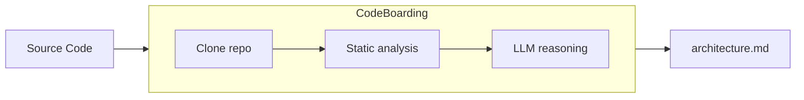

# Awesome Architecture MDs

> Architecture diagrams for popular open-source repos. Auto-generated, markdown, drop-in-ready for your coding agent.

```mermaid
graph LR
  subgraph 1["Orchestration & Lifecycle"]
    1__1_1["CLI & Execution Orchestrator"]
    1__1_2["Environment & Tooling Manager"]
    1__1_3["Project Discovery & Context Builder"]
    1__1_4["Agentic Analysis Pipeline"]
    1__1_5["System Registry & Persistence"]
  end
  subgraph 2["Static Analysis Core"]
    2__2_1["Analysis Orchestrator & Cache Manager"]
    2__2_2["LSP Client & Language Adapters"]
    2__2_3["Semantic Graph Engine"]
    2__2_4["Architectural Clustering & Validation"]
  end
  subgraph 3["Change Analysis"]
    3__3_1["Change Detection & Context Manager"]
    3__3_2["Incremental State Orchestrator"]
    3__3_3["Analysis Serialization Layer"]
  end
  subgraph 4["AI Reasoning Layer"]
    4__4_1["Agentic Orchestration & Execution"]
    4__4_2["Structural Analysis & Health Engine"]
    4__4_3["Prompt Factory & Provider Abstraction"]
    4__4_4["Context Extraction & Persistence"]
  end
  subgraph 5["Health & Documentation"]
    5__5_1["Health Metrics Evaluator"]
    5__5_2["Documentation & Visualization Generator"]
    5__5_3["Unified Data Serializer"]
    5__5_4["Structural Analysis Engine"]
    5__5_5["Incremental Update Manager"]
    5__5_6["CLI & Repository Interface"]
  end
  subgraph 6["Persistence & Tooling"]
    6__6_1["Local Persistence Engine"]
    6__6_2["Repository Interaction Toolkit"]
    6__6_3["Execution Monitoring & Telemetry"]
  end
  1 -->|"Triggers change detection to determine the scope of the current run"| 3
  1 -->|"Initiates the full project scan and graph construction"| 2
  3 -->|"Provides diff context to enable partial updates of the call graph"| 2
  2 -->|"Provides structural graph data for semantic interpretation"| 4
  4 -->|"Uses the toolkit to read specific source code files for deep analysis"| 6
  2 -->|"Provides the call graph for metric calculation and diagram generation"| 5
  4 -->|"Provides semantic descriptions and component purposes for the final reports"| 5
  6 -->|"Provides access to cached analysis data and the local database"| 2
  1 -->|"calls"| 4
  1 -->|"calls"| 5
  1 -->|"calls"| 6
  2 -->|"calls"| 1
  2 -->|"calls"| 3
  3 -->|"calls"| 1
  3 -->|"calls"| 4
  4 -->|"calls"| 1
  4 -->|"calls"| 2
  5 -->|"calls"| 2
  5 -->|"calls"| 4
  6 -->|"calls"| 1
  3__3_1 -->|"Provides the `ChangeSet` and method-level diffs along with the cached `StaticAnalysisResults` from previous runs to initiate the delta computation."| 3__3_2
  3__3_2 -->|"Supplies the updated and validated `AnalysisInsights` to be transformed into structured LLM prompts and response models."| 3__3_3
  3__3_2 -->|"calls"| 3__3_1
  4__4_1 -->|"Requests formatted system and user messages tailored to the active LLM provider."| 4__4_3
  4__4_1 -->|"Invokes repository tools to ground LLM reasoning in actual source code and metadata."| 4__4_4
  4__4_1 -->|"Consumes code clusters and health insights to provide high-level architectural summaries."| 4__4_2
  4__4_2 -->|"Reads raw static analysis data and persists graph-based clustering results for future incremental runs."| 4__4_4
  4__4_2 -->|"calls"| 4__4_1
  4__4_4 -->|"calls"| 4__4_2
  6__6_3 -->|"Persists aggregated run statistics, token usage, and job status updates to the DuckDB/SQLite backend"| 6__6_1
  6__6_2 -->|"Queries the cache using file content hashes to determine if previous analysis results can be reused"| 6__6_1
  6__6_3 -->|"Instruments tool execution to track latency and frequency of filesystem interactions during an analysis run"| 6__6_2
  2__2_1 -->|"Orchestrates the startup and shutdown of language servers required for the current project"| 2__2_2
  2__2_1 -->|"Triggers the graph construction process and provides cached symbol data to minimize redundant LSP queries"| 2__2_3
  2__2_2 -->|"Supplies raw symbol locations and reference batches used to build graph edges"| 2__2_3
  2__2_3 -->|"Provides the completed call graph and hierarchy as input for community detection and logical grouping"| 2__2_4
  2__2_4 -->|"Returns the final clustered results and change metrics to be persisted in the analysis cache"| 2__2_1
  2__2_1 -->|"calls"| 2__2_4
  2__2_2 -->|"calls"| 2__2_1
  2__2_3 -->|"calls"| 2__2_2
  5__5_6 -->|"triggers"| 5__5_5
  5__5_5 -->|"coordinates with"| 5__5_4
  5__5_4 -->|"provides component boundaries to"| 5__5_1
  5__5_1 -->|"sends findings to"| 5__5_3
  5__5_4 -->|"feeds final architectural map into"| 5__5_3
  5__5_3 -->|"provides structured JSON to"| 5__5_2
  5__5_1 -->|"calls"| 5__5_4
  5__5_1 -->|"calls"| 5__5_5
  5__5_2 -->|"calls"| 5__5_3
  5__5_2 -->|"calls"| 5__5_6
  5__5_3 -->|"calls"| 5__5_4
  5__5_3 -->|"calls"| 5__5_5
  5__5_4 -->|"calls"| 5__5_5
  5__5_5 -->|"calls"| 5__5_3
  5__5_6 -->|"calls"| 5__5_2
  1__1_1 -->|"Verifies and prepares the local environment (LSP servers, Node.js) before any analysis begins."| 1__1_2
  1__1_1 -->|"Initiates the repository scanning process to identify the codebase structure and languages."| 1__1_3
  1__1_1 -->|"Triggers the high-level analysis workflow once the environment and project context are established."| 1__1_4
  1__1_3 -->|"Provides the structured project context and file-to-language mappings required for agentic reasoning."| 1__1_4
  1__1_4 -->|"Persists analysis results and retrieves cached signatures to support incremental analysis and reduce LLM token usage."| 1__1_5
  1__1_1 -->|"Uses the registry to dynamically load available tools and plugins during initialization."| 1__1_5
  1__1_3 -->|"calls"| 1__1_1
  1__1_3 -->|"calls"| 1__1_2
  1__1_3 -->|"calls"| 1__1_5
  1__1_4 -->|"calls"| 1__1_1
  1__1_4 -->|"calls"| 1__1_3
  1__1_5 -->|"calls"| 1__1_3
```


*Example: simplified view of a typical RAG stack. Real diagrams are generated from actual source, not drawn.*

   

---

## Why

- **Onboard your AI agent.** Paste the markdown into your AGENT.md so the agent onboards in fewer tokens.
- **Live mindmap as your agent codes.** Human readable to understand the changes your agent does.
- **Pattern literacy.** *"How do mature async runtimes structure their scheduler?"* Browse five of them side-by-side.

## Drop into your agent (10 seconds)

```bash
# Cursor / Claude Code / Aider — load a repo's architecture as context
curl -sL https://raw.githubusercontent.com/<org>/awesome-architecture-mds/main/vllm/architecture.md \
  | pbcopy
```

Or reference it directly in your prompt:
```
@https://github.com/<org>/awesome-architecture-mds/blob/main/vllm/architecture.md
Using the architecture above, implement X without breaking module boundaries.
```

## Browse the atlas

Grouped by what the repo does. Each row links to the repo's top-level `on_boarding.md` — component-level diagrams live in the same folder.

<details>
<summary>📚 Contents</summary>

- [AI & machine learning](#ai--machine-learning)
- [Data & analytics](#data--analytics)
- [Web & UI](#web--ui)
- [Infrastructure & DevOps](#infrastructure--devops)
- [Developer tools](#developer-tools)
- [Scientific & research computing](#scientific--research-computing)
- [Security & privacy](#security--privacy)
- [Games, graphics & media](#games-graphics--media)
- [Networking, APIs & protocols](#networking-apis--protocols)
- [Learning codebases](#learning-codebases)
- [Full index (A–Z)](#full-index-az)

</details>

### AI & machine learning

#### LLM serving & inference
| Repo | Language | Diagram |
|---|---|---|
| [vllm](./vllm/) | Python | [on_boarding.md](./vllm/on_boarding.md) |
| [litellm](./litellm/) | Python | [on_boarding.md](./litellm/on_boarding.md) |
| [mlc-llm](./mlc-llm/) | Python / C++ | [on_boarding.md](./mlc-llm/on_boarding.md) |

#### Agent frameworks & orchestration
| Repo | Language | Diagram |
|---|---|---|
| [agentdojo](./agentdojo/) | Python | [on_boarding.md](./agentdojo/on_boarding.md) |
| [autogen](./autogen/) | Python | [on_boarding.md](./autogen/on_boarding.md) |
| [crewAI](./crewAI/) | Python | [on_boarding.md](./crewAI/on_boarding.md) |
| [haystack](./haystack/) | Python | [on_boarding.md](./haystack/on_boarding.md) |
| [langgraph](./langgraph/) | Python | [on_boarding.md](./langgraph/on_boarding.md) |
| [mcp-agent](./mcp-agent/) | Python | [on_boarding.md](./mcp-agent/on_boarding.md) |

#### AI coding tools
| Repo | Language | Diagram |
|---|---|---|
| [auto-code-rover](./auto-code-rover/) | Python | [on_boarding.md](./auto-code-rover/on_boarding.md) |
| [AutoGPT](./AutoGPT/) | Python | [on_boarding.md](./AutoGPT/on_boarding.md) |
| [CopilotKit](./CopilotKit/) | TypeScript | [on_boarding.md](./CopilotKit/on_boarding.md) |
| [gpt-engineer](./gpt-engineer/) | Python | [on_boarding.md](./gpt-engineer/on_boarding.md) |
| [gpt_engineer](./gpt_engineer/) | Python | [on_boarding.md](./gpt_engineer/on_boarding.md) |
| [stagehand](./stagehand/) | TypeScript | [on_boarding.md](./stagehand/on_boarding.md) |
| [SuperAGI](./SuperAGI/) | Python | [on_boarding.md](./SuperAGI/on_boarding.md) |

#### ML research & models
| Repo | Language | Diagram |
|---|---|---|
| [alphafold](./alphafold/) | Python | [on_boarding.md](./alphafold/on_boarding.md) |
| [alphagenome](./alphagenome/) | Python | [on_boarding.md](./alphagenome/on_boarding.md) |
| [BERTopic](./BERTopic/) | Python | [on_boarding.md](./BERTopic/on_boarding.md) |
| [detectron2](./detectron2/) | Python | [on_boarding.md](./detectron2/on_boarding.md) |
| [diffusers](./diffusers/) | Python | [on_boarding.md](./diffusers/on_boarding.md) |
| [graphrag](./graphrag/) | Python | [on_boarding.md](./graphrag/on_boarding.md) |
| [transformers](./transformers/) | Python | [on_boarding.md](./transformers/on_boarding.md) |

#### Training, evaluation & guardrails
| Repo | Language | Diagram |
|---|---|---|
| [deepeval](./deepeval/) | Python | [on_boarding.md](./deepeval/on_boarding.md) |
| [finetuner](./finetuner/) | Python | [on_boarding.md](./finetuner/on_boarding.md) |
| [llm-guard](./llm-guard/) | Python | [on_boarding.md](./llm-guard/on_boarding.md) |
| [mlflow](./mlflow/) | Python | [on_boarding.md](./mlflow/on_boarding.md) |

[⬆ back to top](#browse-the-atlas)

### Data & analytics

#### ETL & workflow orchestration
| Repo | Language | Diagram |
|---|---|---|
| [airflow](./airflow/) | Python | [on_boarding.md](./airflow/on_boarding.md) |
| [prefect](./prefect/) | Python | [on_boarding.md](./prefect/on_boarding.md) |

#### Databases & storage
| Repo | Language | Diagram |
|---|---|---|
| [influxdb-python](./influxdb-python/) | Python | [on_boarding.md](./influxdb-python/on_boarding.md) |
| [tidb](./tidb/) | Go | [on_boarding.md](./tidb/on_boarding.md) |

#### Data processing & analysis
| Repo | Language | Diagram |
|---|---|---|
| [dask](./dask/) | Python | [on_boarding.md](./dask/on_boarding.md) |
| [numpy](./numpy/) | Python / C | [on_boarding.md](./numpy/on_boarding.md) |
| [pandas](./pandas/) | Python / C | [on_boarding.md](./pandas/on_boarding.md) |
| [polars](./polars/) | Rust / Python | [on_boarding.md](./polars/on_boarding.md) |

[⬆ back to top](#browse-the-atlas)

### Web & UI

#### Frontend frameworks
| Repo | Language | Diagram |
|---|---|---|
| [angular](./angular/) | TypeScript | [on_boarding.md](./angular/on_boarding.md) |
| [react](./react/) | JavaScript / TypeScript | [on_boarding.md](./react/on_boarding.md) |
| [vue](./vue/) | JavaScript | [on_boarding.md](./vue/on_boarding.md) |

#### UI libraries & no-code
| Repo | Language | Diagram |
|---|---|---|
| [ant-design](./ant-design/) | TypeScript | [on_boarding.md](./ant-design/on_boarding.md) |
| [appsmith](./appsmith/) | TypeScript / Java | [on_boarding.md](./appsmith/on_boarding.md) |

#### Apps & platforms
| Repo | Language | Diagram |
|---|---|---|
| [saleor](./saleor/) | Python | [on_boarding.md](./saleor/on_boarding.md) |
| [synapse](./synapse/) | Python | [on_boarding.md](./synapse/on_boarding.md) |
| [zulip](./zulip/) | Python | [on_boarding.md](./zulip/on_boarding.md) |

[⬆ back to top](#browse-the-atlas)

### Infrastructure & DevOps

#### Configuration & automation
| Repo | Language | Diagram |
|---|---|---|
| [ansible](./ansible/) | Python | [on_boarding.md](./ansible/on_boarding.md) |

#### Observability & telemetry
| Repo | Language | Diagram |
|---|---|---|
| [datadogpy](./datadogpy/) | Python | [on_boarding.md](./datadogpy/on_boarding.md) |
| [dd-trace-py](./dd-trace-py/) | Python | [on_boarding.md](./dd-trace-py/on_boarding.md) |
| [grafanalib](./grafanalib/) | Python | [on_boarding.md](./grafanalib/on_boarding.md) |
| [newrelic-python-agent](./newrelic-python-agent/) | Python | [on_boarding.md](./newrelic-python-agent/on_boarding.md) |
| [opentelemetry-go](./opentelemetry-go/) | Go | [on_boarding.md](./opentelemetry-go/on_boarding.md) |
| [opentelemetry-python](./opentelemetry-python/) | Python | [on_boarding.md](./opentelemetry-python/on_boarding.md) |
| [sentry-python](./sentry-python/) | Python | [on_boarding.md](./sentry-python/on_boarding.md) |

#### Media & real-time infra
| Repo | Language | Diagram |
|---|---|---|
| [livekit](./livekit/) | Go | [on_boarding.md](./livekit/on_boarding.md) |

#### Platform SDKs
| Repo | Language | Diagram |
|---|---|---|
| [docker-py](./docker-py/) | Python | [on_boarding.md](./docker-py/on_boarding.md) |

[⬆ back to top](#browse-the-atlas)

### Developer tools

#### Package & environment management
| Repo | Language | Diagram |
|---|---|---|
| [pipenv](./pipenv/) | Python | [on_boarding.md](./pipenv/on_boarding.md) |
| [poetry](./poetry/) | Python | [on_boarding.md](./poetry/on_boarding.md) |

#### Language tooling (lint / types / format)
| Repo | Language | Diagram |
|---|---|---|
| [Black](./Black/) | Python | [on_boarding.md](./Black/on_boarding.md) |
| [mypy](./mypy/) | Python | [on_boarding.md](./mypy/on_boarding.md) |
| [pydantic](./pydantic/) | Python | [on_boarding.md](./pydantic/on_boarding.md) |
| [ruff-lsp](./ruff-lsp/) | Python | [on_boarding.md](./ruff-lsp/on_boarding.md) |

#### CLIs, docs & DX
| Repo | Language | Diagram |
|---|---|---|
| [honcho](./honcho/) | Python | [on_boarding.md](./honcho/on_boarding.md) |
| [mkdocs](./mkdocs/) | Python | [on_boarding.md](./mkdocs/on_boarding.md) |
| [questionary](./questionary/) | Python | [on_boarding.md](./questionary/on_boarding.md) |
| [rich](./rich/) | Python | [on_boarding.md](./rich/on_boarding.md) |
| [tqdm](./tqdm/) | Python | [on_boarding.md](./tqdm/on_boarding.md) |

#### Testing & load
| Repo | Language | Diagram |
|---|---|---|
| [locust](./locust/) | Python | [on_boarding.md](./locust/on_boarding.md) |
| [pytest](./pytest/) | Python | [on_boarding.md](./pytest/on_boarding.md) |
| [pytest-xdist](./pytest-xdist/) | Python | [on_boarding.md](./pytest-xdist/on_boarding.md) |

[⬆ back to top](#browse-the-atlas)

### Scientific & research computing

#### Genomics & bioinformatics
| Repo | Language | Diagram |
|---|---|---|
| [AfterQC](./AfterQC/) | Python / C++ | [on_boarding.md](./AfterQC/on_boarding.md) |
| [alphafold](./alphafold/) | Python | [on_boarding.md](./alphafold/on_boarding.md) |
| [alphagenome](./alphagenome/) | Python | [on_boarding.md](./alphagenome/on_boarding.md) |
| [anndata](./anndata/) | Python | [on_boarding.md](./anndata/on_boarding.md) |
| [kipoiseq](./kipoiseq/) | Python | [on_boarding.md](./kipoiseq/on_boarding.md) |
| [ProteinFlow](./ProteinFlow/) | Python | [on_boarding.md](./ProteinFlow/on_boarding.md) |
| [PyDESeq2](./PyDESeq2/) | Python | [on_boarding.md](./PyDESeq2/on_boarding.md) |

#### Imaging, neuroscience & health
| Repo | Language | Diagram |
|---|---|---|
| [AllenSDK](./AllenSDK/) | Python | [on_boarding.md](./AllenSDK/on_boarding.md) |
| [cellpose](./cellpose/) | Python | [on_boarding.md](./cellpose/on_boarding.md) |
| [nilearn](./nilearn/) | Python | [on_boarding.md](./nilearn/on_boarding.md) |
| [PyHealth](./PyHealth/) | Python | [on_boarding.md](./PyHealth/on_boarding.md) |

#### Molecular dynamics & chemistry
| Repo | Language | Diagram |
|---|---|---|
| [pyemma](./pyemma/) | Python | [on_boarding.md](./pyemma/on_boarding.md) |

[⬆ back to top](#browse-the-atlas)

### Security & privacy

#### App & supply-chain security
| Repo | Language | Diagram |
|---|---|---|
| [bandit](./bandit/) | Python | [on_boarding.md](./bandit/on_boarding.md) |
| [credential-digger](./credential-digger/) | Python | [on_boarding.md](./credential-digger/on_boarding.md) |
| [llm-guard](./llm-guard/) | Python | [on_boarding.md](./llm-guard/on_boarding.md) |
| [python-tuf](./python-tuf/) | Python | [on_boarding.md](./python-tuf/on_boarding.md) |

#### Offensive / red team
| Repo | Language | Diagram |
|---|---|---|
| [CobaltStrikeBeaconCppSource](./CobaltStrikeBeaconCppSource/) | C++ | [on_boarding.md](./CobaltStrikeBeaconCppSource/on_boarding.md) |
| [GhostTrack](./GhostTrack/) | Python | [on_boarding.md](./GhostTrack/on_boarding.md) |

[⬆ back to top](#browse-the-atlas)

### Games, graphics & media

#### Game engines & 3D
| Repo | Language | Diagram |
|---|---|---|
| [openage](./openage/) | C++ / Python | [on_boarding.md](./openage/on_boarding.md) |
| [panda3d](./panda3d/) | C++ / Python | [on_boarding.md](./panda3d/on_boarding.md) |
| [pygame](./pygame/) | Python / C | [on_boarding.md](./pygame/on_boarding.md) |
| [pygame-menu](./pygame-menu/) | Python | [on_boarding.md](./pygame-menu/on_boarding.md) |

#### Video, audio & downloaders
| Repo | Language | Diagram |
|---|---|---|
| [anime-downloader](./anime-downloader/) | Python | [on_boarding.md](./anime-downloader/on_boarding.md) |
| [Deep-Live-Cam](./Deep-Live-Cam/) | Python | [on_boarding.md](./Deep-Live-Cam/on_boarding.md) |
| [soundconverter](./soundconverter/) | Python | [on_boarding.md](./soundconverter/on_boarding.md) |
| [syncedlyrics](./syncedlyrics/) | Python | [on_boarding.md](./syncedlyrics/on_boarding.md) |
| [youtube-dl](./youtube-dl/) | Python | [on_boarding.md](./youtube-dl/on_boarding.md) |
| [yt-dlp](./yt-dlp/) | Python | [on_boarding.md](./yt-dlp/on_boarding.md) |

#### Creative tooling
| Repo | Language | Diagram |
|---|---|---|
| [arcade-ai](./arcade-ai/) | Python | [on_boarding.md](./arcade-ai/on_boarding.md) |
| [blender-mcp](./blender-mcp/) | Python | [on_boarding.md](./blender-mcp/on_boarding.md) |

[⬆ back to top](#browse-the-atlas)

### Networking, APIs & protocols

#### Platform SDKs & API clients
| Repo | Language | Diagram |
|---|---|---|
| [PyGithub](./PyGithub/) | Python | [on_boarding.md](./PyGithub/on_boarding.md) |
| [shopify_python_api](./shopify_python_api/) | Python | [on_boarding.md](./shopify_python_api/on_boarding.md) |
| [twitter-api-client](./twitter-api-client/) | Python | [on_boarding.md](./twitter-api-client/on_boarding.md) |
| [web3.py](./web3.py/) | Python | [on_boarding.md](./web3.py/on_boarding.md) |

#### Industrial & IoT protocols
| Repo | Language | Diagram |
|---|---|---|
| [mavlink](./mavlink/) | Python | [on_boarding.md](./mavlink/on_boarding.md) |
| [python-opcua](./python-opcua/) | Python | [on_boarding.md](./python-opcua/on_boarding.md) |

[⬆ back to top](#browse-the-atlas)

### Learning codebases

Small, well-structured repos where the diagram is more useful for *studying architectural style* than for day-to-day agent grounding.

| Repo | Language | Why it's here |
|---|---|---|
| [30-Days-Of-Python](./30-Days-Of-Python/) | Python | Layered tutorial structure you can read end-to-end |
| [algorithms](./algorithms/) | Python | Minimal, topic-per-module organization |
| [annotated_deep_learning_paper_implementations](./annotated_deep_learning_paper_implementations/) | Python | One module per paper — a reference for "how do I structure research code?" |
| [Solitaire](./Solitaire/) | Python | A complete game in a readable footprint |
| [Sudoku](./Sudoku/) | Python | Classic separation of rules, solver, UI |
| [tinygrad](./tinygrad/) | Python | A full ML framework in few enough files to actually read |

[⬆ back to top](#browse-the-atlas)

### Full index (A–Z)

Every repo in the atlas, flat and alphabetical — for Ctrl-F and for anything not covered above. See [INDEX.md](./INDEX.md).

[⬆ back to top](#browse-the-atlas)


## How diagrams are generated



Every diagram is produced by running [**CodeBoarding**](https://codeboarding.com) — a local static-analysis + LLM-reasoning engine — over the repo at `--depth-level 2`. The engine parses real imports, call graphs, and module boundaries; the LLM only names and summarizes. No diagram is hand-drawn.

## Contribute

**Found a mistake?** Static analysis + LLMs aren't perfect. If a module is misnamed or a dependency is invented, open a PR on the `.md`.

**Want your repo in here?** Open an issue with:
- the GitHub URL
- one sentence on what the repo does
- primary language

We prioritize repos that are (a) actively maintained, (b) widely depended on, or (c) architecturally interesting.

**Running this on your own code?** [CodeBoarding](https://codeboarding.com) runs locally. Point it at any repo, public or private.

## License

[MIT](./LICENSE). Copy the diagrams into your own `README.md`, `ARCHITECTURE.md`, or `.cursorrules`. No attribution required.
