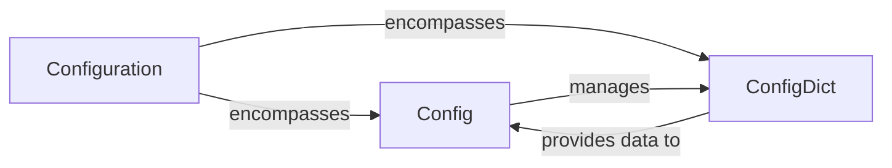

## Details

The `Configuration` subsystem is a core part of the `Open3D-ML` project, specifically located within `ml3d.utils.config`. Its primary boundary encompasses all functionalities related to loading, parsing, managing, and providing access to project configurations, which are predominantly stored in YAML files. This subsystem acts as the central hub for defining and instantiating various pipeline elements, including dataset paths, model parameters, and overall pipeline settings.

### Configuration [[Expand]](./Configuration.md)
This is the overarching conceptual component representing the entire configuration management subsystem. It is responsible for the holistic process of handling project configurations, from initial loading to providing structured access for other parts of the ML pipeline. It embodies the configuration-driven architecture of the project.

**Related Classes/Methods**:

- <a href="https://github.com/isl-org/Open3D-ML/blob/main/ml3d/utils/config.py#L1-L10000" target="_blank" rel="noopener noreferrer">`ml3d.utils.config`:1-10000</a>

### Config
`Config` serves as the primary operational interface for all configuration management operations within the subsystem. Its responsibilities include loading configuration data from files (e.g., YAML), merging settings from various sources, converting configuration structures (e.g., for different frameworks), dumping configurations, and adding dynamic arguments. It orchestrates the lifecycle of configuration data, acting as the main entry point for interacting with the configuration system.

**Related Classes/Methods**:

- <a href="https://github.com/isl-org/Open3D-ML/blob/main/ml3d/utils/config.py#L49-L253" target="_blank" rel="noopener noreferrer">`ml3d.utils.config.Config`:49-253</a>

### ConfigDict
`ConfigDict` is a specialized data container designed to store and organize configuration key-value pairs. It provides structured access to configuration settings, enabling hierarchical and nested configurations. It acts as the passive data structure that `Config` manipulates and provides to other components.

**Related Classes/Methods**:

- <a href="https://github.com/isl-org/Open3D-ML/blob/main/ml3d/utils/config.py#L12-L27" target="_blank" rel="noopener noreferrer">`ml3d.utils.config.ConfigDict`:12-27</a>

### [FAQ](https://github.com/CodeBoarding/GeneratedOnBoardings/tree/main?tab=readme-ov-file#faq)