```mermaid
graph LR
  subgraph 1["User Interface & Interaction"]
    1__1_1["Extension Webview UI"]
    1__1_2["CLI Terminal Interface (TUI)"]
    1__1_3["CLI Autocomplete System"]
    1__1_4["Web Marketing & Documentation Platform"]
    1__1_2 -->|"Delegates input suggestion and trigger detection logic to provide an IDE-like experience within the…"| 1__1_3
    1__1_4 -->|"Informs the provider configuration UI by defining the available models and pricing structures displ…"| 1__1_1
    1__1_2 -->|"Implements parallel interaction patterns and state management for the agentic loop, ensuring featur…"| 1__1_1
  end
  subgraph 2["Agentic Core & Platform Abstraction"]
    2__2_1["Agentic Orchestration Core"]
    2__2_2["Platform Abstraction Layer (VS Code Shim)"]
    2__2_3["Multi-Platform Host Bridge"]
    2__2_4["Agentic Tooling & Safety"]
    2__2_5["Ancillary Services"]
    2__2_3 -->|"Dispatches user commands and UI events to trigger the agentic loop."| 2__2_1
    2__2_1 -->|"Invokes specific tools and validates operations against safety policies."| 2__2_4
    2__2_1 -->|"Utilizes shimmed VS Code APIs for workspace and filesystem access."| 2__2_2
    2__2_3 -->|"CLI Host initializes the shim to provide a simulated environment for the Core."| 2__2_2
    2__2_5 -->|"Provides reliability (retries) and observability (logging) for core operations."| 2__2_1
  end
  subgraph 3["AI Intelligence & Context Layer"]
    3__3_1["AI Provider & Transformation Layer"]
    3__3_2["Codebase Context & Search"]
    3__3_2 -->|"Supplies retrieved code snippets, file contents, and resolved mentions to be formatted into the fin…"| 3__3_1
    3__3_1 -->|"Provides embedding generation services via LLM providers to support vector indexing and semantic se…"| 3__3_2
  end
  subgraph 4["Tooling & Capability Registry"]
    4__4_1["Native Tool Execution Engine"]
    4__4_2["MCP Integration & Hub"]
    4__4_3["Capability Marketplace & Skills Manager"]
    4__4_4["Tool Registry & Governance Layer"]
    4__4_4 -->|"Filters and validates the availability of built-in tools based on the current agent mode and safety…"| 4__4_1
    4__4_4 -->|"Controls access to dynamically discovered MCP tools, ensuring they adhere to the same governance ru…"| 4__4_2
    4__4_3 -->|"Installs and configures new MCP servers, triggering the Hub to refresh its tool registry."| 4__4_2
    4__4_3 -->|"Registers newly installed skills and custom modes, making them available for the governance layer t…"| 4__4_4
    4__4_2 -->|"Implements MCP tool invocation by extending the base tool interfaces, allowing remote tools to be t…"| 4__4_1
  end
  subgraph 5["Infrastructure & State Management"]
    5__5_1["Configuration & Persistence Hub"]
    5__5_2["Safety & Recovery Engine"]
    5__5_3["Cloud & Telemetry Services"]
    5__5_1 -->|"Supplies user preferences and workspace context required to initialize shadow git repositories and …"| 5__5_2
    5__5_1 -->|"Provides authentication secrets and local configuration state needed for cloud synchronization and …"| 5__5_3
    5__5_3 -->|"Updates local state with synchronized settings, organization-level policies, and user session data …"| 5__5_1
    5__5_2 -->|"Persists task history and checkpoint metadata into the global state to ensure recovery points are a…"| 5__5_1
  end
  subgraph 6["Evaluation & Benchmarking"]
    6__6_1["Evaluation Orchestrator"]
    6__6_2["Evaluation Storage"]
    6__6_3["Evaluation Dashboard"]
    6__6_4["Performance Analytics"]
    6__6_1 -->|"writes task execution results and run metadata to"| 6__6_2
    6__6_3 -->|"fetches run history and detailed task metrics from"| 6__6_2
    6__6_3 -->|"monitors live execution status from"| 6__6_1
    6__6_4 -->|"aggregates historical data from"| 6__6_2
    6__6_3 -->|"utilizes queries to perform administrative actions like deleting old runs or editing tool group con…"| 6__6_2
  end
  1 -->|"Sends user commands, task initiations, and configuration updates to the orchestration layer."| 2
  2 -->|"Requests reasoning and completions, providing the necessary codebase context and prompt templates."| 3
  2 -->|"Dispatches parsed tool calls (e.g., read_file, execute_command) for execution."| 4
  4 -->|"Returns tool execution results and logs to be fed back into the agentic loop."| 2
  2 -->|"Persists task history, updates global settings, and creates safety checkpoints before destructive a…"| 5
  3 -->|"Retrieves provider credentials and utilizes caching strategies for token optimization."| 5
  6 -->|"Triggers automated agent tasks to measure accuracy and performance metrics."| 2
```

## Details

Roo-Code operates as an agentic loop where user intent from the UI (VS Code or CLI) is processed by a central Orchestration Core. This core leverages a Platform Shim to remain environment-agnostic, allowing the same logic to run in the VS Code extension host or a standalone terminal. It coordinates with an AI Intelligence layer for reasoning and a Context Engine for codebase awareness (RAG). Actions are executed through a Tool Registry that manages native file/shell tools and external MCP servers. System state, safety checkpoints, and cloud synchronization are handled by the Infrastructure layer, while a dedicated Evaluation framework monitors performance and accuracy.

### User Interface & Interaction

The primary entry points for users, encompassing the VS Code React webview, the CLI terminal interface (TUI), and the public-facing web documentation. It handles user input, chat rendering, and complex configuration screens.

- **Extension Webview UI** — The primary interface for VS Code users, handling complex provider configurations (API keys, model parameters), marketplace interactions for custom modes, and MCP server management.
- **CLI Terminal Interface (TUI)** — An Ink-based terminal application that orchestrates the agentic loop in a CLI environment.
- **CLI Autocomplete System** — A specialized, modular engine within the CLI that provides context-aware suggestions for files, slash commands, and modes.
- **Web Marketing & Documentation Platform** — The public-facing web presence encompassing the homepage, a content-managed blog system, and a searchable directory of AI models and providers with pricing calculations.

### Agentic Core & Platform Abstraction

The central nervous system that manages the 'Agentic Loop' and task lifecycle. It includes a platform shim that mocks VS Code APIs, enabling the core logic to run across different environments (IDE vs. CLI) via IPC.

- **Agentic Orchestration Core** — The central logic engine that manages the iterative agentic loop, task initialization, tool call parsing, and context management.
- **Platform Abstraction Layer (VS Code Shim)** — A virtualization layer that mocks the VS Code Extension API to allow core logic to run in non-IDE environments.
- **Multi-Platform Host Bridge** — Manages entry points for the agent, handling bidirectional communication between the UI and the orchestration core.
- **Agentic Tooling & Safety** — The execution layer for system interactions, including custom tool registry, diffing strategies, and safety controllers.
- **Ancillary Services** — Supporting infrastructure for cross-cutting concerns like cloud-based API retries, telemetry, and evaluation.

### AI Intelligence & Context Layer

Manages the interface with LLM providers and provides the agent with codebase awareness. It handles prompt construction, provider-specific message formatting, token caching strategies, and RAG-based file search/indexing.

- **AI Provider & Transformation Layer** — Orchestrates the lifecycle of an LLM request, from internal message formatting to API execution.
- **Codebase Context & Search** — Provides the agent with "codebase awareness" by indexing files and resolving contextual references.

### Tooling & Capability Registry

Manages the agent's 'toolbox', including native file system and shell tools, Model Context Protocol (MCP) server integrations, and the marketplace for installing new capabilities.

- **Native Tool Execution Engine** — Provides the core toolbox of the agent, containing hardcoded TypeScript implementations for fundamental IDE operations like file system and terminal interactions.
- **MCP Integration & Hub** — Manages the infrastructure for the Model Context Protocol, enabling dynamic extension of agent capabilities through external servers and remote tools.
- **Capability Marketplace & Skills Manager** — Handles the acquisition, installation, and management of high-level agent capabilities, including user-defined skills and marketplace-installed MCP servers.
- **Tool Registry & Governance Layer** — Acts as the gatekeeper for the subsystem, filtering tools based on agent mode, validating arguments, and preventing execution loops.

### Infrastructure & State Management

Handles long-term persistence, global configuration, and safety features. This includes task history, Git-based shadow checkpoints for state recovery, and cloud services for task sharing and telemetry.

- **Configuration & Persistence Hub** — Serves as the central authority for the extension's state, managing user preferences, AI provider profiles, and custom agent modes.
- **Safety & Recovery Engine** — Implements the agent's safety features by maintaining hidden Git-based shadow repositories.
- **Cloud & Telemetry Services** — Manages external integrations, including user authentication, organization-level policy synchronization, and performance tracking.

### Evaluation & Benchmarking

A dedicated framework for testing agent performance, running automated evaluations, and visualizing results via a web dashboard to ensure quality across model updates.

- **Evaluation Orchestrator** — The execution engine responsible for running agent tasks in isolated environments.
- **Evaluation Storage** — Manages the relational data model for benchmarking.
- **Evaluation Dashboard** — A standalone web application for managing evaluations.
- **Performance Analytics** — Specialized reporting module that transforms raw evaluation data into visual insights.

