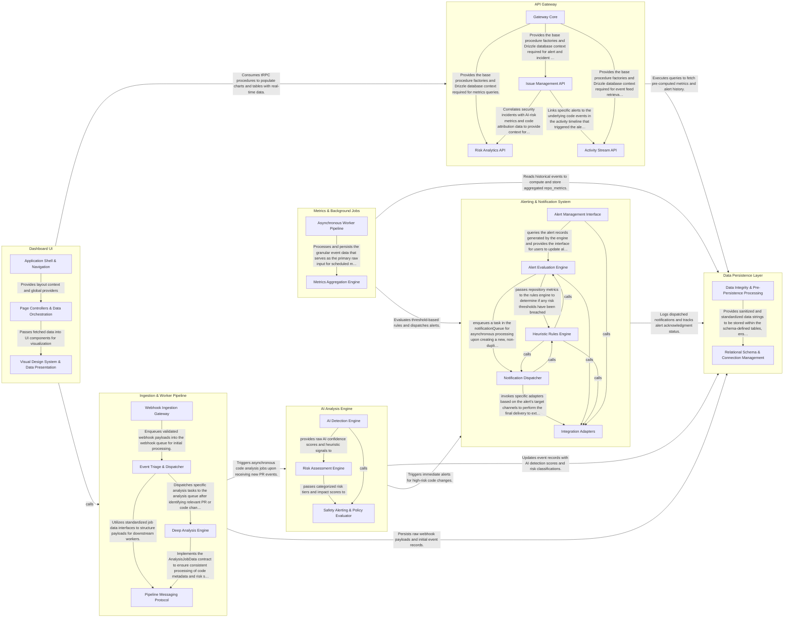

## Details

Sentinel's architecture is designed as a linear processing pipeline that transforms raw code events into actionable engineering insights. The flow begins with the Ingestion & Worker Pipeline, which captures GitHub webhooks and orchestrates asynchronous tasks. These tasks are routed to the AI Analysis Engine for risk assessment and the Metrics & Background Jobs component for long-term trend aggregation. Both processing components feed into the Alerting & Notification System to trigger external integrations like Slack. The entire state is managed by the Data Persistence Layer, which serves as the source of truth for the API Gateway and the Dashboard UI, enabling real-time visibility into AI-generated code risks and reviewer saturation.

### Ingestion & Worker Pipeline

The entry point for the system, responsible for receiving external webhooks, verifying signatures, and managing the BullMQ-based job queue for downstream processing.

- **Webhook Ingestion Gateway** — Acts as the secure entry point for the system, receiving raw HTTP POST requests from GitHub.
- **Event Triage & Dispatcher** — The first worker stage in the pipeline.
- **Deep Analysis Engine** — Executes the core logic of the pipeline by performing detailed code analysis.
- **Pipeline Messaging Protocol** — Defines the standardized data structures and job interfaces used across the BullMQ pipeline.

### AI Analysis Engine

The core intelligence layer that applies heuristic signals and risk classification logic to code changes to detect AI involvement and assess potential safety impacts.

- **AI Detection Engine** — Orchestrates a suite of heuristic detectors to identify AI involvement in code changes.
- **Risk Assessment Engine** — Evaluates the potential safety impact of detected AI code by mapping changes to specific risk tiers (T1 to T4).
- **Safety Alerting & Policy Evaluator** — Translates analysis results into actionable organizational responses.

### Metrics & Background Jobs

Handles scheduled aggregation of raw event data into high-level repository metrics, such as reviewer saturation and survival rates, optimized for dashboard performance.

- **Metrics Aggregation Engine** — Orchestrates the periodic transformation of raw event data into high-level repository health metrics.
- **Asynchronous Worker Pipeline** — Manages the execution environment and operational lifecycle for event-driven background tasks.

### Alerting & Notification System

Evaluates business rules against processed data and dispatches notifications to external platforms like Slack, PagerDuty, and Email.

- **Alert Evaluation Engine** — The central orchestrator of the alerting lifecycle.
- **Heuristic Rules Engine** — A functional logic layer containing the business rules for risk detection.
- **Notification Dispatcher** — An asynchronous delivery system built on BullMQ.
- **Integration Adapters** — The translation layer between Sentinel's internal alert model and external platform APIs.
- **Alert Management Interface** — The user-facing dashboard and API layer.

### API Gateway

A tRPC-based communication layer that provides secure, type-safe access to alerts, metrics, and incident data for the frontend.

- **Gateway Core** — Provides the foundational tRPC infrastructure, including server initialization, middleware for authentication/authorization, and the root appRouter that aggregates all domain-specific procedures into a single type-safe API.
- **Risk Analytics API** — Delivers pre-computed metrics and risk assessments, surfacing repository health snapshots and identifying high-risk files based on AI attribution and "verification tax" heuristics.
- **Issue Management API** — Manages the lifecycle of alerts and security incidents, providing filtered views of system anomalies and allowing users to perform mutations such as acknowledging alerts or investigating incident root causes.
- **Activity Stream API** — Provides a paginated, cursor-based feed of raw code events (commits, pull requests, deployments), serving as the historical timeline for all repository activity and the basis for risk analysis.

### Dashboard UI

The Next.js presentation layer that visualizes risk metrics, trends, and alert tables for engineering managers.

- **Application Shell & Navigation** — Defines the structural framework and global state of the dashboard, managing the root layout, authentication/tRPC providers, and persistent sidebar navigation.
- **Page Controllers & Data Orchestration** — Acts as the controller layer within the Next.js App Router, responsible for route-level logic, fetching data from the backend via tRPC, and orchestrating the layout of metrics and alerts.
- **Visual Design System & Data Presentation** — A modular library of reusable UI components and complex organisms designed for data visualization, including risk badges, alerts tables, and trend charts.

### Data Persistence Layer

Manages the PostgreSQL database schema via Drizzle ORM, providing the foundational storage for events, metrics, and system configuration.

- **Relational Schema & Connection Management** — Manages the database schema definitions, relational constraints, and the operational lifecycle of the PostgreSQL connection pool.
- **Data Integrity & Pre-Persistence Processing** — Acts as a gatekeeper for data quality by providing string manipulation and security utilities.

