```mermaid
graph LR
  subgraph 1["API & Orchestration Layer"]
    1__1_1["API & Configuration Interface"]
    1__1_2["Build & Compilation Engine"]
    1__1_3["Distributed Runtime Orchestrator"]
    1__1_4["Model Architecture Registry"]
    1__1_5["Data Processing & Result Streamer"]
    1__1_6["Memory & Cache Controller"]
    1__1_1 -->|"Passes validated build parameters and hardware targets to initiate engine generation."| 1__1_2
    1__1_2 -->|"Instantiates model layers and weights to construct the TensorRT network graph."| 1__1_4
    1__1_1 -->|"Triggers the initialization of the execution environment and request scheduler based on runtime arg…"| 1__1_3
    1__1_3 -->|"Requests page allocations and manages eviction policies for the KV cache during request execution."| 1__1_6
    1__1_3 -->|"Forwards processed input tensors for execution and retrieves generation results for streaming."| 1__1_5
    1__1_5 -->|"Provides the final processed tokens and streaming responses to the user-facing API endpoints."| 1__1_1
  end
  subgraph 2["Model Factory & Optimized Layers"]
    2__2_1["Hardware-Optimized Layer Primitives"]
    2__2_2["Generative & Encoder LLM Architectures"]
    2__2_3["Advanced MoE & Multi-Modal Architectures"]
    2__2_4["Speculative Decoding Framework"]
    2__2_1 -->|"Provides the optimized Attention, MLP, and LinearMethod implementations used to construct standard …"| 2__2_2
    2__2_1 -->|"Supplies specialized FusedMoEMethod and routing logic required for high-scale expert architectures …"| 2__2_3
    2__2_2 -->|"Standard model architectures are utilized as 'Target Models' within the speculative decoding pipeli…"| 2__2_4
    2__2_4 -->|"Often wraps or inherits from standard architectures to create specialized 'Draft' variants (e.g., E…"| 2__2_2
  end
  subgraph 3["Engine Builder & Graph Optimizer"]
    3__3_1["Graph Rewriting Framework"]
    3__3_2["Weight Conversion & Quantization Pipeline"]
    3__3_3["Multimodal Engine Builder"]
    3__3_4["Multimodal Model Adapters"]
    3__3_3 -->|"invokes adapters to wrap components"| 3__3_4
    3__3_3 -->|"triggers weight loading and quantization passes"| 3__3_2
    3__3_3 -->|"applies optimization pipeline to the network graph"| 3__3_1
    3__3_2 -->|"informs specific graph rewriting passes with metadata"| 3__3_1
  end
  subgraph 4["Request Serving & Scheduling"]
    4__4_1["Intelligent Request Router"]
    4__4_2["Micro-Batch Scheduler"]
    4__4_3["Scheduling Policy & Resource Manager"]
    4__4_1 -->|"Dispatches incoming requests to the specific scheduler instance of the selected server based on loa…"| 4__4_2
    4__4_2 -->|"Queries for feasible batch configurations and requests block allocations to ensure the proposed bat…"| 4__4_3
  end
  subgraph 5["Runtime Executor"]
    5__5_1["Generation Orchestrator"]
    5__5_2["Runtime Engine Interface"]
    5__5_3["Multimodal Pipeline Manager"]
    5__5_3 -->|"Prepares multimodal features and prompt tokens, then delegates the iterative text generation proces…"| 5__5_1
    5__5_1 -->|"Invokes the underlying TensorRT engine for forward passes and requests management of GPU memory buf…"| 5__5_2
  end
  subgraph 6["KV Cache Manager"]
    6__6_1["Logical Cache Orchestrator"]
    6__6_2["Physical Memory Backends"]
    6__6_3["Asynchronous Execution & Resource Management"]
    6__6_1 -->|"Maps logical slots to physical memory addresses and manages pool resizing."| 6__6_2
    6__6_1 -->|"Schedules data movement (offloading/prefetching) and synchronization events."| 6__6_3
    6__6_3 -->|"Executes memory operations (copies/clears) and synchronization on the underlying buffers."| 6__6_2
  end
  subgraph 7["Evaluation Harness"]
    7__7_1["Evaluation Orchestrator"]
    7__7_2["Model Runtime Adapters"]
    7__7_3["Benchmark Task Suite"]
    7__7_3 -->|"invokes orchestrator to start evaluation"| 7__7_1
    7__7_1 -->|"instantiates and manages lifecycle of adapters"| 7__7_2
    7__7_1 -->|"performs self-modification via patching"| 7__7_1
  end
  1 -->|"Configures and instantiates model structures based on user arguments."| 2
  2 -->|"Provides the high-level computational graph for AOT optimization and compilation."| 3
  3 -->|"Produces the serialized engine files required for execution."| 5
  4 -->|"Dispatches scheduled micro-batches of requests for inference."| 5
  5 -->|"Requests memory slot allocation and manages stateful KV caches during the generation loop."| 6
  7 -->|"Triggers inference passes to collect metrics and validate model output."| 5
```

## Details

The TensorRT-LLM architecture follows a decoupled "Build-then-Run" pipeline designed for high-performance GPU inference. The flow begins with the API & Orchestration Layer and Model Factory, which define the computational graph using hardware-optimized Quantized Layers. This graph is then passed to the Engine Builder & Graph Optimizer for ahead-of-time (AOT) compilation into a serialized TensorRT engine. At runtime, the Request Serving & Scheduling component receives incoming requests and organizes them into micro-batches for the Runtime Executor. The executor performs iterative token generation, relying on the KV Cache Manager to maintain the critical GPU memory state (radix-tree based prefix caching) across generation steps. Finally, the Evaluation Harness provides a validation loop to measure the performance and accuracy of the deployed models.

### API & Orchestration Layer

Acts as the primary entry point for the library, handling high-level configuration, argument parsing, and the foundational orchestration of the build and execution workflows.

- **API & Configuration Interface** — Acts as the primary entry point for users, handling CLI arguments, YAML configurations, and providing an OpenAI-compatible REST interface.
- **Build & Compilation Engine** — Orchestrates the compilation pipeline that converts Python-defined models into optimized TensorRT engines.
- **Distributed Runtime Orchestrator** — Manages the execution of compiled engines across distributed GPU clusters.
- **Model Architecture Registry** — Provides the foundational abstractions and specific implementations for various LLM architectures (e.g., Llama, Qwen).
- **Data Processing & Result Streamer** — Manages the transformation of raw inputs into tensors and the asynchronous delivery of generation results.
- **Memory & Cache Controller** — A specialized component focused on GPU memory state management.

### Model Factory & Optimized Layers

Contains the library of supported LLM architectures and the low-level, hardware-optimized primitives (Attention, MLP, Quantization) used to construct them.

- **Hardware-Optimized Layer Primitives** — Provides the fundamental building blocks of neural networks (Attention, MLP, Embedding) integrated with low-level quantization and routing logic.
- **Generative & Encoder LLM Architectures** — Contains the standard library of text-based model architectures, including causal decoders (Llama, Mistral) and encoder-only models (BERT).
- **Advanced MoE & Multi-Modal Architectures** — Handles complex, high-scale architectures including large-scale Mixture-of-Experts (DeepSeek, Qwen) and multi-modal systems (Vision-Language Models, Diffusion Transformers).
- **Speculative Decoding Framework** — Implements the specialized modeling logic required for speculative decoding.

### Engine Builder & Graph Optimizer

Implements the AOT compilation pipeline, performing graph rewriting, weight conversion, and hardware-specific optimizations to produce executable TensorRT engines.

- **Graph Rewriting Framework** — Implements the core AOT graph transformation infrastructure using a pattern-matching system to identify subgraphs and replace them with optimized TensorRT primitives or fused kernels.
- **Weight Conversion & Quantization Pipeline** — Manages the ingestion and transformation of model weights from external formats into optimized layouts, including QKV splitting and quantization pipelines.
- **Multimodal Engine Builder** — Acts as the high-level orchestrator for the compilation process, managing the end-to-end flow from parsing CLI arguments to exporting the final TensorRT executable.
- **Multimodal Model Adapters** — Provides model-specific wrappers and optimization blocks for non-LLM components like vision and audio encoders to bridge them with the TensorRT-LLM builder.

### Request Serving & Scheduling

Manages the lifecycle of inference requests in a multi-user environment, including load balancing, request routing, and micro-batch scheduling.

- **Intelligent Request Router** — Acts as the entry point for the subsystem, managing a pool of inference servers.
- **Micro-Batch Scheduler** — The core execution orchestrator within a single engine instance.
- **Scheduling Policy & Resource Manager** — Provides the algorithmic logic and memory management constraints for the scheduler, including GPU memory block allocation and enforcement of utilization policies.

### Runtime Executor

The core execution engine responsible for loading built engines and managing the iterative token-by-token generation loop.

- **Generation Orchestrator** — Manages the iterative generation loop, including sampling strategies, stopping criteria, and KV cache state.
- **Runtime Engine Interface** — Provides the low-level bridge to the TensorRT engine.
- **Multimodal Pipeline Manager** — Orchestrates the end-to-end flow for multimodal models (e.g., LLaVA, CogVLM).

### KV Cache Manager

A specialized memory management layer that handles GPU slot allocation and prefix caching (radix tree) to optimize memory reuse during generation.

- **Logical Cache Orchestrator** — Manages the high-level lifecycle and hierarchy of KV cache units.
- **Physical Memory Backends** — Provides the hardware-specific memory pools and low-level primitives required to back the logical cache slots.
- **Asynchronous Execution & Resource Management** — Orchestrates asynchronous GPU operations and manages the lifecycle of transient resources like CUDA streams and events.

### Evaluation Harness

Provides integration with benchmarking frameworks to evaluate the accuracy and performance of the optimized models.

- **Evaluation Orchestrator** — The central control unit that manages the evaluation lifecycle, including environment initialization, runtime patching, and distributed execution coordination.
- **Model Runtime Adapters** — A translation layer that adapts TensorRT-LLM's optimized inference runtime to the expected API of benchmarking frameworks, encapsulating engine, tokenizer, and sampling logic.
- **Benchmark Task Suite** — A collection of specialized implementations for various benchmarking datasets, defining data processing, prompt templates, and scoring metrics.

