```mermaid
graph LR
  subgraph 1["Async Execution Engine"]
    1__1_1["Actor Concurrency Framework"]
    1__1_2["Resilient Async Hub"]
    1__1_3["FSM Orchestration Engine"]
    1__1_4["Execution Support & Data Utilities"]
    1__1_3 -->|"uses retry logic and backoff strategies to handle transient failures during state transitions or ac…"| 1__1_2
    1__1_1 -->|"utilize the Future/Promise pattern to return results of asynchronous computations to callers withou…"| 1__1_2
    1__1_3 -->|"uses JSONPath utilities for data extraction from state contexts and environment utilities for confi…"| 1__1_4
    1__1_2 -->|"retry strategies and resource pools are configured using the environment and infrastructure setting…"| 1__1_4
    1__1_1 -->|"calls"| 1__1_4
    1__1_2 -->|"calls"| 1__1_1
    1__1_3 -->|"calls"| 1__1_1
    1__1_4 -->|"calls"| 1__1_1
    1__1_4 -->|"calls"| 1__1_2
  end
  subgraph 2["State Machine Framework"]
    2__2_1["Workflow Definition & Action Logic"]
    2__2_2["Graph Integrity & Remediation"]
    2__2_3["Workflow Visualization"]
    2__2_4["Execution Observability"]
    2__2_1 -->|"Produces a state graph that is passed to the validation engine to ensure logical correctness."| 2__2_2
    2__2_2 -->|"Consumes the validated (and potentially corrected) graph to generate accurate Mermaid diagrams."| 2__2_3
    2__2_1 -->|"Actions defined in the core layer are wrapped or instrumented for runtime tracing and logging."| 2__2_4
    2__2_4 -->|"Diagnostic data from the tracer is used to debug and refine state transitions and action parameters."| 2__2_1
  end
  subgraph 3["Lifecycle & Context Manager"]
    3__3_1["Advanced Context Framework"]
    3__3_2["Resource Cleanup (Closers)"]
    3__3_3["Shutdown Orchestrator"]
    3__3_3 -->|"Triggers the execution of all registered cleanup functions when a shutdown signal is received."| 3__3_2
    3__3_2 -->|"Utilizes lifecycle-insensitive contexts to ensure that resource release logic can complete even aft…"| 3__3_1
    3__3_1 -->|"Provides the underlying cancellation signals and deadline management that the Closer system uses to…"| 3__3_2
  end
  subgraph 4["Configuration & Startup"]
    4__4_1["Startup Orchestrator & Auditor"]
    4__4_2["Environment Access & Resilience"]
    4__4_3["Type Mapping & Transformation"]
    4__4_1 -->|"Triggers the environment loading process and utilizes the reader to populate the initial applicatio…"| 4__4_2
    4__4_2 -->|"Delegates the parsing of raw strings into complex, type-safe structures like Tuples and HostPorts."| 4__4_3
    4__4_1 -->|"Directly utilizes type mapping for critical startup parameters like Stage-specific configuration se…"| 4__4_3
  end
  subgraph 5["Data Primitives & Validation"]
    5__5_1["Generic Collections & Functional Maps"]
    5__5_2["Foundational Primitives & Identity"]
    5__5_3["Concurrent Data Transformation"]
    5__5_4["Resource Lifecycle & Validation"]
    5__5_2 -->|"Provides the Hashable and Comparable interfaces used by Maps and Sets for key indexing and tree bal…"| 5__5_1
    5__5_1 -->|"Supplies the data structures (Slices, Maps, Sets) that serve as input for parallel functional opera…"| 5__5_3
    5__5_3 -->|"Utilizes error collections to aggregate and return multiple errors encountered during parallel exec…"| 5__5_4
    5__5_4 -->|"Provides validation logic to ensure data integrity within collections and manages the lifecycle of …"| 5__5_1
    5__5_1 -->|"calls"| 5__5_2
    5__5_3 -->|"calls"| 5__5_1
    5__5_3 -->|"calls"| 5__5_2
  end
  subgraph 6["System & Observability Services"]
    6__6_1["Observability & Telemetry Infrastructure"]
    6__6_2["System Command Execution Engine"]
    6__6_3["CLI Interaction & Naming Services"]
    6__6_2 -->|"Streams command output and execution errors to structured logs and telemetry spans."| 6__6_1
    6__6_3 -->|"Records user decisions and interactive input events for auditability."| 6__6_1
    6__6_2 -->|"Utilizes naming utilities to format environment variables and system flags during process initializ…"| 6__6_3
  end
  4 -->|"Initializes global shutdown hooks and configures the root execution contexts."| 3
  3 -->|"Injects cancellation signals and manages the lifecycle of background workers and actors."| 1
  1 -->|"Provides the underlying execution engine and retry mechanisms for state transitions."| 2
  1 -->|"Uses thread-safe collections and functional wrappers for message passing and state storage."| 5
  2 -->|"Utilizes validation rules and parameter extractors to ensure transition integrity."| 5
  6 -->|"Captures traces, logs, and metrics from asynchronous tasks and actor interactions."| 1
  4 -->|"Provides the environment settings required to initialize telemetry exporters and log levels."| 6
  5 -->|"calls"| 1
```

## Details

`amp-common` is a foundational Go library designed as a "toolbox" for building resilient, observable backend services. It centers around a high-performance Async Execution Engine that utilizes the Actor model and Futures for concurrency, governed by a robust Lifecycle & Context Manager to ensure graceful resource handling and shutdown safety. The library provides a fluent State Machine Framework for complex workflow orchestration, supported by a rich set of Data Primitives & Validation utilities that ensure type safety and data integrity. Configuration & Startup handles environment-driven initialization, while System & Observability Services provides the necessary hooks for OS interaction and OpenTelemetry-based telemetry, ensuring all operations are transparent and manageable.

### Async Execution Engine

The core active logic of the library, implementing the Actor model, Future/Promise patterns, and retry logic for high-concurrency processing.

- **Actor Concurrency Framework** — Implements the Actor model and background worker patterns, providing isolated execution units that communicate via message passing to ensure thread-safe concurrency and lifecycle management.
- **Resilient Async Hub** — Provides the core primitives for non-blocking execution and fault-tolerant operations.
- **FSM Orchestration Engine** — Orchestrates complex state-based workflows by managing transitions and executing modular actions.
- **Execution Support & Data Utilities** — Supplies the foundational infrastructure and data manipulation tools required for engine operation, including environment configuration, JSONPath data extraction, and lazy-loading utilities.

### State Machine Framework

A high-level orchestration layer that allows developers to define, validate, and visualize complex state-based workflows using a fluent API.

- **Workflow Definition & Action Logic** — The core engine for programmatically building state machines and defining the behavior of transitions.
- **Graph Integrity & Remediation** — A static analysis layer that evaluates the state machine graph against a registry of rules.
- **Workflow Visualization** — Transforms the internal state machine representation into visual diagrams, primarily using Mermaid.js syntax, allowing for automated documentation of complex logic.
- **Execution Observability** — Provides runtime diagnostics for the state machine, including action tracing, outcome logging, and debugging tools to monitor the flow of data and state transitions during execution.

### Lifecycle & Context Manager

Manages the operational safety of the application, providing advanced context types and a resource management system (Closers) for graceful shutdowns.

- **Advanced Context Framework** — This component provides specialized implementations of the Go context.Context interface to handle complex operational requirements.
- **Resource Cleanup (Closers)** — This component implements a structured resource management system (RAII-like) centered around the Closer pattern.
- **Shutdown Orchestrator** — The Shutdown Orchestrator serves as the high-level controller for application operational safety.

### Configuration & Startup

Handles the pre-flight phase of the application, including environment variable parsing, stage management (Dev/Prod), and initial context setup.

- **Startup Orchestrator & Auditor** — Manages the "pre-flight" lifecycle of the application.
- **Environment Access & Resilience** — Provides the core interface for retrieving configuration values from the OS environment or external .env files.
- **Type Mapping & Transformation** — A specialized engine that converts raw string-based configuration data into structured Go types.

### Data Primitives & Validation

A comprehensive set of generic data structures (Maps, Sets, Trees) and functional utilities for data transformation and integrity checking.

- **Generic Collections & Functional Maps** — This sub-component provides the primary data structures of the library, implementing various Map and Set variants with functional transformation capabilities.
- **Foundational Primitives & Identity** — This sub-component defines the core interfaces and types required for object identity, comparison, and safe value handling.
- **Concurrent Data Transformation** — This sub-component enables parallel execution of functional operations across the generic collections.
- **Resource Lifecycle & Validation** — This sub-component manages the safety and integrity of data operations.

### System & Observability Services

Provides low-level system interactions (CLI, shell commands) and a unified observability layer for structured logging and telemetry.

- **Observability & Telemetry Infrastructure** — This sub-component serves as the central diagnostic hub for the entire library.
- **System Command Execution Engine** — Responsible for low-level interactions with the operating system's shell and process manager.
- **CLI Interaction & Naming Services** — This sub-component manages the user-facing interface and the semantic consistency of system identifiers.

