```mermaid
graph LR
  subgraph 1["State & Client Core"]
    1__1_1["State Management Engine"]
    1__1_2["Reactive Client Layer"]
    1__1_3["Context & Tooling Registry"]
    1__1_4["Data Ingestion & Adapters"]
    1__1_5["System Infrastructure"]
    1__1_4 -->|"Normalizes external streams and third-party states into the internal runtime format for processing."| 1__1_1
    1__1_3 -->|"Supplies the runtime with registered tools and system context required for model execution and tool…"| 1__1_1
    1__1_1 -->|"Exposes raw state slices and dispatchers that are wrapped into reactive, UI-ready clients for compo…"| 1__1_2
    1__1_5 -->|"Provides low-level serialization and communication bridges (like MCP) for external data synchroniza…"| 1__1_4
  end
  subgraph 2["UI Component Framework"]
    2__2_1["Headless Logic Layer"]
    2__2_2["Composition & Orchestration"]
    2__2_3["Visual Component Library"]
    2__2_4["Foundation UI System"]
    2__2_5["Specialized Content Renderers"]
    2__2_1 -->|"Provides reactive state and action callbacks to"| 2__2_2
    2__2_2 -->|"Supplies structured message segments and thread state to"| 2__2_3
    2__2_2 -->|"Delegates rendering of specific content types to"| 2__2_5
    2__2_3 -->|"Utilizes atomic UI components to build layout for"| 2__2_4
  end
  subgraph 3["Runtime Adapters & Streaming"]
    3__3_1["Stream Ingestion & Decoding"]
    3__3_2["State Accumulation Engine"]
    3__3_3["Runtime Orchestration Core"]
    3__3_4["External Runtime Adapters"]
    3__3_4 -->|"initiates requests and provides decoders to"| 3__3_1
    3__3_1 -->|"pipes decoded chunks and deltas into"| 3__3_2
    3__3_2 -->|"pushes finalized snapshots to update state in"| 3__3_3
    3__3_4 -->|"extends or implements base interfaces for thread management in"| 3__3_3
  end
  subgraph 4["Cloud & Persistence"]
    4__4_1["Cloud API Client"]
    4__4_2["Cloud Chat Orchestrator"]
    4__4_3["Persistence & Data Adapters"]
    4__4_4["Thread & Session UI Layer"]
    4__4_2 -->|"Invokes low-level API methods to execute runs, manage thread state, and upload file attachments."| 4__4_1
    4__4_2 -->|"Utilizes normalization logic to format message streams and tool outputs before they are sent to the…"| 4__4_3
    4__4_4 -->|"Initializes and tracks active chat sessions, delegating the execution of chat logic to the orchestr…"| 4__4_2
    4__4_4 -->|"Directly fetches thread lists and updates thread metadata (like titles or archive status) via the A…"| 4__4_1
    4__4_3 -->|"Persists normalized message records and history snapshots to the backend storage via the API's pers…"| 4__4_1
  end
  subgraph 5["Dev Tools & CLI"]
    5__5_1["CLI & Scaffolding Engine"]
    5__5_2["DevTools Framework"]
    5__5_3["MCP Documentation Server"]
    5__5_1 -->|"Configures the application environment and installs the necessary providers/hooks required for the …"| 5__5_2
    5__5_2 -->|"Inspects and validates the component configurations and project structure generated by the CLI to p…"| 5__5_1
    5__5_1 -->|"Initializes the documentation paths and local server configurations that the MCP service uses to re…"| 5__5_3
    5__5_2 -->|"Cross-references runtime state with documentation context to provide developers with relevant API r…"| 5__5_3
  end
  subgraph 6["Specialized Extensions"]
    6__6_1["Voice Interface Adapters"]
    6__6_2["Sandboxed Frame Bridge"]
    6__6_3["Lexical Editor Plugins"]
    6__6_4["Remote Thread List Runtime"]
    6__6_5["Data Transformation Adapters"]
    6__6_6["Specialized UI Providers"]
    6__6_3 -->|"Synchronizes rich-text content and attachments from the Lexical editor with the active thread's com…"| 6__6_4
    6__6_1 -->|"Streams transcribed text from the Web Speech API into the thread's input state for processing."| 6__6_4
    6__6_2 -->|"Proxies model context updates and tool execution requests from the host application to the runtime …"| 6__6_4
    6__6_5 -->|"Processes file attachments and formats message history for synchronization with the remote thread s…"| 6__6_4
    6__6_6 -->|"Subscribes to specific slices of the thread state (e.g., message parts) to provide optimized, granu…"| 6__6_4
  end
  2 -->|"Observes reactive state and dispatches user actions"| 1
  1 -->|"Orchestrates AI requests and processes incoming data streams"| 3
  3 -->|"Synchronizes real-time stream data and tool outputs"| 4
  1 -->|"Persists session metadata, thread history, and user preferences"| 4
  2 -->|"Integrates multi-modal capabilities"| 6
  5 -->|"Monitors internal state transitions and runtime events"| 1
```

## Details

The assistant-ui framework is built on a Runtime/Adapter architecture that decouples AI backend logic from the user interface. It orchestrates a reactive data flow where raw AI streams are ingested by Runtime Adapters, processed by a Streaming Engine, and distributed through a centralized State & Client Core, which the UI Component Framework observes to render the evolving state. This modularity supports seamless integration with various AI providers while enabling advanced features like cloud persistence, multi-modal interaction, and specialized extensions.

### State & Client Core

The central state management engine that maintains the "source of truth" for threads, messages, and model contexts. It provides high-level client interfaces for programmatic interaction and uses a reactive engine to distribute state updates to the UI.

- **State Management Engine** — The core operational logic of the subsystem, implementing foundational state transitions for threads and messages and using a custom fiber-based reactive engine to manage resource lifecycles and state subscriptions.
- **Reactive Client Layer** — Acts as the public-facing API for the UI, wrapping the raw runtime state into specialized "Client" objects and providing hooks and providers for React components to consume state.
- **Context & Tooling Registry** — Manages the "Model Context," including the registration and resolution of tools, system instructions, and configuration providers.
- **Data Ingestion & Adapters** — Handles the normalization of external data sources and the processing of AI streams, converting third-party message formats into the internal ThreadMessage format.
- **System Infrastructure** — Provides supporting utilities and communication bridges, including sandboxing for AI-generated content and host bridges for the MCP studio.

### UI Component Framework

A dual-layered UI library consisting of headless logic hooks and pre-built React primitives. It handles the visual representation of AI interactions, including message rendering, composer inputs, and reactive state observation.

- **Headless Logic Layer** — Manages the state and actions of AI components without being tied to specific markup.
- **Composition & Orchestration** — Implements the 'Streaming Accumulator Pattern' by mapping raw AI stream data into structured UI parts (text, tools, attachments) and managing message/thread updates.
- **Visual Component Library** — Provides high-level, domain-specific React components for AI interactions, consuming logic from the headless layer and layout from base primitives.
- **Foundation UI System** — An atomic design system providing accessible, unstyled building blocks for standard UI elements like buttons, inputs, and dialogs.
- **Specialized Content Renderers** — Provides specialized rendering capabilities for complex AI outputs that require external libraries or heavy logic.

### Runtime Adapters & Streaming

The data ingestion layer responsible for connecting to external AI backends and transforming raw streams into structured application state. It implements the "Streaming Accumulator Pattern" to handle real-time updates and tool calls.

- **Stream Ingestion & Decoding** — Manages the low-level lifecycle of network streams and the decoding of specific wire formats, abstracting SSE and line-based protocols into a unified stream of typed chunks.
- **State Accumulation Engine** — Implements the 'Streaming Accumulator Pattern' to transform incremental updates (deltas) into complete, structured application state, handling buffering and JSON tool call reconstruction.
- **Runtime Orchestration Core** — Provides foundational interfaces for the 'Runtime' pattern, managing the source of truth for threads and messages and synchronizing state for UI consumption.
- **External Runtime Adapters** — Specialized integrations for third-party AI frameworks that map vendor-specific event types and message formats into the framework's internal representation.

### Cloud & Persistence

Manages long-term state persistence and synchronization with Assistant Cloud services. It handles thread history, file attachments, and cross-device session management.

- **Cloud API Client** — Provides the foundational SDK and low-level API client for interacting with Assistant Cloud services.
- **Cloud Chat Orchestrator** — Manages the high-level orchestration of cloud-based chat sessions, including streaming transports, telemetry reporting, and specialized extensions like file attachments and MCP (Model Context Protocol) sampling.
- **Persistence & Data Adapters** — Handles the transformation and normalization of message history between the UI's internal state and the Cloud's storage formats.
- **Thread & Session UI Layer** — Provides the React-facing interface for cloud functionality, managing thread lists (both cloud-synchronized and local-fallback), session registries, and hooks for UI components to interact with reactive chat state.

### Dev Tools & CLI

A suite of developer-facing tools for project initialization, debugging, and documentation. Includes an interactive DevTools UI for inspecting runtime state and a CLI for scaffolding components.

- **CLI & Scaffolding Engine** — Orchestrates project setup and component generation.
- **DevTools Framework** — Provides a real-time inspection interface for the AI runtime.
- **MCP Documentation Server** — An MCP-compliant service that exposes project documentation to AI models.

### Specialized Extensions

Extends the framework with niche capabilities such as Web Speech API integration, Lexical rich-text editor plugins, and sandboxed UI environments via frame hosts.

- **Voice Interface Adapters** — Implements Web Speech API integration for dictation (speech-to-text) and synthesis (text-to-speech), managing voice session lifecycles, volume monitoring, and browser-level event handling.
- **Sandboxed Frame Bridge** — Facilitates secure communication between a host application and a sandboxed assistant UI running within an iframe, using a postMessage-based request/response protocol to sync model contexts and delegate tool calls.
- **Lexical Editor Plugins** — Provides specialized plugins for the Lexical rich-text editor to synchronize editor state with the assistant's composer and handle special command triggers (directives).
- **Remote Thread List Runtime** — Manages a collection of threads stored on a remote server, handling thread switching, optimistic UI updates for thread operations (rename, archive, delete), and the lifecycle of multiple active thread runtimes.
- **Data Transformation Adapters** — Provides specialized adapters for handling multi-modal attachments (images, files) and encoding/decoding messages for persistent storage in various formats.
- **Specialized UI Providers** — Offers niche React context providers for specific UI scenarios, such as read-only thread views or granular tracking of individual message parts.

