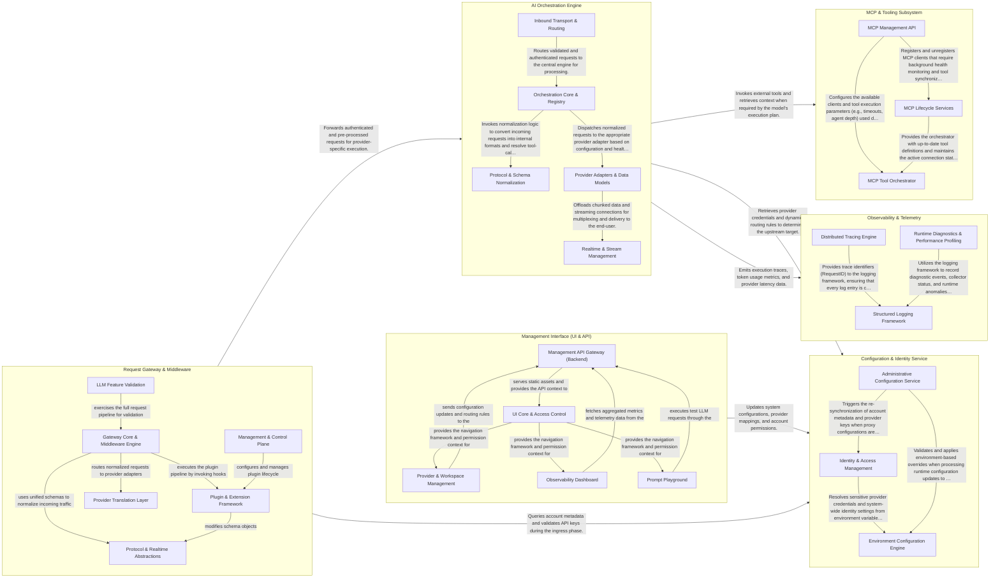

## Details

Bifrost is a high-performance AI gateway that acts as a unified proxy for multiple LLM providers. The data flow begins at the Request Gateway, where incoming HTTP or WebSocket traffic is authenticated and processed through a plugin pipeline. Validated requests are passed to the AI Orchestration Engine, which uses the Configuration Service to resolve provider credentials and routing rules. If the model requires external context, the engine interacts with the MCP Subsystem. Throughout the lifecycle, the Observability component captures telemetry, while the Management Interface provides a comprehensive UI for system administration and monitoring.

### Request Gateway & Middleware

The entry point for all incoming traffic, responsible for protocol handling (HTTP/WebSockets), authentication, and the execution of the plugin pipeline. It manages the lifecycle of both standard RESTful requests and low-latency realtime streams.

- **Gateway Core & Middleware Engine** — The primary traffic handler that implements the middleware chain for authentication, tracing, and protocol-specific handling (HTTP/WebSockets).
- **Plugin & Extension Framework** — Manages the micro-kernel architecture, allowing dynamic extension of the request pipeline through pre-hooks, post-hooks, and stream-chunk hooks.
- **Protocol & Realtime Abstractions** — Defines the core data contracts and session abstractions that unify different AI protocols and transport methods into a common internal format.
- **Provider Translation Layer** — Implements the Strategy pattern to translate unified internal requests into provider-specific payloads for 15+ AI backends.
- **Management & Control Plane** — Provides the administrative interfaces (UI and CLI) for configuring the gateway, managing access profiles, and monitoring system logs.
- **LLM Feature Validation** — A comprehensive test suite that validates the gateway's handling of complex AI-specific logic like tool calling, streaming, and multi-turn conversations.

### AI Orchestration Engine

The core processing hub that implements the Adapter pattern to normalize interactions across 15+ AI providers. It handles request transformation, response multiplexing, and streaming data management to maintain OpenAI compatibility.

- **Inbound Transport & Routing** — Acts as the entry point for the subsystem, handling initial HTTP and WebRTC connections.
- **Orchestration Core & Registry** — The "brain" of the engine that manages the request lifecycle.
- **Protocol & Schema Normalization** — Responsible for maintaining strict OpenAI compatibility and extending functionality via the Model Context Protocol (MCP).
- **Provider Adapters & Data Models** — Implements the Adapter pattern to translate normalized Bifrost requests into provider-specific API calls (e.g., Anthropic, Gemini, Bedrock).
- **Realtime & Stream Management** — Manages the complex state and data flow for streaming responses and realtime interactions.

### MCP & Tooling Subsystem

Implements the Model Context Protocol, allowing LLMs to interact with external tools and servers. It manages tool orchestration, health monitoring of client connections, and synchronization of tool definitions.

- **MCP Management API** — Provides the HTTP interface for administrative control over MCP clients.
- **MCP Tool Orchestrator** — Manages the runtime execution of tools and the server-side implementation of the MCP protocol.
- **MCP Lifecycle Services** — Operates background processes to ensure the reliability and consistency of the MCP subsystem.

### Configuration & Identity Service

Manages the persistent state of the gateway, including user/team identities, API key whitelisting, and runtime environment configurations. It provides the metadata necessary for the engine to authenticate with upstream providers.

- **Identity & Access Management** — Defines and implements the core data models for user and team identities, managing the Account interface and enforcing access control.
- **Administrative Configuration Service** — Acts as the control plane for the gateway's runtime state, exposing an API for administrative tasks and managing hot-reloads of system settings.
- **Environment Configuration Engine** — Provides a secure mechanism for managing environment-based configurations, including parsing, type coercion, and sensitive data redaction.

### Observability & Telemetry

A cross-cutting component providing distributed tracing, performance profiling, and structured logging. It collects metrics on cost, latency, and token volume across all gateway operations.

- **Structured Logging Framework** — Provides high-performance, JSON-based structured logging across the gateway.
- **Distributed Tracing Engine** — Captures the end-to-end lifecycle of requests as they pass through the gateway's internal pipeline.
- **Runtime Diagnostics & Performance Profiling** — Monitors the health and performance of the Go runtime and the gateway process.

### Management Interface (UI & API)

The administrative portal and its backend bridge. It includes the React-based dashboard for workspace management, provider configuration via CEL (Common Expression Language) routing, and an interactive prompt playground.

- **Management API Gateway (Backend)** — The Go-based server-side infrastructure that bridges the management UI with the Bifrost core.
- **Provider & Workspace Management** — The primary "Write" interface for the gateway.
- **Observability Dashboard** — The "Read" interface of the management portal, responsible for aggregating and visualizing telemetry data.
- **Prompt Playground** — An interactive developer sandbox for testing LLM prompts and gateway configurations.
- **UI Core & Access Control** — The foundational framework of the management portal, providing the application layout, navigation, and theme.

