```mermaid
graph LR
  subgraph 1["Cognition & Memory System"]
    1__1_1["Cognitive State & Indexing Engine"]
    1__1_2["Cross-Agent Identity & Telepathy"]
    1__1_3["Memory Integrity & Safety"]
    1__1_1 -->|"Triggers integrity checks when updating or pruning persistent memory blocks to prevent loss of iden…"| 1__1_3
    1__1_2 -->|"Provides external cognitive states and resolved identities that are used as input for the agent's i…"| 1__1_1
  end
  subgraph 2["Social Execution & Automation"]
    2__2_1["Social Identity & Protocol Engine"]
    2__2_2["Reactive Interaction Loops"]
    2__2_3["Proactive Content Pipelines"]
    2__2_4["Social State & Graph Persistence"]
    2__2_5["Public Cognition & Transparency Hooks"]
    2__2_2 -->|"Delegates the execution of replies and likes to the authenticated agent instance."| 2__2_1
    2__2_2 -->|"Queries interaction history to prevent duplicate responses and verify user opt-in status."| 2__2_4
    2__2_3 -->|"Uses agent primitives to publish syndicated posts and blog updates across platforms."| 2__2_1
    2__2_1 -->|"Triggers public logging of internal state changes and decision-making processes following social ac…"| 2__2_5
    2__2_1 -->|"Persists social graph updates and interaction metrics following successful platform actions."| 2__2_4
    2__2_4 -->|"calls"| 2__2_1
    2__2_5 -->|"calls"| 2__2_1
    2__2_5 -->|"calls"| 2__2_4
  end
  subgraph 3["Knowledge & Indexing Infrastructure"]
    3__3_1["Indexing Engine & Data Persistence"]
    3__3_2["Social Discovery & Feed Analytics"]
    3__3_3["Knowledge & Concept Management"]
    3__3_4["Agentic Social Automation"]
    3__3_1 -->|"Provides semantic search capabilities and raw record retrieval for graph exploration."| 3__3_2
    3__3_1 -->|"Streams real-time protocol events and provides historical context for automated responses."| 3__3_4
    3__3_3 -->|"Persists agent-generated concepts and internal knowledge as searchable records in the database."| 3__3_1
    3__3_4 -->|"Utilizes discovery tools to gather additional context and profile data for enriching social interac…"| 3__3_2
    3__3_4 -->|"calls"| 3__3_3
  end
  subgraph 4["External Interface & Interoperability"]
    4__4_1["MCP & Automation Gateway"]
    4__4_2["CLI Command Orchestrator"]
    4__4_3["Social Protocol Adapters"]
    4__4_2 -->|"Invokes platform-specific methods via the central registry to execute network-bound social operatio…"| 4__4_3
    4__4_1 -->|"Triggers workflows that are reconciled or mirrored to maintain consistency between internal cogniti…"| 4__4_3
    4__4_3 -->|"Provides structured API response objects and search results for filtering and mapping to user-facin…"| 4__4_2
  end
  subgraph 5["Evolution & Synchronization"]
    5__5_1["Data Evolution Pipeline"]
    5__5_2["Model Training Engine"]
    5__5_3["Semble Integration Service"]
    5__5_4["Multi-Protocol Content Publisher"]
    5__5_1 -->|"Supplies formatted, tokenized datasets and configuration for fine-tuning execution."| 5__5_2
    5__5_4 -->|"Provides published social records and annotations as source material for training data extraction."| 5__5_1
    5__5_3 -->|"Forwards synchronized content to be mirrored as public records on ATProtocol or GreenGale."| 5__5_4
    5__5_2 -->|"Publishes metadata or 'evolution logs' regarding model updates to maintain a public audit trail of …"| 5__5_4
  end
  subgraph 6["System Operations & Monitoring"]
    6__6_1["Ecosystem & Network Observability"]
    6__6_2["Internal Health & Quality Audit"]
    6__6_3["Targeted Activity Watchdog"]
    6__6_1 -->|"Provides global network statistics to calibrate internal health thresholds"| 6__6_2
    6__6_3 -->|"Triggers diagnostic healthchecks if expected activity is not detected"| 6__6_2
    6__6_2 -->|"Uses ecosystem diversity metrics to validate content quality"| 6__6_1
  end
  1 -->|"Provides decision-making logic and 'thoughts' to be published as social records."| 2
  3 -->|"Supplies contextual data and historical records for retrieval-augmented thinking."| 1
  2 -->|"Feeds new interactions and local database state back into the searchable index."| 3
  4 -->|"Enables external agents or users to query and influence the agent's internal state."| 1
  3 -->|"Provides raw interaction data and thread context for model fine-tuning pipelines."| 5
  5 -->|"Updates the underlying LLM models and memory schemas to improve agent behavior."| 1
  6 -->|"Monitors real-time firehose and responder health to trigger failovers or alerts."| 2
```

## Details

The `central` architecture is a memory-centric autonomous agent system built on the ATProtocol. It operates through a continuous loop where the Knowledge & Indexing Infrastructure ingests network data into a searchable vector store, which the Cognition & Memory System uses to generate "glass-box" thoughts and persistent memories. These cognitive decisions are translated into social actions by the Social Execution & Automation component. The system's intelligence is iteratively improved by the Evolution & Synchronization layer, which fine-tunes models based on interaction history, while the External Interface & Interoperability component provides standardized access for humans and external LLMs via MCP. The entire stack is overseen by System Operations & Monitoring to ensure protocol compliance and service health.

### Cognition & Memory System

The "Brain" of the agent, responsible for maintaining internal state, generating public "thoughts," and resolving the identities and cognitive states of other agents in the network.

- **Cognitive State & Indexing Engine** — Manages the full lifecycle of the agent's internal records, acting as the primary "write" and "search" path for cognition.
- **Cross-Agent Identity & Telepathy** — Responsible for the "Social Brain" functionality, this component allows the agent to interact with and understand other agents in the decentralized ecosystem.
- **Memory Integrity & Safety** — A specialized maintenance layer that protects the agent's persistent identity.

### Social Execution & Automation

The "Active" layer that manages the agent's social identity, handles authentication, and executes automated response loops across Bluesky and X.

- **Social Identity & Protocol Engine** — The foundational layer that encapsulates the agent's persona and handles low-level communication with social APIs.
- **Reactive Interaction Loops** — Manages the real-time event loops that monitor social platforms for notifications and mentions.
- **Proactive Content Pipelines** — Handles scheduled and batch-oriented content generation, such as cross-posting content between platforms (syndication) and publishing long-form updates.
- **Social State & Graph Persistence** — The data layer that tracks the agent's social environment.
- **Public Cognition & Transparency Hooks** — Implements the "Glass-Box" architectural pattern by transforming internal agent decisions and activity logs into public social artifacts.

### Knowledge & Indexing Infrastructure

A high-performance data layer that crawls ATProtocol records, generates embeddings, and provides search capabilities for social discovery and feed management.

- **Indexing Engine & Data Persistence** — The foundational layer responsible for the lifecycle of indexed data.
- **Social Discovery & Feed Analytics** — Provides the analytical and exploratory tools for interacting with the decentralized social graph.
- **Knowledge & Concept Management** — Manages the agent's internal knowledge representations ("Concepts") and ensures their synchronization across the network.
- **Agentic Social Automation** — Implements the active, event-driven behaviors of the agent.

### External Interface & Interoperability

Provides standardized entry points for external interaction, including a Model Context Protocol (MCP) server for LLM integration and a TypeScript CLI for manual management.

- **MCP & Automation Gateway** — Provides a standardized interface for LLMs and automated systems to interact with the agent's internal state.
- **CLI Command Orchestrator** — Manages the high-level execution flow for manual administrative tasks.
- **Social Protocol Adapters** — Encapsulates the logic for interacting with external social networks like Bluesky (ATProtocol) and X.

### Evolution & Synchronization

Manages the lifecycle of agent data, including exporting interaction history for model fine-tuning and synchronizing content across external platforms like Semble.

- **Data Evolution Pipeline** — Handles the end-to-end preparation of training data.
- **Model Training Engine** — Orchestrates the execution of fine-tuning jobs across high-performance compute providers.
- **Semble Integration Service** — Manages bidirectional synchronization with the Semble platform.
- **Multi-Protocol Content Publisher** — Implements the "Glass-Box Cognition" pattern by publishing the agent's internal records, annotations, and thoughts to decentralized protocols.

### System Operations & Monitoring

The "Ops" layer that monitors the ATProtocol firehose for network health and runs automated healthchecks on the indexing and response services.

- **Ecosystem & Network Observability** — Monitors the global ATProtocol firehose to assess network-wide health, traffic patterns, and namespace diversity.
- **Internal Health & Quality Audit** — Orchestrates automated healthchecks across the agent's infrastructure, including the XRPC indexer, database queues, and cron jobs.
- **Targeted Activity Watchdog** — Manages specialized monitoring for specific DIDs (Decentralized Identifiers) or keywords.

