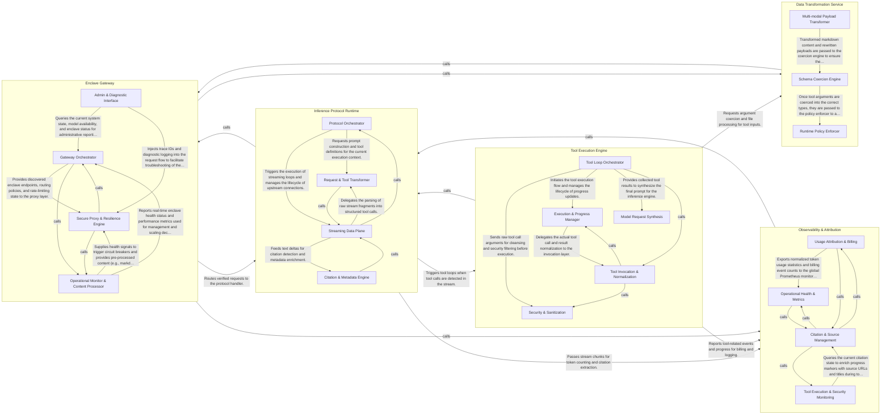

## Details

The confidential-model-router acts as a secure gateway for AI inference, ensuring data privacy through TEE-based enclaves. It manages stateful SSE streams, intercepts tool calls for local or remote execution via MCP, and provides robust observability for billing and citations.

### Enclave Gateway

Acts as the secure entry point, managing TEE-based backend enclaves, circuit breaking, and initial request proxying.

- **Gateway Orchestrator** — Manages the lifecycle of the gateway, including configuration loading, enclave discovery, and stateful tracking of quotas and billing.
- **Secure Proxy & Resilience Engine** — Handles the high-performance routing and proxying of requests to verified enclaves.
- **Operational Monitor & Content Processor** — Continuously evaluates enclave health (e.g., queue depth, latency) to inform routing decisions and performs specialized pre-processing, such as converting multipart file uploads into markdown for model consumption.
- **Admin & Diagnostic Interface** — Provides the external CLI for administrative tasks (e.g., listing models) and internal diagnostic utilities for tracing and debugging the tool runtime during request execution.

### Inference Protocol Runtime

The core state machine for handling streaming AI protocols (Chat and Responses), managing the SSE pump and upstream communication.

- **Protocol Orchestrator** — Acts as the high-level state machine and entry point for the runtime.
- **Streaming Data Plane** — The low-level I/O engine responsible for establishing SSE connections to upstream model enclaves.
- **Request & Tool Transformer** — A translation layer that converts generic API requests into model-specific prompts and tool definitions.
- **Citation & Metadata Engine** — A specialized stream processor that monitors text deltas for markdown links and citations.

### Tool Execution Engine

Orchestrates the "Tool Loop" by intercepting model requests, executing external tools (e.g., via MCP), and feeding results back into the inference stream.

- **Tool Loop Orchestrator** — Acts as the central state machine for the tool execution lifecycle.
- **Execution & Progress Manager** — Manages the active execution phase of tools and provides real-time feedback to the client.
- **Tool Invocation & Normalization** — Handles the low-level mechanics of calling external tools (like MCP servers) and normalizing their outputs.
- **Security & Sanitization** — A security-focused layer that cleanses data passing between the model and tools.
- **Model Request Synthesis** — Constructs the final payloads sent back to the inference engine.

### Data Transformation Service

Provides specialized utilities for coercing data types, processing file inputs into markdown, and sanitizing tool arguments.

- **Schema Coercion Engine** — Provides recursive type validation and coercion to ensure input data (primarily tool arguments) conforms to expected schemas.
- **Multi-modal Payload Transformer** — Intercepts chat completion requests to decode base64-encoded file attachments and render them into markdown.
- **Runtime Policy Enforcer** — Adjusts and sanitizes tool arguments based on runtime configurations and user tiers.

### Observability & Attribution

Monitors the inference flow to perform token counting for billing, manage citation states, and record security-related events.

- **Usage Attribution & Billing** — Responsible for the extraction, normalization, and reporting of token usage from both standard and streaming (SSE) inference responses.
- **Citation & Source Management** — Manages the state of external sources (e.g., web search results) retrieved during tool execution.
- **Tool Execution & Security Monitoring** — Monitors the execution of router-owned tools to emit progress updates and security-related event markers.
- **Operational Health & Metrics** — Provides system-level telemetry by polling backend enclaves for performance metrics (like queue depth) and updating Prometheus counters for request success rates, latencies, and circuit breaker states.

