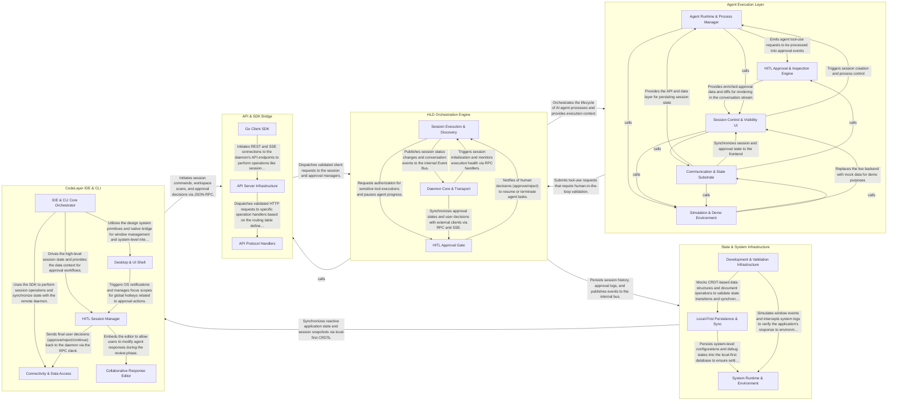

## Details

The system architecture represents a Human-in-the-loop (HITL) AI development platform where the CodeLayer IDE/CLI initiates requests through an API bridge to the HLD Orchestration Engine. This engine manages AI agent lifecycles and approval workflows, interacting with the Agent Execution Layer to process tool-use requests. The entire system relies on a State & System Infrastructure layer for persistence and synchronization, which feeds back into the IDE to maintain a reactive, local-first user experience.

### CodeLayer IDE & CLI

The primary user interface tier, providing the React-based desktop environment and the TypeScript CLI. It serves as the command center for developers to interact with AI agents, manage workspace context, and perform real-time code editing.

- **Connectivity & Data Access** — Manages the low-level JSON-RPC communication and subscription logic between the IDE/CLI and the HumanLayer Daemon (HLD).
- **IDE & CLI Core Orchestrator** — The central logic hub that manages the application lifecycle and global state synchronization.
- **HITL Session Manager** — Orchestrates the Human-in-the-loop workflow by managing session navigation, approval states, and keyboard-driven interaction patterns.
- **Collaborative Response Editor** — A specialized rich-text editing environment built on Tiptap/ProseMirror that allows developers to modify AI-generated code and responses.
- **Desktop & UI Shell** — Provides the native desktop integration and the visual design system.

### API & SDK Bridge

The communication gateway that defines the contract between the HumanLayer Daemon (HLD) and its clients. It handles protocol translation (JSON-RPC/SSE), request routing, and provides native SDKs for internal and external integration.

- **API Server Infrastructure** — Manages the HTTP server lifecycle, Gin-based routing, and OpenAPI specification metadata.
- **API Protocol Handlers** — Consists of generated wrappers that translate incoming HTTP requests into structured calls for the HLD core services.
- **Go Client SDK** — A native Go library providing high-level abstractions for REST and SSE-based communication with the daemon.

### HLD Orchestration Engine

The core logic layer of the daemon responsible for session management, environment discovery, and the Human-in-the-loop (HITL) approval workflow. It acts as the policy enforcement point for all agent actions.

- **Session Execution & Discovery** — Manages the active lifecycle of agent sessions, including environment scanning, LLM client initialization, and execution monitoring.
- **HITL Approval Gate** — Acts as the policy enforcement point for the orchestration engine.
- **Daemon Core & Transport** — Provides the foundational infrastructure for the daemon, including the bootstrap process, graceful shutdown, and the communication layer.

### Agent Execution Layer

A specialized integration layer that wraps the Claude Code agent. It manages the underlying agent processes, monitors their output, and translates agent tool-use requests into system-level approval events.

- **Agent Runtime & Process Manager** — Manages the lifecycle of the Claude Code agent process.
- **HITL Approval & Inspection Engine** — The core logic for Human-in-the-loop workflows.
- **Session Control & Visibility UI** — Provides the user interface for initiating agent sessions and monitoring their progress.
- **Communication & State Substrate** — The underlying infrastructure that connects the frontend to the backend daemon.
- **Simulation & Demo Environment** — A specialized layer for running the execution environment in a simulated mode.

### State & System Infrastructure

The foundational layer providing local-first data persistence, real-time state synchronization (CRDTs), and cross-cutting services like observability, logging, and testing infrastructure.

- **Local-First Persistence & Sync** — Manages the core data models and real-time synchronization logic.
- **System Runtime & Environment** — Provides the operational context for the application, managing the lifecycle of the desktop environment and system-wide observability.
- **Development & Validation Infrastructure** — A dedicated layer for ensuring system reliability and accelerating UI development.

