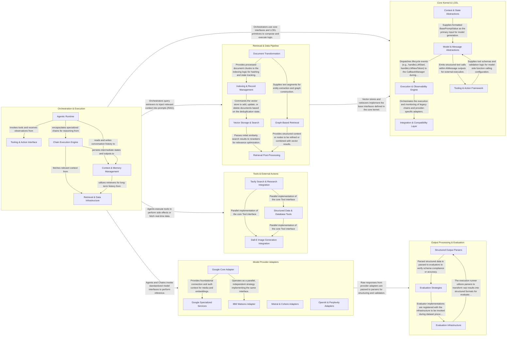

## Details

LangChain.js is an AI orchestration framework designed to build LLM-powered applications through a modular, interface-driven architecture. The system centers on the LangChain Expression Language (LCEL), which allows developers to compose complex chains of thought and action. Data flows from user inputs through orchestration layers (Chains and Agents), which leverage standardized adapters for various LLM providers and vector databases. The framework emphasizes "Composition over Inheritance," enabling seamless integration of external tools, document processing pipelines, and structured output parsing to transform raw model responses into actionable data.

### Core Kernel & LCEL

The foundational layer defining the abstract contracts and the declarative LangChain Expression Language (LCEL). It establishes how all components (Models, Prompts, Tools) interact via a unified interface.

- **Model & Message Abstractions** — Defines the core interfaces for LLMs and Chat Models, along with the schema for their outputs (Messages).
- **Execution & Observability Engine** — Manages the execution lifecycle of chains and runnables.
- **Context & State Abstractions** — Provides foundational abstractions for data inputs and persistence.
- **Tooling & Action Framework** — Establishes the contract for external tools and functions.
- **Integration & Compatibility Layer** — Bridges the core abstractions with specific third-party providers and maintains backward compatibility with legacy framework versions.

### Orchestration & Execution

The high-level engine responsible for managing the execution flow. It coordinates between agents that plan actions and chains that execute predefined sequences of LLM calls.

- **Agentic Runtime** — Responsible for the iterative "thought-action-observation" loop.
- **Chain Execution Engine** — Manages structured, sequential workflows where the output of one component serves as the input to the next.
- **Tooling & Action Interface** — Defines the interface for external capabilities (APIs, file systems, web search) that Agents can invoke.
- **Context & Memory Management** — Handles the persistence and retrieval of conversation history and execution state, allowing both Agents and Chains to maintain continuity across multiple interactions.
- **Retrieval & Data Infrastructure** — Provides the "Augmentation" in RAG (Retrieval-Augmented Generation).

### Model Provider Adapters

A collection of adapters that bridge the gap between LangChain's core interfaces and specific LLM provider APIs (OpenAI, Google, IBM, etc.), handling provider-specific authentication and message formatting.

- **Google Core Adapter** — Manages the primary lifecycle of Google-based model interactions (Gemini, Vertex AI), handling HTTP connection orchestration, GAuth-based authentication, and message transformation.
- **Google Specialized Services** — Extends the Google adapter suite with non-chat capabilities, including multimodal media management and vector/embedding services.
- **IBM Watsonx Adapter** — Dedicated adapter for the IBM Watsonx platform, handling gateway authentication, tool binding, and stream conversion.
- **Mistral & Cohere Adapters** — Provides integration for Mistral AI and Cohere models, mapping role-based messages and managing token usage metadata.
- **OpenAI & Perplexity Adapters** — Handles advanced response processing for OpenAI models and provides search-augmented chat for Perplexity AI.

### Retrieval & Data Pipeline

Manages the Retrieval Augmented Generation (RAG) lifecycle, including document ingestion, text splitting, embedding generation, and similarity search across various vector databases.

- **Document Transformation** — Responsible for the "Split" phase of the RAG pipeline.
- **Indexing & Record Management** — Acts as the stateful controller for the ingestion pipeline.
- **Vector Storage & Search** — Provides a unified interface for interacting with various vector databases and implements similarity search algorithms.
- **Graph-Based Retrieval** — An alternative storage and retrieval paradigm that focuses on structured relationships between entities.
- **Retrieval Post-Processing** — Enhances the quality of retrieved information after the initial search using rerankers and compressors.

### Tools & External Actions

Concrete implementations of tools that allow AI agents to interact with external systems, such as SQL databases, web search engines, and image generation APIs.

- **Structured Data & Database Tools** — Provides tools for agents to interact with structured data sources like SQL databases and JSON objects.
- **Tavily Search & Research Integration** — Encapsulates the integration with the Tavily API to provide advanced web search and AI-driven research capabilities.
- **Dall-E Image Generation Integration** — Facilitates creative multimedia tasks by wrapping OpenAI's Dall-E API.

### Output Processing & Evaluation

Responsible for transforming raw LLM string outputs into structured data (JSON/Zod) and providing utilities to evaluate the quality and accuracy of model responses.

- **Structured Output Parsers** — Transforms raw LLM responses into structured data formats, handling generic text-to-JSON conversion and model-specific tool calling.
- **Evaluation Strategies** — Defines the logic and interfaces for assessing model performance, including semantic string comparisons, pairwise ranking, and trajectory evaluation.
- **Evaluation Infrastructure** — Orchestrates the execution of evaluations across datasets, managing the lifecycle of runs and applying evaluation strategies.

