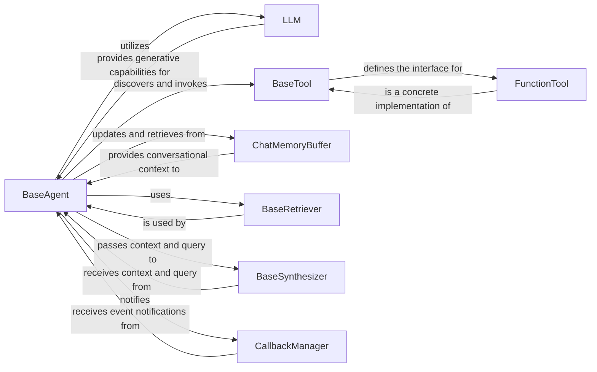

## Details

The `llama_index` agent subsystem is orchestrated by the `BaseAgent`, which serves as the central control unit for decision-making and task execution. It leverages an `LLM` for core generative and reasoning capabilities, enabling the agent to understand queries and formulate responses. To extend its functionality, the `BaseAgent` interacts with various `BaseTool` implementations, such as `FunctionTool`, to perform external actions or access specific functionalities. Conversational context is maintained through `ChatMemoryBuffer`, which the `BaseAgent` actively updates and retrieves from. For information retrieval, the `BaseAgent` utilizes a `BaseRetriever` to fetch relevant data, which is then processed by a `BaseSynthesizer` to generate coherent final responses. Throughout its operation, the `BaseAgent` integrates with a `CallbackManager` to provide observability and enable custom event handling. This modular design allows for flexible and extensible agent behaviors.

### BaseAgent
The core orchestrator of the agent's behavior. It manages the agent's state, decision-making process, and the integration of other components (LLMs, tools, memory) to achieve specific goals. It drives the agent's reasoning and action loop.

**Related Classes/Methods**: _None_

### LLM
Represents the Large Language Model, serving as the "brain" for the agent. It provides fundamental capabilities like text generation, chat completions, and structured output, which the agent uses for reasoning and response formulation.

**Related Classes/Methods**:

- <a href="https://github.com/run-llama/llama_index/blob/main/llama-index-core/llama_index/core/llms/llm.py#L163-L930" target="_blank" rel="noopener noreferrer">`llama_index.core.llms.llm.LLM`:163-930</a>

### BaseTool
Defines the abstract interface for all tools that an agent can utilize. It standardizes how external functionalities (e.g., database queries, API calls, custom Python functions) are exposed and invoked by the agent, enabling modular and extensible action capabilities.

**Related Classes/Methods**:

- <a href="https://github.com/run-llama/llama_index/blob/main/llama-index-core/llama_index/core/tools/types.py#L145-L203" target="_blank" rel="noopener noreferrer">`llama_index.core.tools.types.BaseTool`:145-203</a>

### ChatMemoryBuffer
Manages and provides access to the agent's conversational history. It ensures the agent maintains context across multiple interactions, allowing for coherent and stateful dialogues.

**Related Classes/Methods**:

- <a href="https://github.com/run-llama/llama_index/blob/main/llama-index-core/llama_index/core/memory/chat_memory_buffer.py#L19-L166" target="_blank" rel="noopener noreferrer">`llama_index.core.memory.chat_memory_buffer.ChatMemoryBuffer`:19-166</a>

### BaseRetriever
Responsible for fetching relevant information (nodes) from various data sources or indices based on a given query. Agents often use retrievers to augment their knowledge before making decisions or generating responses.

**Related Classes/Methods**: _None_

### BaseSynthesizer
Takes retrieved information and a user query to generate a coherent, well-formatted, and contextually relevant final response. It structures the output based on the agent's reasoning and retrieved data.

**Related Classes/Methods**:

- <a href="https://github.com/run-llama/llama_index/blob/main/llama-index-core/llama_index/core/response_synthesizers/base.py#L61-L321" target="_blank" rel="noopener noreferrer">`llama_index.core.response_synthesizers.base.BaseSynthesizer`:61-321</a>

### CallbackManager
Provides a mechanism for observing and logging events throughout the agent's execution lifecycle. It is crucial for monitoring, debugging, and enabling custom event handling or integration with observability tools.

**Related Classes/Methods**:

- <a href="https://github.com/run-llama/llama_index/blob/main/llama-index-core/llama_index/core/callbacks/base.py#L28-L265" target="_blank" rel="noopener noreferrer">`llama_index.core.callbacks.base.CallbackManager`:28-265</a>

### FunctionTool
A concrete implementation of BaseTool that wraps standard Python functions, allowing them to be seamlessly exposed and invoked as tools by the agent. This component exemplifies how custom logic can be integrated into the agent's capabilities.

**Related Classes/Methods**:

- <a href="https://github.com/run-llama/llama_index/blob/main/llama-index-core/llama_index/core/tools/function_tool.py#L67-L456" target="_blank" rel="noopener noreferrer">`llama_index.core.tools.function_tool.FunctionTool`:67-456</a>

### [FAQ](https://github.com/CodeBoarding/GeneratedOnBoardings/tree/main?tab=readme-ov-file#faq)