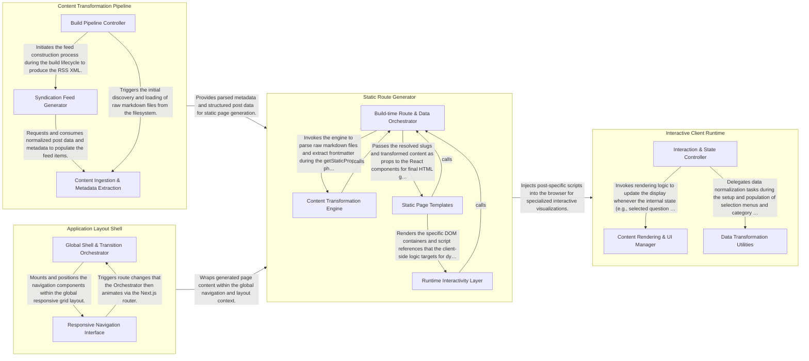

## Details

This architecture follows a classic Jamstack pattern where content is decoupled from the presentation layer. At build time, a Content Transformation Pipeline parses Markdown files to generate metadata and RSS feeds. The Static Route Generator (Next.js) consumes this content via file-system-based data fetching to produce static HTML routes. These routes are wrapped by an Application Layout Shell that provides consistent navigation and global styling. For specialized blog posts requiring complex visualizations, an Interactive Client Runtime of vanilla JavaScript is injected into the browser to handle dynamic DOM updates and model evaluation demos independently of the React lifecycle.

### Content Transformation Pipeline

A build-time utility layer that processes raw markdown files and frontmatter. It automates the generation of auxiliary content like RSS feeds and post metadata, ensuring the site's content is discoverable and structured before the Next.js build begins.

- **Content Ingestion & Metadata Extraction** — Responsible for discovering markdown files in the blog directory and transforming raw text into structured metadata objects.
- **Syndication Feed Generator** — Transforms the collection of structured blog post objects into a standardized RSS XML format.
- **Build Pipeline Controller** — Acts as the entry point for the transformation utility, managing the high-level execution lifecycle.

### Static Route Generator

The core Next.js engine responsible for mapping markdown content to specific URLs. It uses Static Site Generation (SSG) patterns to fetch data at build time and render React components into static HTML files.

- **Build-time Route & Data Orchestrator** — Manages the lifecycle of static generation by identifying pages and gathering data.
- **Content Transformation Engine** — A specialized processing layer that converts unstructured markdown into structured formats, extracting YAML frontmatter and generating HTML fragments.
- **Static Page Templates** — The presentation layer consisting of React components that define the visual structure of the site and assemble the final HTML.
- **Runtime Interactivity Layer** — Provides hydration logic for complex features like model evaluations, managing client-side state and DOM manipulations.

### Application Layout Shell

The global architectural frame that wraps all pages. It manages the persistent UI state, navigation menus, and global CSS, ensuring a consistent user experience across different routes.

- **Global Shell & Transition Orchestrator** — The root React entry point for the application that defines the high-level responsive grid, manages global CSS, and handles page transition animations using framer-motion.
- **Responsive Navigation Interface** — Manages the site's primary navigation links and social media integrations, providing a dual-mode interface (sidebar for desktop, drawer for mobile).

### Interactive Client Runtime

A collection of standalone JavaScript scripts that run directly in the browser. These scripts handle complex, non-React interactions such as model output comparisons and dynamic markdown rendering within specific blog posts.

- **Interaction & State Controller** — Manages the lifecycle of user interactions within the demo scripts.
- **Content Rendering & UI Manager** — Acts as the presentation layer of the runtime.
- **Data Transformation Utilities** — Provides a set of pure, stateless helper functions for data normalization and sanitization.

