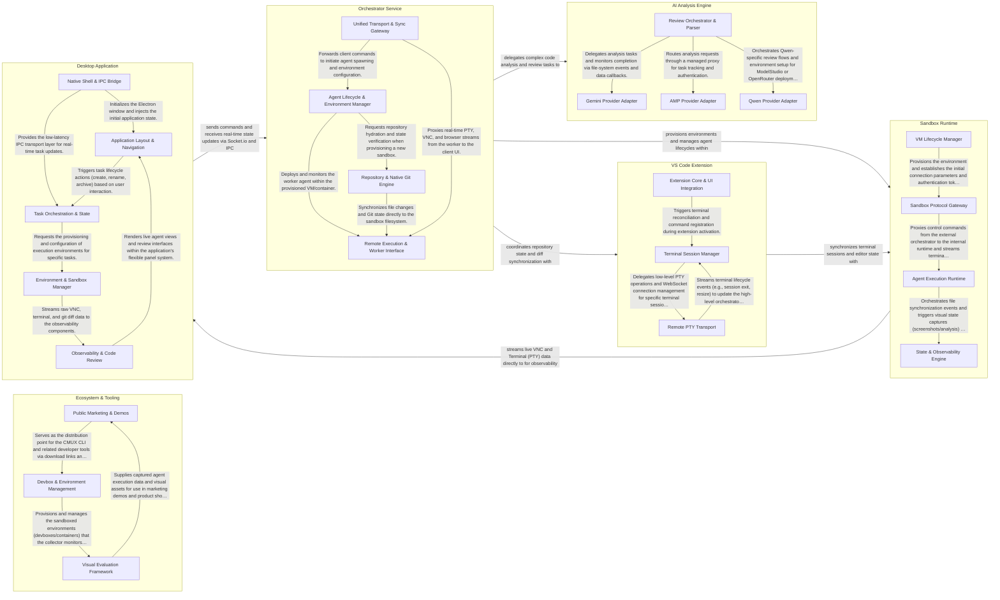

## Details

The manaflow architecture is a high-performance, isolated AI agent orchestration platform that connects a desktop application to distributed sandbox runtimes via an orchestrator service, utilizing specialized proxies for real-time observability, a native Rust core for performance, and an AI analysis engine for complex code tasks, all integrated with VS Code for a seamless developer experience.

### Desktop Application

The primary user interface and desktop shell, managing the application lifecycle and providing a rich environment for task orchestration and observability.

- **Native Shell & IPC Bridge** — The foundational layer that manages the Electron main process, native windowing, and the underlying networking infrastructure.
- **Application Layout & Navigation** — Manages the high-level React application structure, including routing, the flexible panel system, and the core UI kit.
- **Task Orchestration & State** — Central logic for managing the lifecycle of AI tasks.
- **Environment & Sandbox Manager** — Orchestrates the execution environments where agents operate, including Docker-based VS Code instances and cloud sandboxes.
- **Observability & Code Review** — Provides specialized UI components for real-time monitoring and code verification.

### Orchestrator Service

The central backend logic responsible for agent lifecycle management, repository operations, and coordinating communication between the client and sandboxes.

- **Agent Lifecycle & Environment Manager** — Responsible for the high-level orchestration of sandboxed environments.
- **Repository & Native Git Engine** — Manages source control operations and repository state.
- **Unified Transport & Sync Gateway** — Provides a transport-agnostic communication layer that bridges the Orchestrator with the Client UI.
- **Remote Execution & Worker Interface** — Manages the "sidecar" logic that runs within the sandbox.

### Sandbox Runtime

The isolated execution environment (Docker or Cloud VMs) where AI agents perform coding tasks, featuring specialized proxies for live data streaming.

- **VM Lifecycle Manager** — Manages the provisioning, authentication, and lifecycle of the virtual machine or container instances that host the sandbox.
- **Sandbox Protocol Gateway** — A high-performance Go-based sidecar that acts as the primary entry point for low-level protocols.
- **Agent Execution Runtime** — The TypeScript-based "brain" inside the sandbox that manages the execution of agent commands.
- **State & Observability Engine** — Ensures the sandbox workspace remains synchronized with the local environment and provides visual context for the agent.

### AI Analysis Engine

A specialized service layer for performing AI-assisted code reviews, heatmap generation, and LLM provider management.

- **Review Orchestrator & Parser** — The central controller of the subsystem.
- **Gemini Provider Adapter** — Implements the Google Gemini LLM integration.
- **AMP Provider Adapter** — Manages communication with the AI Management Platform (AMP).
- **Qwen Provider Adapter** — Handles integration with Alibaba's Qwen models.

### VS Code Extension

The integration layer that allows Manaflow to synchronize terminal sessions and code diffs directly with the user's local VS Code editor.

- **Extension Core & UI Integration** — Acts as the primary entry point for the extension, handling activation, command registration, and the specialized Multi-Diff Editor UI.
- **Terminal Session Manager** — Orchestrates the mapping between VS Code's terminal UI and the remote sessions.
- **Remote PTY Transport** — Implements the low-level communication protocol for terminal data.

### Ecosystem & Tooling

Public-facing web components and internal developer tools used for evaluation, debugging, and marketing.

- **Public Marketing & Demos** — Manages the external web presence, including the landing page, interactive product demos, and client distribution channels.
- **Visual Evaluation Framework** — Orchestrates the collection and analysis of visual data from agent executions.
- **Devbox & Environment Management** — Provides the CLI and internal scripts necessary to provision, manage, and debug sandboxed execution environments.

