```mermaid
graph LR
  subgraph 1["Gateway & Adapters"]
    1__1_1["API Gateway & Server Core"]
    1__1_2["API Controller Layer"]
    1__1_3["Browser Automation Subsystem"]
    1__1_4["Multi-Channel & Distributed Adapters"]
    1__1_1 -->|"Routes incoming HTTP/SSE requests to specific domain handlers and provides the shared request conte…"| 1__1_2
    1__1_2 -->|"Triggers browser-based agent tasks and manages the lifecycle of automation sessions."| 1__1_3
    1__1_4 -->|"Utilizes the core server infrastructure for webhook registration and security validation."| 1__1_1
    1__1_4 -->|"Invokes standardized execution routes to process messages from chat channels or other agents."| 1__1_2
    1__1_3 -->|"Registers WebSocket upgrade handlers for real-time screencast streaming."| 1__1_1
  end
  subgraph 2["Mastra Kernel & Workflows"]
    2__2_1["Kernel Registry & Lifecycle"]
    2__2_2["Workflow Execution Engine"]
    2__2_3["Async Task & Event Backbone"]
    2__2_4["Streaming & Output Management"]
    2__2_1 -->|"Resolves registered tools and agents required for workflow steps and initiates execution runs."| 2__2_2
    2__2_2 -->|"Offloads long-running steps or parallel branches to the background manager to prevent blocking the …"| 2__2_3
    2__2_2 -->|"Feeds step results, tool calls, and LLM deltas into the streaming wrappers for real-time delivery."| 2__2_4
    2__2_3 -->|"Publishes task completion events and status updates that the Kernel uses to update agent memory or …"| 2__2_1
    2__2_4 -->|"Provides the final execution summary and metadata back to the kernel for logging and operational tr…"| 2__2_1
  end
  subgraph 3["Agentic Intelligence"]
    3__3_1["Agent Core & Lifecycle"]
    3__3_2["Reasoning & Multi-Agent Orchestration"]
    3__3_3["LLM Abstraction & Routing"]
    3__3_4["Middleware & Processing"]
    3__3_5["Compatibility & Testing Infrastructure"]
    3__3_1 -->|"delegates input/output sanitization and prompt injection to the processor pipeline in"| 3__3_4
    3__3_1 -->|"dispatches normalized requests to specific model providers for text generation via"| 3__3_3
    3__3_2 -->|"orchestrates multiple agent instances or iterative steps to complete complex tasks using"| 3__3_1
    3__3_5 -->|"provides mock implementations of the routing layer for unit testing and validation of"| 3__3_3
    3__3_1 -->|"falls back to legacy handlers for agents defined with older configuration schemas in"| 3__3_5
    3__3_2 -->|"uses processors to maintain state and format messages across iterative reasoning loops via"| 3__3_4
  end
  subgraph 4["Context & Persistence"]
    4__4_1["Memory & Conversation Orchestration"]
    4__4_2["Persistence Layer & Storage Adapters"]
    4__4_3["Dataset & Evaluation Management"]
    4__4_4["Execution Context"]
    4__4_1 -->|"Persists and retrieves conversation threads, messages, and working memory state using the abstract …"| 4__4_2
    4__4_3 -->|"Stores structured dataset items and experiment results into the configured backend."| 4__4_2
    4__4_1 -->|"Accesses per-request metadata to contextualize and tag stored memory entries."| 4__4_4
    4__4_2 -->|"May utilize context-bound configuration or credentials to authorize storage operations."| 4__4_4
  end
  subgraph 5["Integration Hub"]
    5__5_1["Tooling Core & Infrastructure"]
    5__5_2["MCP Protocol Bridge"]
    5__5_3["Service Integration Layer"]
    5__5_3 -->|"uses to instantiate and register generated tools"| 5__5_1
    5__5_2 -->|"wraps remote capabilities into native Tool instances and retrieves registered Tool objects"| 5__5_1
    5__5_3 -->|"passed to be automatically exposed as a collection of MCP tools and resources"| 5__5_2
  end
  subgraph 6["DevTools & Observability"]
    6__6_1["Observability & Monitoring"]
    6__6_2["Evaluation & Simulation"]
    6__6_3["Developer Tooling & CLI"]
    6__6_4["Studio & Playground"]
    6__6_4 -->|"Triggers project lifecycle actions like bundling and deployment through CLI services."| 6__6_3
    6__6_3 -->|"Initiates automated testing suites and agent simulation sessions via CLI commands."| 6__6_2
    6__6_2 -->|"Feeds performance metrics and execution traces into the monitoring pipeline for analysis."| 6__6_1
    6__6_4 -->|"Subscribes to execution events and log streams for real-time visualization in the Playground UI."| 6__6_1
    6__6_3 -->|"Provides deployment logs and lifecycle events to the central logging infrastructure."| 6__6_1
  end
  1 -->|"Forwards external requests to"| 2
  2 -->|"Triggers execution and manages lifecycle of"| 3
  2 -->|"Persists state and manages data for"| 4
  3 -->|"Invokes tools and integrations via"| 5
  3 -->|"Accesses and updates memory/context via"| 4
  6 -->|"Monitors and manages operations of"| 2
```

## Details

Mastra is an AI orchestration framework that uses a modular, adapter-based architecture to manage agentic workflows and LLM-powered applications. It routes external requests through a central Kernel, which orchestrates agent reasoning and structured workflows, while leveraging an Integration Hub for external tools and a Context & Persistence layer for state management, all supported by comprehensive DevTools and observability.

### Gateway & Adapters

Provides the primary entry points for the framework, including REST/SSE server adapters and specialized interfaces for browser automation and chat platforms.

- **API Gateway & Server Core** — Provides the foundational hosting environment for the framework.
- **API Controller Layer** — Implements the functional endpoints of the framework, including agents, workflows, and memory management.
- **Browser Automation Subsystem** — Manages headless browser instances and their real-time interaction capabilities.
- **Multi-Channel & Distributed Adapters** — Extends the framework's reach beyond standard REST APIs.

### Mastra Kernel & Workflows

The central orchestration layer that manages the registration of agents and tools, handles event-driven communication (PubSub), and executes complex multi-step workflows.

- **Kernel Registry & Lifecycle** — The foundational registry and management layer.
- **Workflow Execution Engine** — The core logic engine responsible for executing the workflow DSL.
- **Async Task & Event Backbone** — Provides the infrastructure for asynchronous execution and internal communication.
- **Streaming & Output Management** — Manages the egress of data from the execution engine.

### Agentic Intelligence

Implements the core reasoning capabilities, managing LLM interactions, agentic loops (ReAct), and middleware for processing model inputs and outputs.

- **Agent Core & Lifecycle** — The central "Kernel" of the subsystem, responsible for the lifecycle, configuration, and high-level execution of agents.
- **Reasoning & Multi-Agent Orchestration** — Implements advanced reasoning patterns and graph-based workflows.
- **LLM Abstraction & Routing** — An adapter layer that normalizes interactions across various LLM providers.
- **Middleware & Processing** — A pipeline-based middleware system that processes data between the Agent and the LLM.
- **Compatibility & Testing Infrastructure** — Ensures subsystem stability through backward compatibility for legacy agents and provides a robust testing suite, including mock providers for simulating LLM behavior without external API calls.

### Context & Persistence

Manages the stateful context of executions, providing working memory for agents and a persistent storage layer for conversation history, datasets, and workflow state.

- **Memory & Conversation Orchestration** — Manages the high-level stateful context for AI agents, including conversation threads, message history, and working memory.
- **Persistence Layer & Storage Adapters** — Provides the foundational data access layer using the Adapter pattern to support multiple database backends and Git-integrated versioning.
- **Dataset & Evaluation Management** — Manages structured datasets for RAG and model evaluation, including ingestion, versioning, and experiment result persistence.
- **Execution Context** — A lightweight, type-safe container for transient state associated with a single request or execution flow.

### Integration Hub

Extends agent capabilities through a unified Tool abstraction and the Model Context Protocol (MCP), facilitating interaction with external APIs and third-party services.

- **Tooling Core & Infrastructure** — Defines the foundational execution model for all external interactions, providing the base Tool class and ToolStream mechanism for validation, execution, and response handling.
- **MCP Protocol Bridge** — Implements the Model Context Protocol, acting as a gateway between Mastra and the external AI ecosystem by handling both server-side resource exposure and client-side remote tool integration.
- **Service Integration Layer** — Manages high-level service abstractions and automated tool generation, allowing developers to integrate third-party APIs via OpenAPI specifications and grouping related capabilities.

### DevTools & Observability

Supports the development lifecycle with CLI tools, a playground UI, automated evaluation scorers, and comprehensive OpenTelemetry-based tracing and logging.

- **Observability & Monitoring** — The core telemetry backbone of the framework.
- **Evaluation & Simulation** — A validation suite for AI agents and workflows.
- **Developer Tooling & CLI** — Manages the project lifecycle from the command line.
- **Studio & Playground** — The visual development environment for Mastra.

