```mermaid
graph LR
    nltk_tree_tree_Tree["nltk.tree.tree.Tree"]
    nltk_grammar_CFG["nltk.grammar.CFG"]
    nltk_featstruct_FeatStruct["nltk.featstruct.FeatStruct"]
    nltk_parse_api_ParserI["nltk.parse.api.ParserI"]
    nltk_parse_chart_ChartParser["nltk.parse.chart.ChartParser"]
    nltk_parse_dependencygraph_DependencyGraph["nltk.parse.dependencygraph.DependencyGraph"]
    nltk_tag_api_TaggerI["nltk.tag.api.TaggerI"]
    nltk_tag_sequential_SequentialBackoffTagger["nltk.tag.sequential.SequentialBackoffTagger"]
    nltk_tag_hmm_HiddenMarkovModelTagger["nltk.tag.hmm.HiddenMarkovModelTagger"]
    nltk_chunk_regexp_RegexpParser["nltk.chunk.regexp.RegexpParser"]
    nltk_parse_api_ParserI -- "produces" --> nltk_tree_tree_Tree
    nltk_chunk_regexp_RegexpParser -- "takes as input and transforms" --> nltk_tree_tree_Tree
    nltk_parse_dependencygraph_DependencyGraph -- "can be converted to/from" --> nltk_tree_tree_Tree
    nltk_parse_chart_ChartParser -- "consumes" --> nltk_grammar_CFG
    nltk_tree_tree_Tree -- "defines grammar rules for, productions generated from" --> nltk_grammar_CFG
    nltk_grammar_CFG -- "utilizes for feature-based grammars" --> nltk_featstruct_FeatStruct
    nltk_parse_chart_ChartParser -- "implements" --> nltk_parse_api_ParserI
    nltk_parse_api_ParserI -- "produces for dependency parsing" --> nltk_parse_dependencygraph_DependencyGraph
    nltk_parse_chart_ChartParser -- "produces" --> nltk_tree_tree_Tree
    nltk_tag_sequential_SequentialBackoffTagger -- "implements" --> nltk_tag_api_TaggerI
    nltk_tag_hmm_HiddenMarkovModelTagger -- "implements" --> nltk_tag_api_TaggerI
    nltk_tag_sequential_SequentialBackoffTagger -- "can use as backoff strategy" --> nltk_tag_hmm_HiddenMarkovModelTagger
    nltk_chunk_regexp_RegexpParser -- "implicitly relies on output from" --> nltk_tag_api_TaggerI
```

## Component Details

This section provides a detailed overview of the core components within the `Syntactic & Structural Analysis` subsystem of NLTK. These components are fundamental because they represent the primary data structures, formalisms, and algorithmic approaches used for analyzing the grammatical and structural properties of text, from basic tagging to complex parsing.

### nltk.tree.tree.Tree
This class serves as the fundamental data structure for representing hierarchical linguistic structures, such as parse trees and chunk structures. It provides a robust framework for manipulating, traversing, and converting these tree representations, making it central to both constituent parsing and chunking.

**Related Classes/Methods**:

- <a href="https://github.com/nltk/nltk/blob/master/nltk/tree/tree.py#L444-L477" target="_blank" rel="noopener noreferrer">`nltk.tree.tree.Tree:chomsky_normal_form` (444:477)</a>
- <a href="https://github.com/nltk/nltk/blob/master/nltk/tree/tree.py#L479-L502" target="_blank" rel="noopener noreferrer">`nltk.tree.tree.Tree:un_chomsky_normal_form` (479:502)</a>
- <a href="https://github.com/nltk/nltk/blob/master/nltk/tree/tree.py#L504-L525" target="_blank" rel="noopener noreferrer">`nltk.tree.tree.Tree:collapse_unary` (504:525)</a>
- <a href="https://github.com/nltk/nltk/blob/master/nltk/tree/tree.py#L351-L374" target="_blank" rel="noopener noreferrer">`nltk.tree.tree.Tree:productions` (351:374)</a>
- <a href="https://github.com/nltk/nltk/blob/master/nltk/tree/tree.py#L376-L394" target="_blank" rel="noopener noreferrer">`nltk.tree.tree.Tree:pos` (376:394)</a>
- <a href="https://github.com/nltk/nltk/blob/master/nltk/tree/tree.py#L581-L699" target="_blank" rel="noopener noreferrer">`nltk.tree.tree.Tree:fromstring` (581:699)</a>

### nltk.grammar.CFG
Represents Context-Free Grammars, which define the formal rules for generating or parsing sentences. It manages a set of productions and a start symbol, and provides functionalities for checking grammar properties and transforming grammars (e.g., to Chomsky Normal Form). It is crucial for rule-based parsing.

**Related Classes/Methods**:

- <a href="https://github.com/nltk/nltk/blob/master/nltk/grammar.py#L738-L758" target="_blank" rel="noopener noreferrer">`nltk.grammar.CFG:chomsky_normal_form` (738:758)</a>
- <a href="https://github.com/nltk/nltk/blob/master/nltk/grammar.py#L787-L817" target="_blank" rel="noopener noreferrer">`nltk.grammar.CFG:binarize` (787:817)</a>
- <a href="https://github.com/nltk/nltk/blob/master/nltk/grammar.py#L0-L0" target="_blank" rel="noopener noreferrer">`nltk.grammar.CFG:eliminate_start_rules` (0:0)</a>
- <a href="https://github.com/nltk/nltk/blob/master/nltk/grammar.py#L841-L880" target="_blank" rel="noopener noreferrer">`nltk.grammar.CFG:remove_mixed_rules` (841:880)</a>

### nltk.featstruct.FeatStruct
This abstract base class represents feature structures, which are used in feature-based grammars to capture more complex linguistic information than simple atomic categories. It supports operations like unification, crucial for advanced grammatical analysis and constraint satisfaction.

**Related Classes/Methods**:

- <a href="https://github.com/nltk/nltk/blob/master/nltk/featstruct.py#L381-L390" target="_blank" rel="noopener noreferrer">`nltk.featstruct.FeatStruct:freeze` (381:390)</a>
- <a href="https://github.com/nltk/nltk/blob/master/nltk/featstruct.py#L448-L454" target="_blank" rel="noopener noreferrer">`nltk.featstruct.FeatStruct:walk` (448:454)</a>
- <a href="https://github.com/nltk/nltk/blob/master/nltk/featstruct.py#L0-L0" target="_blank" rel="noopener noreferrer">`nltk.featstruct.FeatStruct:substitute` (0:0)</a>
- <a href="https://github.com/nltk/nltk/blob/master/nltk/featstruct.py#L0-L0" target="_blank" rel="noopener noreferrer">`nltk.featstruct.FeatStruct:retract` (0:0)</a>
- <a href="https://github.com/nltk/nltk/blob/master/nltk/featstruct.py#L0-L0" target="_blank" rel="noopener noreferrer">`nltk.featstruct.FeatStruct:rename` (0:0)</a>
- <a href="https://github.com/nltk/nltk/blob/master/nltk/featstruct.py#L531-L532" target="_blank" rel="noopener noreferrer">`nltk.featstruct.FeatStruct:unify` (531:532)</a>
- <a href="https://github.com/nltk/nltk/blob/master/nltk/featstruct.py#L534-L540" target="_blank" rel="noopener noreferrer">`nltk.featstruct.FeatStruct:subsumes` (534:540)</a>

### nltk.parse.api.ParserI
An abstract interface that defines the contract for all parsers within NLTK. It specifies core methods like `parse` and `parse_sents`, ensuring a consistent API for various parsing implementations (e.g., chart parsers, dependency parsers).

**Related Classes/Methods**:

- <a href="https://github.com/nltk/nltk/blob/master/nltk/parse/api.py#L36-L56" target="_blank" rel="noopener noreferrer">`nltk.parse.api.ParserI:parse` (36:56)</a>
- <a href="https://github.com/nltk/nltk/blob/master/nltk/parse/api.py#L58-L63" target="_blank" rel="noopener noreferrer">`nltk.parse.api.ParserI:parse_sents` (58:63)</a>
- <a href="https://github.com/nltk/nltk/blob/master/nltk/parse/api.py#L30-L34" target="_blank" rel="noopener noreferrer">`nltk.parse.api.ParserI:grammar` (30:34)</a>

### nltk.parse.chart.ChartParser
A concrete implementation of `ParserI` and a base class for chart-based parsers. These parsers employ a dynamic programming approach to efficiently parse sentences by building a chart of possible constituents. This is a common and efficient parsing strategy for context-free grammars.

**Related Classes/Methods**:

- <a href="https://github.com/nltk/nltk/blob/master/nltk/parse/chart.py#L1472-L1474" target="_blank" rel="noopener noreferrer">`nltk.parse.chart.ChartParser:parse` (1472:1474)</a>
- <a href="https://github.com/nltk/nltk/blob/master/nltk/parse/chart.py#L0-L0" target="_blank" rel="noopener noreferrer">`nltk.parse.chart.ChartParser:trace` (0:0)</a>

### nltk.parse.dependencygraph.DependencyGraph
Represents dependency parse trees, where words are linked by directed, labeled relations, focusing on grammatical relationships rather than constituent structure. It provides methods for graph manipulation, conversion to other formats, and structural analysis.

**Related Classes/Methods**:

- <a href="https://github.com/nltk/nltk/blob/master/nltk/parse/dependencygraph.py#L0-L0" target="_blank" rel="noopener noreferrer">`nltk.parse.dependencygraph.DependencyGraph:to_tree` (0:0)</a>
- <a href="https://github.com/nltk/nltk/blob/master/nltk/parse/dependencygraph.py#L412-L425" target="_blank" rel="noopener noreferrer">`nltk.parse.dependencygraph.DependencyGraph:triples` (412:425)</a>
- <a href="https://github.com/nltk/nltk/blob/master/nltk/parse/dependencygraph.py#L141-L184" target="_blank" rel="noopener noreferrer">`nltk.parse.dependencygraph.DependencyGraph:to_dot` (141:184)</a>
- <a href="https://github.com/nltk/nltk/blob/master/nltk/parse/dependencygraph.py#L501-L528" target="_blank" rel="noopener noreferrer">`nltk.parse.dependencygraph.DependencyGraph:to_conll` (501:528)</a>
- <a href="https://github.com/nltk/nltk/blob/master/nltk/parse/dependencygraph.py#L0-L0" target="_blank" rel="noopener noreferrer">`nltk.parse.dependencygraph.DependencyGraph:find_cycles` (0:0)</a>

### nltk.tag.api.TaggerI
An abstract interface for all taggers in NLTK, defining methods for tagging individual sentences or batches of sentences. This ensures interchangeability among different tagging algorithms (e.g., rule-based, statistical).

**Related Classes/Methods**:

- <a href="https://github.com/nltk/nltk/blob/master/nltk/tag/api.py#L39-L48" target="_blank" rel="noopener noreferrer">`nltk.tag.api.TaggerI:tag` (39:48)</a>
- <a href="https://github.com/nltk/nltk/blob/master/nltk/tag/api.py#L50-L56" target="_blank" rel="noopener noreferrer">`nltk.tag.api.TaggerI:tag_sents` (50:56)</a>
- <a href="https://github.com/nltk/nltk/blob/master/nltk/tag/api.py#L62-L76" target="_blank" rel="noopener noreferrer">`nltk.tag.api.TaggerI:accuracy` (62:76)</a>
- <a href="https://github.com/nltk/nltk/blob/master/nltk/tag/api.py#L96-L154" target="_blank" rel="noopener noreferrer">`nltk.tag.api.TaggerI:confusion` (96:154)</a>
- <a href="https://github.com/nltk/nltk/blob/master/nltk/tag/api.py#L156-L171" target="_blank" rel="noopener noreferrer">`nltk.tag.api.TaggerI:recall` (156:171)</a>
- <a href="https://github.com/nltk/nltk/blob/master/nltk/tag/api.py#L173-L188" target="_blank" rel="noopener noreferrer">`nltk.tag.api.TaggerI:precision` (173:188)</a>
- <a href="https://github.com/nltk/nltk/blob/master/nltk/tag/api.py#L190-L218" target="_blank" rel="noopener noreferrer">`nltk.tag.api.TaggerI:f_measure` (190:218)</a>

### nltk.tag.sequential.SequentialBackoffTagger
A base class for sequential taggers that employ a backoff strategy. This means they try more specific tagging models first and fall back to simpler ones if a tag cannot be determined, improving robustness and coverage.

**Related Classes/Methods**:

- <a href="https://github.com/nltk/nltk/blob/master/nltk/tag/sequential.py#L86-L102" target="_blank" rel="noopener noreferrer">`nltk.tag.sequential.SequentialBackoffTagger:choose_tag` (86:102)</a>

### nltk.tag.hmm.HiddenMarkovModelTagger
Implements a Hidden Markov Model (HMM) for part-of-speech tagging. This is a statistical approach that models sequences of observations (words) and hidden states (POS tags) to predict the most likely tag sequence using algorithms like Viterbi.

**Related Classes/Methods**:

- <a href="https://github.com/nltk/nltk/blob/master/nltk/tag/hmm.py#L385-L411" target="_blank" rel="noopener noreferrer">`nltk.tag.hmm.HiddenMarkovModelTagger:_best_path` (385:411)</a>

### nltk.chunk.regexp.RegexpParser
A chunk parser that uses regular expressions to identify and group sequences of tagged words into "chunks" (e.g., noun phrases, verb phrases). This provides a rule-based approach to shallow parsing, often applied after POS tagging.

**Related Classes/Methods**:

- <a href="https://github.com/nltk/nltk/blob/master/nltk/chunk/regexp.py#L1256-L1278" target="_blank" rel="noopener noreferrer">`nltk.chunk.regexp.RegexpParser:parse` (1256:1278)</a>
- <a href="https://github.com/nltk/nltk/blob/master/nltk/chunk/regexp.py#L0-L0" target="_blank" rel="noopener noreferrer">`nltk.chunk.regexp.RegexpParser:grammar` (0:0)</a>

### [FAQ](https://github.com/CodeBoarding/GeneratedOnBoardings/tree/main?tab=readme-ov-file#faq)