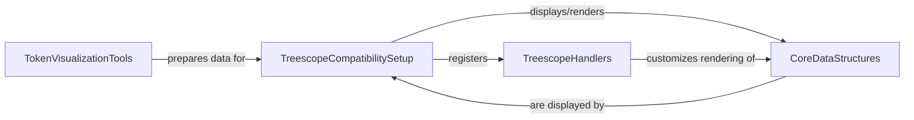

## Details

This subsystem provides specialized tools for visualizing model components, intermediate data, and debugging model behavior, heavily leveraging the `treescope` library for rich, interactive displays of JAX PyTrees. It embodies the "model as data" paradigm by enabling deep inspection of `penzai`'s internal data structures.

### TreescopeCompatibilitySetup
This component serves as the central integration point for the `treescope` library within `penzai`. It is responsible for initializing and configuring the `treescope` rendering environment, providing the public APIs (`display`, `show`, `register_as_default`, `basic_interactive_setup`) that users interact with to visualize `penzai` objects. It acts as the orchestrator for the overall visualization process.

**Related Classes/Methods**:

- <a href="https://github.com/google-deepmind/penzai/blob/main/penzai/treescope/_compatibility_setup.py" target="_blank" rel="noopener noreferrer">`penzai.treescope._compatibility_setup:display`</a>
- <a href="https://github.com/google-deepmind/penzai/blob/main/penzai/treescope/_compatibility_setup.py" target="_blank" rel="noopener noreferrer">`penzai.treescope._compatibility_setup:show`</a>
- <a href="https://github.com/google-deepmind/penzai/blob/main/penzai/treescope/_compatibility_setup.py" target="_blank" rel="noopener noreferrer">`penzai.treescope._compatibility_setup:register_as_default`</a>
- <a href="https://github.com/google-deepmind/penzai/blob/main/penzai/treescope/_compatibility_setup.py" target="_blank" rel="noopener noreferrer">`penzai.treescope._compatibility_setup:basic_interactive_setup`</a>

### TreescopeHandlers
This component defines how various complex `penzai` data types are rendered by `treescope`. These handlers provide detailed, customized display logic for specific `penzai` constructs (e.g., named axes, selections, shape checks, structural elements), extending beyond basic object representations. This component embodies the extensible nature of the visualization framework, allowing `penzai` to present its unique data structures effectively.

**Related Classes/Methods**:

- <a href="https://github.com/google-deepmind/penzai/blob/main/penzai/core/_treescope_handlers" target="_blank" rel="noopener noreferrer">`penzai.core._treescope_handlers`</a>

### CoreDataStructures
This component represents the fundamental `penzai` data structures (e.g., `penzai.core.variables`) that implement the `__treescope_repr__` method. This method is crucial as it allows `penzai` objects to define their own rich, interactive representations when displayed by `treescope`, directly supporting the "model as data" paradigm by making internal model states inspectable.

**Related Classes/Methods**:

- <a href="https://github.com/google-deepmind/penzai/blob/main/penzai/core/variables.py" target="_blank" rel="noopener noreferrer">`penzai.core.variables:__treescope_repr__`</a>

### TokenVisualizationTools
This component offers specialized functions (`show_token_array`, `show_token_scores`) for visualizing token-related data, particularly relevant for transformer models. It focuses on domain-specific processing of token IDs, ordering, and identification of control tokens to prepare this data for display within the `treescope` framework, serving as a specialized debugging and analysis tool for sequence models.

**Related Classes/Methods**:

- <a href="https://github.com/google-deepmind/penzai/blob/main/penzai/toolshed/token_visualization.py" target="_blank" rel="noopener noreferrer">`penzai.toolshed.token_visualization:show_token_array`</a>
- <a href="https://github.com/google-deepmind/penzai/blob/main/penzai/toolshed/token_visualization.py" target="_blank" rel="noopener noreferrer">`penzai.toolshed.token_visualization:show_token_scores`</a>

### [FAQ](https://github.com/CodeBoarding/GeneratedOnBoardings/tree/main?tab=readme-ov-file#faq)