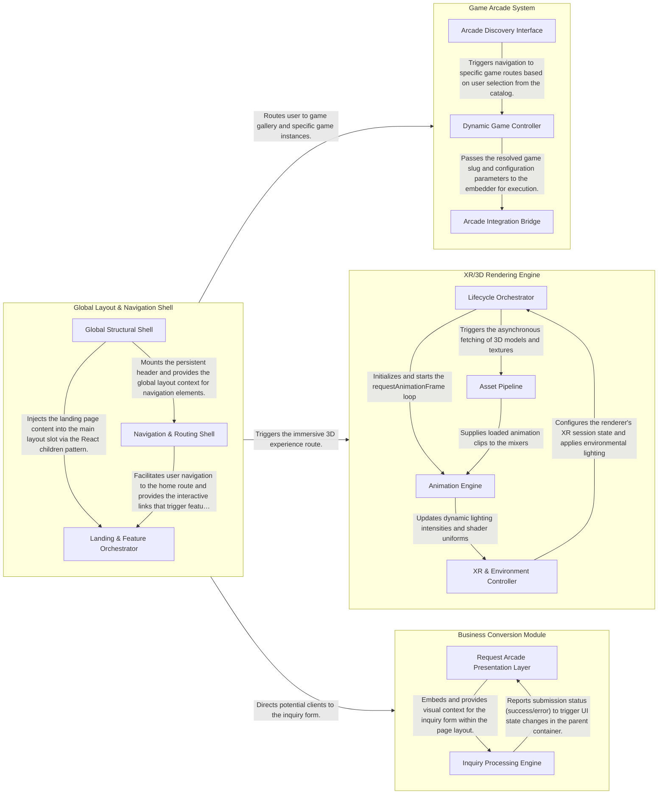

## Details

The application architecture is structured around a central Global Layout & Navigation Shell that orchestrates user flow to specialized functional modules, including a Game Arcade System for interactive content, an XR/3D Rendering Engine for immersive visual experiences, and a Business Conversion Module for lead generation. The purpose of this design is to provide a cohesive, themed user experience while decoupling core navigation from specific feature-rich interactive and business-oriented services.

### Global Layout & Navigation Shell

This component serves as the application's structural foundation and primary entry point. It manages the global state, persistent navigation, and the "Arcade-Rave" visual theme (neon pulses, glitch effects) that defines the user experience. It acts as the central router, dispatching users to specific feature modules.

- **Global Structural Shell** — Establishes the foundational HTML/Body structure and identity of the application.
- **Navigation & Routing Shell** — Manages user movement and interactive navigation.
- **Landing & Feature Orchestrator** — Orchestrates the primary entry point and visual storytelling of the application.

### Game Arcade System

The core interactive hub of the site, responsible for game discovery and execution. It utilizes a dynamic routing pattern to serve specific game instances and implements an "Iframe Integration Pattern" to host external game builds stored in the public arcade directory.

- **Arcade Discovery Interface** — Provides the user-facing catalog and navigation UI for the arcade.
- **Dynamic Game Controller** — Manages the routing logic and lifecycle of individual game instances.
- **Arcade Integration Bridge** — Implements the "Iframe Integration Pattern" to host external game builds stored in the `public/arcade/` directory.

### XR/3D Rendering Engine

A specialized component dedicated to high-performance 3D rendering and XR experiences. It encapsulates the Three.js lifecycle, including GLTF asset loading, animation mixing, and the main render loop, providing an immersive "Cline Runner" visual sequence.

- **Lifecycle Orchestrator** — Manages the integration of Three.js into the React component tree.
- **Asset Pipeline** — Responsible for the asynchronous loading and processing of 3D assets.
- **Animation Engine** — Drives the visual sequence through a high-performance render loop.
- **XR & Environment Controller** — Configures the immersive XR session and manages the "Arcade-Rave" visual atmosphere.

### Business Conversion Module

The functional endpoint for lead generation and studio inquiries. It manages the "Request Arcade" workflow, handling user input through validated forms and integrating with external services like Formspree for data persistence.

- **Request Arcade Presentation Layer** — Manages the structural layout, SEO metadata, and informational content blocks for the Request Arcade page.
- **Inquiry Processing Engine** — Handles the interactive lifecycle of the lead generation form.

