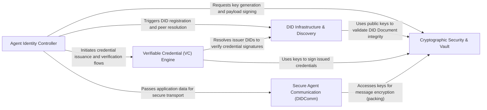

## Details

The `self-agent-id` framework operates as a decentralized identity stack for autonomous agents, where the Agent Identity Controller acts as the central orchestrator. The flow begins with the Cryptographic Security & Vault component generating and securing the root keys, which are then used by the DID Infrastructure & Discovery component to register the agent's identity. Once established, the Verifiable Credential (VC) Engine manages the issuance and verification of claims for trust-less interactions, while the Secure Agent Communication (DIDComm) component utilizes the agent's identity and cryptographic keys to ensure end-to-end privacy and authenticity during peer-to-peer data exchange.

### Agent Identity Controller

The primary entry point and coordinator for the agent. It manages the high-level lifecycle of the agent's identity, delegating specific tasks like signing, resolving, and messaging to specialized sub-components.

### DID Infrastructure & Discovery

Handles the translation of Decentralized Identifiers (DIDs) into actionable DID Documents. It manages interactions with external registries and ledgers to register the agent and discover peers.

### Verifiable Credential (VC) Engine

Manages the lifecycle of verifiable claims. It supports standard W3C Verifiable Credentials and OIDC4VC flows, allowing agents to prove attributes to one another without centralized intermediaries.

### Cryptographic Security & Vault

The "Root of Trust" for the framework. It provides low-level cryptographic primitives for key generation and signing, while ensuring that private keys and secrets are stored securely in an encrypted vault.

### Secure Agent Communication (DIDComm)

Implements the DIDComm messaging protocol. It handles the packing (encryption/signing) and unpacking of messages, enabling secure, asynchronous communication between agents.

