```mermaid
graph LR
  subgraph 1["Deployment & Configuration"]
    1__1_1["Autoregressive Deployment UI"]
    1__1_2["Diffusion & Visual Deployment UI"]
    1__1_3["Multimodal Runtime Configuration"]
    1__1_2 -->|"generates deployment configurations and CLI parameters for"| 1__1_3
    1__1_1 -->|"shares architectural patterns and state management with"| 1__1_2
    1__1_3 -->|"informs hardware requirements and GPU count options via distributed execution constraints for"| 1__1_1
  end
  subgraph 2["SRT Runtime & Scheduler"]
    2__2_1["SRT Core Orchestration & Scheduling"]
    2__2_2["Autoregressive Inference Engine"]
    2__2_3["Multimodal & Diffusion Runtime"]
    2__2_1 -->|"Dispatches optimized batches and KV cache management instructions"| 2__2_2
    2__2_1 -->|"Coordinates multi-stage generation tasks and manages shared memory resources"| 2__2_3
    2__2_3 -->|"Leverages the core engine for text encoding and initial prefill operations"| 2__2_1
    2__2_2 -->|"Returns generated tokens, logits, and updated KV cache metadata"| 2__2_1
  end
  subgraph 3["Distributed Model Backbone"]
    3__3_1["Distributed Layer Implementations"]
    3__3_2["Linear Execution Strategies"]
    3__3_3["Layer Foundations & Utilities"]
    3__3_1 -->|"Delegates weight initialization and the actual mathematical forward pass to the selected execution …"| 3__3_2
    3__3_1 -->|"Inherits from base classes to maintain a consistent interface and utilizes utilities for handling f…"| 3__3_3
    3__3_2 -->|"Implements execution logic that conforms to the foundational requirements and weight structures def…"| 3__3_3
  end
  subgraph 4["Multimodal LLM Models"]
    4__4_1["Causal Text Generation Backbones"]
    4__4_2["Visual Perception & VLM Architectures"]
    4__4_3["Audio Perception & Integration"]
    4__4_2 -->|"projects visual features into text embedding space for multimodal reasoning"| 4__4_1
    4__4_3 -->|"aligns and passes temporal audio embeddings for audio-conditioned generation"| 4__4_1
  end
  subgraph 5["Diffusion & Generative Stack"]
    5__5_1["Image Diffusion Transformers (2D DiT)"]
    5__5_2["Video Diffusion Transformers (3D DiT)"]
    5__5_3["Multimodal VAE Stack"]
    5__5_4["Distributed Generative Infrastructure"]
    5__5_1 -->|"Provides denoised 2D latent tensors for image reconstruction."| 5__5_3
    5__5_2 -->|"Provides denoised 3D latent tensors for video frame decoding."| 5__5_3
    5__5_2 -->|"Utilizes distributed attention and communication primitives for large-scale video denoising."| 5__5_4
    5__5_3 -->|"Employs halo exchange and parallelized blocks for memory-efficient video decoding."| 5__5_4
  end
  subgraph 6["Ecosystem Integrations"]
    6__6_1["ComfyUI Node Interface & Registry"]
    6__6_2["Backend Lifecycle Manager"]
    6__6_3["Inference Execution Engine"]
    6__6_4["Deployment Configuration UI"]
    6__6_1 -->|"defines the structural contract and runtime parameters that ... uses to parameterize generation req…"| 6__6_3
    6__6_1 -->|"triggers the ... when a user adds or configures a model loader node in the ComfyUI graph"| 6__6_2
    6__6_2 -->|"prepares the SGLang server and model state, which is a prerequisite for the ... to perform any gene…"| 6__6_3
    6__6_1 -->|"provides dynamic LoRA and option updates that the ... applies to the backend during active sessions"| 6__6_3
  end
  1 -->|"Generates CLI commands and configuration parameters to launch and initialize the runtime engine."| 2
  2 -->|"Dispatches inference requests and manages KV cache scheduling for text, vision, and audio-based mod…"| 4
  2 -->|"Orchestrates the generation lifecycle, including denoising steps and latent decoding for image/vide…"| 5
  4 -->|"Executes model forward passes using sharded, tensor-parallel linear layers for high-performance inf…"| 3
  5 -->|"Leverages optimized matrix multiplication kernels to accelerate transformer-based diffusion operati…"| 3
  6 -->|"Bridges external node-based UI workflows to the internal high-performance diffusion server for imag…"| 5
```

## Details

SGLang is a high-performance serving framework for LLMs and generative AI that separates frontend configuration from a backend runtime (SRT). The architecture centers on the SRT Runtime, which orchestrates data flow between multimodal models and a generative diffusion stack, both supported by a distributed backbone of hardware-optimized, tensor-parallel layers, while enabling external integrations like ComfyUI.

### Deployment & Configuration

Provides the user-facing interface and documentation-driven configuration tools for model deployment.

- **Autoregressive Deployment UI** — A React-based interactive interface for configuring Large Language Models (LLMs) and speculative decoding bundles.
- **Diffusion & Visual Deployment UI** — Specialized configuration interface for diffusion models and visual tasks, managing task-specific parameters such as LoRA toggles, resolution settings, and turbo-mode optimizations.
- **Multimodal Runtime Configuration** — The backend configuration layer that defines how multimodal models are partitioned and orchestrated within the SRT engine, handling distributed execution groups and pipeline stages.

### SRT Runtime & Scheduler

The central orchestration engine managing the request lifecycle, RadixAttention-based KV cache scheduling, and distributed execution.

- **SRT Core Orchestration & Scheduling** — Acts as the central control plane for the runtime.
- **Autoregressive Inference Engine** — Responsible for the low-level execution of autoregressive LLMs and VLMs.
- **Multimodal & Diffusion Runtime** — Manages complex generative pipelines involving diffusion models, VAEs, and encoders.

### Distributed Model Backbone

Contains low-level, hardware-optimized neural network layers for tensor-parallel operations.

- **Distributed Layer Implementations** — Concrete implementations of sharded linear layers that manage distributed weights and communication.
- **Linear Execution Strategies** — Implements the Strategy pattern to decouple mathematical execution from layer structure.
- **Layer Foundations & Utilities** — Provides the foundational infrastructure and common utilities for the linear layer subsystem.

### Multimodal LLM Models

Implements architectural logic for causal text models, VLMs, and audio encoders.

- **Causal Text Generation Backbones** — Implements the core autoregressive transformer logic for text-based reasoning and generation, including dense architectures and Mixture-of-Experts (MoE) variants.
- **Visual Perception & VLM Architectures** — Manages the processing of visual data (images and video) and its integration into the LLM context, including vision encoders and VLM wrappers.
- **Audio Perception & Integration** — Implements encoders that transform raw audio or spectrograms into meaningful embeddings using Conformer-based architectures.

### Diffusion & Generative Stack

Handles the generative AI pipeline, including Diffusion Transformers and VAEs for image/video generation.

- **Image Diffusion Transformers (2D DiT)** — Implements 2D transformer-based architectures for image generation.
- **Video Diffusion Transformers (3D DiT)** — Extends the DiT architecture to the temporal dimension for video synthesis.
- **Multimodal VAE Stack** — Provides the encoding and decoding logic for various modalities.
- **Distributed Generative Infrastructure** — Provides specialized primitives for distributed execution of generative models.

### Ecosystem Integrations

Provides bridge layers to external tools like ComfyUI for high-performance diffusion inference.

- **ComfyUI Node Interface & Registry** — Defines the visual node schemas and provides runtime control nodes.
- **Backend Lifecycle Manager** — Responsible for the initialization and resource management of the SGLang diffusion backend.
- **Inference Execution Engine** — Orchestrates the actual media generation process.
- **Deployment Configuration UI** — A collection of React-based documentation snippets that provide an interactive interface for users to generate SGLang CLI deployment commands for various model architectures (e.g., Flux, Qwen-VL).

