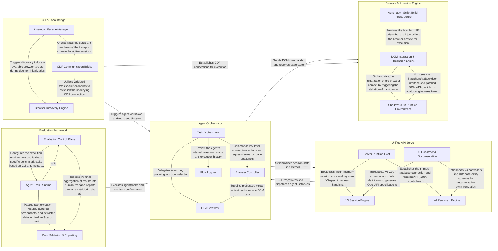

## Details

Stagehand is an AI-driven web automation framework that decouples high-level reasoning (the "Brain") from low-level browser execution (the "Body"). The architecture is centered around the Agent Orchestrator, which manages the agent's lifecycle and translates user intent into executable actions using LLMs. These actions are carried out by the Browser Automation Engine, which abstracts browser control and DOM manipulation. The Unified API Server handles remote execution and persistence, while the CLI & Local Bridge supports local development, and the Evaluation Framework ensures reliability through automated benchmarking.

### Agent Orchestrator

The central intelligence of Stagehand. It manages the agent's lifecycle, processes high-level goals into executable actions (act, extract, observe) using LLMs, and orchestrates tool usage. It handles reasoning, planning, and self-correction while maintaining an observability log of the agent's "thought process."

- **Task Orchestrator** — Manages the high-level lifecycle of the agent, coordinating between user goals and executable actions.
- **LLM Gateway** — Abstracts and manages interactions with various LLM providers (OpenAI, Anthropic, Google).
- **Browser Controller** — Acts as the agent's "body" and "eyes," managing the low-level browser connection via CDP and providing semantic perception of the page.
- **Flow Logger** — Implements the observability layer of the subsystem, tracking the agent's internal state transitions and "thought process." It captures LLM requests, responses, and tool execution traces to provide a transparent audit trail of the agent's reasoning.

### Browser Automation Engine

The execution layer of the agent. It provides a unified interface to the browser, handling low-level DOM manipulation, script injection, and locator resolution. It includes specialized scripts for piercing shadow DOMs and interacting with complex web elements, as well as the build infrastructure for these injected scripts.

- **DOM Interaction & Resolution Engine** — The core execution logic that resolves element selectors and performs physical interactions.
- **Shadow DOM Runtime Environment** — A low-level patching layer that modifies the browser's internal DOM behavior.
- **Automation Script Build Infrastructure** — The development and build-time component responsible for compiling the engine's TypeScript logic into injectable browser scripts.

### Unified API Server

Manages remote execution, session persistence, and multi-version API support (V3 and V4). It provides REST/WebSocket interfaces for interacting with agents, handles database connections for long-term storage of agent steps, and manages LLM configurations across different providers.

- **V3 Session Engine** — Manages the lifecycle of V3 agent sessions using an in-memory store.
- **V4 Persistent Engine** — Provides a scalable, database-backed API for agent execution.
- **Server Runtime Host** — The infrastructure layer that bootstraps the API server.
- **API Contract & Documentation** — Manages the generation and synchronization of OpenAPI/Swagger documentation for the unified server.

### CLI & Local Bridge

Facilitates local development and interaction. It allows users to run Stagehand from the command line, discovers local browser instances via Chrome DevTools Protocol (CDP), and manages the local daemon for script-to-browser communication and cleanup.

- **Daemon Lifecycle Manager** — Orchestrates the background daemon process that acts as a persistent intermediary.
- **Browser Discovery Engine** — Responsible for identifying and validating local browser instances.
- **CDP Communication Bridge** — Manages the data transport layer between the CLI and the browser.

### Evaluation Framework

A dedicated framework for measuring and verifying agent performance. It runs standardized benchmarks (GAIA, Mind2Web, WebVoyager), scores agent actions using exact match and visual verification, and collects screenshots for debugging and quality assurance.

- **Evaluation Control Plane** — Manages the end-to-end evaluation lifecycle, including CLI interaction, benchmark suite construction, and framework self-testing.
- **Agent Task Runtime** — Executes the agentic workflow within the evaluation context.
- **Data Validation & Reporting** — Validates agent outputs against expected results using specialized data extraction verifiers (e.g., checking for specific entities or historical data).

