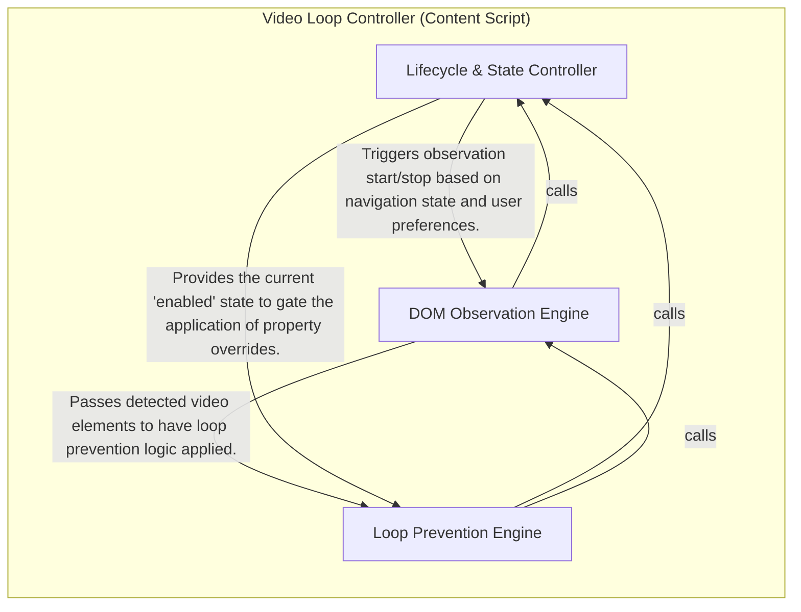

## Details

The Video Loop Controller acts as the central engine for the browser extension, managing the prevention of automatic video looping on YouTube Shorts. Its main flow involves initializing upon page load or navigation, monitoring for video elements, and intercepting DOM properties to override YouTube's internal looping behavior, while simultaneously synchronizing with browser storage to apply user-defined settings.

### Video Loop Controller (Content Script)

The core logic of the extension, operating within the YouTube content script context. It orchestrates the detection of Shorts pages, manages the lifecycle of video elements, and applies property-level overrides to prevent automatic looping. It reacts to YouTube's SPA navigation events and synchronizes state with browser storage to ensure user preferences are respected in real-time.

- **Lifecycle & State Controller** — Acts as the central nervous system of the content script.
- **DOM Observation Engine** — Handles the "discovery" of video elements within YouTube's highly dynamic interface.
- **Loop Prevention Engine** — Executes the core technical intervention required to stop video looping.

