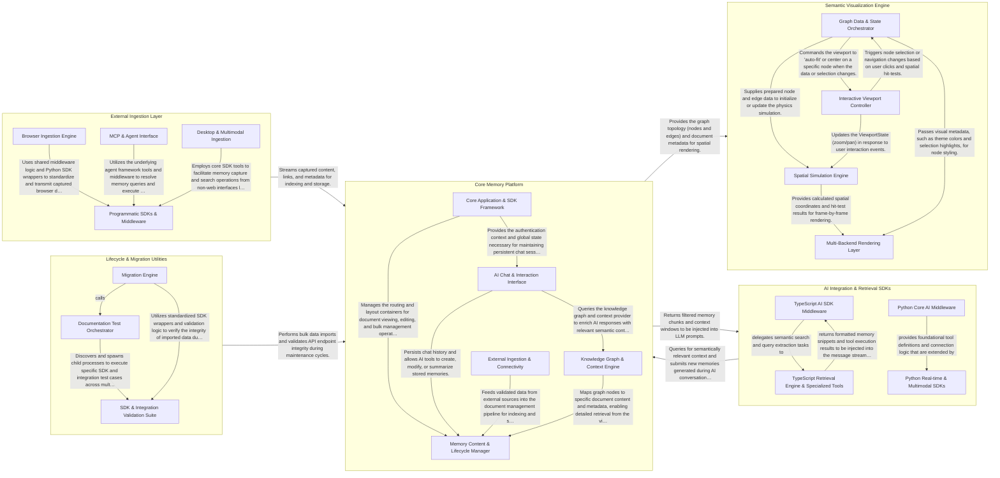

## Details

Supermemory operates as a centralized intelligence hub that transforms unstructured data from various sources into a structured, queryable semantic graph. The data flow begins at the External Ingestion Layer, where browser extensions and MCP servers capture user activity and external content. This data is streamed to the Core Memory Platform, which handles authentication, document processing (chunking/embedding), and persistence in a hybrid relational-vector store. The Semantic Visualization Engine consumes this structured data to render an interactive memory graph, allowing users to explore knowledge spatially. Simultaneously, the AI Integration & Retrieval SDKs act as a middleware layer for external LLMs, querying the Core Platform to inject relevant context into AI conversations (RAG) and capturing new insights back into the memory store.

### External Ingestion Layer

The primary entry point for data, responsible for capturing content directly from the user's workflow via browser extensions and providing a standardized interface for external AI clients through the Model Context Protocol (MCP).

- **Browser Ingestion Engine** — Manages the lifecycle of the browser extension, including background synchronization, authentication, and site-specific content scripts (ChatGPT, Claude, Twitter) that capture user interactions and data directly from the DOM.
- **MCP & Agent Interface** — Implements the Model Context Protocol (MCP) to expose Supermemory as a resource and toolset for external AI clients (e.g., Claude Desktop).
- **Programmatic SDKs & Middleware** — Provides a suite of wrappers and middleware for popular AI development frameworks (Vercel AI SDK, Mastra, VoltAgent).
- **Desktop & Multimodal Ingestion** — Extends ingestion capabilities to desktop environments via Raycast and voice-based interactions via Pipecat, allowing for quick memory capture and retrieval outside of traditional browser or code-based workflows.

### Core Memory Platform

The central processing and management hub. It hosts the Next.js web application, the Hono-based API, and the core logic for document management, user authentication, and the primary chat interface. It coordinates the transformation of raw data into indexed memories.

- **Core Application & SDK Framework** — The foundational layer of the platform, providing the Next.js application structure, authentication context, and programmatic SDK interfaces.
- **AI Chat & Interaction Interface** — Manages the conversational AI experience, including the chat sidebar, message streaming, and the execution of AI tools.
- **Memory Content & Lifecycle Manager** — Handles the storage, viewing, and editing of individual memories (documents, notes, links).
- **Knowledge Graph & Context Engine** — Orchestrates the semantic relationships between memories, providing a visual graph representation and a context provider for AI agents.
- **External Ingestion & Connectivity** — Manages connections to external data sources (Notion, Google Drive) and implements protocols like MCP (Model Context Protocol) to ingest data.

### Semantic Visualization Engine

A specialized rendering engine that visualizes the memory graph. It uses force-directed simulations and WebGL/Canvas to represent semantic relationships between documents and memories as an interactive spatial map.

- **Graph Data & State Orchestrator** — Manages the lifecycle of graph data and the high-level application state.
- **Spatial Simulation Engine** — The mathematical core of the engine, responsible for calculating node positions and managing the spatial environment.
- **Interactive Viewport Controller** — Handles user input and translates physical gestures (mouse wheel, touch, drag) into viewport transformations.
- **Multi-Backend Rendering Layer** — An abstraction layer for drawing the graph to the screen.

### AI Integration & Retrieval SDKs

A cross-language middleware layer (Python and TypeScript) that integrates Supermemory into AI agent frameworks. It provides tools for semantic retrieval, prompt enhancement, and automated memory creation during LLM interactions.

- **Python Core AI Middleware** — Provides the primary integration for standard text-based AI agents and LLM clients in Python, implementing a wrapper pattern to inject memories and manage memory stores.
- **Python Real-time & Multimodal SDKs** — Specialized for low-latency and streaming environments, adapting retrieval logic for voice and multimodal pipelines to allow real-time agents to access semantic memories.
- **TypeScript AI SDK Middleware** — Implements the middleware layer for the TypeScript ecosystem, targeting Vercel AI SDK and VoltAgent to transform message arrays and inject retrieved memories.
- **TypeScript Retrieval Engine & Specialized Tools** — The underlying engine for TypeScript integrations, managing direct communication with the Supermemory API and providing shared utilities for semantic profile searching.

### Lifecycle & Migration Utilities

Supporting scripts and tools for system maintenance, including data migration from legacy platforms (like Mem0) and automated testing of SDK responses and documentation.

- **Migration Engine** — Manages the end-to-end data migration lifecycle, handling the extraction of memories from legacy platforms, transforming them into Supermemory-compatible formats, and performing post-migration verification.
- **Documentation Test Orchestrator** — The infrastructure layer responsible for discovering test files across the monorepo, managing execution environments (Bun, Python venvs), and aggregating results from documentation-based tests.
- **SDK & Integration Validation Suite** — A comprehensive collection of automated tests that validate the Supermemory SDKs and their compatibility with external AI frameworks and tool-calling standards.

