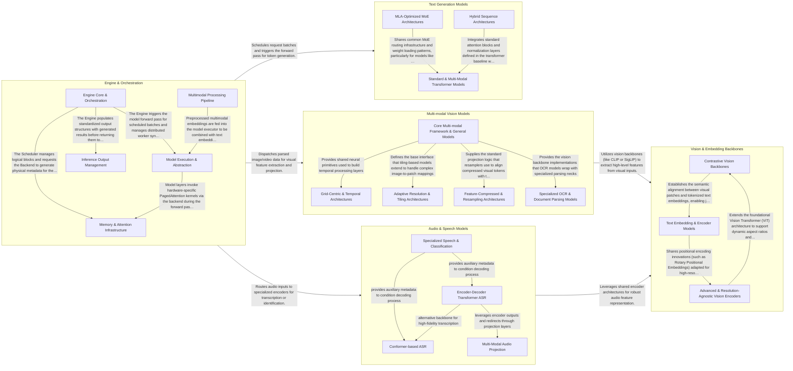

## Details

The vLLM architecture is designed as a high-performance, memory-efficient inference engine centered around the PagedAttention algorithm. The system follows an asynchronous, event-driven flow where the Engine & Orchestration layer manages request lifecycles, scheduling, and KV cache memory. Requests are dispatched to specialized model executors—Text Generation, Multi-modal Vision, or Audio & Speech Models—depending on the input type. These models often leverage a shared layer of Vision & Embedding Backbones for feature extraction. The architecture maximizes throughput by batching requests and managing physical memory blocks independently of logical sequences, allowing for efficient memory sharing and minimal fragmentation.

### Engine & Orchestration

The central control plane of vLLM. It manages the lifecycle of requests, from API entrypoints to scheduling and memory allocation. It coordinates distributed workers and manages the KV cache using PagedAttention logic to optimize memory utilization.

- **Engine Core & Orchestration** — The primary coordinator that manages the request lifecycle, queuing, and the main execution loop.
- **Memory & Attention Infrastructure** — Manages the physical layout of the KV cache and provides hardware-optimized attention kernels.
- **Model Execution & Abstraction** — Provides the abstraction layer and concrete implementations for various LLM architectures.
- **Multimodal Processing Pipeline** — Handles the complex lifecycle of non-text inputs (images, video, audio).
- **Inference Output Management** — Defines the standardized data contracts for results returned by the engine.

### Text Generation Models

High-performance implementations of Large Language Models (LLMs) optimized for causal inference. These models handle the core text-to-text generation tasks, utilizing tensor and pipeline parallelism to scale across multiple accelerators.

- **MLA-Optimized MoE Architectures** — Implements advanced model architectures that combine Multi-head Latent Attention (MLA) with Mixture-of-Experts (MoE).
- **Standard & Multi-Modal Transformer Models** — Provides implementations for foundational transformer architectures, including the Llama and Gemma families.
- **Hybrid Sequence Architectures** — Implements heterogeneous models that integrate different sequence modeling primitives, specifically combining standard Attention layers with State Space Models (SSM) like Mamba.

### Multi-modal Vision Models

Specialized models that extend LLM capabilities to process visual inputs (images and videos). They project visual features into the language model's embedding space for unified processing and reasoning.

- **Core Multi-modal Framework & General Models** — Provides the foundational infrastructure and standard implementations for vision-language integration, including shared neural primitives and general-purpose models.
- **Grid-Centric & Temporal Architectures** — Manages models that utilize complex spatial and temporal grid processing, often employing mROPE and THW grid logic.
- **Adaptive Resolution & Tiling Architectures** — Specialized in processing high-resolution images by breaking them into optimal tiles using patch merging and image-pooling attention.
- **Feature-Compressed & Resampling Architectures** — Focuses on efficient visual feature extraction through Resampler modules to compress visual features into a reduced set of tokens.
- **Specialized OCR & Document Parsing Models** — Architectures optimized for high-fidelity text extraction and structured document understanding using specialized vision backbones.

### Audio & Speech Models

Models dedicated to audio signal processing, including Automatic Speech Recognition (ASR) and Language Identification (LID). They transform raw audio features into text or classification tokens.

- **Encoder-Decoder Transformer ASR** — Implements the classic transformer-based encoder-decoder architecture for speech-to-text tasks, processing raw audio features through a deep transformer stack.
- **Conformer-based ASR** — Utilizes the Conformer architecture, combining global Transformer modeling with local CNN feature extraction, often employing CTC for alignment-free recognition.
- **Multi-Modal Audio Projection** — Integrates audio capabilities into LLM frameworks by mapping audio features into the text-based latent space using specialized projectors and patch-embedding layers.
- **Specialized Speech & Classification** — Encompasses non-standard attention mechanisms and classification-specific models, including long-form speech recognition (SANM/FSMN) and language identification.

### Vision & Embedding Backbones

Standalone feature extractors and embedding models. These serve as the "perceptual" layer for multi-modal models or provide high-dimensional vector representations for retrieval and similarity tasks.

- **Contrastive Vision Backbones** — Implements standard dual-encoder architectures that align image and text modalities using contrastive or sigmoid loss functions.
- **Advanced & Resolution-Agnostic Vision Encoders** — Handles complex vision tasks using native resolution processing (NaViT) and specialized 3D or high-resolution encoders.
- **Text Embedding & Encoder Models** — Provides a suite of encoder-only transformer models optimized for generating high-quality text embeddings.

