```mermaid
graph LR
  subgraph 1["Backend API & Orchestration"]
    1__1_1["Core API & Orchestration Engine"]
    1__1_2["AI-Driven Diagnostics (RCA)"]
    1__1_3["Agentic Interface (MCP)"]
    1__1_4["User Interface & State Management"]
    1__1_5["Performance Analytics & Visualization"]
    1__1_4 -->|"Submits benchmark configurations and polls for run status updates via REST endpoints."| 1__1_1
    1__1_3 -->|"Invokes benchmark execution and data retrieval tools on behalf of AI agents."| 1__1_1
    1__1_1 -->|"Triggers asynchronous diagnostic tasks when a benchmark run completes with failures or SLA breaches."| 1__1_2
    1__1_1 -->|"Provides the raw metrics and SLA evaluation results required for data transformation and rendering."| 1__1_5
    1__1_5 -->|"Injects visual components (charts, badges) into the dashboard to represent the current state of per…"| 1__1_4
    1__1_3 -->|"calls"| 1__1_4
    1__1_4 -->|"calls"| 1__1_2
    1__1_4 -->|"calls"| 1__1_3
  end
  subgraph 2["Benchmark Execution Engine"]
    2__2_1["Execution Core (Backend)"]
    2__2_2["Benchmark Management & Orchestration"]
    2__2_3["Observability & Diagnostics"]
    2__2_4["Agentic Gateway (MCP)"]
    2__2_2 -->|"Submits validated benchmark configurations and SLA requirements to initiate asynchronous test runs."| 2__2_1
    2__2_4 -->|"Programmatically invokes benchmark execution logic, enabling AI-driven performance testing."| 2__2_1
    2__2_1 -->|"Provides aggregated metrics, SLA compliance status, and diagnostic payloads for visualization and a…"| 2__2_3
    2__2_2 -->|"Synchronizes the UI state to ensure that the monitoring views reflect the current status of orchest…"| 2__2_3
  end
  subgraph 3["Database Infrastructure"]
    3__3_1["Persistence & Migration Engine"]
    3__3_2["Data Schema & Contracts"]
    3__3_3["Observability & Visualization Layer"]
    3__3_4["Ingestion & Submission Controller"]
    3__3_4 -->|"Submits benchmark configurations and results for transactional persistence."| 3__3_1
    3__3_1 -->|"Provides historical benchmark and metric data for rendering in the dashboard."| 3__3_3
    3__3_2 -->|"Defines the structural constraints and ORM mappings for the relational models."| 3__3_1
    3__3_2 -->|"Enforces type safety and validation for user-submitted benchmark data."| 3__3_4
    3__3_2 -->|"Ensures consistent data representation for charts, tables, and agent-facing summaries."| 3__3_3
  end
  subgraph 4["Frontend Core & Interaction"]
    4__4_1["Application Shell & State Orchestration"]
    4__4_2["Benchmark Configuration Engine"]
    4__4_3["Diagnostic & RCA Interface"]
    4__4_2 -->|"Triggers global state updates and run list refreshes via the handleRunCreated callback after succes…"| 4__4_1
    4__4_1 -->|"Provides the selected run context and diagnostic data required to populate the RCA investigation pa…"| 4__4_3
  end
  subgraph 5["Observability & Visualization"]
    5__5_1["Observability Data Models"]
    5__5_2["Benchmark Analysis Table"]
    5__5_3["Performance Visualization Engine"]
    5__5_1 -->|"Provides the Run and SlaResult type definitions required for row rendering, regression calculations…"| 5__5_2
    5__5_1 -->|"Supplies the MetricsSummary and time-series data structures used to populate and scale the latency …"| 5__5_3
  end
  subgraph 6["MCP Integration Server"]
    6__6_1["MCP Interface & API Orchestrator"]
    6__6_2["Load Testing & Metrics Engine"]
    6__6_3["SLA Evaluation & Data Modeling"]
    6__6_4["Database Infrastructure & Migrations"]
    6__6_1 -->|"Triggers the execution of benchmarks and retrieval of aggregated metrics based on agent tool calls."| 6__6_2
    6__6_1 -->|"Uses schemas for request validation and invokes SLA evaluation to provide pass/fail context to the …"| 6__6_3
    6__6_1 -->|"Queries historical run data and diagnostic information directly from the persistence layer."| 6__6_4
    6__6_2 -->|"Persists raw execution data and calculated metrics for long-term storage."| 6__6_4
    6__6_3 -->|"Retrieves stored run metrics to perform post-hoc SLA compliance checks."| 6__6_4
  end
  4 -->|"Dispatches REST requests to trigger benchmarks and fetch diagnostic data."| 1
  1 -->|"Delegates long-running load test tasks to the asynchronous runner."| 2
  1 -->|"Persists benchmark metadata, SLA evaluations, and RCA findings."| 3
  2 -->|"Streams real-time performance metrics and updates run status during execution."| 3
  6 -->|"Proxies agent-initiated tool calls to the core backend services."| 1
  4 -->|"Passes fetched run data and state updates to visualization components for rendering."| 5
```

## Details

QueryScope is a developer observability platform for load testing and LLM benchmarking, utilizing a service-oriented architecture with a React frontend and FastAPI backend. The system orchestrates benchmark execution, evaluates performance against SLAs, provides AI-driven root cause analysis, and integrates with AI agents via an MCP server, all while persisting data in PostgreSQL.

### Backend API & Orchestration

The central logic hub of the application. It exposes REST endpoints for managing benchmarks, handles the orchestration of Root Cause Analysis (RCA) using AI services, and evaluates performance metrics against defined SLAs.

- **Core API & Orchestration Engine** — The primary controller for the subsystem, managing the RESTful interface, database persistence, and the high-level orchestration of benchmark runs.
- **AI-Driven Diagnostics (RCA)** — Responsible for the intelligent layer of the orchestration flow, leveraging LLMs and RAG pipelines to perform Root Cause Analysis on failed benchmarks.
- **Agentic Interface (MCP)** — Implements the Model Context Protocol to expose the orchestration engine's capabilities to external AI agents.
- **User Interface & State Management** — The frontend command center that manages the user-facing lifecycle of a benchmark, handling form state and real-time status updates.
- **Performance Analytics & Visualization** — Transforms raw metrics and SLA evaluation results into visual representations for the dashboard.

### Benchmark Execution Engine

An asynchronous service layer responsible for executing load tests and LLM-specific benchmarks. it manages the lifecycle of requests to target systems and collects raw performance data.

- **Execution Core (Backend)** — The primary engine responsible for benchmark execution, simulating load, interacting with LLM providers, computing metrics, and coordinating with the RCA service.
- **Benchmark Management & Orchestration** — Manages the frontend lifecycle of a benchmark, including configuration, schema enforcement, and orchestration logic.
- **Observability & Diagnostics** — Transforms raw metrics into visual insights, highlights SLA violations, and presents root cause analysis.
- **Agentic Gateway (MCP)** — Provides a programmatic entry point for AI agents to interact with the benchmark engine via the Model Context Protocol (MCP).

### Database Infrastructure

Manages the PostgreSQL persistence layer, including schema migrations and the data model for benchmarks, baselines, and SLA results.

- **Persistence & Migration Engine** — The core backend component responsible for the physical storage layer.
- **Data Schema & Contracts** — Defines the unified data models used across the frontend, backend, and MCP server.
- **Observability & Visualization Layer** — Manages the "Read" side of the database infrastructure.
- **Ingestion & Submission Controller** — Handles the "Write" side of the database infrastructure.

### Frontend Core & Interaction

The React application shell that manages global state, navigation, and user-driven actions. It handles the configuration of new benchmarks and triggers diagnostic deep-dives.

- **Application Shell & State Orchestration** — The backbone of the QueryScope frontend, managing global application state, layout, and lifecycle.
- **Benchmark Configuration Engine** — Responsible for user-driven configuration and launching of new benchmarks.
- **Diagnostic & RCA Interface** — Manages the 'deep-dive' diagnostic experience, allowing users to investigate performance anomalies or SLA breaches.

### Observability & Visualization

A specialized UI suite focused on data presentation. It renders complex performance metrics, latency charts, and benchmark comparison tables to highlight regressions.

- **Observability Data Models** — Acts as the 'Source of Truth' for the subsystem, defining the core interfaces and type contracts for benchmark data.
- **Benchmark Analysis Table** — The primary interactive interface for exploring and comparing benchmark runs.
- **Performance Visualization Engine** — Responsible for the graphical representation of performance metrics, specifically focusing on latency trends over time.

### MCP Integration Server

Implements the Model Context Protocol to allow external AI agents to interact with QueryScope as a tool, enabling automated querying of runs and execution of benchmarks.

- **MCP Interface & API Orchestrator** — Acts as the primary entry point for the subsystem, hosting the MCP server that exposes tools to AI agents.
- **Load Testing & Metrics Engine** — The execution core responsible for performing the actual load tests and LLM benchmarks.
- **SLA Evaluation & Data Modeling** — Manages the data contracts and performance validation logic.
- **Database Infrastructure & Migrations** — Provides the foundational persistence layer and manages the evolution of the database schema.

