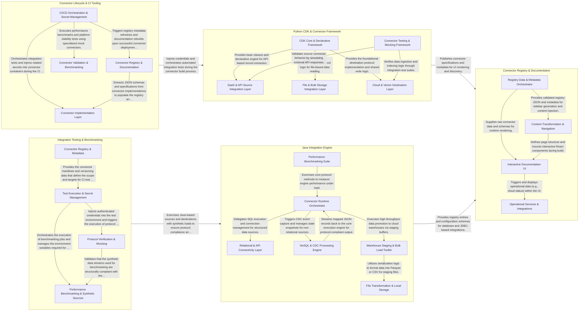

## Details

Airbyte's architecture is a protocol-driven ecosystem designed for high extensibility and isolation. The platform's core data flow is orchestrated through specialized Connector Development Kits (CDK) for Java and Python, which standardize how data is ingested from sources and delivered to destinations. These connectors are validated by a dedicated testing and benchmarking layer to ensure protocol compliance, while a centralized CI/CD and secret management system handles the operational lifecycle. Finally, a registry and documentation layer serves as the discovery interface, consuming metadata from the connectors to provide a unified view of the integration ecosystem.

### Connector Registry & Documentation

Manages the public-facing catalog and technical documentation for all Airbyte connectors. It processes connector metadata and OpenAPI specifications to render the interactive registry and documentation site.

- **Registry Data & Metadata Orchestrator** — Acts as the "Source of Truth" manager for the subsystem, fetching remote registry definitions, extracting metadata from connectors, and validating OpenAPI specifications.
- **Content Transformation & Navigation** — Manages Docusaurus build-time logic, using Remark plugins to inject dynamic connector specifications into Markdown and programmatically generating navigation sidebars.
- **Interactive Documentation UI** — The frontend "View" layer consisting of React components that render the interactive connector catalog, searchable grids, and JSON schema viewers.
- **Operational Services & Integrations** — Handles runtime auxiliary features, including real-time Airbyte Cloud status updates and third-party integrations like Kapa.ai.

### Java Integration Engine

The high-performance runtime for database, warehouse, and streaming integrations. It handles complex SQL generation, connection pooling, and data serialization for Java-based sources and destinations.

- **Connector Runtime Orchestrator** — The central entry point that manages the lifecycle of connector execution.
- **Relational & API Connectivity Layer** — Handles low-level interactions with relational databases and specialized cloud management APIs.
- **NoSQL & CDC Processing Engine** — A specialized engine for handling non-relational data models and Change Data Capture (CDC).
- **Warehouse Staging & Bulk Load Toolkit** — Manages high-performance data loading patterns for cloud warehouses.
- **File Transformation & Local Storage** — Responsible for the serialization and deserialization of data from file-based sources and local storage destinations.
- **Performance Benchmarking Suite** — Provides tools for measuring the throughput and latency of the integration engine.

### Python CDK & Connector Framework

The primary development framework for SaaS and API-based connectors. It provides declarative and imperative patterns for authentication, record extraction, and schema transformation.

- **CDK Core & Declarative Framework** — The foundational framework providing the Airbyte protocol implementation, base classes for sources and streams, and a declarative engine for low-code connector development.
- **SaaS & API Source Integration Layer** — Implements source connectors for SaaS platforms and REST APIs.
- **File & Bulk Storage Integration Layer** — Specialized connectors for reading data from file systems and bulk storage services (S3, GCS, SFTP).
- **Cloud & Vector Destination Layer** — Manages the ingestion of data into modern cloud data lakes and vector databases.
- **Connector Testing & Mocking Framework** — Provides the infrastructure for integration testing of connectors.

### Connector Lifecycle & CI Tooling

Automates the operational aspects of the connector ecosystem, including secret rotation from Google Secret Manager and the orchestration of CI/CD pipelines for connector integration tests.

- **Connector Registry & Documentation** — Manages the discovery, cataloging, and presentation of the Airbyte connector ecosystem.
- **CI/CD Orchestration & Secret Management** — Automates the operational aspects of connector testing and deployment.
- **Connector Validation & Benchmarking** — Provides specialized internal tooling for validating platform stability and measuring connector performance.
- **Connector Implementation Layer** — Contains the core business logic for the various source and destination connectors.

### Integration Testing & Benchmarking

Provides the infrastructure for end-to-end validation and performance testing. It generates synthetic data streams to verify protocol compliance and measure connector throughput.

- **Connector Registry & Metadata** — Acts as the source of truth for the testing subsystem by maintaining the catalog of connectors and their versions.
- **Test Execution & Secret Management** — Provides the foundational infrastructure for running automated tests in a secure environment.
- **Protocol Verification & Mocking** — A dual-purpose component that simulates external API responses and validates internal protocol compliance.
- **Performance Benchmarking & Synthetic Sources** — Focuses on measuring connector throughput and resource utilization.

