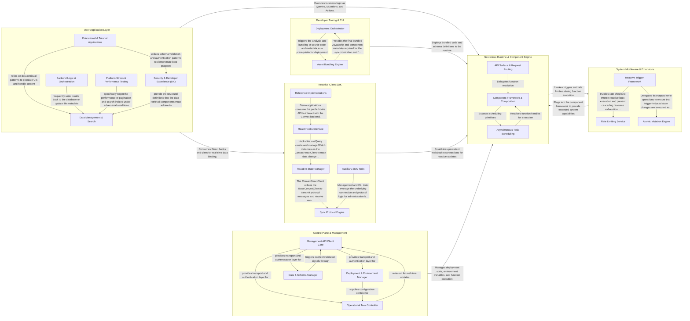

## Details

The Convex platform architecture is designed as a reactive backend-as-a-service that synchronizes state between a cloud-hosted database and client-side applications. The flow begins with the Developer Tooling & CLI bundling and deploying user-defined functions to the Serverless Runtime & Component Engine. Once deployed, the User Application Layer interacts with the backend via the Reactive Client SDK, which maintains a persistent WebSocket connection for real-time updates. The Serverless Runtime executes business logic, leveraging System Middleware & Extensions for cross-cutting concerns like rate limiting and triggers, while the Control Plane & Management layer provides administrative oversight and state management for the entire deployment.

### Reactive Client SDK

The client-side library that provides a reactive interface for applications. It manages the WebSocket connection to the Convex backend, maintains a local cache of query results, and provides React hooks for seamless data binding and optimistic updates.

- **Sync Protocol Engine** — The foundational layer responsible for the low-level WebSocket lifecycle and the Convex wire protocol.
- **Reactive State Manager** — A framework-aware layer that wraps the sync engine to manage local state and query subscriptions.
- **React Hooks Interface** — The primary public API surface for developers.
- **Auxiliary SDK Tools** — Supporting utilities bundled with the SDK that facilitate platform management, CLI interactions, and administrative tasks like billing and AI file management.
- **Reference Implementations** — A collection of demo applications and integration examples that demonstrate best practices for using the SDK with various authentication providers and architectural patterns.

### Developer Tooling & CLI

Tools for managing the development lifecycle of a Convex project. This includes the CLI for pushing schema and function definitions, bundling user code with esbuild, and configuring deployment settings.

- **Deployment Orchestrator** — Manages the high-level lifecycle of CLI commands and the "push" workflow.
- **Asset Bundling Engine** — Handles the technical transformation of source code into deployable assets.

### Serverless Runtime & Component Engine

The core execution engine responsible for running User Defined Functions (UDFs) in sandboxed V8 isolates. It handles request routing, function scheduling, and the modular component system that allows for reusable backend logic.

- **Component Framework & Composition** — Manages the hierarchical structure of the application, including component definitions, instantiation, and the resolution of internal function exports.
- **API Surface & Request Routing** — Defines the public-facing API surface of the Convex application.
- **Asynchronous Task Scheduling** — Implements the "Serverless" scheduling logic, allowing functions to be executed at a later time or after a specific delay.

### Control Plane & Management

The administrative and monitoring layer of the platform. It provides APIs for the Convex Dashboard to manage environment variables, view deployment logs, and perform data operations like table deletions.

- **Management API Client Core** — The foundational infrastructure layer that provides the communication primitives for the dashboard.
- **Deployment & Environment Manager** — Responsible for the high-level configuration and lifecycle management of a Convex deployment.
- **Data & Schema Manager** — Provides administrative tools for direct database manipulation and metadata maintenance.
- **Operational Task Controller** — Manages the execution of logic within the platform, encompassing both the monitoring and cancellation of scheduled background jobs and the manual invocation of User Defined Functions (UDFs) for testing purposes.

### System Middleware & Extensions

A set of pre-built, system-level components that extend the core database functionality. This includes triggers for reactive data processing, rate limiting for traffic control, and atomic mutators for complex state transitions.

- **Rate Limiting Service** — Implements traffic control and resource protection by tracking request frequency and enforcing quotas.
- **Reactive Trigger Framework** — A client-side middleware that wraps the standard database client to enable reactive processing.
- **Atomic Mutation Engine** — The server-side execution layer for complex, multi-step database transitions.

### User Application Layer

Represents the user-land code, including example applications and test projects that utilize the Convex platform. This layer demonstrates the use of queries, mutations, and actions in various domains.

- **Educational & Tutorial Applications** — Provides the entry point for developers, showcasing standard Convex patterns through progressive chat applications and library integrations.
- **Data Management & Search** — Demonstrates advanced data handling capabilities, including complex pagination, full-text search, vector search, and file storage.
- **Backend Logic & Orchestration** — Implements side-effect-heavy logic that interacts with external systems, including Actions, scheduled tasks, and cron jobs.
- **Security & Developer Experience (DX)** — Manages the structural integrity and security of the application layer, including authentication, schema validation, and type safety.
- **Platform Stress & Performance Testing** — Internal-facing applications designed to push the limits of the Convex reactive engine and test high-frequency updates and edge cases.

