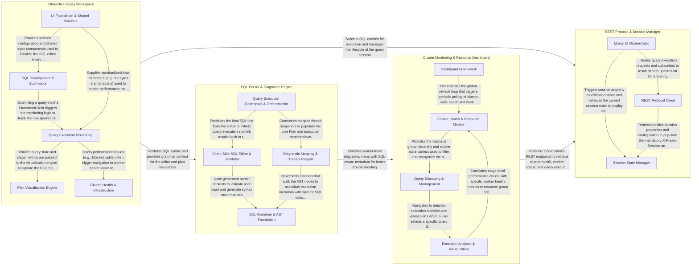

## Details

This system represents a Presto UI architecture designed for interactive query development, cluster monitoring, and real-time performance diagnostics. The main flow involves the Interactive Query Workspace submitting SQL queries via the REST Protocol & Session Manager, while the SQL Parser & Diagnostic Engine provides syntax validation and diagnostic context. Simultaneously, the Cluster Monitoring & Resource Dashboard polls the Coordinator to maintain a real-time view of system health and resource utilization, with the diagnostic engine enriching these views with SQL-aware metadata to facilitate troubleshooting.

### REST Protocol & Session Manager

Manages the low-level communication with the Presto Coordinator, implementing the Presto REST API protocol for query submission and result retrieval while maintaining session state.

- **REST Protocol Client** — Implements the asynchronous Presto REST protocol.
- **Session State Manager** — Manages the lifecycle and validation of Presto session properties, including filtering, highlighting altered settings, and preparing the session context for REST API calls.
- **Query UI Orchestrator** — Acts as the primary integration layer for the query interface, coordinating the display of query headers, progress bars, and results while providing the entry point for session configuration.

### SQL Parser & Diagnostic Engine

Uses ANTLR4-generated parsers to decompose SQL statements for client-side validation, syntax highlighting, and mapping worker execution threads to SQL constructs for diagnostics.

- **SQL Grammar & AST Foundation** — Contains the structural definition of the Presto SQL dialect.
- **Client-Side SQL Editor & Validator** — The user-facing interface for SQL input.
- **Diagnostic Mapping & Thread Analysis** — The core logic engine that bridges the static SQL structure with dynamic execution data.
- **Query Execution Dashboard & Orchestration** — Manages the lifecycle of query execution and the visualization of performance metrics.

### Interactive Query Workspace

The primary user interface for query development and performance tuning, providing a SQL editor and D3.js-based visualization of execution plans and data distribution.

- **SQL Development & Submission** — Manages the authoring environment and the lifecycle of query submission.
- **Query Execution Monitoring** — Responsible for tracking the lifecycle of queries across the cluster.
- **Plan Visualization Engine** — A specialized visualization layer that transforms complex execution plan data into interactive graphical representations.
- **Cluster Health & Infrastructure** — Provides a global view of the Presto cluster's state, independent of individual queries.
- **UI Foundation & Shared Services** — Provides the common architectural framework and reusable UI components for the workspace.

### Cluster Monitoring & Resource Dashboard

Aggregates high-level cluster metrics, providing views into worker health, query stage progress, and resource group management by polling the Coordinator.

- **Cluster Health & Resource Monitor** — Manages the high-level physical and logical state of the cluster, including real-time monitoring of workers, memory, CPU, and Resource Group hierarchies.
- **Query Discovery & Management** — Handles the primary query lifecycle, listing, and client-side SQL parsing, providing filtering and sorting for query discovery.
- **Execution Analysis & Visualization** — Provides granular deep-dive analysis of query performance, including task-level statistics and interactive execution plan visualization using D3.js.
- **Dashboard Framework** — The foundational orchestration layer defining the React component registry, routing, and shared utilities for API interaction.

