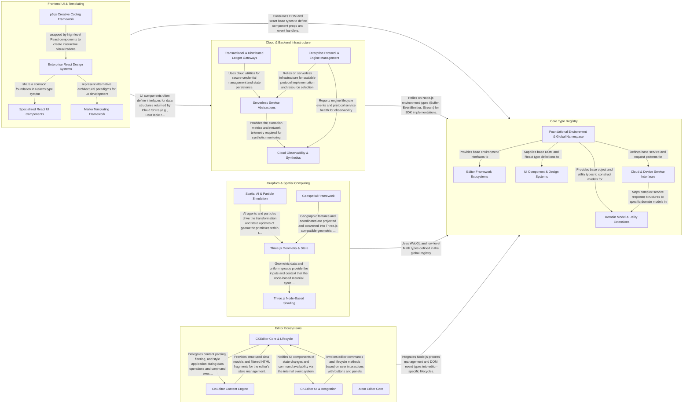

## Details

DefinitelyTyped is a massive monorepo of TypeScript type definitions, structured as a hub-and-spoke architecture where a central Core Type Registry provides foundational environment types that specialized domain components consume to define strict interfaces for the broader JavaScript ecosystem. The data flow is primarily a dependency flow, where UI, Cloud, Graphics, and Editor components rely on these core types to ensure type safety across high-concurrency contributions, all validated and published through a centralized CI/CD pipeline.

### Core Type Registry

The foundational layer of the repository, containing global namespace definitions, environment types (Node.js, Browser), and shared base utilities that serve as the "connective tissue" for all other packages.

- **Foundational Environment & Global Namespace** — The root of the type registry, defining the global environment and base service interfaces that all other packages depend on.
- **Editor Framework Ecosystems** — Aggregates complex type definitions for large-scale application frameworks, specifically focusing on editor architectures.
- **UI Component & Design Systems** — Defines the properties, state, and event handlers for UI component libraries.
- **Cloud & Device Service Interfaces** — Handles the type definitions for external service SDKs and hardware control protocols.
- **Domain Model & Utility Extensions** — Contains specialized data models and engine utilities that extend generic object types.

### Frontend UI & Templating

Manages the presentation layer of the ecosystem, encompassing React-based design systems, interactive UI components, and creative coding frameworks like p5.js and Marko.

- **Enterprise React Design Systems** — Manages high-fidelity type definitions for enterprise-scale React component libraries, focusing on complex data structures and stateful interactions within the IBM Carbon ecosystem.
- **Specialized React UI Components** — Provides type definitions for "plug-and-play" React components that handle specific interactive features like geospatial mapping and smooth-scroll navigation.
- **Marko Templating Framework** — Handles the type definitions for the Marko framework, encompassing both its HTML templating engine and its component-based runtime lifecycle.
- **p5.js Creative Coding Framework** — Encompasses the imperative API for the p5.js library, focusing on canvas rendering, environment control, and geometric primitives for creative coding.

### Cloud & Backend Infrastructure

Defines the interfaces for server-side development, including cloud SDKs (AWS, Azure), payment gateways (PayPal), database drivers (DynamoDB), and authentication utilities (JWT).

- **Cloud Observability & Synthetics** — Manages the telemetry and reporting structures for cloud-native applications.
- **Serverless Service Abstractions** — Provides standardized interfaces for core cloud services within serverless environments.
- **Transactional & Distributed Ledger Gateways** — Defines the interfaces for secure external value transfers and verification.
- **Enterprise Protocol & Engine Management** — Handles specialized backend protocols and low-level platform management.

### Editor Ecosystems

Complex, self-contained type systems for large-scale editors like Atom and CKEditor 4, defining internal lifecycles, plugin architectures, and UI-to-process communication.

- **CKEditor Core & Lifecycle** — The central management layer for CKEditor 4, handling instance initialization, command registration, and the event-driven architecture.
- **CKEditor Content Engine** — Manages the internal representation of content through a custom HTML parser and DOM-like model.
- **CKEditor UI & Integration** — Orchestrates the editor's visual interface, including toolbars, buttons, and panels.
- **Atom Editor Core** — Encapsulates the Atom editor's type system, covering keyboard input resolution, external process management (e.g., for linters), and the definitions of internal events and state changes.

### Graphics & Spatial Computing

High-performance math and rendering definitions, focusing on 3D graphics (Three.js), spatial AI (Yuka), and geographic coordinate systems.

- **Three.js Geometry & State** — Manages the mathematical foundations of 3D objects and the low-level GPU state.
- **Three.js Node-Based Shading** — A modern, graph-based approach to shader definition.
- **Spatial AI & Particle Simulation** — Handles the dynamic behavior of entities in 3D space.
- **Geospatial Framework** — Specialized logic for GIS (Geographic Information Systems) visualization.

