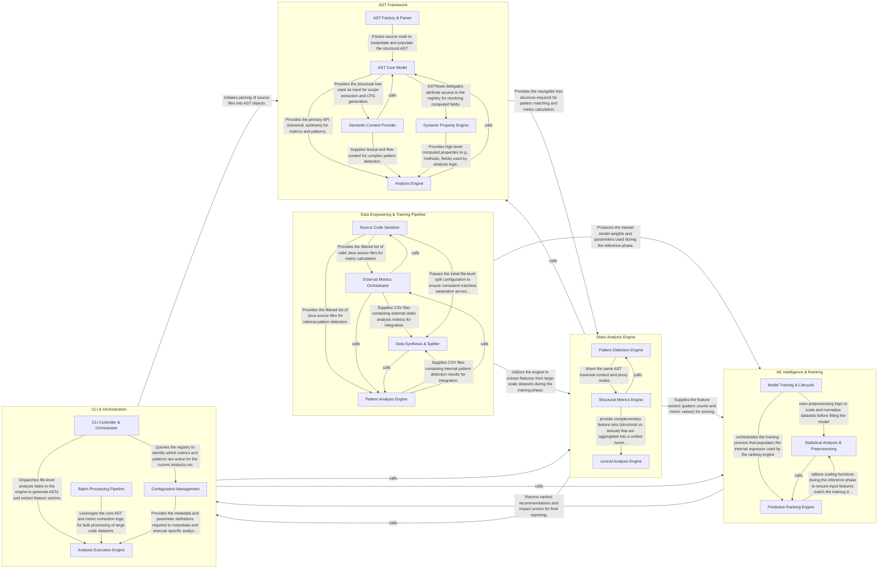

## Details

The aibolit architecture follows a sophisticated ML-augmented Static Analysis Pipeline. The process begins with the CLI & Orchestration component, which manages configuration and triggers the AST Framework to parse Java source code into an enriched, navigable tree. This tree is then consumed by the Static Analysis Engine, which executes a suite of deterministic pattern detectors and complexity metrics to extract a high-dimensional feature vector. These features are passed to the ML Intelligence & Ranking component, where a pre-trained model scores and prioritizes the findings based on their predicted impact on code quality. Finally, the results are funneled back to the orchestrator for report generation. A separate Data Engineering & Training Pipeline exists to handle large-scale repository processing and model retraining, ensuring the tool's recommendations remain relevant.

### CLI & Orchestration

Acts as the system's brain and primary interface. It handles user input, manages global configuration, and orchestrates the sequential execution of parsing, analysis, and ranking. It is also responsible for formatting the final output into human-readable or machine-parsable reports (XML/Text).

- **CLI Controller & Orchestrator** — The primary entry point and execution manager.
- **Configuration Management** — Acts as the system's registry and metadata repository.
- **Analysis Execution Engine** — The functional core responsible for the transformation of source code into structured data.
- **Batch Processing Pipeline** — A set of auxiliary scripts designed for high-volume data processing tasks, such as calculating Halstead metrics or Ranking Scores (RS) for dataset preparation, complementing the main CLI tool.

### AST Framework

Provides the structural foundation for analysis by wrapping javalang to create an improved, queryable Abstract Syntax Tree (AST). It includes specialized logic for class decomposition, scope management, and Control Flow Graph (CFG) generation, allowing other components to traverse code structures efficiently.

- **AST Core Model** — Defines the fundamental data structures (AST, ASTNode) and navigation logic.
- **AST Factory & Parser** — Responsible for converting raw Java source code into the framework's internal AST representation.
- **Dynamic Property Engine** — An extensibility mechanism that allows for the registration and dynamic resolution of computed fields on AST nodes.
- **Semantic Context Provider** — Enriches the structural AST with semantic information, including lexical scope hierarchies and Control Flow Graphs (CFGs), to support advanced analysis patterns.
- **Analysis Engine** — The consumer layer of the framework, consisting of metrics and pattern detectors that utilize the AST and its semantic enrichments to identify code smells and calculate features.

### Static Analysis Engine

A modular engine implementing the Strategy pattern to detect "anti-patterns" and calculate software metrics. It traverses the AST to identify specific code smells (e.g., Null Assignment, Classic Getters) and computes complexity scores (Cyclomatic, Cognitive, NPath), transforming code into a numerical feature set.

- **Pattern Detection Engine** — Implements the Strategy pattern to identify discrete "anti-patterns" in the code.
- **Structural Metrics Engine** — Calculates quantitative measures of code complexity and internal class cohesion.
- **Lexical Analysis Engine** — Extracts features from the raw text and token stream of the source code.

### ML Intelligence & Ranking

The predictive core of the tool. It takes the raw features produced by the Static Analysis Engine and applies machine learning models (regressors) to rank identified patterns. It uses mathematical scoring to determine which code improvements should be prioritized for the developer.

- **Model Training & Lifecycle** — Manages the end-to-end offline process of creating the ranking models, including dataset collection, environment setup, and the execution of the training process.
- **Statistical Analysis & Preprocessing** — Provides the analytical foundation for the subsystem, handling data transformation tasks like scaling and normalization, and performing impact analysis.
- **Predictive Ranking Engine** — The runtime core that implements the mathematical scoring logic, exposing the primary API for inference and applying the trained model to rank patterns.

### Data Engineering & Training Pipeline

A suite of utilities designed for offline operations. It manages parallel processing of large Java datasets, filters source files, and extracts features at scale to facilitate the training and refinement of the ranking models.

- **Source Code Sanitizer** — Responsible for the initial ingestion and sanitization of the Java dataset.
- **External Metrics Orchestrator** — Manages the execution of external static analysis tools to enrich the feature set.
- **Pattern Analysis Engine** — The core feature extraction component that identifies specific code patterns using Aibolit's internal AST framework.
- **Data Synthesis & Splitter** — Finalizes the pipeline by merging CSV outputs from all extraction engines into a master dataset.

