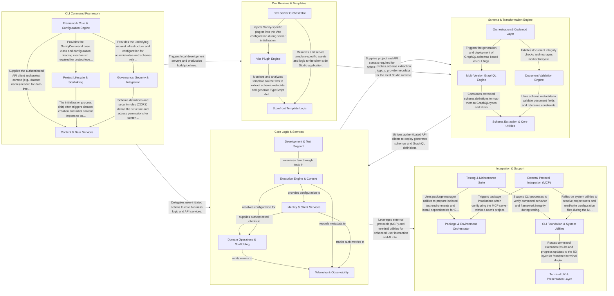

## Details

The Sanity CLI architecture follows a command-driven pattern where user interactions are parsed by a framework layer and delegated to specialized service modules. The flow typically begins with environment initialization and configuration resolution, followed by the execution of specific actions (such as dataset management, document validation, or schema deployment) that interact with the Sanity API. A dedicated development system manages local studio environments and build processes, while a schema engine handles complex data structure extraction and GraphQL generation.

### CLI Command Framework

Handles the CLI lifecycle, including argument parsing via oclif, project configuration loading, and environment initialization. It provides the base command structures that all CLI features inherit from.

- **Framework Core & Configuration Engine** — Provides the foundational infrastructure for the CLI, including the base command class, configuration discovery, and environment initialization.
- **Project Lifecycle & Scaffolding** — Orchestrates the primary developer workflows for Sanity projects, including initialization, local development, and production builds.
- **Content & Data Services** — Implements the command set for managing Sanity's content lake.
- **Governance, Security & Integration** — Manages the administrative and structural aspects of a Sanity project.

### Core Logic & Services

The central execution engine of the CLI, managing authentication, API client instantiation, and core business logic for project and data operations. It also integrates telemetry for usage tracking.

- **Execution Engine & Context** — Manages the CLI's runtime environment, including project root discovery, configuration parsing (e.g., sanity.config.ts), and the execution of scripts and workers.
- **Identity & Client Services** — Handles user authentication cycles (OAuth, provider selection) and manages the lifecycle of the Sanity API client, including token caching and request configuration.
- **Domain Operations & Scaffolding** — Implements the core business logic for Sanity resources (datasets, schemas, backups) and provides the templates and blueprints used during project initialization.
- **Telemetry & Observability** — Provides a persistent store and transmission mechanism for usage data, command traces, and error reporting, ensuring non-blocking event flushing to the backend.
- **Development & Test Support** — Contains internal utilities, E2E test setups, and CI tools used to ensure the quality and coverage of the CLI codebase during development.

### Schema & Transformation Engine

Manages the extraction, validation, and deployment of Sanity schemas. This component also handles automated code transformations (codemods) and GraphQL API generation across different versions.

- **Orchestration & Codemod Layer** — Acts as the primary entry point for schema-related CLI commands.
- **Multi-Version GraphQL Engine** — A versioned generation engine that translates Sanity schemas into GraphQL SDL.
- **Document Validation Engine** — Executes deep validation of Sanity documents against their defined schemas.
- **Schema Extraction & Core Utilities** — Provides the foundational logic for extracting schema definitions from the user's workspace.

### Dev Runtime & Templates

Provides the infrastructure for local development, including the Vite-based development server and build plugins. It also contains template-specific logic for specialized storefronts like Shopify.

- **Dev Server Orchestrator** — Manages the lifecycle of the development and preview servers.
- **Vite Plugin Engine** — A collection of Vite-specific plugins that extend the build process for Sanity Studio.
- **Storefront Template Logic** — Contains the domain-specific schemas, document actions, and UI logic for specialized storefronts like Shopify.

### Integration & Support

Encompasses external protocol integrations (like MCP), terminal UX utilities, package management helpers, and the end-to-end testing suite.

- **External Protocol Integration (MCP)** — Manages the Model Context Protocol (MCP) integration, allowing AI-enabled editors like VSCode, Cursor, and Zed to interact with Sanity projects.
- **Package & Environment Orchestrator** — Abstracts interactions with Node.js package managers (npm, yarn, pnpm, bun) and provides browser API mocks (DOM, observers) to enable the execution of browser-targeted Studio code within the Node.js CLI environment.
- **Terminal UX & Presentation Layer** — Responsible for the "View" layer of the CLI, transforming raw data into human-readable terminal output.
- **Testing & Maintenance Suite** — Provides the framework for end-to-end testing of the CLI in simulated environments using PTYs (Pseudo-Terminals), along with internal tools for documentation generation and project health checks.
- **CLI Foundation & System Utilities** — The foundational layer providing the oclif-based command loading framework and low-level utilities for file system operations, environment detection, and configuration resolution.

