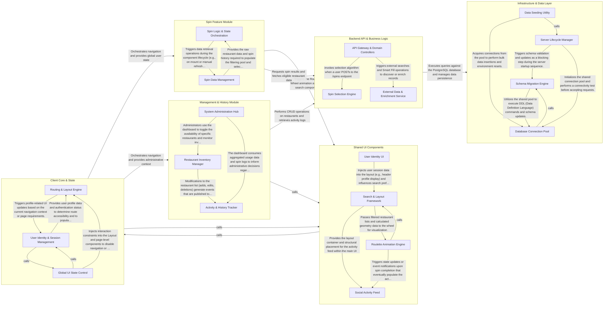

## Details

The `codemate-7-app` follows a classic Client-Server architecture where a React-based frontend interacts with an Express/Node.js backend. The data flow is centered around the "Spin" interaction: the Client Core manages global state and routing, directing users to the Spin Feature Module or Management & History pages. These feature modules utilize a Shared UI Library for complex visualizations (like the Roulette Wheel) and communicate with the Backend API to execute business logic (the spin algorithm) and persist data. The backend relies on an Infrastructure & Data Layer for database connectivity and external service integrations (Google Places).

### Client Core & State

The foundational layer of the frontend, responsible for application routing, global user context, and high-level state management.

- **Routing & Layout Engine** — Manages the high-level navigation structure and the visual shell of the application.
- **User Identity & Session Management** — Responsible for maintaining the global state of the current user, including profile information and session persistence.
- **Global UI State Control** — Manages non-domain global states that affect the interactivity of the application.

### Shared UI Components

A library of reusable presentation components and utility functions, including the core Roulette Wheel visualization and restaurant search interface.

- **Search & Layout Framework** — Provides the structural foundation of the application, including the global layout and the restaurant search interface.
- **Roulette Animation Engine** — Manages the high-fidelity roulette wheel visualization.
- **User Identity UI** — Handles the interactive elements for user identification and session management.
- **Social Activity Feed** — Visualizes the real-time social aspect of the application.

### Spin Feature Module

Encapsulates the primary interactive logic of the application, handling restaurant filtering, spin execution, and the orchestration of the "Spin" lifecycle.

- **Spin Logic & State Orchestration** — This component manages the core business logic of the spin feature, including the reactive filtering of restaurants and the orchestration of the spin execution lifecycle.
- **Spin Data Management** — This component encapsulates the data-fetching layer of the Spin module.

### Management & History Module

Handles secondary application features including restaurant CRUD operations, administrative dashboards, and historical data views like the Activity Feed and Spin Log.

- **Restaurant Inventory Manager** — Responsible for the lifecycle management of the restaurant database, providing interfaces for manual entry, search-based selection, and metadata enrichment (tagging and rating).
- **System Administration Hub** — Acts as the central control point for system-wide configurations, user permission management, and the enforcement of operational constraints like spin limits.
- **Activity & History Tracker** — Aggregates and transforms raw system logs into human-readable chronological feeds and specialized logs, providing transparency into user actions and spin results.

### Backend API & Business Logic

The server-side core containing RESTful endpoints, the proprietary spin selection algorithm, and integrations with external APIs like Google Places.

- **API Gateway & Domain Controllers** — Acts as the primary entry point for the backend, exposing RESTful endpoints that map HTTP verbs to domain-specific operations.
- **Spin Selection Engine** — Encapsulates the proprietary business logic that defines the application's unique value proposition.
- **External Data & Enrichment Service** — Manages interactions with the Google Places API and handles data processing to maintain a clean local database, including geocoding, "Smart Fill" searches, and deduplication.

### Infrastructure & Data Layer

Manages the server lifecycle, database connection pooling, schema migrations, and environment-specific seeding scripts.

- **Server Lifecycle Manager** — Orchestrates the application boot sequence, configuring Express middleware, static asset serving, and coordinating the initialization of other infrastructure components.
- **Database Connection Pool** — Encapsulates the pg library's pooling logic to provide efficient, shared access to the PostgreSQL database while managing connection health and SSL configurations.
- **Schema Migration Engine** — Responsible for applying the base SQL schema and incremental updates (migrations) to ensure the database structure remains consistent with the application code.
- **Data Seeding Utility** — Provides standalone scripts and maintenance routines for populating the database with test scenarios and performing data cleanup during development and testing.

