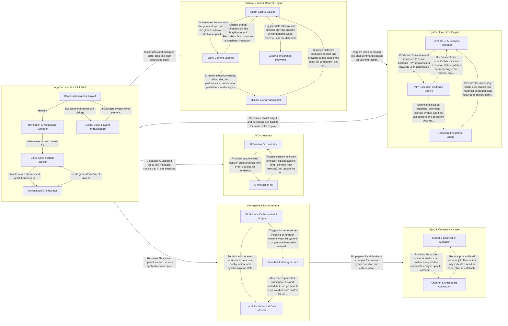

## Details

The desktop application follows a local-first, block-based architecture where the App Orchestrator & UI Shell serves as the central coordinator for state and navigation. Users interact with the Runbook Editor & Content Engine to compose and execute workflows, which are processed by the System Execution Engine for local shell tasks or the AI Orchestrator for intelligent assistance. Data is managed by the Workspace & Data Manager, which handles local persistence and file system watching, while the Sync & Connectivity Layer ensures real-time collaboration and state synchronization with remote services via Phoenix channels. This structure separates high-level UI management from low-level system execution and network synchronization, ensuring a responsive and secure developer environment.

### App Orchestrator & UI Shell

The central hub of the application that manages the global state, windowing system, and navigation lifecycle. It coordinates between the UI, the AI assistant, and the execution engine while handling tab management and modal dialogs.

- **Root Orchestrator & Layout** — Primary entry point and layout coordinator.
- **Navigation & Workspace Manager** — Manages the hierarchical organization, workspace tree, and multi-tab interface.
- **Editor Shell & Block Registry** — Primary content container that manages the rendering of the block-based editor, coordinating block types and execution outputs.
- **AI Assistant Orchestrator** — Coordinates AI integration, managing the AI chat assistant state and inline generation hooks within the editor.
- **Global State & Event Infrastructure** — Provides low-level communication and state management, including the event bus and centralized dialog management.

### Runbook Editor & Content Engine

Manages the interactive block-based editor and rich content previews. It handles the granular state of different block types (HTTP, SQL, Script) and provides the UI for historical data and external integrations like GitHub/GitLab.

- **Editor Core & Layout** — Manages the foundational framework of the interactive editor, including the high-level state transitions, layout constraints, and generic execution triggers.
- **Block Content Engines** — Handles the complex internal logic and specialized UI requirements for specific block types.
- **External Integration Previews** — Provides a standardized mechanism for fetching and rendering rich metadata from external Git providers.
- **History & Analytics Engine** — Processes and visualizes post-execution data.

### Workspace & Data Manager

Responsible for the hierarchical organization of runbooks and folders. It manages local file system interactions, full-text search indexing, and data persistence to the local SQLite/KV stores.

- **Workspace Orchestration & Lifecycle** — Central controller for workspace operations, managing active state, file system watching via Tauri IPC, and synchronization strategies.
- **Local Persistence & Data Models** — Foundational storage layer using an Active Record pattern over SQLite for workspace metadata and application settings.
- **Search & Indexing Service** — Provides high-performance full-text search for runbooks using an in-memory index updated reactively.

### System Execution Engine

Handles the low-level execution of shell commands and the rendering of terminal outputs. It manages PTY (Pseudo-Terminal) instances and streams execution logs back to the UI via a document bridge.

- **Terminal UI & Lifecycle Manager** — Manages the visual terminal interface and its React lifecycle.
- **PTY Execution & Stream Engine** — Acts as the core execution controller, managing the global registry of PTY instances.
- **Document Integration Bridge** — Facilitates the synchronization of execution data with the application's local-first data layer.

### AI Orchestrator

Encapsulates the logic for AI session management and event streaming. It provides a dedicated interface for developer productivity tools, managing conversation history and real-time AI output.

- **AI Session Orchestrator** — Acts as the central controller for the subsystem, managing the initialization of the AI environment and the reactive synchronization of session data.
- **AI Interaction UI** — Responsible for the presentation layer of the AI experience.

### Sync & Connectivity Layer

Manages the low-level networking and socket management required for real-time collaboration. It handles Phoenix channel connections and ensures local-first data is synchronized with the Atuin Hub.

- **Socket & Connection Manager** — Manages the physical WebSocket connection and its lifecycle.
- **Channel & Messaging Abstraction** — Provides a high-level abstraction over Phoenix Channels, converting the standard callback-driven messaging into a modern async/await pattern.

