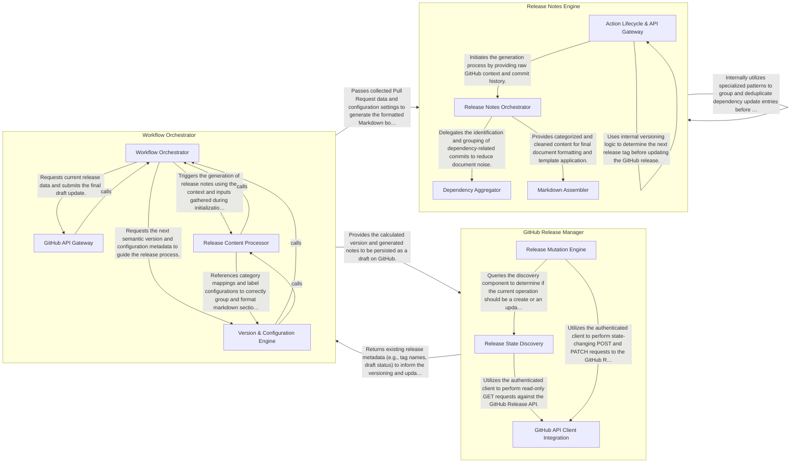

## Details

The `draft-release` GitHub Action follows a structured pipeline pattern designed to automate the maintenance of release drafts. The process begins with the Workflow Orchestrator, which ingests GitHub event data and configuration to establish the execution context and determine versioning logic. It then delegates the transformation of repository history (Pull Requests and commits) to the Release Notes Engine, which applies complex grouping and formatting rules. Finally, the GitHub Release Manager interfaces with the GitHub API to reconcile the generated content with the existing repository state, either creating a new draft or updating an existing one to ensure the release notes are always up-to-date before a manual publish.

### Workflow Orchestrator

Acts as the central entry point and controller for the action. It parses inputs, fetches the execution context (repo, owner, event details), and calculates the version increment based on labels or configuration.

- **Workflow Orchestrator** — Acts as the central controller and entry point.
- **Version & Configuration Engine** — Responsible for interpreting the repository's configuration (YAML) and applying semantic versioning logic.
- **Release Content Processor** — A complex engine dedicated to generating and formatting the release body.
- **GitHub API Gateway** — Encapsulates all external communication with GitHub's REST and GraphQL APIs.

### Release Notes Engine

The core logic engine responsible for transforming raw GitHub data into structured Markdown. it handles the grouping of dependency updates (e.g., from Dependabot), strips conventional commit prefixes, and applies Handlebars templates to generate the final release body.

- **Action Lifecycle & API Gateway** — Acts as the external boundary of the subsystem, managing the execution lifecycle of the GitHub Action.
- **Release Notes Orchestrator** — The central logic hub responsible for coordinating the transformation of raw commit data into categorized release sections.
- **Dependency Aggregator** — A specialized logic engine that processes automated dependency updates (primarily from Dependabot).
- **Markdown Assembler** — Manages the physical structure and assembly of the final Markdown document.

### GitHub Release Manager

Manages the stateful interactions with the GitHub REST/GraphQL APIs. It identifies the current "latest" release versus the "draft" release and performs the actual mutations (create/update) on the repository's release resources.

- **Release State Discovery** — Responsible for querying the GitHub API to determine the current state of releases within the repository.
- **Release Mutation Engine** — Handles the actual creation and modification of release resources on GitHub.
- **GitHub API Client Integration** — The low-level infrastructure layer that manages the @actions/github Octokit client.

