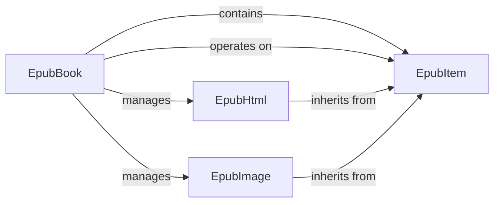

## Details

The ebooklib project's core subsystem for EPUB book representation revolves around the EpubBook component, which acts as the central aggregate for managing all EPUB content. This content is abstracted by the EpubItem base class, providing a unified interface for various media types. Concrete implementations like EpubHtml and EpubImage extend EpubItem to handle specific content types, encapsulating their unique properties and content. EpubBook orchestrates the addition, retrieval, and manipulation of these EpubItem instances, maintaining the structural integrity of the EPUB, including its spine, guide, and table of contents.

### EpubBook
The central aggregate root representing the entire EPUB book in memory. It manages the collection of EpubItem objects, stores EPUB metadata (e.g., title, author, language), and maintains the structural order (spine, guide, table of contents). It provides methods for adding, retrieving, and manipulating these elements.

**Related Classes/Methods**:

- <a href="https://github.com/aerkalov/ebooklib/blob/master/ebooklib/epub.py#L568-L880" target="_blank" rel="noopener noreferrer">`ebooklib.epub.EpubBook`:568-880</a>

### EpubItem
An abstract base class defining the common interface and properties (e.g., uid, file_name, media_type, content) for all types of content within an EPUB. It serves as the foundational contract for concrete content types like HTML pages, images, or stylesheets.

**Related Classes/Methods**:

- <a href="https://github.com/aerkalov/ebooklib/blob/master/ebooklib/epub.py#L118-L213" target="_blank" rel="noopener noreferrer">`ebooklib.epub.EpubItem`:118-213</a>

### EpubHtml
A concrete implementation of EpubItem specifically representing an HTML content document within the EPUB. It encapsulates the actual HTML content and properties relevant to HTML documents, such as whether it's a chapter or a navigation document.

**Related Classes/Methods**:

- <a href="https://github.com/aerkalov/ebooklib/blob/master/ebooklib/epub.py#L243-L464" target="_blank" rel="noopener noreferrer">`ebooklib.epub.EpubHtml`:243-464</a>

### EpubImage
A concrete implementation of EpubItem representing an image file within the EPUB. It holds the binary image content and properties specific to image files, such as their media type.

**Related Classes/Methods**:

- <a href="https://github.com/aerkalov/ebooklib/blob/master/ebooklib/epub.py#L538-L551" target="_blank" rel="noopener noreferrer">`ebooklib.epub.EpubImage`:538-551</a>

### [FAQ](https://github.com/CodeBoarding/GeneratedOnBoardings/tree/main?tab=readme-ov-file#faq)