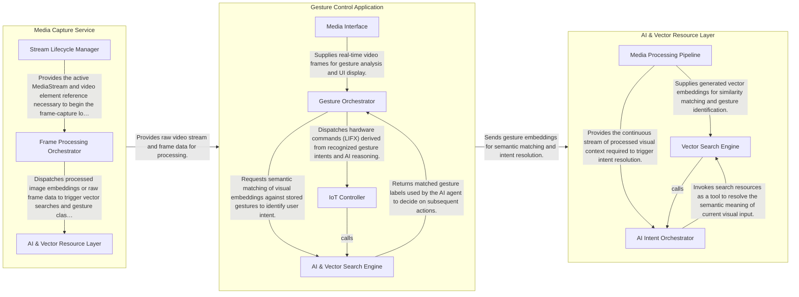

## Details

This architecture represents a reactive, data-centric system where a React-based orchestration layer coordinates real-time video capture, vector-based gesture recognition, and LLM-driven intent analysis. The flow begins with the Media Capture Service providing raw video frames to the Gesture Control Application. This central hub generates embeddings and queries the AI & Vector Resource Layer (powered by HarperDB and Gemini) to perform semantic matching. Once a gesture is identified and its intent is validated, the application triggers hardware actions via the LIFX IoT API, completing the loop from physical movement to smart home control.

### AI & Vector Resource Layer

The intelligence backbone of the system, responsible for deterministic vector matching and probabilistic intent reasoning. It leverages HarperDB's custom resources to perform similarity searches on gesture embeddings and interfaces with the Gemini API to resolve high-level user intents.

- **Vector Search Engine** — Implements deterministic matching logic within HarperDB, managing custom resources for vector similarity searches and semantic caching.
- **AI Intent Orchestrator** — The reasoning hub that manages the Gemini API's function-calling lifecycle, defining tools and coordinating probabilistic decision-making.
- **Media Processing Pipeline** — Responsible for high-frequency data acquisition, webcam lifecycle management, and using MediaPipe to transform video frames into embeddings.

### Gesture Control Application

The primary orchestration layer and user interface. It manages the application lifecycle, switching between Training (data collection) and Live (inference) modes. It coordinates the transformation of video frames into embeddings and executes IoT commands (LIFX) based on the results returned from the AI layer.

- **Media Interface** — Manages the hardware interface for video capture and the lifecycle of the webcam stream.
- **Gesture Orchestrator** — The primary UI and logic layer that coordinates the application's lifecycle.
- **AI & Vector Search Engine** — Handles the semantic matching logic and the interface with HarperDB.
- **IoT Controller** — Executes physical actions in the smart home environment.

### Media Capture Service

A specialized utility layer that abstracts the browser's MediaDevices API. It handles webcam initialization, stream management, and provides the continuous frame-capture loop required for real-time gesture recognition.

- **Stream Lifecycle Manager** — Manages the initialization, permission requests, and teardown of the browser's MediaDevices stream.
- **Frame Processing Orchestrator** — Implements the continuous requestAnimationFrame loop required for real-time interaction.
- **AI & Vector Resource Layer** — Provides the abstraction for external AI services and the HarperDB vector store.

