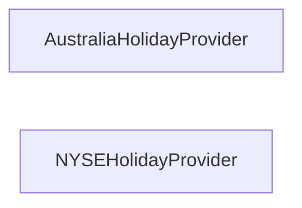

## Details

One paragraph explaining the functionality which is represented by this graph. What the main flow is and what is its purpose.

### AustraliaHolidayProvider
Provides holiday information for Australia.

**Related Classes/Methods**:

- <a href="https://github.com/vacanza/holidays/blob/dev/holidays/countries/australia.py#L28-L968" target="_blank" rel="noopener noreferrer">`holidays.countries.australia.Australia`:28-968</a>

### NYSEHolidayProvider
Provides holiday information for NYSE.

**Related Classes/Methods**:

### [FAQ](https://github.com/CodeBoarding/GeneratedOnBoardings/tree/main?tab=readme-ov-file#faq)