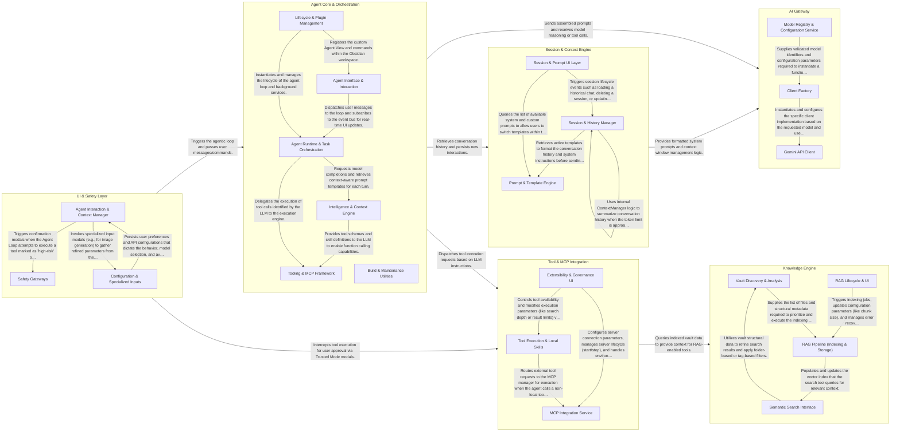

## Details

The obsidian-gemini architecture is built around a central Agentic Loop that orchestrates interactions between the user's local Obsidian vault and the Google Gemini AI. The flow begins in the UI & Safety Layer, where user inputs are captured and routed to the Agent Core. The Core manages the lifecycle of an "Agent Loop," coordinating with the Session & Context Engine to assemble conversation history and system prompts. These are sent via the AI Gateway to the LLM. When the model returns tool calls, the Tool & MCP Integration executes the requested actions—often querying the Knowledge Engine for RAG-based vault data—while the Safety Gates ensure that sensitive operations (like file deletions) are intercepted for user approval before completion.

### Agent Core & Orchestration

The central engine of the plugin that manages the lifecycle of agent instances and background tasks. It coordinates the flow of data between the LLM, the user interface, and the tool execution environment.

- **Agent Runtime & Task Orchestration** — The primary execution engine that drives the agentic loop and manages asynchronous background operations.
- **Lifecycle & Plugin Management** — Handles the initialization of the plugin within Obsidian and the creation/persistence of agent instances and chat sessions.
- **Intelligence & Context Engine** — Manages the "brain" of the agent, including LLM communication, prompt templating, and the RAG (Retrieval-Augmented Generation) infrastructure that indexes the vault for semantic search.
- **Tooling & MCP Framework** — Provides the "hands" of the agent, allowing it to interact with the local vault, the web, and external services via the Model Context Protocol (MCP).
- **Agent Interface & Interaction** — Orchestrates the user-facing components, translating user messages into loop triggers and rendering the agent's streaming responses and tool outputs.
- **Build & Maintenance Utilities** — Supporting infrastructure for model updates, build processes, and documentation management that ensures the plugin remains up-to-date with the Gemini API.

### Session & Context Engine

Manages the persistence of chat sessions, conversation history, and the assembly of context. It uses templates to format system instructions and user prompts for the LLM.

- **Session & History Manager** — Manages the persistence, retrieval, and optimization of chat sessions.
- **Prompt & Template Engine** — Handles the discovery, parsing, and management of prompt templates.
- **Session & Prompt UI Layer** — Provides the user interface components for interacting with the session and prompt systems.

### Knowledge Engine

Provides Retrieval-Augmented Generation (RAG) capabilities by indexing the Obsidian vault and performing semantic searches to ground the AI's responses in local data.

- **Vault Discovery & Analysis** — Responsible for the structural and semantic mapping of the Obsidian vault.
- **RAG Pipeline (Indexing & Storage)** — The core "write" engine of the subsystem.
- **Semantic Search Interface** — The "read" interface that exposes RAG capabilities to the Agent Loop.
- **RAG Lifecycle & UI** — Manages the user-facing aspects of the Knowledge Engine, including configuration settings, indexing progress visualization, and manual maintenance tasks like index cleanup or resumption.

### Tool & MCP Integration

The extensibility layer that allows the agent to perform actions. It manages local "Skills" (like file CRUD) and external tools via the Model Context Protocol (MCP).

- **Tool Execution & Local Skills** — The core execution engine and the library of built-in capabilities.
- **MCP Integration Service** — The bridge to external tool providers via the Model Context Protocol (MCP).
- **Extensibility & Governance UI** — The user-facing management layer for tools and MCP servers.

### AI Gateway

The technical interface to the Google Gemini API. It handles model configuration, request/response parsing, and manages the available model list.

- **Model Registry & Configuration Service** — Manages the catalog of available Gemini models and ensures their operational parameters are valid.
- **Client Factory** — Implements the Factory pattern to abstract the creation of Gemini clients.
- **Gemini API Client** — The technical implementation of the Gemini API interface.

### UI & Safety Layer

The user-facing component of the plugin, including chat views and settings. It incorporates "Safety Gates" that require human-in-the-loop confirmation for high-risk agent actions.

- **Agent Interaction & Context Manager** — The core user interface for the plugin, responsible for rendering the chat view, managing session history, and visualizing the context (files, images, and mentions) that the agent is currently processing.
- **Safety Gateways** — Implements the "Human-in-the-loop" pattern by intercepting high-risk agent actions.
- **Configuration & Specialized Inputs** — Manages the administrative and task-specific UI elements.

