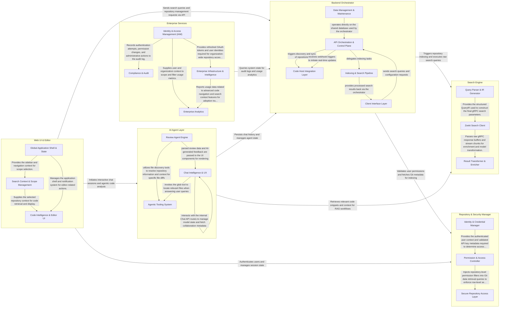

## Details

Sourcebot is a high-performance code search and intelligence platform where the Web UI & Editor serves as the entry point for user interaction, sending requests to the Backend Orchestrator. The Backend Orchestrator manages indexing and security by coordinating with the Search Engine for retrieval and the Repository & Security Manager for access control. The AI Agent Layer integrates with both the Search Engine for RAG-based context and the Backend Orchestrator for state persistence, while Enterprise Services provide additional auditing and analytics capabilities.

### Backend Orchestrator

The central server-side hub responsible for API orchestration, background job management, and system-wide utilities. It coordinates repository indexing and manages the lifecycle of connections to external code hosts.

- **API Orchestration & Control Plane** — The central management layer that coordinates all backend activities, handles server lifecycle, manages background worker stability, and provides the primary entry point for system-wide operations.
- **Code Host Integration Layer** — Implements the Adapter Pattern to interface with various version control systems, handling repository discovery, permission syncing, and filtering.
- **Indexing & Search Pipeline** — The data transformation engine that converts raw Git repository data into searchable Zoekt indices and provides query parsing logic.
- **Data Management & Maintenance** — Provides administrative utilities and maintenance scripts for the underlying PostgreSQL database, including migrations and data deduplication.
- **Client Interface Layer** — The "Northbound" consumer surface consisting of Next.js application routes and React components that translate user actions into API calls.

### Search Engine

The high-performance indexing and retrieval core. It interfaces with Zoekt via gRPC to execute complex regex searches and transforms raw search results into structured application models.

- **Query Parser & IR Generator** — Responsible for the lexical analysis and syntactic parsing of search queries.
- **Zoekt Search Client** — Manages the low-level gRPC lifecycle and protocol translation.
- **Result Transformer & Enricher** — Performs post-processing on raw search hits.

### AI Agent Layer

Powers the platform's intelligence features, including RAG-based chat, automated code reviews, and agentic tool use. it manages LLM provider selection and context window optimization.

- **Review Agent Engine** — Responsible for the ingestion and transformation of version control data into AI-ready context.
- **Agentic Tooling System** — Provides the "hands" for the AI agents, allowing them to interact with the codebase programmatically.
- **Chat Intelligence & UX** — Manages the end-to-end chat experience, including model selection, RAG source visualization, and collaborative metadata.

### Repository & Security Manager

Manages the security perimeter and data access layer. It handles user authentication, API key lifecycles, and enforces repository-level permissions at the database query level.

- **Identity & Credential Manager** — Manages the lifecycle of user identities and programmatic access credentials.
- **Permission & Access Controller** — The core logic engine responsible for enforcing the security perimeter.
- **Secure Repository Access Layer** — Provides the data access interface for Git repository structures.

### Web UI & Editor

The primary user interface, featuring a sophisticated code editor with syntax highlighting, navigation tools, and a global application shell for notifications and onboarding.

- **Global Application Shell & State** — Manages the persistent UI framework, including the global application shell, navigation sidebar, and cross-cutting state like notifications and user identity.
- **Search Context & Scope Management** — Handles the selection and management of search scopes (repositories and context) within the chat interface, allowing users to filter the AI's retrieval context.
- **Code Intelligence & Editor UI** — Implements the sophisticated code editor features, including code block rendering, syntax highlighting, code folding, and navigation through referenced source files.

### Enterprise Services

Provides specialized features for enterprise deployments, including usage analytics, audit logging, and license management.

- **Enterprise Analytics** — Aggregates and visualizes platform usage metrics, enabling administrators to monitor active users, search volume, and AI chat engagement across various interfaces.
- **Compliance & Audit** — Manages the recording and lifecycle of security-relevant events, providing an auditable history of user actions and automated log retention enforcement.
- **Identity & Access Management (IAM)** — Handles enterprise-grade authentication (SSO) and ensures that user repository permissions are continuously synchronized with external identity and code providers.
- **Enterprise Infrastructure & Intelligence** — Manages organization-wide integrations like GitHub Apps and provides advanced code intelligence features such as symbol-based exploration and search context synchronization.

