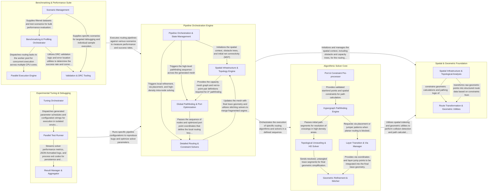

## Details

The `tscircuit-autorouter` architecture is organized as a multi-stage pipeline that transforms high-level routing requirements into precise geometric traces. The system centers on a Pipeline Orchestration Engine that sequences specialized Algorithmic Solvers (handling pathing, via placement, and density) while leveraging a Spatial & Geometric Foundation for efficient collision detection and mathematical utilities. This core logic is supported by a Benchmarking & Performance Suite for regression testing and an Experimental Tuning & Debugging layer for resolving complex edge cases and optimizing solver parameters.

### Pipeline Orchestration Engine

The central entry point and management layer that defines and executes routing pipelines. It handles input validation, initializes global state, and sequences the execution of specialized solvers.

- **Pipeline Orchestration & State Management** — The central control layer that receives routing requests, validates inputs, and sequences the execution of various solvers.
- **Spatial Infrastructure & Topology Engine** — Responsible for the physical-to-logical mapping of the PCB.
- **Global Pathfinding & Port Optimization** — Determines the high-level routes for nets across the capacity mesh.
- **Detailed Routing & Constraint Solvers** — Executes the final, detailed routing within individual capacity nodes, particularly in high-density areas.

### Algorithmic Solver Core

A collection of specialized solvers that implement deep routing logic, including capacity-based pathing, high-density trace generation, and jumper/via placement strategies.

- **Port & Constraint Pre-processor** — Manages the spatial distribution of ports and handles "cramped" scenarios where port placement is highly restricted, ensuring uniform entry/exit points for the pathfinder.
- **Hypergraph Pathfinding Engine** — The primary engine for determining signal movement across the PCB mesh using hypergraph abstractions and capacity-based pathing logic.
- **Topological Unraveling & HD Solver** — Resolves complex intersections and trace crossings in high-density routing corridors by breaking problems into sections and untangling them.
- **Layer Transition & Via Manager** — Evaluates and places vias or jumper patterns to facilitate transitions between different PCB layers or to bypass obstacles.
- **Geometric Refinement & Stitcher** — Consolidates route fragments and simplifies jagged algorithmic paths into geometrically valid 45-degree PCB traces.

### Spatial & Geometric Foundation

Provides the mathematical and spatial infrastructure for the router. It manages obstacle detection via spatial trees and provides geometric utilities for 45-degree pathing and intersection checks.

- **Spatial Infrastructure & Topological Analysis** — Manages spatial indexing and the analysis of geometric relationships between segments and nodes.
- **Route Transformation & Geometric Utilities** — Provides geometric utility functions for path construction and handles the conversion of internal route representations.

### Benchmarking & Performance Suite

Infrastructure for performance testing and validation. It includes worker pools for parallel execution of routing scenarios and tools for measuring DRC success and execution time.

- **Parallel Execution Engine** — Manages the lifecycle of worker processes for high-density routing tasks.
- **Benchmarking & Profiling Orchestrator** — Coordinates large-scale test runs and fine-grained performance analysis.
- **Scenario Management** — Responsible for loading, filtering, and sorting PCB routing datasets (scenarios).
- **Validation & DRC Tooling** — Executes individual routing samples and performs Design Rule Checks (DRC) to ensure geometric validity.

### Experimental Tuning & Debugging

Specialized tools for investigating specific bug reports and fine-tuning solver parameters. It performs parameter sweeps and focused searches to optimize routing schedules for difficult cases.

- **Tuning Orchestrator** — Defines the experimental search space and generates combinatorial parameter schedules.
- **Parallel Test Runner** — Manages the lifecycle of individual solver tests executed in isolated child processes.
- **Result Manager & Aggregator** — Responsible for collecting, sorting, and persisting the results of experimental runs.

