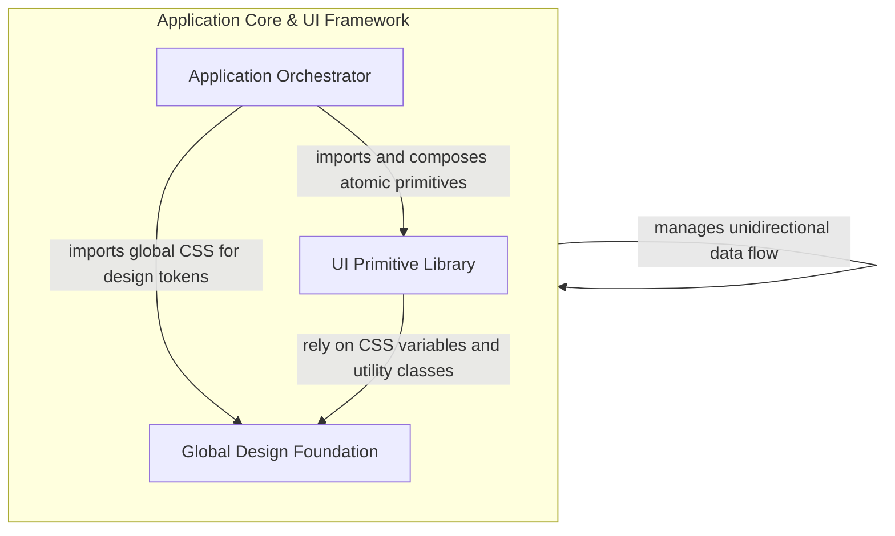

## Details

The application architecture is consolidated into a unified core that manages both the execution context and the UI framework. This central component orchestrates the boot process, root React component tree, and UI primitives, ensuring a cohesive data flow from initialization to rendering while managing top-level state and design system integration.

### Application Core & UI Framework

This central component serves as the primary orchestrator for the entire application. It encompasses the initial boot process (Vite entry), the root React component tree, and the integrated UI primitive system. It is responsible for managing top-level state, handling core user interactions, and applying the global design system tokens. By merging the entry logic with the UI foundation, it ensures a cohesive data flow from initialization to rendering.

- **Application Orchestrator** — Manages the application lifecycle and root-level logic.
- **UI Primitive Library** — Provides a set of reusable, accessible, and themeable atomic components built on Radix UI.
- **Global Design Foundation** — Defines the global visual language of the application, including Tailwind CSS v4 configuration, CSS variables, and base design tokens.

