```mermaid
graph LR
  subgraph 1["Orchestration & Interface"]
    1__1_1["Engine Facade & Management"]
    1__1_2["Interactive Developer Interface"]
    1__1_3["Compilation & Validation Pipeline"]
    1__1_4["VM Execution & Runtime"]
    1__1_5["Diagnostics & Error Handling"]
    1__1_2 -->|"sends user-entered code strings to the Engine's Eval method for processing"| 1__1_1
    1__1_1 -->|"coordinates the transformation of source code into bytecode by invoking the syntax compiler and val…"| 1__1_3
    1__1_1 -->|"initializes the VM context and triggers the execution of compiled bytecode"| 1__1_4
    1__1_3 -->|"produces bytecode and constant pools that are directly consumed by the VM during execution"| 1__1_4
    1__1_4 -->|"captures execution state and generates detailed error objects when runtime exceptions occur"| 1__1_5
    1__1_2 -->|"uses diagnostic tools to format stack traces and display error locations to the user"| 1__1_5
    1__1_1 -->|"wraps internal failures into structured CompilationError or RuntimeError types for the caller"| 1__1_5
  end
  subgraph 2["Compiler Frontend"]
    2__2_1["Lexical & Syntax Foundation"]
    2__2_2["Macro Expansion Engine"]
    2__2_3["Semantic Validator & AST Builder"]
    2__2_1 -->|"Provides the initial hygienic syntax tree (SyntaxObjects) that the expansion engine traverses and t…"| 2__2_2
    2__2_2 -->|"Passes the fully expanded syntax tree for final semantic checks and conversion into the validated I…"| 2__2_3
  end
  subgraph 3["Virtual Machine (VM)"]
    3__3_1["Instruction Set (ISA)"]
    3__3_2["Execution Engine & Optimizer"]
    3__3_3["Execution Stack & Resource Management"]
    3__3_4["Control Flow & Continuations"]
    3__3_5["Runtime Context & Telemetry"]
    3__3_2 -->|"Dispatches optimized bytecode instructions to their respective implementation logic during the exec…"| 3__3_1
    3__3_2 -->|"Updates execution statistics and records call histograms as instructions are processed."| 3__3_5
    3__3_1 -->|"Consumes arguments from and pushes results onto the operand stack during instruction execution."| 3__3_3
    3__3_1 -->|"Triggers the capture of continuations or the execution of 'before/after' guards during non-linear c…"| 3__3_4
    3__3_3 -->|"Provides the primary data workspace and pooled objects required for the `MachineContext` to run eff…"| 3__3_2
    3__3_4 -->|"Saves and restores segments of the operand stack when capturing or reinstating delimited continuati…"| 3__3_3
  end
  subgraph 4["Runtime & Values"]
    4__4_1["Value Model & Structured Data"]
    4__4_2["Concurrency & Synchronization"]
    4__4_3["I/O & Host Integration"]
    4__4_1 -->|"protects data objects passed between threads"| 4__4_2
    4__4_1 -->|"provides fundamental data types for serialization"| 4__4_3
    4__4_2 -->|"provides locking and thread-state management for I/O safety"| 4__4_3
    4__4_3 -->|"produces new Value instances and wraps host-native objects"| 4__4_1
  end
  subgraph 5["Registry & Environment"]
    5__5_1["Environment & Scoping"]
    5__5_2["Registry Definition & Assembly"]
    5__5_3["Registry Application & Binding"]
    5__5_4["Security Policy & Authorization"]
    5__5_2 -->|"Supplies the collection of extensions and primitives to be materialized into the engine."| 5__5_3
    5__5_3 -->|"Materializes registry contents into symbol bindings and value slots within the environment frames."| 5__5_1
    5__5_4 -->|"Filters and selects the set of extensions allowed for a specific execution profile."| 5__5_2
    5__5_4 -->|"Provides authorization constraints and authorizers that govern the registration and runtime behavio…"| 5__5_3
  end
  1 -->|"Passes raw source code or REPL input for parsing and macro expansion."| 2
  1 -->|"Configures the engine by registering extensions, profiles, and global bindings."| 5
  2 -->|"Provides validated syntax objects or bytecode for execution."| 3
  3 -->|"Performs symbol lookups in the current environment and invokes registered primitives or extensions."| 5
  3 -->|"Manipulates stack values, creates new runtime objects, and manages Go-native concurrency."| 4
  5 -->|"Stores and retrieves Scheme values within scoped environment frames."| 4
```

## Details

The wile engine architecture is a modular system that orchestrates the lifecycle of Scheme code from user input through compilation and execution. It begins with an orchestration layer that manages user interaction and engine configuration, passes input to a compiler frontend for transformation into validated bytecode, which is then executed by a stack-based virtual machine that interacts with a runtime system for data management and a registry for environment and scope handling.

### Orchestration & Interface

Acts as the primary entry point and management layer for the engine. It coordinates the interaction between the user (via CLI/REPL) and the internal compilation/execution pipeline, while also providing debugging and documentation tools.

- **Engine Facade & Management** — Acts as the primary entry point for the library.
- **Interactive Developer Interface** — Implements the user-facing interactive environment.
- **Compilation & Validation Pipeline** — Responsible for the "static" phase of the engine.
- **VM Execution & Runtime** — Represents the "dynamic" phase of the engine.
- **Diagnostics & Error Handling** — Provides the infrastructure for error reporting and debugging.

### Compiler Frontend

Transforms raw source code into a structured and validated format. It handles tokenization, maintains hygiene through syntax objects, executes macro transformers, and performs final validation of Scheme forms before they are passed to the VM.

- **Lexical & Syntax Foundation** — Responsible for the initial conversion of raw source code into a structured, hygienic representation.
- **Macro Expansion Engine** — Handles the recursive expansion of Scheme macros.
- **Semantic Validator & AST Builder** — The final stage of the frontend pipeline.

### Virtual Machine (VM)

The core execution engine of wile. It implements a stack-based bytecode interpreter that handles instruction dispatch, stack management, delimited continuations, and dynamic-wind operations.

- **Instruction Set (ISA)** — Defines the complete set of bytecode operations (the "verbs") of the VM.
- **Execution Engine & Optimizer** — The central orchestrator of the VM that manages the instruction pointer and dispatches operations.
- **Execution Stack & Resource Management** — Provides the fundamental data structures for the VM's workspace.
- **Control Flow & Continuations** — Handles non-linear execution paths required by the Scheme language.
- **Runtime Context & Telemetry** — Manages the execution environment's metadata and observability.

### Runtime & Values

Defines the data model and runtime primitives. It bridges Scheme's value system with Go's native capabilities, including support for pairs, strings, records, and advanced concurrency primitives like threads and mutexes.

- **Value Model & Structured Data** — Defines the core data types and memory structures.
- **Concurrency & Synchronization** — Implements the execution context and thread-safety mechanisms.
- **I/O & Host Integration** — Manages communication with the external environment.

### Registry & Environment

Manages the engine's state, symbol bindings, and extensibility. It maintains environment frames for scoping and provides a registry for loading libraries, extensions, and security profiles.

- **Environment & Scoping** — Manages the runtime and compile-time state of the engine, including symbol resolution and memory slots for global and local variables.
- **Registry Definition & Assembly** — Provides the infrastructure for defining new language features, libraries, and foreign functions.
- **Registry Application & Binding** — Responsible for the "activation" of a registry within an engine instance.
- **Security Policy & Authorization** — Enforces security boundaries by controlling which extensions and operations are permitted.

