```mermaid
graph LR
  subgraph 1["Gateway & Control Plane"]
    1__1_1["Configuration & Schema Engine"]
    1__1_2["Gateway Control Plane"]
    1__1_3["Core Orchestrator & Registry"]
    1__1_4["Administrative CLI"]
    1__1_5["Extension Runtime Layer"]
    1__1_6["Infrastructure & Client Services"]
    1__1_1 -->|"Supplies validated and materialized configuration snapshots for system initialization."| 1__1_3
    1__1_3 -->|"Orchestrates the startup of the WebSocket server and provides the runtime context for RPC handlers."| 1__1_2
    1__1_3 -->|"Manages the lifecycle and execution of specific provider adapters based on active configuration."| 1__1_5
    1__1_4 -->|"Persists user-defined settings, model aliases, and authentication tokens to the configuration store."| 1__1_1
    1__1_2 -->|"Triggers runtime configuration mutations and patches via the RPC interface."| 1__1_1
    1__1_6 -->|"Establishes secure WebSocket connections to the control plane for remote orchestration and monitori…"| 1__1_2
  end
  subgraph 2["Agent & Plugin Runtime"]
    2__2_1["Plugin Lifecycle & Capability Engine"]
    2__2_2["ACP Communication & Security Layer"]
    2__2_3["Workflow & Task Manager"]
    2__2_4["Channel & SDK Adapter"]
    2__2_5["Runtime Test Infrastructure"]
    2__2_1 -->|"Provides the initialized plugin instances and capability providers required to fulfill ACP protocol…"| 2__2_2
    2__2_2 -->|"Initiates stateful tasks and workflows in response to agent commands received via the protocol."| 2__2_3
    2__2_3 -->|"Executes specific plugin-defined actions and tools within the context of a managed workflow."| 2__2_1
    2__2_4 -->|"Registers channel-specific plugins into the runtime and utilizes the engine for message routing and…"| 2__2_1
    2__2_1 -->|"Is validated by the test suite to ensure isolation boundaries and capability mappings remain intact."| 2__2_5
  end
  subgraph 3["Multi-Channel Adapters"]
    3__3_1["Core Client Infrastructure"]
    3__3_2["Rich Social Platforms"]
    3__3_3["Voice & Telephony Services"]
    3__3_4["Enterprise & Legacy Messaging"]
    3__3_5["Ecosystem & Local Bridges"]
    3__3_2 -->|"Implements specialized versions of the base messaging clients to support platform-specific rich int…"| 3__3_1
    3__3_3 -->|"Extends the base provider interfaces to integrate real-time audio streams into the unified session …"| 3__3_1
    3__3_4 -->|"Utilizes common normalization utilities and base client patterns for REST and socket-based communic…"| 3__3_1
    3__3_5 -->|"Relies on the core runtime definitions to bridge external RPC/Socket events into the Gateway's expe…"| 3__3_1
    3__3_5 -->|"Shares client logic for handling iMessage-like interactions that mirror social messaging patterns."| 3__3_2
    3__3_3 -->|"Coordinates with social adapters when voice calls are initiated or managed through social platform …"| 3__3_2
  end
  subgraph 4["Persistence & Memory Engine"]
    4__4_1["Session Persistence Manager"]
    4__4_2["RAG Orchestration Engine"]
    4__4_3["Vector Storage Provider (LanceDB)"]
    4__4_1 -->|"Forwards new conversation segments and transcript updates to be chunked and indexed for long-term r…"| 4__4_2
    4__4_2 -->|"Delegates the physical storage of embeddings and executes low-level vector similarity searches agai…"| 4__4_3
  end
  subgraph 5["Tooling & Secure Sandbox"]
    5__5_1["Sandbox Execution Engine (OpenShell)"]
    5__5_2["LLM Provider Adapters"]
    5__5_3["Skill Runtime & Tooling"]
    5__5_4["Skill Governance & Registry"]
    5__5_4 -->|"Filters and provides validated configurations to the runtime, ensuring only authorized tools are ex…"| 5__5_3
    5__5_4 -->|"Supplies tool definitions and schemas to the LLM adapters so they can be included in the model's co…"| 5__5_2
    5__5_3 -->|"Delegates shell-based operations and untrusted code execution to the secure OpenShell environment."| 5__5_1
    5__5_2 -->|"(Indirectly) The LLM adapters receive tool-call requests from the model and trigger the correspondi…"| 5__5_3
  end
  subgraph 6["User Interface & Visualization"]
    6__6_1["Web Interface & Configuration"]
    6__6_2["Terminal Interface & Interaction"]
    6__6_3["Canvas Visualization Host"]
    6__6_1 -->|"Embeds or links to the Canvas server to display interactive artifacts."| 6__6_3
    6__6_2 -->|"Triggers the Canvas host to open browser-based visualizations."| 6__6_3
  end
  subgraph 7["QA & Diagnostic Suite"]
    7__7_1["QA Lab Web Application"]
    7__7_2["Mock Provider Runtime"]
    7__7_3["Debug Proxy Capture"]
    7__7_4["Matrix QA Substrate"]
    7__7_1 -->|"Triggers test scenarios and manages the lifecycle of mock LLM servers."| 7__7_2
    7__7_1 -->|"Queries and visualizes captured traffic logs and API coverage data."| 7__7_3
    7__7_2 -->|"Generates simulated LLM traffic that is intercepted and recorded for verification."| 7__7_3
    7__7_4 -->|"Feeds protocol-specific event data and room states into the diagnostic timeline."| 7__7_1
    7__7_4 -->|"Matrix client interactions are intercepted to ensure protocol compliance during tests."| 7__7_3
  end
  3 -->|"Sends normalized messaging and voice events for routing."| 1
  1 -->|"Orchestrates agent lifecycle and routes incoming events to the appropriate plugin."| 2
  2 -->|"Persists session state and retrieves vector memory for RAG."| 4
  2 -->|"Executes skills and LLM requests in sandboxed environments."| 5
  6 -->|"Connects via WebSocket for real-time interaction and configuration."| 1
  2 -->|"Pushes UI updates and Canvas visualizations to the user."| 6
  7 -->|"Monitors traffic and validates system behavior during development."| 1
```

## Details

OpenClaw is a personal AI assistant framework that operates as a secure gateway between various communication channels (Discord, iMessage, Voice) and stateful AI agents. The system follows a micro-kernel architecture where a central Gateway orchestrates a Plugin Runtime, which in turn manages agents that can use tools and skills within secure sandboxes. Data flows from external adapters through the gateway to agents, which interact with a local-first persistence and memory engine to maintain context across sessions, finally presenting results through a rich Web/TUI interface or interactive Canvas.

### Gateway & Control Plane

The central hub that manages system configuration, orchestrates the WebSocket server, and provides administrative CLI tools. It acts as the primary entry point for all system-wide operations and routing.

- **Configuration & Schema Engine** — Manages the physical lifecycle and structural integrity of the system's configuration.
- **Gateway Control Plane** — The network-facing runtime that implements the communication protocol.
- **Core Orchestrator & Registry** — The central glue of the subsystem that materializes runtime configurations and manages the extension registry.
- **Administrative CLI** — Provides the user-facing management interface for the system.
- **Extension Runtime Layer** — The execution environment for specific integrations.
- **Infrastructure & Client Services** — Provides shared utility services and the client-side implementation for connecting to the Gateway.

### Agent & Plugin Runtime

The execution environment for agents and plugins. It manages the lifecycle of extensions and implements the Agent Control Protocol (ACP) for secure, standardized communication between the gateway and agent entities.

- **Plugin Lifecycle & Capability Engine** — Manages the end-to-end lifecycle of plugins, from discovery and auto-configuration based on model requirements to sandboxed execution using Jiti.
- **ACP Communication & Security Layer** — Implements the Agent Control Protocol (ACP) to facilitate secure, standardized communication.
- **Workflow & Task Manager** — Orchestrates stateful tasks and complex "TaskFlows" within the runtime.
- **Channel & SDK Adapter** — Provides the standardized SDK for plugins to interact with the gateway's communication channels.
- **Runtime Test Infrastructure** — Specialized testing environment for validating runtime behaviors, including simulated typing pulses, lease management, and mock plugin boundaries.

### Multi-Channel Adapters

Normalizes communication from various external platforms (Discord, iMessage, WhatsApp, Voice/SIP) into a unified format for the gateway. It handles both text-based messaging and real-time voice streams.

- **Core Client Infrastructure** — Provides the foundational interfaces, base client classes, and initialization logic for all adapters.
- **Rich Social Platforms** — Manages complex, feature-rich social messaging platforms.
- **Voice & Telephony Services** — Orchestrates real-time audio communication and telephony signaling.
- **Enterprise & Legacy Messaging** — Implements adapters for standardized enterprise chat platforms (Mattermost, Zalo) and legacy protocols (IRC).
- **Ecosystem & Local Bridges** — Bridges the Gateway to specific hardware/OS ecosystems (iMessage via BlueBubbles) or local companion applications (Codex, Browser).

### Persistence & Memory Engine

Manages the stateful aspects of the assistant, including persistent conversation sessions, disk-based history, and local-first vector search (RAG) using LanceDB for long-term memory retrieval.

- **Session Persistence Manager** — Manages the lifecycle of conversation sessions, ensuring atomic persistence of transcripts to the local filesystem and enforcing disk usage policies.
- **RAG Orchestration Engine** — Coordinates the transformation of raw session text into searchable vectors, handles document chunking, manages embedding generation, and executes query expansion.
- **Vector Storage Provider (LanceDB)** — Provides the implementation for the vector database (LanceDB), defining schemas and handling environment-specific configurations.

### Tooling & Secure Sandbox

Provides the functional capabilities (skills) and LLM provider integrations. It ensures secure execution of untrusted code or shell commands through Docker/SSH-based sandboxing (OpenShell).

- **Sandbox Execution Engine (OpenShell)** — Manages the lifecycle of secure, isolated environments using Docker or SSH.
- **LLM Provider Adapters** — Acts as the translation layer between the framework's internal requests and specific LLM providers, such as LM Studio.
- **Skill Runtime & Tooling** — Implements the functional capabilities (skills) available to the agent.
- **Skill Governance & Registry** — The control plane for the tooling subsystem.

### User Interface & Visualization

The presentation layer comprising the Web UI, Terminal UI, and the Canvas visualization system. It allows users to interact with agents and view rich, interactive content rendered by the system.

- **Web Interface & Configuration** — Manages the browser-based user experience, system configuration logic, application lifecycle, and WebSocket connectivity.
- **Terminal Interface & Interaction** — Implements the Terminal User Interface (TUI) for high-performance text rendering, interactive navigation, and agent communication.
- **Canvas Visualization Host** — A specialized server component that hosts web assets and provides real-time hot-reloading for interactive, agent-generated visualizations.

### QA & Diagnostic Suite

A comprehensive set of tools for testing, debugging, and monitoring the framework. Includes the QA Lab, mock servers, and proxy capture for inspecting agent-LLM traffic.

- **QA Lab Web Application** — The browser-based command center for the diagnostic suite.
- **Mock Provider Runtime** — Manages the lifecycle and configuration of simulated AI providers (OpenAI, Anthropic, etc.).
- **Debug Proxy Capture** — A low-level utility that intercepts network traffic at the framework level by patching global fetch and WebSocket implementations.
- **Matrix QA Substrate** — A specialized testing substrate for the Matrix protocol.

