```mermaid
graph LR
  subgraph 1["React UI Kit & State Management"]
    1__1_1["State & Configuration Backbone"]
    1__1_2["Identity & Connection Orchestrator"]
    1__1_3["Reactive API & Action Layer"]
    1__1_4["Cross-Platform Compatibility Layer"]
    1__1_2 -->|"Updates the global store with new signer and account information upon successful authentication."| 1__1_1
    1__1_1 -->|"Provides UI configuration and triggers modal visibility via the UI config store."| 1__1_2
    1__1_3 -->|"Subscribes to account state changes to trigger UI re-renders and dispatches actions to update the s…"| 1__1_1
    1__1_4 -->|"Injects environment-specific listeners and polyfills to ensure the store hydrates and responds to e…"| 1__1_1
    1__1_3 -->|"Hooks trigger specific UI flows or verification steps managed by the Orchestrator."| 1__1_2
  end
  subgraph 2["Authentication & Signer Layer"]
    2__2_1["Signer Interface & Adapters"]
    2__2_2["Authentication Engine & MFA"]
    2__2_3["Session & State Management"]
    2__2_4["Mobile Signer Implementation"]
    2__2_5["Authentication UI Layer"]
    2__2_1 -->|"Delegates authentication requests and cryptographic signing operations to the underlying client."| 2__2_2
    2__2_1 -->|"Queries the current connection status and updates session state upon successful authentication."| 2__2_3
    2__2_2 -->|"Triggers UI components (like Dialogs) to handle user interactions during MFA or OAuth flows."| 2__2_5
    2__2_3 -->|"Coordinates the clearing or refreshing of credentials stored within the client during session trans…"| 2__2_2
    2__2_4 -->|"Implements the core client interfaces using mobile-specific transports and secure storage."| 2__2_2
    2__2_2 -->|"calls"| 2__2_1
    2__2_3 -->|"calls"| 2__2_1
  end
  subgraph 3["Core AA Engine & Middleware"]
    3__3_1["Smart Account Orchestrator"]
    3__3_2["Middleware Execution Stack"]
    3__3_3["Account & Protocol Layer"]
    3__3_4["Bundler & RPC Transport"]
    3__3_5["Signer & Authentication"]
    3__3_6["Application & Compatibility Layer"]
    3__3_1 -->|"invokes the stack to populate UserOperation fields"| 3__3_2
    3__3_1 -->|"requests cryptographic signatures for the generated UserOperation hash"| 3__3_5
    3__3_1 -->|"dispatches the fully formed and signed UserOperation to the network"| 3__3_4
    3__3_1 -->|"queries account-specific state and EntryPoint details"| 3__3_3
    3__3_2 -->|"utilizes the transport layer to perform gas estimation and fee market queries"| 3__3_4
    3__3_6 -->|"consumes the client to trigger transaction flows and manage account state"| 3__3_1
    3__3_3 -->|"uses signers to validate ownership or authorize modular plugin management"| 3__3_5
    3__3_2 -->|"calls"| 3__3_1
    3__3_3 -->|"calls"| 3__3_1
  end
  subgraph 4["Smart Account & Plugin System"]
    4__4_1["Light Account Implementation"]
    4__4_2["Modular Account Core & Management"]
    4__4_3["Validation & Ownership Modules"]
    4__4_4["Session & Permission Logic"]
    4__4_1 -->|"Provides data and initialization logic for upgrade to Modular Account"| 4__4_2
    4__4_2 -->|"Orchestrates installation and delegates signature verification"| 4__4_3
    4__4_2 -->|"Manages lifecycle and enforces execution constraints"| 4__4_4
    4__4_3 -->|"Provides UserOperation signing logic and owner management actions"| 4__4_2
    4__4_4 -->|"Extends execution capabilities via encoded permission checks"| 4__4_2
    4__4_3 -->|"calls"| 4__4_4
  end
  subgraph 5["Integration & Compatibility Adapters"]
    5__5_1["Privy Ecosystem Adapter"]
    5__5_2["EIP-5792 Standard Client"]
    5__5_3["Ethers.js Compatibility Bridge"]
    5__5_1 -->|"utilizes for standardized wallet actions and batch transactions"| 5__5_2
    5__5_3 -->|"provides authentication mechanism to initialize and authorize actions on the client"| 5__5_2
  end
  subgraph 6["Support & Tooling Infrastructure"]
    6__6_1["Plugin Generation Engine"]
    6__6_2["Observability & Logging Framework"]
    6__6_3["Developer Experience & Quality Tooling"]
    6__6_4["Development & Testing Sandbox"]
    6__6_1 -->|"The code generated by the engine is subject to the linting rules and documentation standards enforc…"| 6__6_3
    6__6_2 -->|"Logging plugins and their configurations are documented using the automated reference tools to ensu…"| 6__6_3
    6__6_4 -->|"Sandbox environments utilize the logging framework to provide visibility into authentication and tr…"| 6__6_2
  end
  1 -->|"Initiates user login and retrieves active session signers."| 2
  1 -->|"Dispatches transaction requests and account configuration updates."| 3
  3 -->|"Requests cryptographic signatures for UserOperations during the signing phase of the middleware sta…"| 2
  3 -->|"Queries account-specific data (e.g., initCode, nonce) and executes plugin-specific actions."| 4
  5 -->|"Wraps the core client to provide standardized interfaces (like EIP-5792) for external applications."| 3
  4 -->|"Uses generated plugin wrappers to provide type-safe interactions with on-chain modules."| 6
```

## Details

The aa-sdk architecture follows a layered, middleware-driven approach to Ethereum Account Abstraction (ERC-4337). The data flow typically originates in the React UI Kit, which captures user intent and manages application state. Authentication and identity are delegated to the Authentication & Signer Layer, which provides cryptographic signatures. These components interact with the Core AA Engine & Middleware, the central orchestrator that constructs UserOperations, runs a customizable middleware stack for gas estimation and paymaster sponsorship, and manages the lifecycle of on-chain interactions. The Smart Account & Plugin System defines the specific on-chain logic and modular capabilities of the user's account, while Integration Adapters provide bridges to external standards and third-party libraries.

### React UI Kit & State Management

The entry point for developers, providing declarative React components and hooks to manage account state, authentication flows, and transaction execution.

- **State & Configuration Backbone** — The foundational "Source of Truth" for the subsystem, managing the global Zustand store and providing the React Context for SDK configuration.
- **Identity & Connection Orchestrator** — Manages the visual and logical flow of user onboarding, including multi-step authentication and external wallet discovery.
- **Reactive API & Action Layer** — The primary developer-facing interface providing high-level React hooks and actions for real-time account and transaction management.
- **Cross-Platform Compatibility Layer** — Ensures UI Kit and state management functionality across environments, specifically providing polyfills and mobile-specific screens for React Native.

### Authentication & Signer Layer

Manages user identity and secure signature generation. It supports various authentication methods including Passkeys (WebAuthn), Email/OTP, and social logins, abstracting them into a standard signer interface.

- **Signer Interface & Adapters** — Defines the high-level API for identity and signing, abstracting authentication mechanisms and providing a consistent interface for signing messages and typed data.
- **Authentication Engine & MFA** — Handles communication with authentication providers, including WebAuthn (Passkeys), OAuth, and Email/OTP.
- **Session & State Management** — Manages user authentication state, session persistence (cookies/local storage), and tracks signer status.
- **Mobile Signer Implementation** — Optimized signer architecture for React Native, utilizing native-specific primitives like NativeTEKStamper for secure key management.
- **Authentication UI Layer** — Provides the visual interface for authentication, including MFA prompts and social login popups.

### Core AA Engine & Middleware

The central processing unit of the SDK. it orchestrates the UserOperation lifecycle, including building the operation, executing the middleware stack (gas estimation, paymaster sponsorship), and broadcasting to the bundler.

- **Smart Account Orchestrator** — The central controller that implements the `SmartAccountClient`.
- **Middleware Execution Stack** — A modular pipeline of functions that populate and optimize UserOperation fields.
- **Account & Protocol Layer** — Defines the foundational abstractions for Smart Contract Accounts and their interaction with the EntryPoint.
- **Bundler & RPC Transport** — Handles the low-level communication with ERC-4337 Bundlers and Ethereum nodes.
- **Signer & Authentication** — Provides the cryptographic signing primitives required to authorize UserOperations.
- **Application & Compatibility Layer** — Provides high-level integrations for React/Mobile applications and compatibility adapters for legacy libraries like ethers.js, along with shared SDK utilities and logging.

### Smart Account & Plugin System

Defines the on-chain identity and extensible logic of the smart contract account. It handles account-specific details like address prediction, initialization code, and modular plugin management (e.g., session keys).

- **Light Account Implementation** — Manages the "Light Account" family, which are gas-optimized, non-modular ERC-4337 accounts.
- **Modular Account Core & Management** — The central orchestrator for extensible accounts.
- **Validation & Ownership Modules** — Implements the authorization logic for Modular Accounts.
- **Session & Permission Logic** — A specialized plugin system for managing temporary, scoped access to an account.

### Integration & Compatibility Adapters

Provides interoperability layers for external ecosystems and standards. This includes EIP-5792 wallet actions, adapters for Privy embedded wallets, and compatibility wrappers for Ethers.js.

- **Privy Ecosystem Adapter** — Provides a comprehensive integration layer for the Privy ecosystem, including environment-specific adapters for Web and React Native, and high-level React hooks for transaction execution and DeFi operations like swaps.
- **EIP-5792 Standard Client** — Implements the EIP-5792 specification, providing a specialized Smart Wallet Client decorated with actions for batching calls, managing permissions, and tracking call status.
- **Ethers.js Compatibility Bridge** — Provides a translation layer for Ethers.js, allowing developers to convert Ethers Signers and Wallets into SDK-compatible SmartAccountSigner instances.

### Support & Tooling Infrastructure

Internal utilities and developer tools that support the SDK lifecycle, including code generation for smart contract plugins and observability/logging plugins.

- **Plugin Generation Engine** — This component serves as the primary developer tool for extending the SDK's capabilities.
- **Observability & Logging Framework** — A modular infrastructure for SDK telemetry and debugging.
- **Developer Experience & Quality Tooling** — This component manages the internal health and external clarity of the SDK.
- **Development & Testing Sandbox** — Provides auxiliary services and utilities required for local development and integration testing of complex SDK features.

