```mermaid
graph LR
  subgraph 1["Control Plane & Session Manager"]
    1__1_1["Daemon Control Plane & Security"]
    1__1_2["Session & Side-channel Manager"]
    1__1_3["Frontend & Solver Gateway"]
    1__1_4["Client API Library"]
    1__1_5["Storage & Source Orchestration"]
    1__1_6["Build Output Exporters"]
    1__1_4 -->|"Initiates gRPC build requests and management commands."| 1__1_1
    1__1_1 -->|"Initializes and tracks long-lived sessions for each build request to enable client-side data access."| 1__1_2
    1__1_1 -->|"Dispatches build definitions (LLB) and frontend requests to the solver engine."| 1__1_3
    1__1_3 -->|"Uses established side-channels to dynamically fetch secrets, SSH keys, and local files from the cli…"| 1__1_2
    1__1_3 -->|"Resolves external image/git sources and manages intermediate build snapshots and content."| 1__1_5
    1__1_1 -->|"Triggers the conversion of build results into final artifacts once the solver completes."| 1__1_6
  end
  subgraph 2["Frontend & LLB Translator"]
    2__2_1["Dockerfile Parser & Semantic Analyzer"]
    2__2_2["Dockerfile-to-LLB Translator"]
    2__2_3["Build Context Manager"]
    2__2_4["LLB Graph Builder"]
    2__2_5["LLB Marshaller"]
    2__2_1 -->|"Supplies structured semantic instructions for conversion into the build graph."| 2__2_2
    2__2_2 -->|"Requests resolution of named build stages and external context references into concrete LLB sources."| 2__2_3
    2__2_2 -->|"Invokes the State API to construct the DAG, adding vertices for each build instruction."| 2__2_4
    2__2_4 -->|"Provides the completed, immutable graph structure for serialization into the final binary Definitio…"| 2__2_5
    2__2_2 -->|"Triggers the final serialization process once all instructions have been processed and the graph is…"| 2__2_5
  end
  subgraph 3["Solver Engine"]
    3__3_1["Job Management & API"]
    3__3_2["Execution Scheduler"]
    3__3_3["Cache & Result Manager"]
    3__3_4["LLB Graph & Provenance"]
    3__3_1 -->|"Dispatches build requests and job configurations to the scheduler to initiate graph traversal and o…"| 3__3_2
    3__3_2 -->|"Queries the cache for existing results before executing a vertex and requests the storage of new re…"| 3__3_3
    3__3_2 -->|"Traverses the defined graph structure to determine execution order and records execution metadata f…"| 3__3_4
    3__3_3 -->|"Links stored build results and cache keys to their corresponding LLB vertices and records provenanc…"| 3__3_4
  end
  subgraph 4["Worker & Execution Engine"]
    4__4_1["Worker Orchestrator"]
    4__4_2["Execution Engine"]
    4__4_3["Snapshot Manager"]
    4__4_4["Sandbox Infrastructure"]
    4__4_1 -->|"Delegates the execution of LLB vertices to the specific runtime implementation."| 4__4_2
    4__4_1 -->|"Requests the preparation of filesystem layers and commits changes after execution."| 4__4_3
    4__4_2 -->|"Resolves abstract mount references into OS-level mounts for the container rootfs."| 4__4_3
    4__4_2 -->|"Configures resource limits and network isolation for the spawned build processes."| 4__4_4
  end
  subgraph 5["Source Manager"]
    5__5_1["Source Orchestrator"]
    5__5_2["Git Source Handler"]
    5__5_3["HTTP Source Handler"]
    5__5_4["Local Source Handler"]
    5__5_5["Image Source Handler"]
    5__5_1 -->|"Delegates resolution of git:// and https://*.git URIs to fetch specific repository states."| 5__5_2
    5__5_1 -->|"Dispatches requests for standalone remote files to be downloaded and verified."| 5__5_3
    5__5_1 -->|"Coordinates with the client session to ingest local build contexts into the daemon's snapshotter."| 5__5_4
    5__5_1 -->|"Uses image identifiers to resolve registry references into pullable layer manifests."| 5__5_5
    5__5_2 -->|"Registers itself as the authoritative handler for git-based schemes during initialization."| 5__5_1
    5__5_4 -->|"Provides specialized SourceInstance implementations that bridge client-side file changes with the d…"| 5__5_1
  end
  subgraph 6["Infrastructure Utilities"]
    6__6_1["Execution Coordination & Progress"]
    6__6_2["Remote Resource Access"]
    6__6_3["Protocol & Error Management"]
    6__6_4["Platform & Pattern Utilities"]
    6__6_2 -->|"Deduplicates concurrent fetch requests for the same image layers and attaches progress writers to a…"| 6__6_1
    6__6_1 -->|"Propagates task status updates and execution errors through the gRPC communication layer using stru…"| 6__6_3
    6__6_2 -->|"Maps registry-specific authentication failures and network timeouts to standardized gRPC status cod…"| 6__6_3
  end
  1 -->|"Routes incoming build requests to the appropriate frontend for translation."| 2
  2 -->|"Submits the generated LLB graph for dependency resolution and execution."| 3
  3 -->|"Requests external dependencies (images, git repos) to provide initial filesystem state."| 5
  3 -->|"Schedules and dispatches individual LLB vertices for execution."| 4
  4 -->|"Accesses the session side-channel to pull local files or secrets from the client during execution."| 1
  1 -->|"Monitors build progress and manages job cancellation."| 3
```

## Details

BuildKit is a high-performance build engine that operates as a client-server system, translating high-level build definitions (like Dockerfiles) into a Low-Level Builder (LLB) directed acyclic graph (DAG). The Solver engine orchestrates the execution of this graph by resolving dependencies, managing a content-addressable cache, and delegating process execution to Workers. Workers utilize snapshotters and executors (such as runc) to run build steps in isolated environments, while a Session manager facilitates real-time data synchronization for local files and secrets between the client and the daemon.

### Control Plane & Session Manager

Acts as the primary entry point for the BuildKit daemon, managing gRPC communication and long-lived sessions with clients. It handles request routing and establishes side-channels for synchronizing local files, secrets, and SSH agents from the client's environment.

- **Daemon Control Plane & Security** — The primary entry point for the daemon, responsible for process lifecycle, gRPC service implementation, and security policy enforcement.
- **Session & Side-channel Manager** — Manages long-lived, bidirectional sessions between the client and daemon.
- **Frontend & Solver Gateway** — Acts as the bridge between the high-level build definitions (like Dockerfiles) and the Low-Level Builder (LLB) solver.
- **Client API Library** — The client-side orchestration library used by buildctl and other integrations.
- **Storage & Source Orchestration** — Manages the underlying content-addressable storage, snapshotters, and source resolvers (Git, HTTP, OCI).
- **Build Output Exporters** — Handles the final stage of the build process by converting the resulting rootfs and metadata into standardized formats such as OCI images, local directories, or tarballs.

### Frontend & LLB Translator

Responsible for converting high-level build descriptions (e.g., Dockerfiles) into the LLB intermediate representation. It provides the logic for parsing instructions and constructing the state graph that the Solver can execute.

- **Dockerfile Parser & Semantic Analyzer** — Handles the initial processing of Dockerfiles, including lexical analysis, AST generation, linting for anti-patterns, and mapping generic nodes to typed semantic instructions.
- **Dockerfile-to-LLB Translator** — The central orchestration engine that iterates through semantic instructions and converts them into LLB operations.
- **Build Context Manager** — Manages the resolution of external sources and "Named Contexts," allowing the translator to reference other builds, local files, or remote repositories by name.
- **LLB Graph Builder** — Provides the fluent API for constructing the LLB graph.
- **LLB Marshaller** — Finalizes the in-memory LLB graph by serializing it into a content-addressable Protobuf format that the BuildKit Solver can ingest and execute.

### Solver Engine

The core execution logic of BuildKit. It manages the build lifecycle, schedules the execution of LLB vertices based on dependency graphs, and handles complex caching strategies to ensure efficient layer reuse.

- **Job Management & API** — Serves as the primary entry point for the Solver Engine, managing the lifecycle of build requests (Jobs) and handling structured metadata and error serialization.
- **Execution Scheduler** — The core logic for traversing the LLB graph, using a reactive pipe-based system to manage task dispatching, dependency readiness, and asynchronous execution.
- **Cache & Result Manager** — Manages build persistence, layer reuse, and result proxies, interacting with cache backends to ensure efficient sharing of build outputs.
- **LLB Graph & Provenance** — Defines the fundamental domain model of the build as a graph of vertices and edges, while capturing provenance data for auditability and reproducibility.

### Worker & Execution Engine

Executes the actual build commands within isolated containers. It manages the filesystem state using snapshotters and interacts with low-level runtimes like runc to perform the work defined in the LLB vertices.

- **Worker Orchestrator** — Acts as the high-level management layer that registers workers and coordinates task distribution.
- **Execution Engine** — Defines the architectural contracts for execution and provides the concrete implementation for running containerized build processes.
- **Snapshot Manager** — Manages the content-addressable filesystem state by preparing, committing, and removing snapshots.
- **Sandbox Infrastructure** — Provides the isolation and monitoring services required for secure execution.

### Source Manager

Orchestrates the retrieval of external assets required for the build. It includes specialized handlers for fetching container images, cloning Git repositories, and downloading files via HTTP.

- **Source Orchestrator** — The central registry and dispatcher that manages the lifecycle of source requests.
- **Git Source Handler** — Specialized provider for Git repositories.
- **HTTP Source Handler** — Manages the retrieval of remote files via HTTP/HTTPS.
- **Local Source Handler** — Facilitates the transfer of files from the client's local file system to the build daemon.
- **Image Source Handler** — Defines the logic for identifying and parsing container image references.

### Infrastructure Utilities

Provides cross-cutting support services used across all components, including progress reporting, registry authentication, request deduplication, and platform-specific compatibility layers.

- **Execution Coordination & Progress** — Manages the deduplication of concurrent requests and the propagation of real-time status updates.
- **Remote Resource Access** — Handles the retrieval of content from external sources, primarily OCI registries.
- **Protocol & Error Management** — Facilitates communication between the BuildKit client and daemon by managing feature negotiation (capabilities) and translating internal errors into structured, machine-readable gRPC statuses.
- **Platform & Pattern Utilities** — Provides low-level compatibility layers for non-Linux environments (Windows) and specialized logic for string pattern matching used in file inclusion/exclusion filters.

