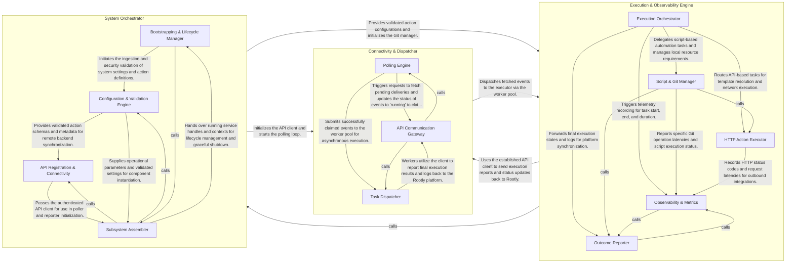

## Details

The `rootly-edge-connector` follows a linear, secure execution pipeline designed for outbound-only communication. The process begins with the System Orchestrator, which loads and validates YAML configurations and initializes the internal services. Once active, the Connectivity & Dispatcher component maintains a long-polling connection to the Rootly API to retrieve automation events. These events are queued into a worker pool and handed off to the Execution & Observability Engine. This engine runs the specified logic—either via direct HTTP calls or by executing local scripts managed by a Git-backed resource manager. Finally, the execution results and performance metrics are reported back to Rootly, completing the feedback loop.

### System Orchestrator

Acts as the entry point and configuration authority. It is responsible for bootstrapping the application, parsing configuration files, validating security constraints, and wiring together the connectivity and execution components.

- **Bootstrapping & Lifecycle Manager** — Acts as the primary entry point for the application, managing CLI flag parsing, versioning, and the high-level startup sequence.
- **Configuration & Validation Engine** — Handles the ingestion of YAML configuration files and environment variables, applying default values to ensure a consistent system state.
- **API Registration & Connectivity** — Manages the transformation of internal configuration models into API-compatible formats required by the Rootly platform.
- **Subsystem Assembler** — The "glue" component that instantiates and interconnects the functional subsystems.

### Connectivity & Dispatcher

Manages the "Outbound Polling" pattern. It handles the lifecycle of the connection to Rootly, fetches pending events, and uses a worker pool to manage concurrency and task distribution.

- **Polling Engine** — Orchestrates the core execution loop of the agent.
- **API Communication Gateway** — Manages the secure, authenticated connection to the Rootly platform.
- **Task Dispatcher** — Provides the concurrency layer for the subsystem.

### Execution & Observability Engine

The core execution unit that processes automation tasks. it handles script execution (interfacing with Git for resource management), HTTP requests, and records telemetry. It also ensures that execution outcomes are reported back to the Rootly platform.

- **Execution Orchestrator** — Acts as the central brain of the engine, managing the high-level lifecycle of every automation task.
- **Script & Git Manager** — Manages the retrieval and execution of script-based automations.
- **HTTP Action Executor** — Specialized component for network-based automations.
- **Observability & Metrics** — Provides real-time monitoring and telemetry for the execution engine.
- **Outcome Reporter** — The final stage of the execution pipeline, responsible for synchronizing results with the Rootly platform.

