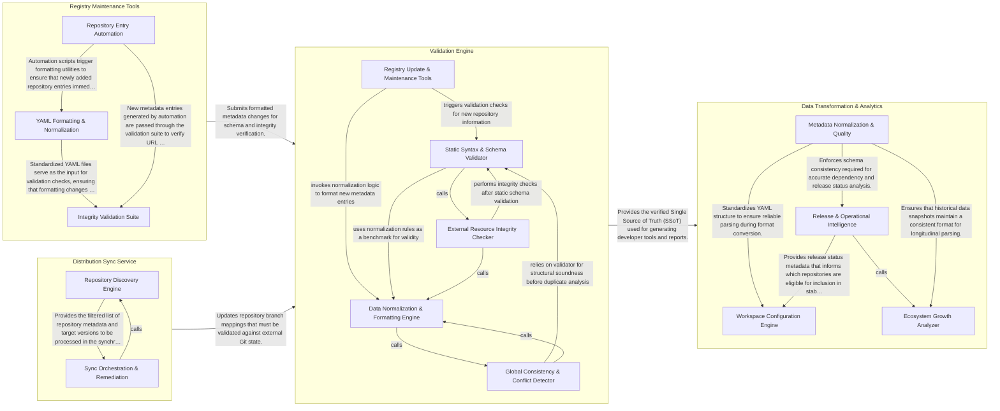

## Details

The `rosdistro` project serves as the central metadata registry for the Robot Operating System (ROS) ecosystem, utilizing a "Configuration-as-Code" approach to manage package distributions and dependencies. The architecture is centered around a collection of YAML files that act as the Single Source of Truth (SSoT). The data flow begins with Registry Maintenance Tools and the Distribution Sync Service, which automate the ingestion, formatting, and synchronization of repository metadata from external sources. These updates are strictly gated by the Validation Engine, which performs comprehensive schema checks and repository accessibility audits. Finally, the Data Transformation & Analytics component consumes the verified metadata to generate workspace configurations (e.g., .rosinstall) and provide insights into the health and growth of the ROS package ecosystem.

### Validation Engine

Acts as the primary gatekeeper for the registry, ensuring that all metadata contributions adhere to strict formatting and structural rules. It performs schema validation for rosdep and rosdistro files, verifies external repository accessibility, and detects duplicate entries.

- **Static Syntax & Schema Validator** — Performs deep inspection of YAML structures for both rosdep and rosdistro files, enforcing strict formatting rules and schema compliance.
- **External Resource Integrity Checker** — Performs network-based checks to verify that source code repositories, release tags, and documentation URLs are accessible.
- **Global Consistency & Conflict Detector** — Analyzes the registry as a whole to identify naming collisions and overlapping rosdep keys.
- **Data Normalization & Formatting Engine** — Provides logic for standardizing YAML data, including sorting keys and formatting strings.
- **Registry Update & Maintenance Tools** — Operational interface for modifying the registry, facilitating repository additions and synchronization.

### Registry Maintenance Tools

Provides the automation necessary for modifying and standardizing the registry's content. It includes utilities for programmatically adding new repositories and ensuring consistent YAML formatting (sorting, indentation, and quoting).

- **Repository Entry Automation** — Provides the programmatic interface for modifying the registry.
- **YAML Formatting & Normalization** — Enforces a standardized physical layout for the registry's YAML files.
- **Integrity Validation Suite** — A comprehensive set of scripts that perform static analysis on the registry.

### Distribution Sync Service

Manages the operational synchronization between the static registry metadata and external development branches. It specifically handles the mapping between core ROS 2 repositories and their corresponding GitHub Bloom-generated (GBP) branches.

- **Repository Discovery Engine** — This component is responsible for identifying and preparing the set of ROS 2 repositories that require synchronization.
- **Sync Orchestration & Remediation** — Serving as the execution engine of the service, this component implements the main control loop that manages the synchronization lifecycle.

### Data Transformation & Analytics

Handles the downstream usage of registry data, transforming raw YAML metadata into actionable formats like workspace setup files or analytical insights regarding package growth and commit history.

- **Workspace Configuration Engine** — Handles the transformation of distribution metadata into actionable developer environment files.
- **Ecosystem Growth Analyzer** — Provides longitudinal insights into the ROS ecosystem by analyzing the git history of the registry.
- **Release & Operational Intelligence** — Provides actionable data for maintainers to manage the release lifecycle.
- **Metadata Normalization & Quality** — Enforces structural consistency and readability across the registry's YAML files.

